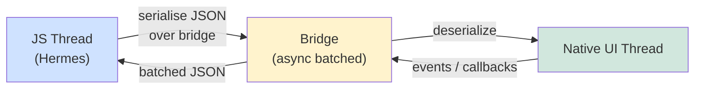
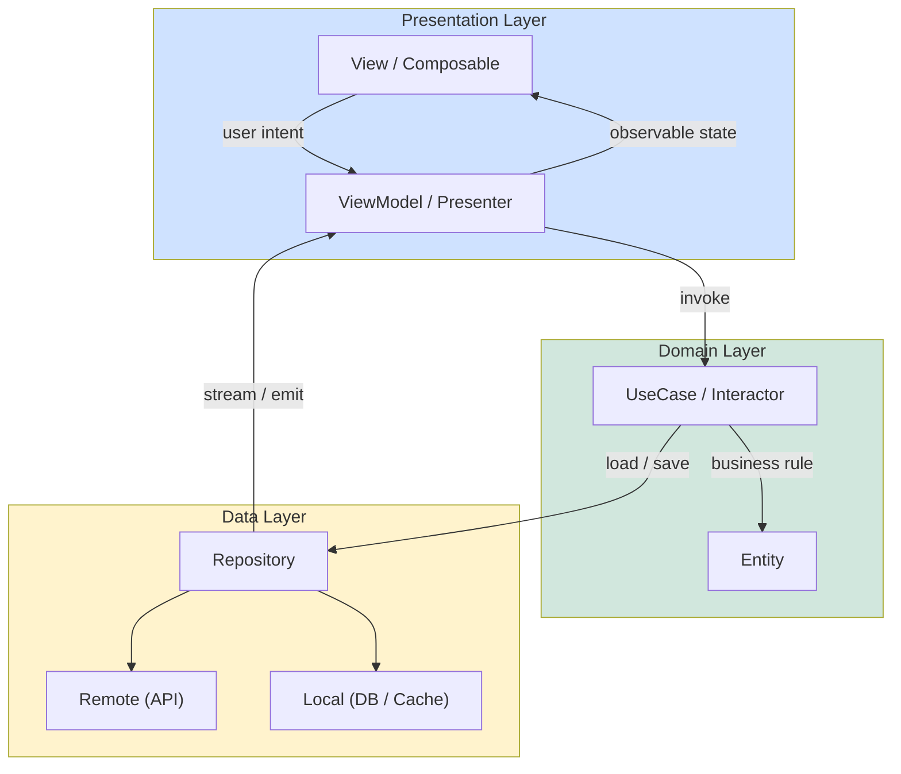
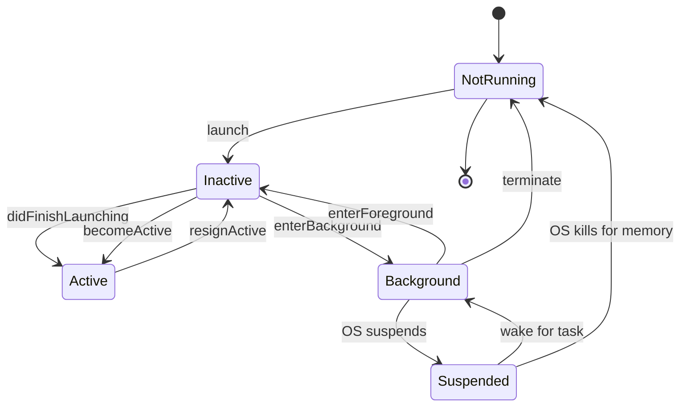

# Mobile Engineering

Mobile engineering is the discipline of designing, building, shipping and
maintaining applications that run on iOS and Android smartphones, tablets,
wearables and — increasingly — foldables and mixed-reality devices. Unlike web
or backend systems, mobile apps run on **constrained, battery-powered,
intermittently-connected hardware** with strict OS-level sandboxing. This page
is the **deep-dive index** for Section 22 of [`../index.md`](../index.md); it
cross-references the dedicated [`ios.md`](./ios.md), [`android.md`](./android.md)
and [`mobile-security.md`](./mobile-security.md) pages and adds the
cross-platform, architectural, networking, storage, push, background-task and
performance topics those per-platform pages do not cover in depth.

## Table of Contents

- [Mobile Engineering Landscape](#the-mobile-engineering-landscape) · [Native iOS](#native-ios-swift-swiftui-uikit) · [Native Android](#native-android-kotlin-jetpack-compose-views)
- [React Native](#cross-platform-react-native) · [Flutter](#cross-platform-flutter) · [Architecture Patterns](#mobile-architecture-patterns)
- [App Lifecycle](#app-lifecycle) · [Networking](#mobile-networking) · [Offline-First](#offline-first-design)
- [Push Notifications](#push-notifications) · [Background Tasks](#background-tasks) · [Storage](#mobile-storage)
- [Security Recap](#mobile-security-recap) · [Performance](#mobile-performance) · [Interview Questions](#interview-questions) · [References](#references)

---

## The Mobile Engineering Landscape

A modern mobile app is usually built with one of three stacks:

1. **Native** — Swift / Objective-C on iOS, Kotlin / Java on Android. Best
   performance, fullest API access, two codebases to maintain.
2. **Cross-platform with a native bridge** — React Native (JS / TS over Hermes,
   native widgets via bridge / JSI). Single codebase, near-native UI.
3. **Cross-platform with its own rendering engine** — Flutter (Dart, Skia /
   Impeller). Single codebase, pixel-identical UI, larger binary.

| Aspect | Native (iOS / Android) | React Native | Flutter |
|---|---|---|---|
| Language | Swift, Kotlin (Java, Obj-C legacy) | JS / TS (Hermes) | Dart |
| UI rendering | Platform widgets (UIKit, Compose) | Native widgets via bridge | Own engine (Skia / Impeller) |
| Performance | Best — direct API, no bridge | Near-native; bridge can bottleneck | Excellent; bypasses platform widgets |
| App size | Smallest | Medium (bundles JS + hermes) | Largest (bundles Dart AOT + engine) |
| Hot reload | Limited (SwiftUI Preview, Compose Preview) | Fast Refresh | Stateful Hot Reload |
| Platform API access | Full | Via native modules / TurboModules | Via platform channels |
| Talent pool | Platform specialists | Web / JS engineers | Dart / cross-platform |
| Best for | Performance-critical, AR, banking, system apps | Apps with web team, content apps, B2B | Branded UI, design-heavy, MVPs |

Per Apple's [Human Interface Guidelines](https://developer.apple.com/design/human-interface-guidelines/)
and Google's [Material Design](https://m3.material.io/), each platform has its
own idiom for navigation, gesture, typography and motion. Native code honours
those idioms by default; cross-platform teams must explicitly opt into them.

## Native iOS: Swift, SwiftUI, UIKit

See [`ios.md`](./ios.md) for the Swift, SwiftUI, UIKit, Combine, concurrency,
APNs, signing and security deep dive. Architectural notes:

- **Swift** (5.9+) is the primary language; **Objective-C** survives in legacy
  frameworks and C/C++ interop. Swift emphasises value types (`struct`,
  `enum`), protocol-oriented programming, `async/await` and `Sendable` safety.
- **SwiftUI** (iOS 13+) is the declarative UI framework — state-driven,
  diffable. Property wrappers (`@State`, `@Binding`, `@StateObject`,
  `@ObservedObject`, `@EnvironmentObject`) model data flow.
- **UIKit** is the imperative predecessor (`UIView`, `UIViewController`,
  Auto Layout, `UICollectionView`). Interoperable with SwiftUI via
  `UIViewRepresentable` / `UIViewControllerRepresentable`.
- **Combine** is the reactive framework; for new code prefer `async/await` +
  `AsyncSequence`. **Memory model** — ARC; break cycles with `weak` / `unowned`.

## Native Android: Kotlin, Jetpack Compose, Views

See [`android.md`](./android.md) for the Activity / Fragment lifecycle,
Compose, ViewModel, Room and coroutines overview. Architectural notes:

- **Kotlin** is the primary language (Java remains source-compatible);
  coroutines + Flow are the canonical concurrency model. `suspend` functions
  are CPS-transformed state machines integrated with structured concurrency.
- **Jetpack Compose** (stable since 2021) is the declarative UI toolkit —
  `@Composable` functions, `remember` / `rememberSaveable` for state,
  `StateFlow` / `LiveData` for reactive data. Replaces XML layouts for new code.
- **Views** (XML + View binding / Data binding) is the legacy toolkit, still
  required for some library interop and enterprise apps.
- **Jetpack libraries** — ViewModel, Lifecycle, Navigation, Room, WorkManager,
  DataStore, Hilt — form the recommended app stack per the
  [Android developer guides](https://developer.android.com/guide).
- **Background execution** is heavily restricted on Android 8+; use
  `WorkManager` for deferrable, guaranteed work and a **Foreground Service**
  for user-visible work.

## Cross-Platform: React Native

[React Native](https://reactnative.dev/) renders native platform widgets from
React components written in JavaScript / TypeScript. The JS runs on **Hermes**;
a thin layer communicates with the native UI thread.

### Old Architecture: the Bridge

The legacy **bridge** serialises every call as JSON across the JS ↔ native
boundary — asynchronous, batched, copy-based. For high-frequency data (lists,
gestures, animations) this becomes the bottleneck.

### New Architecture (Fabric + TurboModules + JSI + Codegen)

React Native 0.74+ ships the **New Architecture**, enabled by default from 0.76:

- **JSI (JavaScript Interface)** — a C++ binding layer that lets JS hold direct
  references to C++ / native objects. No JSON serialisation; synchronous calls.
- **Fabric** — the new rendering system. Synchronous UI commits on the UI thread
  with priority-based scheduling, enabling concurrent layout.
- **TurboModules** — native modules accessed via JSI; lazy-loaded, type-safe,
  generated by **Codegen** from TypeScript specs.

| Feature | Old Arch (Bridge) | New Arch (JSI + Fabric) |
|---|---|---|
| Cross-thread comm | Async JSON batch | Synchronous JSI calls |
| Native modules | `NativeModules` (bridge) | TurboModules (lazy, typed) |
| Rendering | Asynchronous | Fabric (concurrent, sync commits) |
| Type safety | Runtime contract | Codegen-generated specs |
| Concurrent rendering | No | Yes |

## Cross-Platform: Flutter

[Flutter](https://docs.flutter.dev/) is Google's UI toolkit built on the Dart
language. Unlike React Native, **Flutter does not use platform widgets** — it
paints every pixel itself via the Skia (or Impeller) rendering engine. This
produces a pixel-identical UI across iOS and Android at the cost of larger
binaries and reduced automatic platform-look-and-feel.

A Flutter app is a tree of immutable widgets. `setState` marks a `State` dirty;
the framework re-runs `build`, diffs against the previous widget tree and
produces minimal `RenderObject` mutations. Three trees cooperate:

| Tree | Role | Mutability |
|---|---|---|
| **Widget** | Immutable description of UI configuration | Immutable; rebuilt on state change |
| **Element** | Instantiation of a widget; manages lifecycle | Long-lived; updated in place when widget changes |
| **RenderObject** | Handles layout, paint, hit-testing | Mutated by element diffing |

Flutter is **vsync-driven**: the engine schedules a frame on each vsync and
build, layout, paint and compositing must all complete inside the frame budget
(see [Mobile Performance](#mobile-performance)).

## Mobile Architecture Patterns

Most non-trivial mobile apps adopt a **separation-of-concerns** pattern. The
[Clean Architecture](https://blog.cleancoder.com/uncle-bob/2012/08/13/the-clean-architecture.html)
formulation by Robert C. Martin ("Uncle Bob") — **Dependency Rule**:
dependencies must point inward toward the domain — is widely cited and adapted
on mobile.

| Pattern | Key Idea | Testability | iOS Use | Android Use |
|---|---|---|---|---|
| **MVC** (Apple's variant) | View & Controller are coupled; Controller mediates | Low | UIKit default (legacy) | Legacy |
| **MVP** | Presenter owns UI logic; View is passive | Medium | Some UIKit apps | Some legacy apps |
| **MVVM** | ViewModel exposes observable state; View binds | High | SwiftUI + ObservableObject | Compose + ViewModel + StateFlow |
| **Clean Architecture** | Layered (Presentation / Domain / Data); dependencies point inward | Very high | Common in enterprise iOS | Common in enterprise Android |
| **VIPER** | View, Interactor, Presenter, Entity, Router — strict separation | Very high | Native to iOS (Rambler&Co) | Rare on Android |

**The Dependency Rule**: an arrow pointing inward never points outward. The
domain layer (entities, use cases) must not import UIKit, SwiftUI, Compose,
URLSession, OkHttp, Room or Core Data. Repository interfaces live in the domain
layer; concrete implementations live in the data layer.

### MVVM in practice

- **iOS (SwiftUI)** — `@StateObject private var vm = MyViewModel()`;
  `vm` is an `ObservableObject` with `@Published` properties; the View
  re-renders automatically when published state changes.
- **Android (Compose)** — `val vm: MyViewModel = viewModel()`;
  `vm` is a `ViewModel` exposing `StateFlow<UiState>`; the View collects via
  `collectAsStateWithLifecycle()`.

## App Lifecycle

Both iOS and Android impose a strict lifecycle on apps to enable the OS to
reclaim memory, suspend background work and restart apps cleanly. Knowing the
transitions is essential for save-on-background, restore-on-launch and
"don't lose the user's draft" behaviour.

| State | iOS equivalent | Android equivalent | What app should do |
|---|---|---|---|
| NotRunning | Not loaded | `onDestroy` done | Restore from saved state on next launch |
| Inactive / Launching | `willFinishLaunching` | `onCreate` | Restore UI state, set up first screen |
| Active | `didBecomeActive` / `sceneDidBecomeActive` | `onResume` | Start animations, refresh feed, resume timers |
| Inactive (transient) | `willResignActive` | `onPause` | Pause games, quieten audio, save draft |
| Background | `didEnterBackground` | `onStop` | Finish writes, release resources, schedule `BGTask` |
| Suspended | iOS suspended | Android cached / stopped | Nothing — frozen; may be killed at any time |

On **iOS** the [`UIApplicationDelegate`](https://developer.apple.com/documentation/uikit/uiapplicationdelegate)
and (since iOS 13) the [`UISceneDelegate`](https://developer.apple.com/documentation/uikit/uiscenedelegate)
provide the callbacks. On **Android** the
[`Activity` lifecycle](https://developer.android.com/guide/components/activities/activity-lifecycle)
and [`ProcessLifecycleOwner`](https://developer.android.com/reference/androidx/lifecycle/ProcessLifecycleOwner)
give app-level visibility.

> **Surviving rotation on Android:** a configuration change destroys and
> recreates the `Activity`. Use a `ViewModel` (survives the change) or
> `rememberSaveable` (Compose) to preserve UI state; use `onSaveInstanceState`
> only for small primitive data.

## Mobile Networking

Mobile networks are **lossy, slow and metered**. A mobile HTTP client must
cache aggressively, time out quickly, retry idempotently, and survive full
offline windows. The platform-native stacks are [`URLSession`](https://developer.apple.com/documentation/foundation/urlsession)
on iOS and [`OkHttp`](https://square.github.io/okhttp/) (often wrapped by
[Retrofit](https://square.github.io/retrofit/)) on Android.

| Aspect | URLSession | OkHttp | Retrofit |
|---|---|---|---|
| Layer | Apple framework (Foundation) | Square HTTP client (Android default) | Square type-safe REST wrapper over OkHttp |
| API style | Callback / `async` `URLSessionDataTask` | Synchronous / interceptors | Declarative interfaces with annotations |
| TLS pinning | `URLSessionDelegate` challenge handler | `CertificatePinner` | Inherited from OkHttp |
| Interceptors | `URLProtocol` subclasses | `Interceptor` chain | Inherited; adds converters |
| Caching | `URLCache` (HTTP cache) | `Cache` directory | Inherited from OkHttp |
| Streaming / WebSocket | `URLSessionWebSocketTask` | `WebSocket` | Inherited from OkHttp |
| Best for | iOS-native code | General HTTP on Android | REST APIs on Android |

### Common mobile networking concerns

- **Timeouts** — connect ~10s, read ~30s; never wait forever.
- **Retries with backoff** — only idempotent verbs (`GET`, `PUT`, `DELETE`);
  exponential backoff with jitter to avoid thundering herds.
- **TLS pinning** — see [`mobile-security.md`](./mobile-security.md); pin the
  SPKI hash of the leaf or intermediate certificate.
- **HTTP/2 and HTTP/3 (QUIC)** — both clients negotiate these automatically,
  multiplexing requests on one connection and recovering faster from loss.
- **Cancellation** — propagate `Task.cancel()` (iOS) or `Call.cancel()`
  (OkHttp) on view dismissal; otherwise in-flight responses leak.

## Offline-First Design

An **offline-first** app treats the local store as the source of truth and
synchronises with the server in the background. Pattern (popularised by
[PouchDB / CouchDB sync](https://pouchdb.com/), adopted by Notion, Linear,
Things):

1. **Read** from the local DB; render immediately.
2. **Write** to the local DB; mark the row `dirty` / `pending_sync`.
3. **Sync worker** (`BGTaskScheduler` / `WorkManager`) drains the queue, POSTing
   to the server with exponential backoff and idempotency keys.
4. **Conflict resolution** — last-write-wins, vector clocks, or CRDTs (Yjs,
   Automerge) for collaborative edits.
5. **Push-from-server** — FCM data messages or WebSocket notify the device of
   remote writes; the device pulls the delta and merges.

The repository layer abstracts this: the ViewModel calls
`repository.getUsers()`, which returns a `Flow<List<User>>` (Android) or
`AsyncStream<[User]>` (iOS).

## Push Notifications

Push notifications are the primary re-engagement channel for mobile apps. The
two platform services are fundamentally different:

| Aspect | APNs (Apple) | FCM (Firebase Cloud Messaging) |
|---|---|---|
| Provider | Apple | Google (Firebase) |
| Auth | JWT (ES256) signed with Apple key, or p8 cert | OAuth2 access token (Google) |
| Endpoint | `api.push.apple.com/3/device/{token}` (HTTP/2) | `fcm.googleapis.com/v1/projects/.../messages:send` |
| Device token | Per-app, per-device; rotate on restore | Per-app, per-device; rotation less frequent |
| Reliability | Best-effort; one stored notification per device | Best-effort; supports collapsible / topic messages |
| Data payload | "content-available" silent push (background, ~30s) | "data" message; Android handles in foreground service |
| Notification UI | System displays; app wakes via Service Extension | System displays; app receives via `FirebaseMessagingService` |
| Cross-platform | iOS only | Android (primary), iOS (via FCM-APNs bridge), Web |

### End-to-end APNs / FCM flow

1. App calls `UNUserNotificationCenter.requestAuthorization` (iOS) or obtains
   the FCM registration token via `FirebaseMessaging.getInstance().token`.
2. OS returns a **device token** (APNs) or **registration token** (FCM).
3. App POSTs the token to its own backend, which stores it per-user.
4. Backend signs a request to APNs / FCM and sends the payload.
5. APNs / FCM routes to the device; if offline, stores briefly (APNs: last
   notification only; FCM: with TTL up to 4 weeks).
6. On receipt, the OS displays (alert push) or wakes the app (silent / data
   push) for background processing.

> **iOS silent pushes** (`content-available: 1`) are throttled by the OS based
> on app usage, device power state, and a per-device priority score. They are
> **not** a reliable background-cron mechanism — use `BGTaskScheduler` instead.

## Background Tasks

Both platforms heavily restrict background execution to preserve battery.
Long-running, always-on services are anti-patterns; the OS will kill them.

| Need | iOS | Android |
|---|---|---|
| Brief background fetch (≤30s) | `BGAppRefreshTask` (`BGTaskScheduler`) | `WorkManager` OneTimeWorkRequest (deferred) |
| Long-running processing (image / ML) | `BGProcessingTask` (minutes, requires power + screen off) | `WorkManager` with constraints, or Foreground Service |
| Upload / download large file | `URLSession` background configuration | `WorkManager` + `WorkManager` UploadWorker, or Foreground Service |
| User-visible work (audio, navigation) | Background modes (audio, location, VoIP) | Foreground Service with notification |
| Periodic sync | `BGTaskScheduler` (best-effort, ~daily) | `WorkManager` PeriodicWorkRequest (min interval 15min) |
| Push-triggered work | Silent push (`content-available`) — throttled | FCM data message → `FirebaseMessagingService` |

On Android 14+, foreground services must declare a **type**
(`dataSync`, `mediaPlayback`, `location`, `camera`, `microphone`, `health`,
`connectedDevice`, `specialUse`) and obtain the matching permission. iOS
requires you to declare the background mode in `Info.plist` and justify it in
App Review.

## Mobile Storage

| Solution | Platform | Type | Schema / Migration | Best for |
|---|---|---|---|---|
| **SQLite** (C API) | Both | Relational DB | Manual SQL | Full control, complex queries |
| **Room** | Android | SQLite ORM | Compile-time checked, `Migration` classes | Default for Android structured data |
| **Core Data** | iOS | Object graph over SQLite | `.xcdatamodeld`, lightweight + custom migration | iOS-default for complex object graphs |
| **SwiftData** | iOS 17+ | Modern ORM over Core Data | `@Model` macro, automatic migrations | New iOS apps |
| **Realm** (Atlas Device SDK) | Both | Object database | Auto-migration by schema version | Offline-first apps with sync |
| **SQLCipher** | Both | Encrypted SQLite | As SQLite + key pragma | Sensitive data at rest |
| **UserDefaults / SharedPreferences** | iOS / Android | Key-value | None | Small non-sensitive preferences |
| **EncryptedSharedPreferences / Keychain** | Android / iOS | Encrypted secrets | None | Tokens, credentials, biometric keys |
| **File system** | Both | Plists / JSON / binary | None | Documents, caches, exports |

For everything sensitive (auth tokens, refresh tokens, API keys, biometric
keys), use **Keychain** on iOS and **EncryptedSharedPreferences** / **Keystore**
on Android — never `UserDefaults` or `SharedPreferences`. See
[`mobile-security.md`](./mobile-security.md) for the full secure-storage matrix.

## Mobile Security Recap

See [`mobile-security.md`](./mobile-security.md) for the full threat model,
certificate pinning code, secure storage decision matrix, app hardening and
runtime protection (RASP / Frida / anti-hooking) discussion. Key takeaways for
architecture:

- **Assume the device is compromised.** Any secret shipped in the binary can
  be extracted. Move secrets server-side; use app attestation
  ([DeviceCheck](https://developer.apple.com/documentation/devicecheck),
  [Play Integrity](https://developer.android.com/google/play/integrity)) to
  verify the binary.
- **TLS everywhere, pinned.** ATS enforces TLS 1.2+ on iOS; pin the SPKI hash
  on both platforms.
- **Encrypt at rest.** Use `NSFileProtectionComplete` (iOS) and
  `EncryptedSharedPreferences` / SQLCipher (Android) for sensitive data.
- **Least privilege for background modes.** Each declared background mode is
  scrutinised in App Review and increases user privacy prompts.

## Mobile Performance

Mobile performance has three pillars the OS and users actually notice: **startup
time**, **frame rate (jank)** and **memory footprint**.

### Startup time

Apple's [HIG](https://developer.apple.com/design/human-interface-guidelines/)
recommends a launch screen no longer than the time it takes to render the first
useful frame. A typical budget on a mid-range device: pre-main / process init
< 200 ms, app delegate / `Application.onCreate` < 300 ms, first frame < 500 ms
total, full interactive < 2 s. Techniques:

- **Defer non-critical init** to a background task after the first frame.
- **Lazy-load modules** — feature flags or route-based code splitting.
- **Avoid synchronous I/O** in `Application.onCreate` / `didFinishLaunching`.
- **Baseline profile** (Android) — pre-compile hot paths with
  `androidx.benchmark:macro-junit4`.

### Jank and the frame budget

To hit 60 Hz, every frame must complete layout, paint and compositing inside

\\[
   T_{\text{frame}} = \frac{1000}{60} \approx 16.67\text{ ms}
\\]

A 120 Hz display halves this to \\( \approx 8.33 \\) ms. Drop a frame and the
user sees **jank**. Both platforms offer tools: **Instruments** (Core Animation
track, hangs) on iOS, **Android Studio Profiler** and **Perfetto** traces on
Android.

Common causes:

- **Main-thread I/O** — disk reads, JSON decode on UI thread.
- **Layout thrash** — invalidating layout in `onDraw` / `body`; nested
  `UIStackView` / `Column` hierarchies.
- **Heavy computation in `build` / `body`** — re-running expensive pure
  functions on every state change; memoise.
- **Image decode** — large images decoded on the main thread. Use
  `UIImage(preparingForDisplay:)` (iOS) or Glide / Coil (Android).
- **GC pauses** (Android) — avoid allocations in draw loops; use object pools.

### Memory footprint

Mobile devices are memory-constrained and the OS is aggressive about killing
background apps. Symptoms of pressure: invisible surfaces reclaimed, silent
`onTrimMemory` callbacks (Android), `applicationDidReceiveMemoryWarning` (iOS),
and ultimately process termination with no user-visible crash dialog.

| Tier | Approx. heap budget | Typical apps |
|---|---|---|
| Low-end Android (1 GB RAM) | 48–96 MB | Must aggressively evict caches |
| Mid-range Android (4 GB) | 192–256 MB | Most consumer apps |
| Flagship Android / iPhone Pro (6–12 GB) | 384 MB – 1 GB | Games, photo / video editors |

Common leaks: **iOS** — retain cycles via `self` in closures, long-lived
`URLSession` delegates, observers not removed on `deinit`. **Android** — static
reference to a `View` / `Activity` context, non-static inner class holding outer
`Activity`, unregistered listeners, unclosed `Cursor` / `Bitmap`. Tools:
**Xcode Memory Graph Hierarchy**, **Allocations** instrument (iOS);
**LeakCanary** (debug builds), **Android Studio Memory Profiler**, **MAT**
(Android).

---

## Interview Questions

1. **Compare native, React Native and Flutter. When would you pick each?**
   Native (Swift/Kotlin) when you need the best performance, fullest platform
   API access, or tight integration with AR / system services — banking, games,
   system utilities. React Native when you have an existing web team, want one
   codebase, and can tolerate bridge overhead — content apps, B2B dashboards.
   Flutter when you need pixel-perfect branded UI across iOS and Android,
   design-heavy MVPs, and accept a larger binary and reduced idiomatic platform
   feel.

2. **Explain the React Native New Architecture. Why is it faster than the bridge?**
   The New Architecture (Fabric + TurboModules + JSI + Codegen) replaces the
   async, JSON-serialised bridge with synchronous C++ bindings via JSI. JSI
   lets the JS thread hold direct references to native objects, eliminating
   serialisation for high-frequency calls (gestures, list scrolling). Fabric
   renders on the UI thread with concurrent layout and priority scheduling.
   TurboModules are lazily-loaded and typed via Codegen specs.

3. **Walk through the layers of Clean Architecture on mobile.**
   Three layers: **Presentation** (View + ViewModel, depends on the UI
   framework), **Domain** (Entity + UseCase, framework-free), **Data**
   (Repository implementation + Remote / Local sources). The Dependency Rule:
   arrows point inward. The domain defines repository interfaces; the data
   layer implements them. ViewModels invoke use cases, never the network or DB
   directly. This makes the domain unit-testable without a device and lets you
   swap the UI framework (UIKit → SwiftUI, Views → Compose) without touching
   business logic.

4. **What happens when the user backgrounds an iOS app? What about Android?**
   iOS: `sceneWillResignActive` → `sceneDidEnterBackground`. ~5 seconds to
   release resources and save state, then **suspended** (no CPU). The OS may
   kill it for memory. Schedule a `BGTaskScheduler` task or use a background-mode
   capability (audio, location, VoIP). Android: `onPause` → `onStop`. The app
   enters **cached / stopped** with limited CPU. Use `WorkManager` (deferred,
   OS-throttled) or a Foreground Service with notification. The OS may kill the
   process; the next launch starts fresh — restore from `onSaveInstanceState` /
   `rememberSaveable`.

5. **How does APNs differ from FCM?**
   APNs is Apple's push service: per-device token, authenticated with a JWT
   signed by an Apple-issued ES256 key, sent to `api.push.apple.com`. Stores at
   most one pending notification per device; silent pushes throttled by a
   per-device score. FCM is Google's cross-platform service: registration token,
   OAuth2 access token from a Google service account, sent to
   `fcm.googleapis.com`. Supports collapsible messages, topic messaging, TTL up
   to 4 weeks, and bridges to APNs for iOS recipients. APNs is iOS-only; FCM is
   Android-first but supports iOS, web and Unity.

6. **Design an offline-first mobile chat app.**
   Local store (Room / GRDB or Realm) is the source of truth. The ViewModel
   observes a `Flow` / `AsyncStream` of messages. Writes go to the local store
   with a `pending_sync` flag; a `WorkManager` / `BGTaskScheduler` worker drains
   the queue with exponential backoff and idempotency keys. Remote writes arrive
   via WebSocket (foreground) or FCM data message (background); the device pulls
   deltas and merges with last-write-wins or vector-clock conflict resolution.
   Read path renders from local immediately; sync path is invisible to the user.

7. **Why does Android kill background processes? How should an app prepare?**
   Android kills background processes to reclaim RAM — the LRU cache of process
   states is the OS's primary memory-management lever. An app must (a) persist
   user-editable state on `onStop`, (b) use a `ViewModel` so it survives config
   changes, (c) use `onSaveInstanceState` for small primitive UI state, (d) use
   `WorkManager` (not a Service) for deferrable background work since it
   persists across reboots and process death, (e) avoid static references to
   `Activity` / `View` contexts that prevent GC.

8. **A user reports your app "freezes" on a mid-range Android when scrolling a
   long list. How do you diagnose and fix?**
   Capture a Perfetto trace or Android Studio Profiler; look for frames over
   the 16 ms (60 Hz) / 8 ms (120 Hz) budget. Common culprits: (1) synchronous
   image decode on the main thread — switch to Coil / Glide. (2) Layout thrash
   from nested `ConstraintLayout` / `Column` — flatten or use `LazyColumn` with
   stable keys. (3) Allocations in the bind / `@Composable` path causing GC
   pauses — pool objects, hoist state. (4) Heavy work in `RecyclerView.onBind` /
   Compose `items()` — precompute and cache. (5) Watch for `Choreographer:
   Skipped N frames` log lines. On iOS use Instruments → Core Animation →
   "Hangs" / "Frames".

## References

- [Apple Human Interface Guidelines](https://developer.apple.com/design/human-interface-guidelines/) · [Apple Developer Docs](https://developer.apple.com/documentation/)
- [Android Developer Guides](https://developer.android.com/docs) · [Jetpack Compose](https://developer.android.com/jetpack/compose) · [Jetpack libraries](https://developer.android.com/jetpack)
- [React Native docs — New Architecture](https://reactnative.dev/docs/the-new-architecture/why)
- [Flutter docs](https://docs.flutter.dev/) · [Dart language tour](https://dart.dev/language)
- [Material Design 3](https://m3.material.io/)
- [OkHttp](https://square.github.io/okhttp/) · [Retrofit](https://square.github.io/retrofit/)
- [APNs](https://developer.apple.com/documentation/usernotifications/setting_up_a_remote_notification_server) · [Firebase Cloud Messaging](https://firebase.google.com/docs/cloud-messaging)
- [WorkManager](https://developer.android.com/topic/libraries/architecture/workmanager) · [BGTaskScheduler](https://developer.apple.com/documentation/backgroundtasks)
- [Room](https://developer.android.com/training/data-storage/room) · [Core Data](https://developer.apple.com/library/archive/documentation/Cocoa/Conceptual/CoreData/) · [SwiftData](https://developer.apple.com/documentation/swiftdata) · [Realm / Atlas Device SDK](https://www.mongodb.com/docs/atlas/device-sdks/)
- [Clean Architecture — Robert C. Martin](https://blog.cleancoder.com/uncle-bob/2012/08/13/the-clean-architecture.html) · [VIPER architecture](https://medium.com/@smalam119/viper-architecture-for-ios-1f67ee5f14b6)
- [Mobile-Specific Security — see mobile-security.md](./mobile-security.md)
