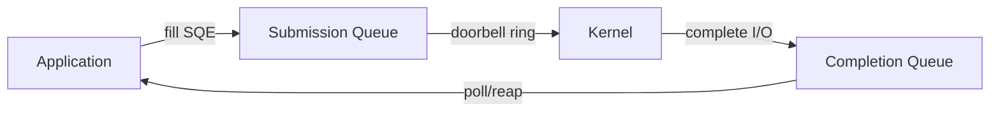
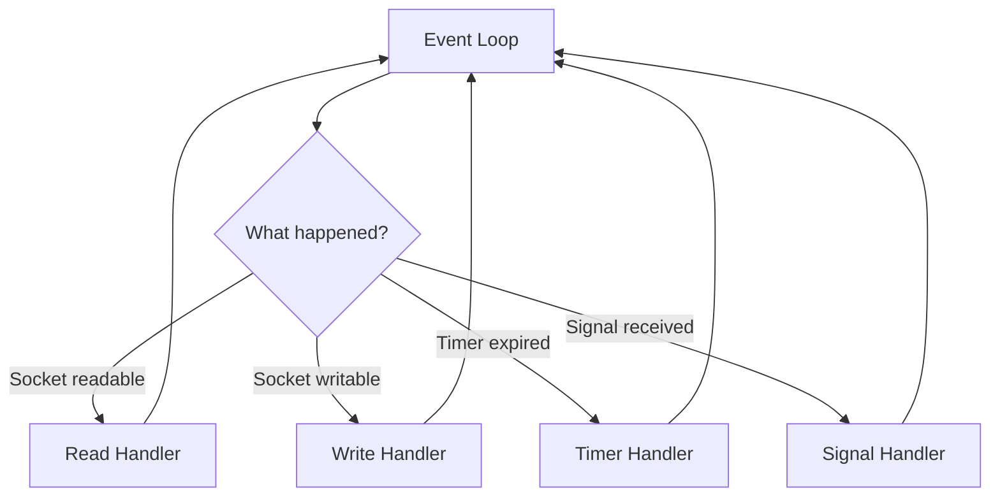

# Advanced I/O Models

The fundamental challenge in network programming is managing I/O on many sockets simultaneously. The choice of I/O model determines your server's scalability, latency, and CPU efficiency.

## Blocking vs Non-Blocking I/O

**Blocking I/O** (default): A `recv()` or `accept()` call blocks the calling thread until data is available or a connection arrives. Simple to program, but a thread can only handle one socket at a time.

**Non-blocking I/O**: Set `O_NONBLOCK` on a socket. All operations return immediately with `EAGAIN`/`EWOULDBLOCK` if they cannot complete. This forces you to manage readiness yourself, which requires an event notification mechanism.

```c
int flags = fcntl(fd, F_GETFL, 0);
fcntl(fd, F_SETFL, flags | O_NONBLOCK);
```

## I/O Multiplexing

I/O multiplexing lets a single thread monitor many file descriptors and process only those that are ready.

### Comparison Table

| Feature | `select()` | `poll()` | `epoll` (Linux) | `kqueue` (BSD/macOS) |
|---------|-----------|----------|-----------------|----------------------|
| Max fds | `FD_SETSIZE` (~1024) | No limit | No limit | No limit |
| Complexity per call | O(n) | O(n) | O(1) per event | O(1) per event |
| Data structure | Fixed bitmap | Dynamic array | Kernel-managed | Kernel-managed |
| Copies fd set to kernel | Yes (every call) | Yes (every call) | No (persistent) | No (persistent) |
| Trigger modes | Level | Level | Level + Edge | Edge |
| Platform | POSIX | POSIX | Linux | BSD, macOS |
| Supports | Sockets, pipes, tty | Sockets, pipes, tty | Sockets, pipes, epollfd, eventfd, timerfd | Files, sockets, signals, processes |

### Why select() and poll() Don't Scale

Both `select()` and `poll()` copy the entire set of file descriptors to the kernel on every call, and the kernel scans all of them. With 10,000 connections, that is 10,000 iterations—most of which find nothing ready. `epoll` and `kqueue` maintain state in the kernel: you register fds once and the kernel returns only the fds that actually have events.

## Asynchronous I/O

### POSIX AIO

The original POSIX AIO API (`aio_read()`, `aio_write()`, `lio_listio()`) initiates I/O and notifies via signal or callback. On Linux, the glibc implementation is built on threads—not true kernel AIO—so it offers no real advantage over manual threading.

### Linux io_uring

**io_uring** (Linux 5.1+) is the modern asynchronous I/O interface. It uses two shared ring buffers between user space and kernel, eliminating system call overhead for repeated I/O operations.

**How it works:**

1. **Setup**: `io_uring_setup()` creates two ring buffers—a Submission Queue (SQ) and a Completion Queue (CQ)
2. **Submit**: The application fills SQ entries (read, write, accept, etc.) and rings the doorbell
3. **Process**: The kernel consumes SQ entries asynchronously
4. **Complete**: Completed operations appear in the CQ; the application polls or blocks on it



**Advantages of io_uring:**

- **Zero-copy for certain operations** (e.g., `IORING_OP_READV_FIXED` with registered buffers)
- **No system call per operation**—batch submissions in the ring buffer
- **Supports any I/O type**: files, sockets, timeouts, signals, even `openat` and `stat`
- **Kernel bypass for registered buffers** using fixed file descriptors and buffers
- **Increasingly adopted** by `libuv`, `tokio` (Rust), and high-performance storage engines

## Event-Driven Architecture

In event-driven design, the program's control flow is dictated by events (I/O readiness, timers, signals) rather than a sequential call stack. The core loop:

1. Wait for events
2. Dispatch events to handlers
3. Repeat

## Reactor Pattern

The **Reactor** is the dominant pattern for event-driven network servers:



- The **Reactor** registers interest in events (via `epoll_ctl`, `kqueue`)
- The **Event Loop** blocks in `epoll_wait()`/`kevent()` until events occur
- **Handlers** are callbacks invoked for each ready fd
- I/O happens **synchronously within the handler** but non-blocking (read until `EAGAIN`)

Used by: **nginx**, **redis**, **Node.js**, **libevent**, **libuv**, **Python asyncio**

## Proactor Pattern

The **Proactor** initiates **asynchronous** I/O operations and receives completions:

1. Initiator starts an async operation (`io_uring_submit`, Windows IOCP)
2. The operation completes in the background (kernel or thread pool)
3. A completion handler is invoked when the operation finishes

- The event loop waits on completions, not readiness
- I/O never blocks the calling thread—true asynchronous completion
- Used by: **Windows IOCP**, **Boost.Asio** (on Windows), **io_uring**

| Aspect | Reactor | Proactor |
|--------|---------|----------|
| Notification | I/O is *ready* | I/O is *completed* |
| I/O in handler | Synchronous (non-blocking) | Already done |
| Platform | epoll/kqueue (cross-platform) | io_uring (Linux), IOCP (Windows) |
| Complexity | Simpler | More complex setup |

## libevent and libuv

### libevent
A mature C library providing an event loop abstraction over `select`, `poll`, `epoll`, `kqueue`, and Windows IOCP. It automatically selects the best backend for the platform. Provides buffered I/O (`bufferevent`), timers, signals, DNS, and an HTTP framework.

**Used by**: memcached, Tor, Chrome's early network stack.

### libuv
Built originally for Node.js, libuv provides a cross-platform event loop with:

- Asynchronous TCP/UDP sockets and named pipes
- File system operations via thread pool
- Child process management
- Signal handling and timers
- Thread pool for blocking operations

**Used by**: Node.js, Julia, Luvit, and many C/C++ applications.

## Interview Questions

1. Explain the difference between blocking and non-blocking I/O. Why is non-blocking necessary for an event-driven server?
2. Why does `select()` not scale beyond ~1000 file descriptors? Is this a kernel limitation or an API limitation?
3. Explain the difference between level-triggered and edge-triggered event notification.
4. What is the C10K problem and how does `epoll` solve it?
5. Compare the Reactor and Proactor patterns. Which does `nginx` use? Which does `io_uring` enable?
6. How does `io_uring` eliminate system call overhead for repeated operations?
7. What is the difference between POSIX AIO and Linux io_uring?
8. Why might you choose `libuv` over raw `epoll` for a production application?
9. A single-threaded event loop runs a handler that takes 100ms. What happens to other connections? How do you fix this?
10. How does `epoll` handle file descriptor reuse (when a fd is closed and a new one reuses the same number)?