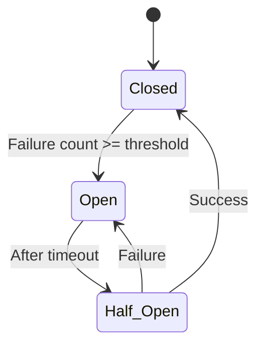

# Practical Network Programming Patterns

Production network code must handle far more than happy-path send/receive. This chapter covers the resilience patterns that separate interview-ready engineers from those who have only written toy servers.

## Connection Pooling

Creating a new TCP connection for every request is expensive: three-way handshake, TLS handshake (if applicable), TCP slow start, and socket allocation. **Connection pooling** maintains a set of reusable, pre-established connections.

### Design Considerations

- **Pool sizing**: Min and max connections based on concurrency requirements and server limits
- **Health checking**: Remove connections that have been idle too long or received errors
- **Thread safety**: Lock-free or mutex-protected access to the pool
- **Multiplexing**: Protocols like HTTP/2 can multiplex requests over a single connection, reducing pool size

```
Client sends request → Get connection from pool → Send request → Receive response
                                                            → Return connection to pool

Pool empty? → Create new connection (if under max)
             → Wait (if at max capacity)

Connection stale? → Remove and create new one
```

## Retry with Exponential Backoff and Jitter

Network requests fail transiently. Retrying immediately causes **thundering herd**—all clients retry simultaneously, overloading a recovering server. Exponential backoff with jitter spreads retries over time.

```python
import random
import time

def retry_with_backoff(request_fn, max_retries=5, base_delay=0.1):
    """
    Retry request_fn with exponential backoff and full jitter.
    Delays: uniform random in [0, base_delay * 2^attempt]
    """
    for attempt in range(max_retries):
        try:
            return request_fn()
        except (ConnectionError, TimeoutError) as e:
            if attempt == max_retries - 1:
                raise
            # Full jitter: random delay in [0, ceiling]
            ceiling = base_delay * (2 ** attempt)
            delay = random.uniform(0, ceiling)
            time.sleep(delay)
```

### Why Full Jitter?

| Strategy | Formula | Problem |
|----------|---------|---------|
| Constant | `d` | Retries bunch together | 
| Linear | `d * attempt` | Still correlated |
| Exponential | `d * 2^attempt` | All clients retry at the same moments |
| **Exponential + full jitter** | `random(0, d * 2^attempt)` | **Spreads retries uniformly** |

Reference: [AWS Architecture Blog: Exponential Backoff And Jitter](https://aws.amazon.com/blogs/architecture/exponential-backoff-and-jitter/)

## Rate Limiting

### Token Bucket

A token bucket maintains a counter (bucket) that fills at a fixed rate. Each request consumes one token. If the bucket is empty, the request is rejected or queued.

- **Burst-friendly**: Allows short bursts up to bucket capacity
- **Smooth average**: Long-term rate equals the fill rate
- **Used by**: Nginx `limit_req`, AWS API Gateway, Stripe API

```python
class TokenBucket:
    def __init__(self, rate: float, capacity: int):
        self.rate = rate          # Tokens per second
        self.capacity = capacity  # Max burst size
        self.tokens = float(capacity)
        self.last_refill = time.monotonic()

    def allow(self) -> bool:
        now = time.monotonic()
        elapsed = now - self.last_refill
        self.tokens = min(self.capacity, self.tokens + elapsed * self.rate)
        self.last_refill = now

        if self.tokens >= 1.0:
            self.tokens -= 1.0
            return True
        return False
```

### Leaky Bucket

Requests enter a queue (bucket) and are processed at a fixed rate. If the queue is full, new requests are rejected.

- **Smooth output**: Constant processing rate, no bursts
- **Not burst-friendly**: Even brief spikes are spread out
- **Used by**: Network traffic shaping (token bucket is more common for API rate limiting)

| Aspect | Token Bucket | Leaky Bucket |
|--------|-------------|-------------|
| Burst handling | Allows bursts up to capacity | Smooths all bursts |
| Output rate | Variable (up to burst) | Constant |
| Best for | API rate limiting | Traffic shaping |

## Timeout Strategies

Timeouts prevent resources from being held indefinitely by slow or failed peers.

- **Connect timeout**: How long to wait for TCP handshake completion (e.g., 5 seconds)
- **Read timeout**: How long to wait for data after a request is sent (e.g., 30 seconds)
- **Write timeout**: How long to wait for the send buffer to accept data
- **Total timeout**: Hard deadline for the entire operation (e.g., 60 seconds)

Always set all three. A missing connect timeout leaves the client hanging if the server is unreachable. A missing read timeout leaves the client hanging if the server stalls after accepting the connection.

## Circuit Breaker Pattern

The circuit breaker prevents cascading failures by stopping requests to a failing service.



- **Closed**: Requests pass through. Failures are counted in a sliding window.
- **Open**: All requests are rejected immediately (fail-fast). No requests reach the failing service.
- **Half-Open**: After a cooldown, allow a limited number of test requests. If they succeed, return to Closed. If they fail, return to Open.

Implementations: **Resilience4j** (Java), **Polly** (.NET), **Hystrix** (deprecated, Java).

## Health Checking

Active health checking periodically probes a service to determine if it is alive and healthy.

- **TCP check**: Can we connect to the port? (Minimal)
- **HTTP check**: Does `/healthz` return 200 OK? (Standard for microservices)
- **Deep check**: Can we execute a test query against the database? (Comprehensive)

Health check results feed into load balancer routing and circuit breaker state.

## Interview Questions

1. Design a connection pool for a database client. What data structures would you use? How do you handle stale connections?
2. Explain why exponential backoff with jitter is better than exponential backoff alone.
3. Implement a token bucket rate limiter. What happens if the rate is higher than the capacity?
4. What is the circuit breaker pattern? How does it differ from simply retrying?
5. You have a service that makes HTTP calls to an external API. The API sometimes returns 500 errors. Design a retry strategy.
6. What timeouts would you set for a production HTTP client? Explain your reasoning.
7. How would you implement health checking for a pool of backend servers? Describe the interaction with your load balancer.
8. What is the difference between client-side and server-side rate limiting? When would you use each?
9. A connection pool has 100 connections. All become stale simultaneously. What happens when 200 requests arrive at once? Design a solution.
10. How does HTTP/2 connection multiplexing change the calculus of connection pooling?