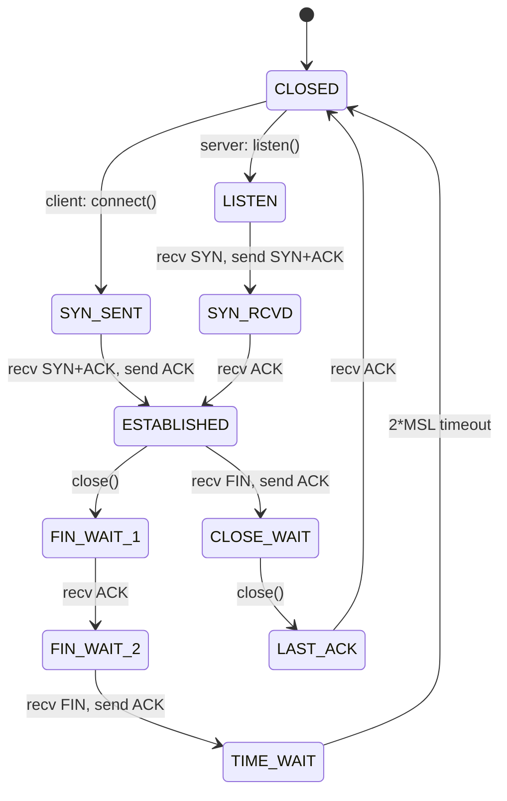
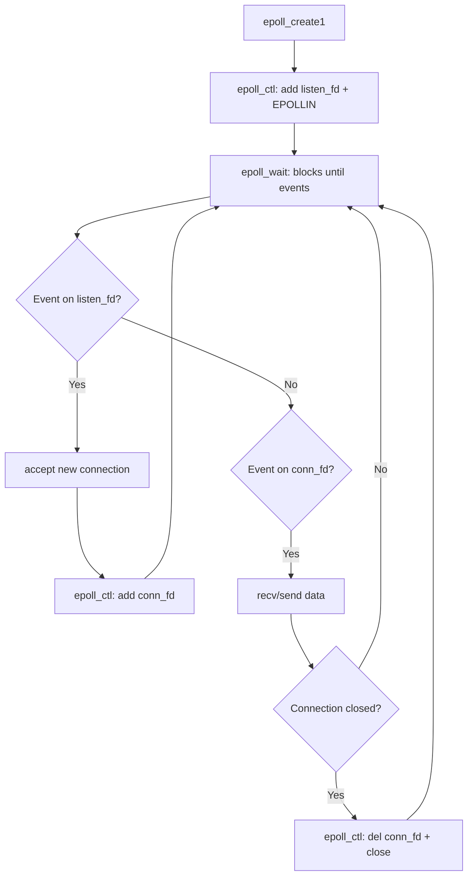

# TCP Socket Programming

## TCP Socket Lifecycle

A TCP connection goes through a well-defined sequence of states. Understanding this lifecycle is essential for writing correct server and client code.



### Server Side

1. **`socket(AF_INET, SOCK_STREAM, 0)`** — Create a TCP socket (returns a file descriptor)
2. **`bind(fd, &addr, len)`** — Associate the socket with an IP address and port
3. **`listen(fd, backlog)`** — Mark the socket as passive, set the pending connection queue size
4. **`accept(fd, &client_addr, &len)`** — Block until a client connects; returns a *new* fd for the connection
5. **`recv()`/`send()`** — Exchange data on the connected fd
6. **`close(fd)`** — Terminate the connection

### Client Side

1. **`socket()`** — Create a TCP socket
2. **`connect(fd, &server_addr, len)`** — Initiate the three-way handshake
3. **`send()`/`recv()`** — Exchange data
4. **`close()`** — Terminate the connection

## TCP Server in C

```c
#include <stdio.h>
#include <stdlib.h>
#include <string.h>
#include <unistd.h>
#include <errno.h>
#include <sys/socket.h>
#include <netinet/in.h>
#include <arpa/inet.h>

#define PORT 8080
#define BACKLOG 128
#define BUF_SIZE 4096

int main(void) {
    int listen_fd = socket(AF_INET, SOCK_STREAM, 0);
    if (listen_fd < 0) {
        perror("socket");
        exit(EXIT_FAILURE);
    }

    int opt = 1;
    setsockopt(listen_fd, SOL_SOCKET, SO_REUSEADDR, &opt, sizeof(opt));

    struct sockaddr_in addr = {
        .sin_family = AF_INET,
        .sin_port   = htons(PORT),
        .sin_addr.s_addr = INADDR_ANY
    };

    if (bind(listen_fd, (struct sockaddr *)&addr, sizeof(addr)) < 0) {
        perror("bind");
        close(listen_fd);
        exit(EXIT_FAILURE);
    }

    if (listen(listen_fd, BACKLOG) < 0) {
        perror("listen");
        close(listen_fd);
        exit(EXIT_FAILURE);
    }

    printf("Listening on port %d\n", PORT);

    for (;;) {
        struct sockaddr_in client_addr;
        socklen_t client_len = sizeof(client_addr);
        int conn_fd = accept(listen_fd, (struct sockaddr *)&client_addr, &client_len);
        if (conn_fd < 0) {
            perror("accept");
            continue;
        }

        char buf[BUF_SIZE];
        ssize_t n = recv(conn_fd, buf, sizeof(buf) - 1, 0);
        if (n > 0) {
            buf[n] = '\0';
            printf("Received: %s", buf);
            send(conn_fd, buf, n, 0);  // Echo back
        }
        close(conn_fd);
    }

    close(listen_fd);
    return 0;
}
```

## TCP Client in C

```c
#include <stdio.h>
#include <stdlib.h>
#include <string.h>
#include <unistd.h>
#include <sys/socket.h>
#include <netinet/in.h>
#include <arpa/inet.h>

#define SERVER_IP "127.0.0.1"
#define PORT 8080

int main(void) {
    int fd = socket(AF_INET, SOCK_STREAM, 0);
    if (fd < 0) {
        perror("socket");
        return EXIT_FAILURE;
    }

    struct sockaddr_in server_addr = {
        .sin_family = AF_INET,
        .sin_port   = htons(PORT)
    };
    inet_pton(AF_INET, SERVER_IP, &server_addr.sin_addr);

    if (connect(fd, (struct sockaddr *)&server_addr, sizeof(server_addr)) < 0) {
        perror("connect");
        close(fd);
        return EXIT_FAILURE;
    }

    const char *msg = "Hello, TCP Server!\n";
    send(fd, msg, strlen(msg), 0);

    char buf[1024];
    ssize_t n = recv(fd, buf, sizeof(buf) - 1, 0);
    if (n > 0) {
        buf[n] = '\0';
        printf("Server replied: %s", buf);
    }

    close(fd);
    return 0;
}
```

## Handling Multiple Clients

The server above is **iterative**—it handles one client at a time. Real servers must handle many clients concurrently.

### Fork
Each `accept()` spawns a child process. The child handles the connection; the parent loops back to `accept()`. Simple but heavy (each process has its own memory space).

### Threads
Each `accept()` spawns a thread. Lighter than fork (shared address space) but still has per-connection overhead. Typically limited to a few thousand concurrent connections.

### `select()`
Monitor multiple file descriptors in a single thread. Limited to `FD_SETSIZE` (typically 1024) descriptors. O(n) per call—scans the entire set.

### `poll()`
Similar to `select()` but uses a dynamic array of `struct pollfd`. No hard limit on descriptor count. Still O(n).

### `epoll()`
Linux's scalable I/O event notification mechanism. O(1) for event delivery regardless of the number of monitored descriptors.

## epoll in Detail

### How epoll Works



### Level-Triggered vs Edge-Triggered

| Mode | Behavior | When to Use |
|------|----------|-------------|
| **Level-triggered** (default) | `epoll_wait` returns as long as the fd is ready. If you only read part of the available data, the next `epoll_wait` will notify you again. | Simple, correct by default |
| **Edge-triggered** (`EPOLLET`) | `epoll_wait` returns only when the state *changes* from not-ready to ready. You **must** read/write until `EAGAIN`. Missed if you don't drain the buffer. | Higher throughput, lower CPU usage |

Edge-triggered epoll with non-blocking sockets is the pattern used by `nginx` and `redis`.

### epoll Code Example

```c
#define MAX_EVENTS 64

int listen_fd = /* ... created, bound, listening ... */;

int epfd = epoll_create1(0);

struct epoll_event ev = {
    .events  = EPOLLIN,
    .data.fd = listen_fd
};
epoll_ctl(epfd, EPOLL_CTL_ADD, listen_fd, &ev);

struct epoll_event events[MAX_EVENTS];
for (;;) {
    int nfds = epoll_wait(epfd, events, MAX_EVENTS, -1);
    for (int i = 0; i < nfds; i++) {
        if (events[i].data.fd == listen_fd) {
            // New connection
            int conn_fd = accept(listen_fd, NULL, NULL);
            // Set non-blocking
            int flags = fcntl(conn_fd, F_GETFL, 0);
            fcntl(conn_fd, F_SETFL, flags | O_NONBLOCK);

            struct epoll_event conn_ev = {
                .events  = EPOLLIN | EPOLLET,  // Edge-triggered
                .data.fd = conn_fd
            };
            epoll_ctl(epfd, EPOLL_CTL_ADD, conn_fd, &conn_ev);
        } else {
            // Data on existing connection
            char buf[4096];
            for (;;) {
                ssize_t n = recv(events[i].data.fd, buf, sizeof(buf), 0);
                if (n <= 0) {
                    if (n == 0 || (errno != EAGAIN && errno != EWOULDBLOCK)) {
                        epoll_ctl(epfd, EPOLL_CTL_DEL, events[i].data.fd, NULL);
                        close(events[i].data.fd);
                    }
                    break;
                }
                // Process buf[0..n-1]
            }
        }
    }
}
```

## kqueue (BSD/macOS)

`kqueue` is the BSD/macOS equivalent of `epoll`. It uses `kevent()` to register and retrieve events. Like `epoll`, it is O(1) for event delivery and supports edge-triggered semantics. Key differences:

- `kqueue` can monitor more event types (file modifications, signals, process events) via filters
- Uses `struct kevent` arrays instead of separate control and wait calls
- Portability concern: `kqueue` is BSD/macOS, `epoll` is Linux

## Connection Options

### SO_REUSEADDR
Allows binding to an address/port that is in `TIME_WAIT` state. **Essential for development servers** that are frequently restarted.

### SO_KEEPALIVE
Enables TCP keepalive probes. If no data is exchanged for a configurable idle period, the kernel sends keepalive packets. Detects half-open connections (peer crashed without sending FIN).

### TCP_NODELAY
Disables **Nagel's algorithm**. Nagle buffers small writes until an ACK is received or the buffer is full, reducing packet count. `TCP_NODELAY` forces immediate transmission—critical for low-latency protocols like SSH, Telnet, and interactive games.

## Interview Questions

1. Explain the TCP state diagram. What is TIME_WAIT and why does the kernel hold it for 2×MSL?
2. What is the difference between `select()` and `epoll()`? Why is `epoll` more scalable?
3. Explain level-triggered versus edge-triggered epoll. Why must edge-triggered use non-blocking sockets?
4. What is the `backlog` parameter in `listen()`? What happens when it is exceeded?
5. How would you write a TCP server that handles 100,000 concurrent connections?
6. What is Nagle's algorithm? When would you disable it?
7. What does `SO_REUSEADDR` do and why is it important?
8. Explain the difference between a graceful close (`close()` after FIN exchange) and an abortive close (`RST`).
9. What is the `C10K problem`? How do modern servers solve it?
10. How does `epoll` differ from `kqueue`?