# Section J — Networking Research (Topics 851–930)

## Overview

This section covers cutting-edge networking research and advanced datacenter networking that frequently appears in senior/staff-level systems interviews at companies running large-scale infrastructure (Google, Meta, AWS, Microsoft, Netflix, Cloudflare). Topics range from programmable data planes (P4, SmartNICs) to emerging transport protocols and network verification.

## Topic Map

```mermaid
graph TD
    A[Networking Advanced] --> B[Programmable Networks]
    A --> C[Advanced Congestion Control]
    A --> D[Modern Network Architecture]
    A --> E[Datacenter Topology]
    A --> F[Emerging Networks]
    
    B --> B1[P4 / Programmable Switches / ASICs]
    B --> B2[SmartNICs / DPDK / XDP]
    B --> B3[eBPF Networking Advanced / SR-IOV]
    
    C --> C1[BBR Internals / Copa / PCC]
    C --> C2[ECN / DCTCP / Incast / Bufferbloat]
    C --> C3[AQM: CoDel / PIE / Fair Queuing]
    C --> C4[Network Calculus]
    
    D --> D1[TSN / Deterministic Networking]
    D --> D2[Segment Routing / SRv6]
    D --> D3[INT / Telemetry / Tomography]
    D --> D4[SDN / P4Runtime / Verification]
    
    E --> E1[Clos / Fat-Tree / Leaf-Spine]
    E --> E2[Optical DC Networks / Photonic]
    
    F --> F1[Satellite / LEO / Edge / 5G / 6G]
    F --> F2[NFV / SFC / Container Networking]
    F --> F3[QUIC Internals / HTTP/3 / MASQUE]
    F --> F4[Encrypted Transport / DoH / DoT / ODoH]
```

## Reading Order

| # | File | Prerequisites | Focus |
|---|------|--------------|-------|
| 1 | `programmable-networks.md` | eBPF basics, TCP/IP | P4, SmartNICs, DPDK, XDP, SR-IOV |
| 2 | `congestion-control-advanced.md` | TCP congestion control fundamentals | Advanced CC algorithms, AQM, queuing |
| 3 | `modern-network-arch.md` | SDN basics, routing | TSN, SR, telemetry, verification |
| 4 | `datacenter-topology.md` | Switching basics | Clos, fat-tree, optical DCNs |
| 5 | `emerging-networks.md` | TCP, TLS, containers | LEO, 5G/6G, NFV, QUIC, encrypted DNS |

## Cross-References

- **TCP fundamentals**: `../tcp/README.md`, `../tcp/bbr.md`, `../tcp/cubic.md`, `../tcp/congestion-control.md`
- **QUIC/HTTP3**: `../http/quic.md`, `../http/http3.md`
- **eBPF**: `../ebpf-networking.md`, `../../os/kernel-advanced/ebpf-deep.md`
- **Fast I/O**: `../../os/advanced/fast-io.md` (DPDK, io_uring)
- **Load balancing**: `../load-balancing/README.md`
- **Security**: `../security/README.md`
- **HPC networking**: `../../hpc/mpi-parallelism.md` (RDMA, InfiniBand, RoCE)
