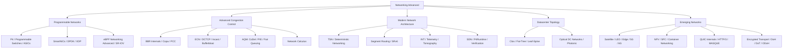

# Section J — Networking Research (Topics 851–930)

## Overview

This section covers cutting-edge networking research and advanced datacenter networking that frequently appears in senior/staff-level systems interviews at companies running large-scale infrastructure (Google, Meta, AWS, Microsoft, Netflix, Cloudflare). Topics range from programmable data planes (P4, SmartNICs) to emerging transport protocols and network verification.

## Topic Map

```mermaid
graph TD
    A[Networking Advanced] --> B[Programmable Networks]
    A --> C[Advanced Congestion Control]
    A --> D[Modern Network Architecture]
    A --> E[Datacenter Topology]
    A --> F[Emerging Networks]
    
    B --> B1[P4 / Programmable Switches / ASICs]
    B --> B2[SmartNICs / DPDK / XDP]
    B --> B3[eBPF Networking Advanced / SR-IOV]
    
    C --> C1[BBR Internals / Copa / PCC]
    C --> C2[ECN / DCTCP / Incast / Bufferbloat]
    C --> C3[AQM: CoDel / PIE / Fair Queuing]
    C --> C4[Network Calculus]
    
    D --> D1[TSN / Deterministic Networking]
    D --> D2[Segment Routing / SRv6]
    D --> D3[INT / Telemetry / Tomography]
    D --> D4[SDN / P4Runtime / Verification]
    
    E --> E1[Clos / Fat-Tree / Leaf-Spine]
    E --> E2[Optical DC Networks / Photonic]
    
    F --> F1[Satellite / LEO / Edge / 5G / 6G]
    F --> F2[NFV / SFC / Container Networking]
    F --> F3[QUIC Internals / HTTP/3 / MASQUE]
    F --> F4[Encrypted Transport / DoH / DoT / ODoH]
```

## Reading Order

| # | File | Prerequisites | Focus |
|---|------|--------------|-------|
| 1 | `programmable-networks.md` | eBPF basics, TCP/IP | P4, SmartNICs, DPDK, XDP, SR-IOV |
| 2 | `congestion-control-advanced.md` | TCP congestion control fundamentals | Advanced CC algorithms, AQM, queuing |
| 3 | `modern-network-arch.md` | SDN basics, routing | TSN, SR, telemetry, verification |
| 4 | `datacenter-topology.md` | Switching basics | Clos, fat-tree, optical DCNs |
| 5 | `emerging-networks.md` | TCP, TLS, containers | LEO, 5G/6G, NFV, QUIC, encrypted DNS |

## Complete Page Map

Every file in this directory, grouped by theme. Interviewers rarely ask "explain file X" — they ask the *problem* each file solves, so read the one-line focus as the question you should be able to answer after reading it.

### Programmable data planes and fast I/O

| File | One-line focus |
|---|---|
| [programmable-networks.md](./programmable-networks.md) | Hub page: P4, SmartNICs, DPDK, XDP, SR-IOV — when to move packet processing off the kernel |
| [p4-programmable-dataplane.md](./p4-programmable-dataplane.md) | P4/PISA model: match-action pipelines, parse-match-execute, Tofino-class switches |
| [cilium-ebpf.md](./cilium-ebpf.md) | eBPF datapath for Kubernetes: XDP/TC hooks, sockmap, service mesh without sidecars |
| [sr-iov-networking.md](./sr-iov-networking.md) | SR-IOV virtual functions, VFIO passthrough, NIC sharing for NFV tenants |
| [fdio-vpp.md](./fdio-vpp.md) | FD.io VPP vector (batch) packet processing — why batching amortizes per-packet cost |
| [fast-failover.md](./fast-failover.md) | Sub-second reconvergence: BFD, ECMP rehashing, SDN fast-failover groups |

### Congestion control, queueing, and pacing

| File | One-line focus |
|---|---|
| [congestion-control-advanced.md](./congestion-control-advanced.md) | Survey: BBR/Copa/PCC model-based CC, DCTCP, ECN, AQM family tree |
| [quic-congestion-control.md](./quic-congestion-control.md) | CC inside QUIC: per-stream signals, pacing, BBR over QUIC, congestion signal loss |
| [rdma-congestion-control.md](./rdma-congestion-control.md) | RoCEv2: PFC pause frames, DCQCN (ECN+rate), IRN; why RDMA CC differs from TCP's |
| [learning-congestion-control.md](./learning-congestion-control.md) | ML-learned CC policies (PCC Vivace, Orca, Aurora) — reward functions, generalization |
| [datacenter-tcp.md](./datacenter-tcp.md) | DCTCP internals, incast collapse, fine-grained ECN thresholds, tuning |
| [fair-queuing.md](./fair-queuing.md) | Scheduling theory: WFQ, DRR, guarantees and why perfect fairness costs O(log n) |
| [fq-codel-pacing.md](./fq-codel-pacing.md) | FQ-CoDel + send pacing in Linux: killing bufferbloat and latency spikes |
| [traffic-shaping.md](./traffic-shaping.md) | Token bucket vs leaky bucket, policers vs shapers, burst sizing math |
| [tcp-outcast-problem.md](./tcp-outcast-problem.md) | Port-level drop imbalance: last-arriving flow loses everything under drop-tail |
| [fec-networking.md](./fec-networking.md) | Forward error correction (Reed-Solomon, Raptor): trading bandwidth for loss recovery |

### Datacenter architecture

| File | One-line focus |
|---|---|
| [datacenter-topology.md](./datacenter-topology.md) | Clos/fat-tree math: bisection bandwidth, oversubscription ratios, cost scaling |
| [datacenter-fabrics.md](./datacenter-fabrics.md) | Spine-leaf in practice: underlay/overlay routing, Equal-Cost Multi-Path design |
| [datacenter-tcp.md](./datacenter-tcp.md) | (also above) transport tuning for microsecond RTTs and shallow buffers |
| [vlan-stp.md](./vlan-stp.md) | 802.1Q tagging, VLAN segmentation, STP/RSTP loop prevention and its convergence cost |
| [mpls.md](./mpls.md) | Label switching, LDP/RSVP-TE signaling, traffic engineering vs IP forwarding |
| [l4-load-balancing-internals.md](./l4-load-balancing-internals.md) | Maglev-style consistent-hashing L4 LBs, DSR, state replication at millions of RPS |
| [multicast.md](./multicast.md) | IGMP/PIM multicast: one-to-many replication for caches, market data, cluster sync |

### Programmable control planes and verification

| File | One-line focus |
|---|---|
| [modern-network-arch.md](./modern-network-arch.md) | Survey: TSN, segment routing, INT, SDN, formal verification — the modernization map |
| [sdn-openflow.md](./sdn-openflow.md) | OpenFlow protocol, controller placement, flow-table limits, reactive vs proactive rules |
| [srv6.md](./srv6.md) | SRv6 network programming: 128-bit SIDs, uSID compression, source routing in IPv6 |
| [network-verification.md](./network-verification.md) | Proving correctness: control-plane reachability (Batfish), data-plane header-space analysis |
| [in-band-network-telemetry.md](./in-band-network-telemetry.md) | INT: hop-by-hop metadata stamping in programmable pipelines, MTU/scale costs |
| [in-band-telemetry.md](./in-band-telemetry.md) | Telemetry deployment angle: INT vs streaming telemetry (gNMI), sampling vs every-packet |

### Deterministic networking and time

| File | One-line focus |
|---|---|
| [tsn-deterministic-networking.md](./tsn-deterministic-networking.md) | IEEE 802.1 TSN: Qbv time-aware shapers, preemption, bounded-latency scheduling |
| [tsn-time-sensitive-networking.md](./tsn-time-sensitive-networking.md) | TSN toolset: gPTP sync, credit-based shapers, frame replication (FRER) for loss-tolerance |
| [time-synchronization.md](./time-synchronization.md) | NTP vs PTP accuracy classes, hardware timestamping, why µs sync matters for trading/TSN |
| [gnss-timing.md](./gnss-timing.md) | GNSS time transfer, holdover oscillators, timing attacks and redundancy in datacenters |

### Overlays, transport extensions, emerging networks

| File | One-line focus |
|---|---|
| [emerging-networks.md](./emerging-networks.md) | Hub: LEO satellites, 5G/6G, NFV/SFC, QUIC/HTTP-3, encrypted DNS |
| [encrypted-dns.md](./encrypted-dns.md) | DoT/DoH/DoH3/ODoH: privacy gains, enterprise visibility loss, centralization debate |
| [tcp-fast-open.md](./tcp-fast-open.md) | TFO cookies: data in SYN saves 1 RTT; middlebox and idempotency pitfalls |
| [stun-turn.md](./stun-turn.md) | NAT traversal: STUN discovery, TURN relay fallback, ICE candidate pairing |
| [overlay-mesh-vpns.md](./overlay-mesh-vpns.md) | WireGuard-based mesh overlays, NAT hole-punching, identity-based access networks |
| [geneve.md](./geneve.md) | GENEVE encapsulation: extensible tunnel metadata for overlays (used by OVN/Cilium) |
| [diffserv-qos.md](./diffserv-qos.md) | DSCP classes, per-hop behaviors, marking/queuing policy across operator boundaries |

## Reading Paths by Goal

**Datacenter track** (backend/infra interviews at cloud companies):
[datacenter-topology.md](./datacenter-topology.md) → [datacenter-fabrics.md](./datacenter-fabrics.md) → [datacenter-tcp.md](./datacenter-tcp.md) → [congestion-control-advanced.md](./congestion-control-advanced.md) → [rdma-congestion-control.md](./rdma-congestion-control.md) → [l4-load-balancing-internals.md](./l4-load-balancing-internals.md). This path answers the canonical chain: "why leaf-spine?", "why does incast happen?", "how do we carry storage traffic losslessly?", "how does Google balance a front-end?".

**Low-latency track** (trading, HFT, gaming, CDN edge):
[programmable-networks.md](./programmable-networks.md) → [sr-iov-networking.md](./sr-iov-networking.md) → [fdio-vpp.md](./fdio-vpp.md) → [fq-codel-pacing.md](./fq-codel-pacing.md) → [tcp-fast-open.md](./tcp-fast-open.md) → [time-synchronization.md](./time-synchronization.md) → [gnss-timing.md](./gnss-timing.md). This path follows the latency budget: bypass the kernel (DPDK/XDP), pin and isolate NIC queues (SR-IOV), batch packets (VPP), pace to avoid queueing, shave handshakes (TFO), and timestamp everything (PTP/GNSS).

**Programmable track** (network platforms, cloud networking teams):
[programmable-networks.md](./programmable-networks.md) → [p4-programmable-dataplane.md](./p4-programmable-dataplane.md) → [sdn-openflow.md](./sdn-openflow.md) → [srv6.md](./srv6.md) → [in-band-network-telemetry.md](./in-band-network-telemetry.md) → [network-verification.md](./network-verification.md) → [cilium-ebpf.md](./cilium-ebpf.md). This path builds the argument arc interviewers want: what programmable ASICs enable, how control planes program them, how source routing simplifies tunnels, how telemetry observes them, and how verification replaces hope with proof.

## Cross-Cutting Interview Themes

Most senior networking questions fuse two or three pages at once. Use this table to rehearse in connected chunks — each row is a real interview prompt and the files that answer it.

| Theme | Pages to combine | The question it answers |
|---|---|---|
| Incast collapse | `datacenter-tcp.md`, `tcp-outcast-problem.md`, `congestion-control-advanced.md` | "Many-to-one sync stalls at 90% — walk me through the last 10%." |
| Storage over the network | `rdma-congestion-control.md`, `fec-networking.md`, `datacenter-fabrics.md` | "How do you carry lossless-feeling traffic over Ethernet?" |
| Kernel-bypass decision | `programmable-networks.md`, `sr-iov-networking.md`, `fdio-vpp.md`, `cilium-ebpf.md` | "Where should packets be processed, and what do you give up?" |
| Router of the future | `p4-programmable-dataplane.md`, `sdn-openflow.md`, `network-verification.md` | "Design a switch feature that ships in weeks, not ASIC generations." |
| Traffic engineering at scale | `srv6.md`, `mpls.md`, `l4-load-balancing-internals.md` | "How do big operators steer flows without per-path state?" |
| Deterministic latency | `tsn-deterministic-networking.md`, `time-synchronization.md`, `fq-codel-pacing.md` | "How do you *guarantee* a deadline, not just a p99?" |
| Trust and privacy in transport | `encrypted-dns.md`, `overlay-mesh-vpns.md`, `stun-turn.md` | "Encrypt everything — what breaks operationally?" |

## Key Numbers to Memorize

Interview credibility in networking often comes down to quoting orders of magnitude without flinching. These recur across the section:

| Quantity | Ballpark value | Why it matters |
|---|---|---|
| Datacenter RTT (top-of-rack) | ~100–500 µs | Sets the pacing/timeout regime; 1000× smaller than WAN |
| 10 Gbps × 1 ms BDP | ~1.25 MB | The buffer a switch needs to hold one RTT of one flow |
| DCTCP ECN threshold (K) | ~20 packets | Shallow-marking regime that keeps queues ≈1 RTT deep |
| Kernel-stack forwarding ceiling | ~1–2 Mpps/core | The number that justifies DPDK/XDP |
| DPDK polled forwarding | tens of Mpps/core | The payoff for giving up the socket API |
| RoCEv2 PFC risk | Head-of-line blocking, deadlock | Why DCQCN (ECN+rate) or IRN is mandatory |
| SRv6 SID size | 128 bits (uSID ≈ 16–32 bit micro-SIDs) | Header overhead driving compression work |
| PTP achievable sync | sub-µs (vs ms-class NTP) | What makes TSN and trading-grade timing possible |

## Interview Questions

1. **Why do datacenters deploy DCTCP instead of keeping loss-based TCP?** Loss-based TCP needs deep buffers to avoid throughput collapse, and deep buffers add tens of milliseconds of queueing delay; they also make incast timeouts worse. DCTCP treats the ECN marking ratio as a signal of queue occupancy and scales the window down proportionally, keeping switch queues around one RTT deep while sustaining full throughput (RFC 8257). The trade-off is that every switch must mark ECN at a fine threshold, and mixed deployments with loss-based senders can starve. Interview follow-ups usually probe the marking threshold (K ≈ 20 packets at 10 Gbps) and incast behavior.

2. **What is the TCP outcast problem and how do you fix it?** When a congested output port uses drop-tail, a flow whose packet happens to be enqueued last can lose *every* packet in a burst while others lose few — severe unfairness that shows up in incast and storage fan-in. Fixes replace tail-drop with stochastic or stateful drop: RED/ECN, fair-queuing (DRR/FQ-CoDel), or shapers that bound bursts. The general interview point is that drop policies, not TCP itself, determine per-flow fairness at the bottleneck.

3. **How does BBR differ from CUBIC, and what are BBRv1's known weaknesses?** CUBIC infers congestion from packet loss and fills buffers, while BBR explicitly estimates bottleneck bandwidth and minimum RTT and keeps roughly one BDP in flight, so it does not wait for loss to slow down. BBRv1's weakness is that its bandwidth probe (periodic 1.25× up-ramp) can push standing queues onto loss-based flows and starve them in shallow-buffer competition; BBRv2/v3 add loss and ECN response to coexist with CUBIC. Expect follow-ups on probe intervals and why BBR loves shallow buffers but struggles with deep-buffered paths.

4. **When would you choose DPDK/XDP over the regular kernel network stack?** Kernel-path forwarding peaks around 1–2 Mpps per core due to per-packet syscall, softirq, and allocation overhead, while DPDK's user-space polling reaches tens of Mpps per core and XDP drops/redirects packets at the driver with eBPF for a middle ground. Choose DPDK for dedicated appliances (vSwitches, 5G user planes) where you own the whole port, XDP when you must coexist with normal sockets on the same NIC, and the kernel stack when throughput is not the bottleneck. The trade-offs you name — lost socket ecosystem, CPU pinning, memory management (hugepages), and onboarding cost — decide the answer.

5. **Compare MPLS and SRv6 for traffic engineering.** MPLS forwards on local labels and needs a signaling plane (LDP, or RSVP-TE for explicit paths), while SRv6 encodes the path as a list of 128-bit IPv6 SIDs in a routing header, so the source node programs the end-to-end path with no per-path state in the core. SRv6 enables network programming (SID = instruction: VPN, firewall, slicing) but the 128-bit header overhead is heavy, hence the uSID/micro-SID compression deployed by large operators. If asked "why did operators move", the answer is: fewer protocols, source-routed TE, and programmability aligned with IPv6.

6. **Your service's p99 jumps every time a batch job runs on the same cluster. What networking knobs do you reach for?** Start with queueing: batch jobs fill buffers, and filled buffers add queueing delay to interactive flows — the bufferbloat pattern, so separate the traffic with QoS classes (DSCP marking + per-class queues) or fair queuing/FQ-CoDel so one class cannot monopolize the port. Then check incast-style ECN/pacing for the batch fan-in, and confirm the fabric isn't hashing both onto the same ECMP path. The complete answer names where each fix lives — end hosts (pacing, congestion control), switches (AQM, queues), topology (path diversity) — because a senior engineer owns all three.

## Key Takeaways

- Datacenter networking is about **shallow queues + explicit signals**: ECN/DCTCP and pacing beat deep buffers and loss-based reactions for both latency and throughput.
- Topology and transport are coupled: leaf-spine gives predictable bisection bandwidth, but incast at any edge can still collapse a TCP workload without ECN or application pacing.
- Programmable data planes (P4, DPDK, XDP, SmartNICs) trade generality for 10–100× packet-processing throughput; the decision is *where* each packet's work runs, not "hardware vs software".
- RDMA/RoCE introduces a different congestion regime — PFC pauses can deadlock and block other traffic, so DCQCN-style ECN+rate control (or IRN) is mandatory knowledge for storage/ML clusters.
- Segment Routing (MPLS or v6) removes per-path state from the network core; it is the default answer to "how do big operators do traffic engineering today?"
- Telemetry evolved from SNMP polling to INT/streaming (gNMI): interviews expect you to know *what* you'd export per hop and the cost of doing it every packet.
- Time is an infrastructure service: PTP/GNSS synchronization underpins TSN, trading, and even distributed databases (TrueTime-style commit waits).
- Verification (Batfish, header-space analysis) turns "we think the config is right" into a proof — a strong differentiator answer in senior interviews.

## References

- QUIC v1 transport, RFC 9000: <https://www.rfc-editor.org/rfc/rfc9000.html>
- Explicit Congestion Notification (ECN) in IP/TCP, RFC 3168: <https://www.rfc-editor.org/rfc/rfc3168>
- DCTCP, RFC 8257: <https://www.rfc-editor.org/rfc/rfc8257>
- Recommendations on Queue Management and Congestion Avoidance, RFC 7567: <https://www.rfc-editor.org/rfc/rfc7567>
- P4 Language Consortium (specifications, P4Runtime): <https://p4.org/>
- eBPF — what it is and how it works: <https://ebpf.io/what-is-ebpf/>
- Google BBR (papers and reference implementation): <https://github.com/google/bbr>
- Cardwell, Cheng, Gunn, Yeganeh, Jacobson — "BBR: Congestion-Based Congestion Control", Communications of the ACM, 2017 (no URL; search CACM).

## Cross-References

- **TCP fundamentals**: `../tcp/README.md`, `../tcp/bbr.md`, `../tcp/cubic.md`, `../tcp/congestion-control.md`
- **QUIC/HTTP3**: `../http/quic.md`, `../http/http3.md`
- **eBPF**: `../ebpf-networking.md`, `../../os/kernel-advanced/ebpf-deep.md`
- **Fast I/O**: `../../os/advanced/fast-io.md` (DPDK, io_uring)
- **Load balancing**: `../load-balancing/README.md`
- **Security**: `../security/README.md`
- **HPC networking**: `../../hpc/mpi-parallelism.md` (RDMA, InfiniBand, RoCE)
- [Linux kernel internals](../../os/kernel/README.md) — where XDP/eBPF hooks and softirq processing live in the kernel
- [Kernel networking stack deep dive](../../os/kernel-advanced/network-stack.md) — the in-kernel packet path that DPDK/XDP bypass or short-circuit
- [Distributed systems overview](../../distributed/overview.md) — the *consumers* of datacenter network guarantees (partitions, latency tails)
- [HTTP/3 and QUIC page](../http/http3.md) — the transport layer half of the QUIC topics introduced in `emerging-networks.md`
