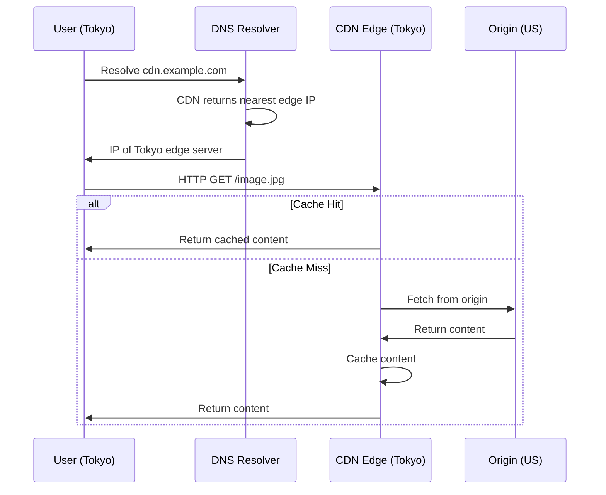
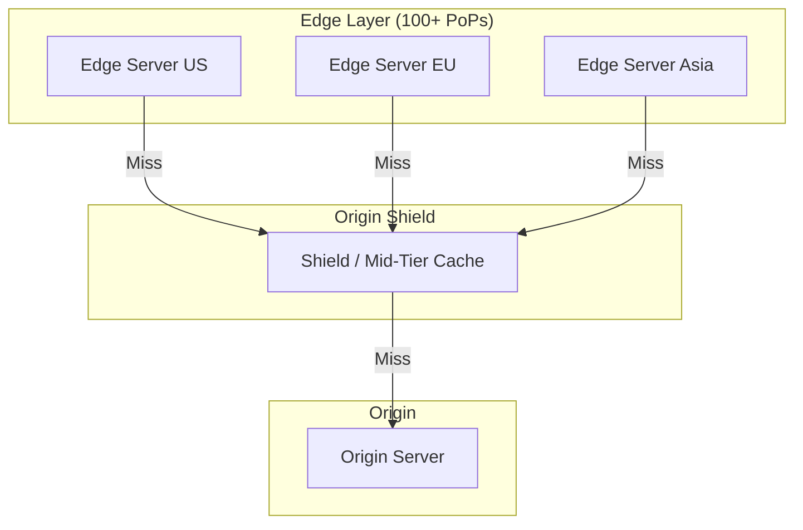
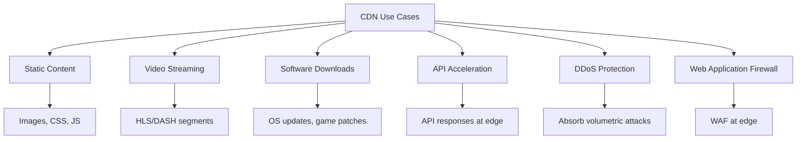
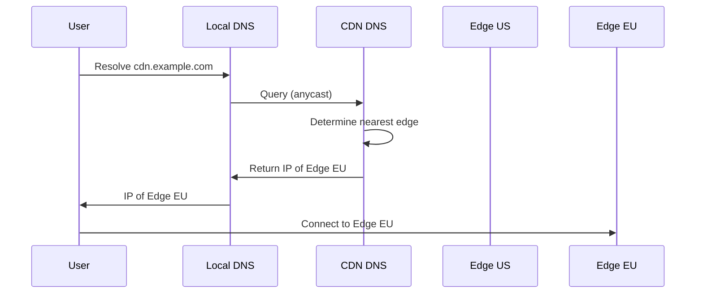

# CDN — Content Delivery Network

## Overview

A CDN is a geographically distributed network of servers (edge nodes) that delivers content to users from the nearest location. CDNs reduce latency, improve availability, and offload origin servers.

## Why CDNs Matter

- **Latency**: Users get content from a nearby edge server (milliseconds vs hundreds of milliseconds)
- **Availability**: If one edge server fails, another serves the content
- **Bandwidth**: Origin server handles less traffic (edge servers cache)
- **DDoS protection**: Distributed infrastructure absorbs attacks
- **Global reach**: Content served from 100+ locations worldwide

## How a CDN Works



## CDN Architecture



**Origin Shield**: An intermediate cache between edge and origin. Reduces origin load by consolidating requests from multiple edge servers.

## CDN Caching

### Cache-Control Headers

```
Cache-Control: public, max-age=3600
```

| Directive | Meaning |
|-----------|---------|
| **public** | Can be cached by CDN and browser |
| **private** | Browser-only cache (not CDN) |
| **no-cache** | Must revalidate with origin before using cache |
| **no-store** | Don't cache at all |
| **max-age=3600** | Cache for 3600 seconds |
| **s-maxage=3600** | CDN-specific max age |
| **immutable** | Content never changes (use with versioned URLs) |

### Cache Key

The CDN uses a cache key to identify content:

```
Cache key = URL + Query string + Host header + Vary headers
```

Example:
- `https://cdn.example.com/image.jpg?v=1` → Cache entry 1
- `https://cdn.example.com/image.jpg?v=2` → Cache entry 2 (different)

### Cache Invalidation

| Method | Description |
|--------|-------------|
| **TTL expiration** | Content expires after max-age |
| **Purge** | Explicitly remove from cache (API call) |
| **Versioned URLs** | `/style.css?v=2` → new URL = new cache entry |
| **Stale-while-revalidate** | Serve stale content while fetching fresh |

## CDN Use Cases



## DNS-Based CDN Routing



**Techniques**:
- **Anycast**: Same IP advertised from multiple locations; BGP routes to nearest
- **GeoDNS**: DNS returns IP based on client's geographic location
- **Latency-based**: DNS measures latency to each edge and returns the closest

## CDN Providers

| Provider | Notable Features |
|----------|-----------------|
| **Cloudflare** | Anycast, WAF, DDoS protection, Workers (edge compute) |
| **AWS CloudFront** | Deep AWS integration, Lambda@Edge |
| **Akamai** | Largest network, enterprise-focused |
| **Fastly** | VCL configuration, real-time purging |
| **Google Cloud CDN** | GCP integration, premium tier |

## Interview Questions

1. **Q: How does a CDN reduce latency?**
   A: By caching content at edge servers geographically close to users. Instead of fetching from an origin server (possibly thousands of miles away), users get content from a nearby edge server in milliseconds.

2. **Q: What is cache hit ratio and why does it matter?**
   A: The percentage of requests served from cache vs origin. Higher = better performance and lower origin load. Typical targets: 80-95%. Measured by monitoring cache HIT/MISS headers.

3. **Q: What is origin shielding?**
   A: An intermediate cache layer between edge servers and the origin. When multiple edge servers miss the cache, they request from the shield (not directly from origin), reducing origin load.

4. **Q: How do you invalidate CDN cache?**
   A: Three methods: 1) Wait for TTL expiration, 2) API purge (immediate but has propagation delay), 3) Versioned URLs (change the URL for new content). Versioned URLs are the most reliable.

5. **Q: What's the difference between CDN and load balancer?**
   A: A CDN is geographically distributed and caches content at the edge. A load balancer distributes traffic within a single data center. CDNs use load balancers internally, but they serve different purposes.

6. **Q: Can a CDN cache dynamic content?**
   A: Traditional CDNs cache static content. Modern CDNs can cache API responses (edge computing), personalized content (ESI — Edge Side Includes), and use edge compute (Cloudflare Workers, Lambda@Edge) for dynamic processing at the edge.

## Common Mistakes

- Not setting proper Cache-Control headers (content never cached or cached too long)
- Cache key too broad (different users get same cached response) or too narrow (low hit ratio)
- Not using versioned URLs for cache invalidation
- Forgetting to purge CDN cache during deployments
- Assuming CDN makes origin server unnecessary (origin is still needed for cache misses)

## Summary

CDNs distribute content globally via edge servers, reducing latency and improving availability. Key concepts: cache hit ratio, Cache-Control headers, cache invalidation, origin shielding, and DNS-based routing. CDNs are essential for any application with a global user base.

## Cross-References

- [How CDN Works](how-it-works.md)
- [Edge Computing](edge.md)
- [Load Balancing](../load-balancing/README.md)
- [DNS](../routing/README.md)
- [Reverse Proxy](../load-balancing/reverse-proxy.md)
