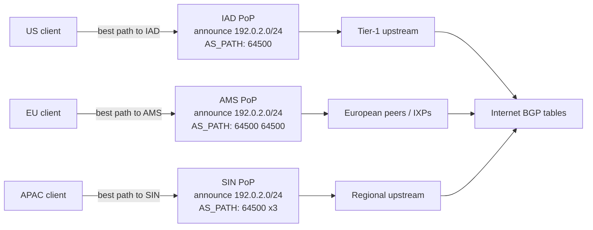
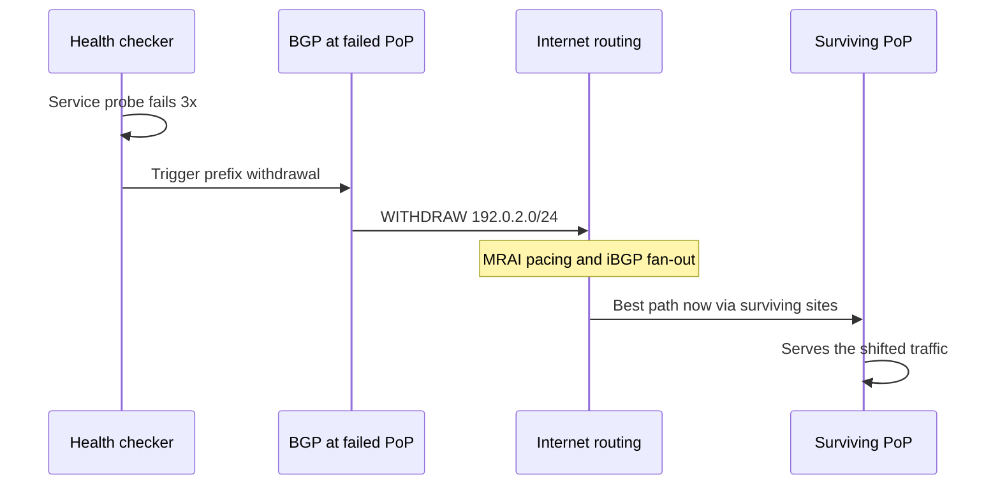
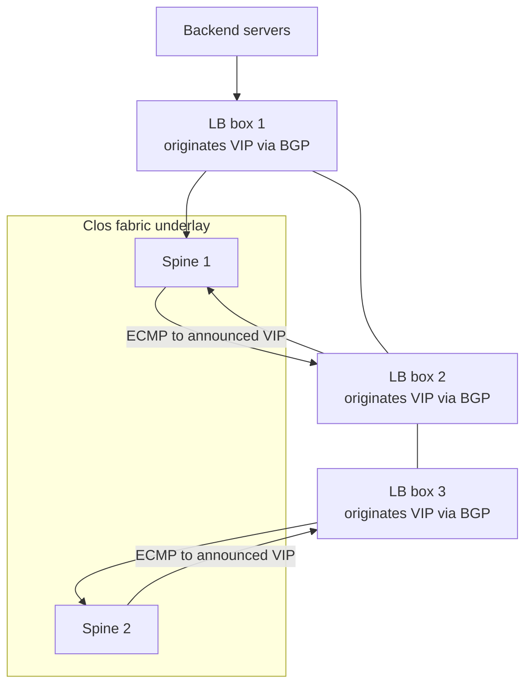

# Anycast and Geo-Aware Routing

## Overview

Anycast makes one IP address live in many data centers at once: every site announces the same prefix via BGP, and the Internet's routing tables deliver each user to the "nearest" announcing site. It is the mechanism behind the 13 root-server letters, 1.1.1.1, 8.8.8.8, and the DNS layer of every major CDN. GeoDNS — Route 53-style latency and geolocation routing — attacks the same problem one layer up, in DNS answers rather than routing tables: finer-grained control, slower failover. This page covers the BGP announcement model, failover and convergence caveats, the anycast-vs-GeoDNS decision, and the operational drawbacks (TCP connection drift, access-network load imbalance) that interviews increasingly probe.

## How Anycast Works at the Routing Layer

### The announcement model

Anycast is not a protocol — it is a deployment pattern. One identical prefix (say `192.0.2.0/24`) is configured on routers or load balancers in many PoPs, each site eBGP-announces it to its upstreams and IXPs, and every router on the Internet picks the best path toward *one of* the announcements. Nothing in BGP distinguishes the copies; from the routing system's perspective they are redundant advertisements of the same route, and longest-prefix and BGP best-path rules choose which copy a given packet reaches. If one site withdraws its announcement, the others are still there — resiliency is an emergent property of the routing table, not of any health-checking machinery in the data path.

The original idea dates to RFC 1546 (1993), which proposed anycast as a host-level service; the deployable form turned out to be purely routing-layer, formalized architecturally in RFC 7094. RFC 4786 (BCP 126) is the operations manual for the pattern as it is actually run today — written largely from the root-DNS operators' experience with global anycast constellations. Reading order for interviews: 1546 for the concept, 7094 for the architecture, 4786 for the operational checklist (site isolation, health checking, and the "all sites must be stateless or state-synced" rule).

### "Nearest" is BGP-nearest, not latency-nearest

BGP has no latency metric: the winner is decided by AS_PATH length, local-pref policies, hot-potato IGP costs, and commercial peering decisions. A site 30 ms away can win over a site 10 ms away because its AS_PATH is shorter. Operators therefore engineer proximity with three levers: AS_PATH prepends (artificially lengthening the path from overloaded sites so neighbors prefer others), BGP communities that upstreams honor to steer per region, and selective peering (announcing at an IXP only from the sites that should serve that metro). Each lever acts on the granularity of whole networks and AS paths, never on individual users — remember that when weighing anycast against GeoDNS below.

In this example the Singapore PoP prepends its AS three times, telling the world "prefer anyone else for my prefix" — a crude but effective load-shedding dial. Turning that dial is the only load-balancing primitive anycast natively has.

### Who does what: sites, routers, health checkers

An anycast deployment decomposes into four roles, and interviews reward naming them precisely. The **service fleet** (DNS daemons, caches, LB boxes) does the work and must be identical across sites. The **announcing routers** originate the prefix at each site — sometimes the service boxes themselves. The **health checker** watches the service and drives announcements, typically by scripting a BGP speaker such as ExaBGP. The **coordination layer** keeps zone data, config, and software versions in lockstep across sites, because anycast silently hides a site that drifted. Keeping the roles separable — service, announcement, health, data — is what makes a fleet debuggable; collapse them into one box per site and every failure mode becomes ambiguous.

### Soft versus hard failure

Distinguish the two failure classes when designing. A *hard* failure (site down, link down) is anycast's home turf: the announcement disappears, the routing table heals, users shift — automatically and acceptably fast. A *soft* failure (site slow, answering wrong, partially degraded) is anycast's blind spot: BGP sees a perfectly healthy announcement and keeps delivering users to a limping site. Every mitigation for soft failure is application-layer or measurement-layer — synthetic query checks, per-vantage-point latency probes, automated prepend-on-degradation — because the routing system has no signal for "up but wrong". When an interviewer asks "what does anycast not protect against?", soft failure is the answer they are fishing for.

### Why infrastructure services love it

Three properties make anycast uniquely attractive for infrastructure workloads. It absorbs volumetric DDoS attacks by diluting them across all sites, with scrubbing happening locally at each PoP instead of at one choke point. It needs no client-side changes — a plain A/AAAA record points at the anycast IP and every client worldwide "just works" with zero coordination. And it fails gracefully by construction: a site that stops announcing simply stops receiving new traffic, with no redirection step, no TTL wait, and no client-side timeout to tune. The price for all three is that the network, not your software, decides who serves each user.

## Same IP, Many PoPs: The Canonical Deployments

The root DNS system is the flagship. Thirteen letters (A–M), each an independently operated anycast constellation, serve 1,500+ instances across roughly 140 countries — all sharing those 13 IPv4/IPv6 address pairs ([root-servers.org](https://www.root-servers.org/)). When a resolver in Jakarta queries the K-root address, it is talking to whichever K-root instance BGP handed it, usually within the region. Large recursive resolvers followed the same design: Cloudflare's 1.1.1.1 and Google's 8.8.8.8 are anycast services announced from hundreds of locations, which is why both answer with single-digit-to-low-double-digit RTTs from almost anywhere on the planet.

CDNs apply the pattern in two distinct roles. For their **authoritative DNS**, anycast is non-negotiable: the steering decisions that pick a user's edge PoP happen at the nearest DNS PoP, so the DNS tier must itself be globally proximate. For **edge serving** (the HTTP tier), some CDNs anycast the VIP as well; others announce per-region prefixes and let DNS do the final steering, precisely because HTTP is stateful and TCP — as discussed below — is where anycast gets delicate. Managed DNS products (Route 53, NS1, Google Cloud DNS) are anycast for the same reason the root is: authoritative answers must come from everywhere.

| Service | Anycast scale | What rides on it |
|---|---|---|
| Root servers (13 letters) | 1,500+ instances | First hop of every uncached DNS lookup |
| Cloudflare 1.1.1.1 | 300+ cities | Public recursive resolver |
| Google 8.8.8.8 | Global anycast | Public recursive resolver |
| Managed DNS (R53, NS1, …) | Dozens of sites per service | Authoritative answers + traffic steering |
| CDN edge (varies by CDN) | Per-CDN | Cache serving where statelessness allows |

The DNS bias is not an accident. UDP request/response is stateless, so any request can be answered by any site holding a copy of the zone — no session affinity, no state sync. That is the design center of anycast, and the same property that makes it perfect for DNS is exactly what makes it delicate for TCP.

### Running an anycast authority: data sync and version skew

Statelessness applies to *queries*, not to the zone data itself — an anycast authority fleet is only as consistent as its distribution pipeline. The standard architecture is a hidden primary (unannounced, single source of truth) that pushes AXFR/IXFR to every anycast site, with configuration managed by the same pipeline so all sites answer identically. Version skew is the failure mode to design against: a site that misses a zone update answers stale data with valid authority, which is worse than an outage because it is silent. Mature fleets therefore check per-site SOA serials as a health signal, canary zone pushes at one site before fleet-wide rollout, and treat config drift the same way application teams treat image drift — as a correctness defect, not a nuisance.

IPv6 adds one wrinkle worth a sentence in interviews: besides global anycast prefixes, IPv6 reserves interface- and subnet-scoped anycast addresses (RFC 4291 defines the architecture; RFC 2526 reserves subnet anycast IDs), but deployed practice for services like DNS overwhelmingly uses the same global-unicast-announcement model as IPv4. The services that made anycast famous run on ordinary BGP announcements of ordinary global prefixes — the pattern generalizes across address families almost without change.

## Failover Behavior and Convergence Caveats

### The failover sequence

Operators automate this with service-aware health checkers: [ExaBGP](https://github.com/Exa-Networks/exabgp) is the standard open-source tool for scripting "probe fails → withdraw the announcement", and every managed-DNS vendor runs an equivalent. The health check must watch the *service*, not the BGP session — a router that keeps announcing while its DNS daemon is dead is the classic anycast blackhole.

### Convergence is BGP-paced

Total failover time is bounded by BGP mechanics rather than by anything in your fleet. Withdrawal propagation is near-instant on the direct path, but delayed elsewhere by update pacing (MRAI, commonly 5–30 s), by route-flap dampening policies that may suppress a flapping route, and by the seconds-to-minutes it takes iBGP and route reflectors to fan the change across a large AS — see [Route Reflector Design](../protocols/route-reflector-design.md) for that fan-out machinery. Realistic anycast failover is therefore "seconds to a couple of minutes", not sub-second. Sub-second local protection belongs to IGP/LDP-layer machinery like LFA and Remote-LFA (RFC 7490), covered in [Fast Failover](../advanced/fast-failover.md); confusing the two layers is a common interview trap.

### The caveats with names

Three pathologies recur in post-incident reviews. **Blackholing from partial failure**: the server is dead but the router still announces, so BGP happily delivers traffic to a site with no service — only service-aware health checking closes this. **Vantage-point divergence**: during reconvergence, different networks see different best paths for seconds to minutes, so a user's packets can land on different PoPs for different flows — or mid-flow for the same flow — and "what does the users' traffic see?" has no single answer. **Dampening and flapping**: an unstable site that withdraws and re-announces repeatedly can get its route dampened by neighbors, extending an outage far beyond the original failure. Each is a direct consequence of steering living in the global routing table, where you control announcements but not the timing of everyone else's convergence.

### Health checking: designing the withdrawal

Because the only anycast failure BGP cannot see is a site that keeps announcing while its application is dead, the health-check design *is* the availability design. Checks ladder from cheap-and-coarse to expensive-and-true, and mature deployments chain them: a BGP session or BFD failure withdraws immediately, a service probe withdraws within seconds, and deeper synthetic checks gate re-admission so a flapping site does not thrash the table.

| Check layer | Detects | Withdrawal trigger | Latency to detect |
|---|---|---|---|
| BGP session / BFD | Site or link down | Automatic (session drop) | <1 s (BFD) to hold-timer |
| Service probe (ExaBGP script) | DNS/HTTP daemon dead while router lives | Scripted prefix withdrawal | Probe interval x failures (seconds) |
| Synthetic query checks | Wrong answers, slow answers, stale zone | Withdraw or prepend | Seconds–minutes |
| Per-vantage-point probes (RIPE Atlas-style) | Regional blackholing, path asymmetry | Alert → operator or automation | Minutes |

The re-admission side matters as much as the withdrawal side. A site that failed and recovered should be re-announced only after its service checks have been green for a stabilization window, and ideally with a temporary prepend so it re-inherits load gradually — otherwise the recovered site's first minute is a traffic cliff, which is exactly when its caches and connection pools are coldest.

## Anycast vs GeoDNS/Latency-Based Routing

### What GeoDNS does differently

GeoDNS solves the steering problem in the application layer: the authoritative DNS returns *different unicast IPs* per requester, chosen by geolocation or by measured latency — Route 53's latency-based, geolocation, and geoproximity policies are the canonical managed examples (see [Route 53](../../cloud/aws/route53.md)). The DNS server sees the recursive resolver's IP, not the end client's, unless EDNS Client Subnet (ECS) carries partial client prefixes through; either way the granularity is per-resolver or per-subnet, and answers change only as fast as TTLs allow — the TTL mechanics that bound this are in [DNS Caching](../dns/caching.md). The result is deterministic, auditable steering ("this answer came from this policy at this time") that anycast's per-routing-table decisions cannot provide.

### Decision table

| Dimension | Anycast (BGP layer) | Unicast + GeoDNS (DNS layer) |
|---|---|---|
| Steering granularity | Per routing-table best path (per network/region, coarse) | Per resolver/subnet with ECS (fine) |
| Failover trigger | Automatic — withdraw announcement | Health checks + DNS answer change, TTL-bound |
| Failover speed | Seconds–minutes (BGP convergence) | Check interval + TTL (minutes by design) |
| Client visibility of change | None (same IP) | New IP in the answer |
| DDoS absorption | Excellent (traffic diluted, scrubbed per PoP) | Weak (answers concentrate users on unicast IPs) |
| TCP/QUIC state | Hard — flows can drift across sites mid-connection | Easy — one stable endpoint per region |
| Load-balancing ability | Indirect (prepends, communities, prefix splitting) | Direct (weighted/latency answers per query) |
| Ops surface | BGP, peering, RPKI hygiene, per-site health checks | DNS infra, health-check fleet, ECS handling |
| Determinism for debugging | Low (per-vantage-point paths differ) | High (answer provenance is logged) |
| Typical users | Root/TLD/authoritative DNS, public resolvers, CDN DNS | App-tier GSLB, multi-region SaaS, DR failover |

The two are complements more than rivals, and large platforms layer them deliberately: anycast carries the DNS query to the nearest steering PoP, which then answers with unicast app IPs chosen by latency data. Anycast decides *which site answers DNS*; GeoDNS decides *which site serves the app*. That layered framing is the interview answer that separates operators from textbook readers.

### ECS and TTL tiering in practice

GeoDNS quality depends on two implementation details that rarely make it into architecture diagrams. **ECS handling**: the DNS server must parse EDNS Client Subnet, honor the scope restrictions privacy-conscious resolvers send (or omit ECS entirely and fall back to the resolver's own IP), and cache answers per ECS prefix rather than per query — a CDN DNS that caches one global answer for an ECS-enabled zone has silently disabled its own steering. **TTL tiering**: records that steer actively (edge IPs under health-checked policies) need short TTLs (60 s), while the records beneath them (stable regional endpoints) can carry long TTLs; mixing the tiers — a short TTL all the way down — multiplies authoritative query load ~24× per tier for no steering benefit.

| Record role | Typical TTL | Rationale |
|---|---|---|
| Actively steered edge IP | 60 s | Health-checked failover within a minute |
| Regional unicast endpoint | 3600 s | Stable; steering happens above it |
| Static infra (NS, MX) | 86400 s | Changes are planned events |

## Flow Steering (FLI) and the Load-Balancing Gap

Because BGP is load-oblivious, anycast's biggest architectural gap is imbalanced load — and the mitigation tools are correspondingly coarse. The classic levers were introduced above: per-site AS_PATH prepends, selective IXP peering, communities that upstreams honor, and geographic splitting of the announced prefix (announce a more-specific /24 only from the sites that should serve it, under a covering aggregate so global reach is never lost — the covering-aggregate trick is also your rollback path if a split goes wrong). Prefix splitting is the sharpest of these: it re-routes only the affected geography, at the cost of consuming address space and adding announcements to monitor.

More recent research attacks the gap directly: the flow-steering literature (FLI is the representative example) keeps anycast's automatic resilience but steers individual flows to preferred PoPs by dynamically refining per-PoP announcements, or by redirecting flows after they land via an overlay. The recurring finding is that BGP state changes at flow granularity are too slow and too disruptive, so practical systems steer at prefix granularity with hysteresis and treat DNS-layer steering as the fine adjustment. For interviews, the takeaway is a trade, not a verdict: anycast buys automatic resilience and DDoS dilution with load-awareness as the casualty, and every production system buys the load-awareness back somewhere else.

The access-network failure mode deserves its own name: broadband users hang off shared aggregation devices (BRAS in telco access, CMTS in cable), and every subscriber behind one BRAS follows the same BGP best path. One PoP can therefore inherit an entire city's load while a healthier site 200 km away sits idle — no per-user logic at the routing layer can fix it. Operators respond with prefix splitting, prepend tuning, or by pushing the steering decision into DNS with ECS. This is also the answer to the interview question "if anycast is load-blind, why do big DNS networks not melt down?" — DNS queries are tiny and uniform, so even a 10× skew is survivable; it is stateful workloads that cannot tolerate the skew.

### A worked example: splitting a /24 across a metro

Concretely: an operator serving `192.0.2.0/24` from four PoPs finds that the IAD PoP carries 3× its fair share because one large cable network's CMTS paths land there. The prefix-splitting response is mechanical. Keep the covering /23 (or the /24) announced globally from all sites as the safety net; carve the overloaded geography's addresses into a more-specific (or reuse part of the block) and announce that more-specific from the two PoPs that should serve it; monitor the traffic shift per PoP and per network; and keep the more-specific's withdrawal as the instant rollback. The covering announcement guarantees no user ever loses reachability during the change — the worst case is that the split does not move the traffic you expected, which is a measurement problem, not an outage.

The same machinery in reverse is how anycast operators shed load during incidents: withdraw the specific, let the covering route catch the traffic, and re-announce when the PoP has capacity. Every lever here is a BGP announcement — which is the page's thesis stated operationally: anycast's load control is announcement engineering, and its ceiling is BGP's granularity.

## Anycast Inside the Data Center

The same pattern recurs one level down. Anycast VIPs are the standard front door for scale-out L4 load balancing: each load-balancer box (hardware or DPDK/Software like Google's Maglev) originates the VIP route into the data center fabric via BGP, ECMP spreads flows across boxes, and a box's failure withdraws its route so ECMP re-hashes around it. The state problem shows up here in miniature — consistent hashing and connection tracking synchronize the boxes so that ECMP re-hashing does not reset established flows (Maglev's backup path and consistent-hashing design exist precisely for this). For the full mechanics, see [L4 Load Balancing Internals](../advanced/l4-load-balancing-internals.md); the lesson is that anycast at any scale needs a state story, whether across PoPs or across LB boxes.

Each LB box is simultaneously a BGP speaker and a forwarder, which is why the health-check rules from the PoP-level design apply here verbatim: a box that stops serving must stop announcing, and re-admission should lag recovery.

### Operational hygiene: RPKI, max-prefix, and monitoring

Anycast infrastructure is BGP infrastructure, so the interdomain hygiene rules apply with extra force. Sign your prefixes with RPKI ROAs so hijacked more-specifics are detectable (the ROV mechanics are in [BGP Security](../protocols/rpki-bgp-security.md)); size max-prefix limits on every eBGP session (the 1.5–2× sizing rule); and monitor per-PoP, not globally — per-vantage-point probes (RIPE Atlas style) tell you which constellation is sick, since a global average happily hides one dead region. Health-check the service process, withdraw from the routing layer on failure, and alert on announcement *presence* per site: the most valuable anycast metric is "is my prefix being announced from every expected site, and is the traffic split what prepends predict?"

### Where this shows up in system design interviews

Outside network-engineering loops, anycast appears in four recurring shapes. "Design a service like 8.8.8.8" is the anycast-UDP question — announce the IP everywhere, keep the tier stateless. "Users in region X hit the wrong region" is the GeoDNS question — ECS, latency policies, and TTLs. "A DDoS is saturating our single ingress" is the absorptive-edge question — spread the VIP, scrub per PoP. And "our failover takes minutes, make it faster" is usually a TTL or convergence-caveat question rather than an anycast question at all. Recognizing which shape is on the table is most of the answer.

## Drawbacks: TCP Connection Drift, State, and Diagnostics

Three operational drawbacks account for most anycast incidents in stateful services. **TCP connection drift**: a long-lived TCP connection is just a 5-tuple with no site label; if BGP re-routes mid-connection, packets arrive at a PoP that never saw the handshake, which responds with RST or silently drops. QUIC's connection IDs soften this somewhat, but they do not eliminate the problem across uncoordinated sites that share no session state. **State divergence**: anything stateful at the edge — TLS session tickets, HTTP/2/3 connection state, cache contents, rate-limit counters — must be synchronized across PoPs or made reconstructable, or users hit hard failures when flows drift. **Diagnosis opacity**: "which PoP am I hitting?" is not answerable from the packet alone; operators embed PoP codes in response headers (`X-Served-By: cache-lax` is the Fastly convention) or expose echo endpoints, and even a simple "ping this IP" is ambiguous because different vantage points hit different sites.

None of this kills anycast in its sweet spot: stateless UDP DNS, cacheable CDN objects (where a drifted flow just re-fills a cache from the new PoP), and absorptive DDoS fronts. It is the reason stateful application tiers usually sit behind unicast VIPs reached through GeoDNS answers instead. The design pattern to internalize: anycast at the edge for what is stateless, unicast-with-steering behind it for what is not.

QUIC deserves one nuance in the drift discussion: connection IDs make a connection *identifiable* across address changes, so a QUIC flow that drifts to a new PoP could in principle be resumed there — if the two PoPs share the session state and the connection-ID routing (CIDR routing of CIDs to sites) is coordinated. That is a real architecture (state-synced anycast QUIC edges exist), but note what it costs: you have re-introduced cross-site state synchronization, the very expense anycast was chosen to avoid. Any interviewer who hears "QUIC fixes anycast drift" should hear "QUIC makes drift *repairable*, at the cost of state sync".

## Numbers Worth Having Ready

| Number | Belongs to | Why it matters |
|---|---|---|
| 13 letters, 1,500+ instances | Root DNS | The flagship anycast constellation |
| 300+ cities | Cloudflare 1.1.1.1 | Anycast recursive resolver scale |
| Seconds–minutes | Anycast failover | BGP-paced, not sub-second |
| One /24 | Minimum practical anycast unit | Announcement granularity is prefixes |
| Covering aggregate | Prefix-splitting safety net | Rollback path for every split |
| 3×–10× | Typical BRAS-induced PoP skew | Load-blindness made concrete |
| Per-network, not per-user | BGP steering granularity | Why GeoDNS exists at all |

## Interview Questions

1. **How can 1.1.1.1 be one IP address if it is served from hundreds of cities?**
   Every site announces the same /24 via eBGP; BGP best-path selection sends each border router's traffic toward the best announcement it sees, normally the topologically closest PoP. There is no anycast protocol — just redundant identical advertisements under standard BGP rules, with RFC 4786 (BCP 126) documenting the operations. The consequences to state: "nearest" means BGP-nearest (policy, not latency or load), a site leaving the BGP table silently sheds its traffic, and a site that dies while still announcing blackholes its users until a service-aware health check withdraws the route.

2. **Your anycast DNS PoP dies. How fast do users recover, and what can delay it?**
   Recovery is BGP reconvergence: withdrawal propagates in seconds on the direct path, but MRAI-style update pacing (5–30 s), route-flap dampening, and route-reflector fan-out can stretch it to minutes for some vantage points. The classic trap is partial failure — machine dead, router still announcing — which blackholes traffic until automated service-aware checking (ExaBGP-style) withdraws the prefix. If pressed on sub-second: that is IGP-layer fast reroute (RLFA, RFC 7490), a different layer with a different job, and conflating the two is a common design error.

3. **When would you choose unicast + GeoDNS over anycast, and why?**
   When endpoints are stateful or you need fine-grained, load-aware, deterministic control: per-resolver/per-subnet steering with ECS, weighted traffic shifting, and auditable answers whose provenance you can log. Anycast gives automatic, coarse, load-oblivious resilience with no client changes — ideal for stateless DNS and caches. The strongest answer is the layered production pattern: anycast the DNS tier (nearest steering PoP) and GeoDNS the app tier (best unicast region), getting anycast's reach and GeoDNS's control simultaneously.

4. **Why is anycast great for UDP DNS but awkward for TCP-heavy services?**
   UDP request/response is stateless: any PoP with the zone or cache can answer any query, so mid-flow drift costs nothing. TCP carries handshake and sequence state at exactly one site; if BGP re-routes mid-connection, the new PoP lacks the session and resets or drops the flow. Stateful services on anycast need cross-PoP state synchronization (expensive, and Maglev-style consistent hashing only solves it within a cluster) or must tolerate resets during convergence — which is why app tiers sit behind unicast VIPs answered by GeoDNS.

5. **Explain how one anycast PoP can end up serving far more traffic than its peers.**
   BGP best path is per-network, not per-user: thousands of subscribers behind one BRAS or CMTS all inherit the same best path, so a single PoP can capture an entire metro's load. Peering policy has the same effect at continental scale — a tier-1 that prefers one announcement can divert whole regions. Mitigations are coarse routing-layer tools: per-site prepends, selective peering, communities, and prefix splitting with a covering aggregate. DNS workloads survive the skew because queries are tiny and uniform; stateful workloads cannot.

6. **How do you debug "works for me, broken for them" on an anycast service?**
   First identify the PoP per vantage point — PoP codes in response headers, echo endpoints, or DNS TXT diagnostics — because the IP itself is ambiguous under anycast. Then compare BGP views (RouteViews/RIPE RIS) from the affected networks: is the failed site still announcing (blackhole), did a prepend policy change flip paths, is dampening suppressing the route? Finally check per-PoP service health rather than session health, and alert on announcement presence per site — the highest-signal anycast metrics are which sites are announcing and whether the traffic split matches the prepend design.

## Key Takeaways

- Anycast = same prefix announced from many sites; BGP best path does the steering. RFC 1546 defined the idea, RFC 7094 the architecture, RFC 4786 (BCP 126) the operations.
- The root servers (13 letters, 1,500+ instances), 1.1.1.1, 8.8.8.8, and every managed-DNS network run on it because DNS is stateless UDP — the workload anycast serves perfectly.
- Failover is automatic but BGP-paced: seconds to minutes, with MRAI pacing, dampening, and RR fan-out as the delays; sub-second protection is IGP-layer (RLFA), not anycast.
- Blackholing from partial failure is the signature anycast incident — health-check the service, not the BGP session, and withdraw on service failure (ExaBGP is the standard tool).
- "Nearest" is BGP-nearest: AS_PATH, local-pref, and peering decide, never latency and never load; prepends, communities, and prefix splitting are the only native load dials.
- GeoDNS/latency routing (Route 53 style) is the application-layer alternative: finer ECS-based granularity, deterministic auditable answers, TTL-bounded failover; the layered design (anycast DNS → GeoDNS app) is the production pattern.
- Named drawbacks to drop in interviews: TCP connection drift on re-route, cross-PoP state divergence, BRAS/CMTS aggregation imbalance, and diagnosis ambiguity — all rooted in routing-layer decisions being coarse and load-oblivious.

## References

- [RFC 4786: Operation of Anycast Services (BCP 126)](https://datatracker.ietf.org/doc/html/rfc4786)
- [RFC 7094: Architectural Considerations of IP Anycast](https://datatracker.ietf.org/doc/html/rfc7094)
- [RFC 1546: Host Anycasting Service (original proposal)](https://datatracker.ietf.org/doc/html/rfc1546)
- [RFC 3258: Distributing Authoritative Name Servers via Shared Unicast Addresses](https://datatracker.ietf.org/doc/html/rfc3258)
- [RFC 4291: IP Version 6 Addressing Architecture (anycast addressing)](https://datatracker.ietf.org/doc/html/rfc4291)
- [RFC 2526: Reserved IPv6 Subnet Anycast Addresses](https://datatracker.ietf.org/doc/html/rfc2526)
- [RFC 7490: Remote-LFA Fast Reroute (sub-second failover below BGP)](https://datatracker.ietf.org/doc/html/rfc7490)
- [Cloudflare: A Brief Primer on Anycast](https://blog.cloudflare.com/a-brief-anycast-primer)
- [Cloudflare Learning: What is Anycast DNS?](https://www.cloudflare.com/learning/dns/what-is-anycast-dns)
- [Cloudflare Learning: Anycast networks](https://www.cloudflare.com/learning/cdn/glossary/anycast-network)
- [1.1.1.1 (Cloudflare public resolver)](https://1.1.1.1/)
- [Google Public DNS documentation (8.8.8.8)](https://developers.google.com/speed/public-dns)
- [Root Server Operations: instance map and counts](https://www.root-servers.org/)
- [AWS Route 53: Choosing a routing policy](https://docs.aws.amazon.com/Route53/latest/DeveloperGuide/routing-policy.html)
- [AWS Route 53: Latency-based routing](https://docs.aws.amazon.com/Route53/latest/DeveloperGuide/routing-policy-latency.html)
- [ExaBGP (scripted BGP announcements for anycast health checks)](https://github.com/Exa-Networks/exabgp)
- Ballani & Francis, "Towards a Global IP Anycast Service", ACM SIGCOMM 2005.
- Eisenbud et al., "Maglev: A Fast and Reliable Software Network Load Balancer", USENIX NSDI 2016 (anycast VIPs and consistent hashing inside the DC).

## Cross-References

- [How a CDN Works](./how-it-works.md) — the request flow that anycast and GeoDNS steer users into.
- [Edge Computing](./edge.md) — what runs inside the PoPs an anycast announcement serves.
- [BGP Deep Dive](../routing/bgp-deep.md) — best-path selection, prepends, and communities behind the steering.
- [Route Reflector Design](../protocols/route-reflector-design.md) — how withdrawals and announcements fan out inside large ASes.
- [BGP Security (RPKI)](../protocols/rpki-bgp-security.md) — ROAs, ROV, and max-prefix hygiene for the announcements anycast depends on.
- [Route 53](../../cloud/aws/route53.md) — the managed GeoDNS/latency-routing toolbox this page compares against.
- [DNS Caching](../dns/caching.md) — TTL mechanics that bound GeoDNS failover speed.
- [L4 Load Balancing Internals](../advanced/l4-load-balancing-internals.md) — the stateful balancing layer behind an anycast VIP.
- [Fast Failover](../advanced/fast-failover.md) — sub-second reroute machinery (BFD, RLFA) beneath BGP convergence.
