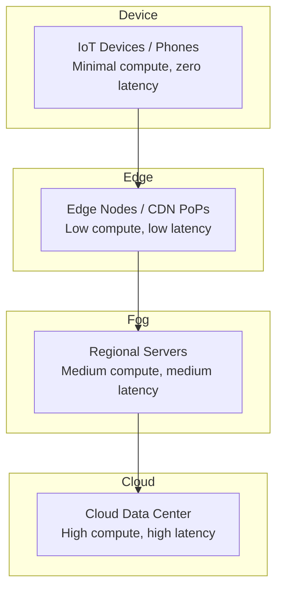
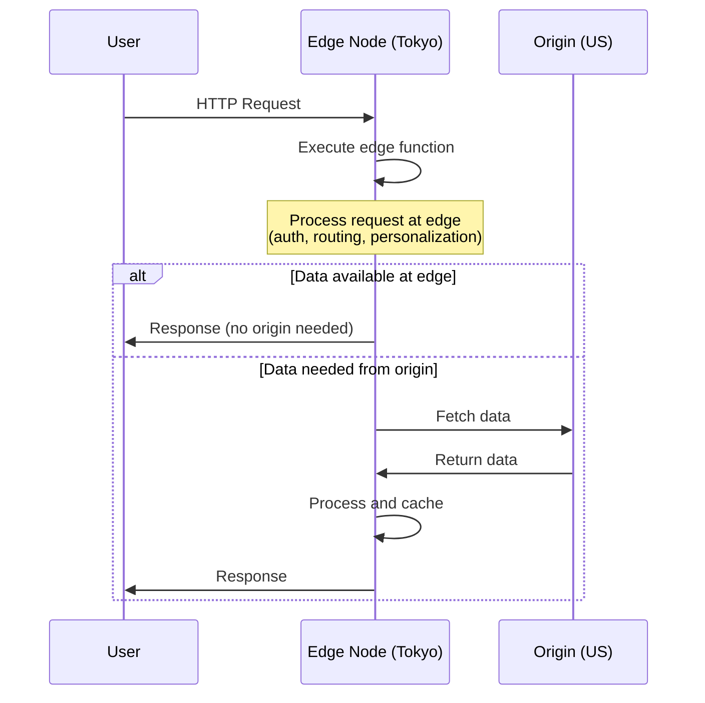
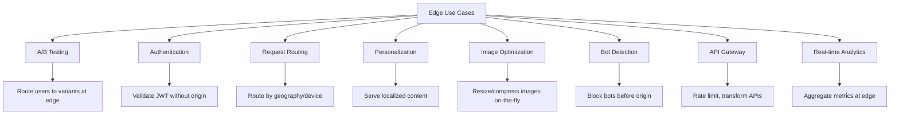
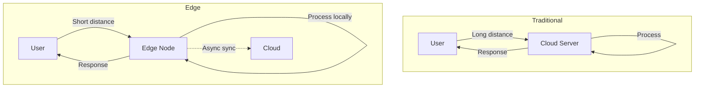

# Edge Computing

## Overview

Edge computing pushes computation and data storage closer to the sources of data — at the "edge" of the network, near users. Instead of sending all data to a centralized cloud, processing happens at CDN edge nodes, IoT gateways, or regional servers.

## Why Edge Computing Matters

- **Latency**: Processing near users = milliseconds, not hundreds of milliseconds
- **Bandwidth**: Only relevant data sent to cloud, reducing costs
- **Privacy**: Sensitive data processed locally, not transmitted
- **Reliability**: Works even with intermittent connectivity
- **Real-time**: Enables applications that need instant responses

## Cloud vs Edge vs Fog



| Layer | Location | Latency | Compute | Example |
|-------|----------|---------|---------|---------|
| **Device** | User device | 0ms | Minimal | Phone, sensor |
| **Edge** | CDN PoP, 5G tower | 1-10ms | Moderate | Cloudflare Workers |
| **Fog** | Regional DC | 10-50ms | High | AWS Local Zones |
| **Cloud** | Centralized DC | 50-200ms | Massive | AWS us-east-1 |

## Edge Computing Platforms

### CDN-Based Edge Compute

| Platform | Language | Description |
|----------|----------|-------------|
| **Cloudflare Workers** | JavaScript/Rust | V8 isolates at 300+ PoPs |
| **AWS Lambda@Edge** | Node.js/Python | Runs at CloudFront edge |
| **Fastly Compute** | Rust/Go/JS | Wasm-based edge compute |
| **Vercel Edge Functions** | JavaScript | Next.js edge rendering |
| **Deno Deploy** | JavaScript/TypeScript | V8 isolates globally |

### How Edge Compute Works



## Use Cases



## Edge Function Example (Cloudflare Workers)

```javascript
export default {
  async fetch(request) {
    const url = new URL(request.url);
    
    // A/B testing at edge
    const cookie = request.headers.get('Cookie');
    const variant = cookie?.includes('variant=B') ? 'B' : 'A';
    
    // Route to different backends
    if (url.pathname.startsWith('/api/')) {
      return fetch(`https://api.example.com${url.pathname}`);
    }
    
    // Serve personalized content
    const country = request.cf?.country;
    const greeting = country === 'JP' ? 'こんにちは' : 'Hello';
    
    return new Response(`${greeting}! You're in variant ${variant}`);
  }
};
```

## Edge vs Traditional Architecture



## Interview Questions

1. **Q: What is edge computing and how does it differ from cloud computing?**
   A: Edge computing processes data near the user (at CDN PoPs, 5G towers, IoT gateways) rather than in centralized cloud data centers. It reduces latency, saves bandwidth, and enables real-time applications. Cloud computing provides massive compute but with higher latency.

2. **Q: When would you use edge computing?**
   A: When you need: low latency (real-time gaming, AR/VR), bandwidth savings (IoT data filtering), privacy compliance (process data locally), or offline capability. Don't use edge for heavy computation or large datasets.

3. **Q: What is Cloudflare Workers?**
   A: A serverless edge computing platform that runs JavaScript/Rust in V8 isolates at 300+ CDN edge locations. Each request runs in an isolated environment with minimal cold start (<1ms). Used for A/B testing, auth, routing, and API processing at the edge.

4. **Q: What are the limitations of edge computing?**
   A: Limited compute resources (can't run heavy ML models), limited storage (stateless by default), cold start issues (though minimal in modern platforms), debugging complexity (distributed), and vendor lock-in.

5. **Q: What's the difference between edge and fog computing?**
   A: Edge computing processes at the network edge (CDN, 5G tower). Fog computing is a broader concept that includes processing at any point between the device and cloud, including regional data centers. Edge is a subset of fog.

## Common Mistakes

- Trying to run heavy computation at the edge (limited resources)
- Not considering data consistency (edge nodes may have stale data)
- Vendor lock-in (each platform has different APIs)
- Not understanding cold start behavior
- Over-complicating architecture (sometimes a simple cloud server is better)

## Summary

Edge computing brings computation closer to users, reducing latency and bandwidth usage. CDN-based edge compute (Cloudflare Workers, Lambda@Edge) enables running code at 100+ locations globally. It's ideal for A/B testing, authentication, routing, and personalization.

## Cross-References

- [CDN Overview](README.md)
- [How CDN Works](how-it-works.md)
- [Load Balancing](../load-balancing/README.md)
- [5G](../wireless/5g.md) — Edge computing enabler
- [SDN](../wireless/sdn.md) — Network programmability
