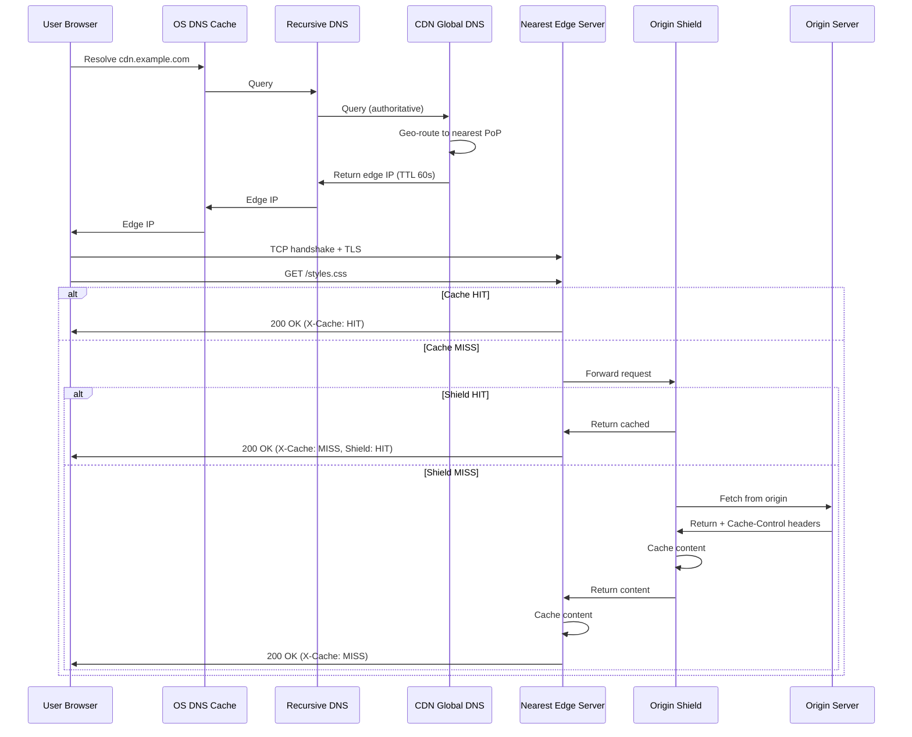
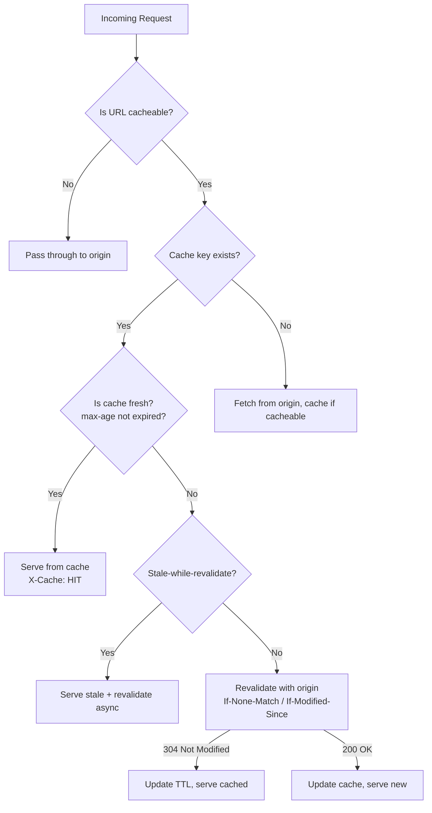
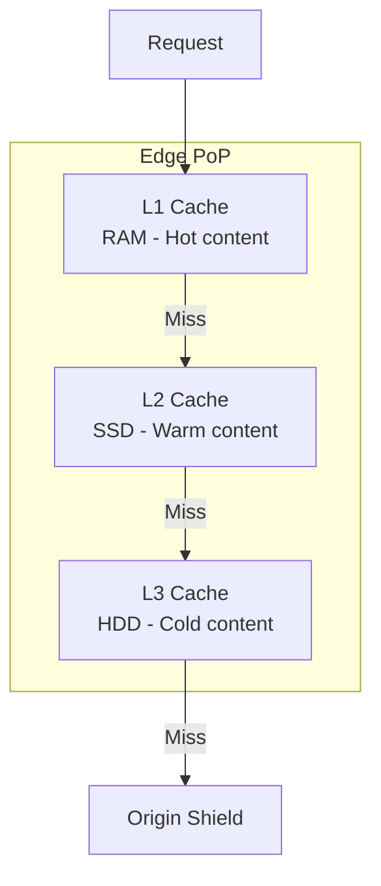
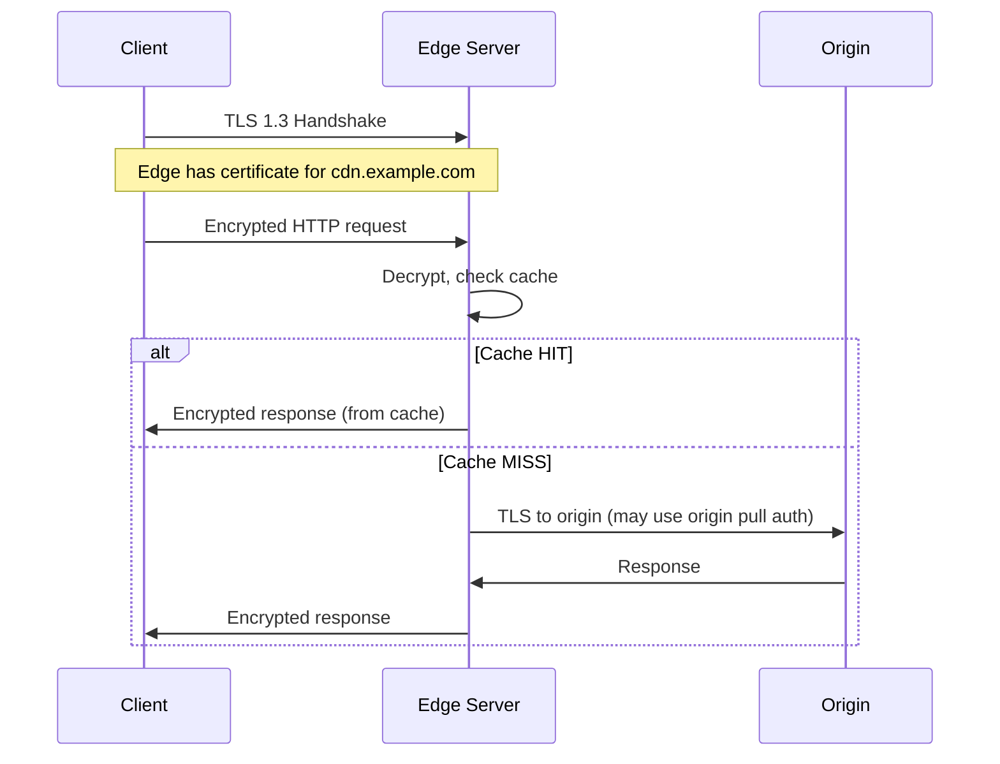

# How a CDN Works

## Overview

This page dives deeper into the technical mechanics of a CDN — how requests are routed, content is cached, and performance is optimized at every step.

## Request Flow: The Complete Journey



## Cache Decision Logic



## Content Types and Caching Strategy

| Content Type | Cache Duration | Strategy |
|-------------|---------------|----------|
| **Static assets** (images, CSS, JS) | 1 year | Versioned URLs + immutable |
| **HTML pages** | Minutes to hours | s-maxage + stale-while-revalidate |
| **API responses** | Seconds to minutes | Short TTL or no-cache |
| **Video segments** (HLS/DASH) | Hours to days | Long TTL, segmented |
| **Personalized content** | Not cached | Pass through or ESI |

## Cache Headers in Practice

### Origin Response Headers

```http
HTTP/1.1 200 OK
Content-Type: image/jpeg
Cache-Control: public, max-age=31536000, immutable
ETag: "abc123"
Content-Length: 45678
```

### CDN Response Headers

```http
HTTP/1.1 200 OK
Content-Type: image/jpeg
Cache-Control: public, max-age=31536000, immutable
X-Cache: HIT
X-Cache-Hits: 42
Age: 3600
CF-Cache-Status: HIT  # Cloudflare specific
X-Served-By: cache-lax  # Fastly specific
```

## Edge Server Caching Architecture



Most CDN edge servers use a multi-tier cache:
- **L1**: In-memory (fastest, smallest capacity, hot content)
- **L2**: SSD (fast, medium capacity)
- **L3**: HDD (slower, largest capacity)

## TLS at the Edge



**CDN TLS Termination**: The CDN holds the TLS certificate for your domain. Users connect to the CDN edge over TLS. The CDN then connects to your origin (optionally over TLS).

## Purging and Invalidation

### API Purge

```bash
# Cloudflare
curl -X POST "https://api.cloudflare.com/client/v4/zones/{zone_id}/purge_cache" \
  -H "Authorization: Bearer {token}" \
  -d '{"files":["https://cdn.example.com/styles.css"]}'

# Purge everything
curl -X POST "https://api.cloudflare.com/client/v4/zones/{zone_id}/purge_cache" \
  -d '{"purge_everything":true}'
```

### Tag-Based Purge

```http
# Origin sets cache tags
Cache-Tag: images, user-profile, css

# Purge by tag
PURGE /cache-tag/images
```

## Interview Questions

1. **Q: Walk me through what happens when a user requests a CDN-cached resource.**
   A: 1) DNS resolves to nearest edge server. 2) Client establishes TLS with edge. 3) Edge checks cache by cache key. 4) If HIT, serves from cache. 5) If MISS, edge checks origin shield. 6) If shield misses, fetches from origin. 7) Caches at edge and shield for future requests.

2. **Q: What is a cache key and what should it include?**
   A: The cache key uniquely identifies cached content. Typically includes: URL path, query parameters, Host header, and Vary headers (Accept-Encoding, Accept-Language). Too broad = wrong content served; too narrow = low hit ratio.

3. **Q: How does stale-while-revalidate work?**
   A: When content expires, the CDN serves the stale (expired) content immediately while asynchronously fetching fresh content from origin. This avoids latency spikes when content expires. Next request gets the fresh content.

4. **Q: What's the difference between cache purge and cache bypass?**
   A: Purge removes cached content permanently (next request goes to origin). Cache bypass serves from origin for a single request but doesn't remove the cached copy. Purge is for deployments; bypass is for debugging.

5. **Q: Why do CDNs use short DNS TTLs?**
   A: Short TTLs (60s) allow the CDN to quickly redirect clients to a different edge server if one fails. If TTL were 24h, clients would cache the IP and continue hitting a failed server.

## Common Mistakes

- Not understanding the full request flow (DNS → Edge → Shield → Origin)
- Confusing cache purge with cache bypass
- Not setting proper Vary headers (serving gzip content to clients that don't support it)
- Using long TTLs without versioned URLs (stale content issues)
- Not monitoring cache hit ratio

## Summary

A CDN works by routing users to the nearest edge server via DNS, caching content at the edge, and using origin shields to reduce origin load. Cache-Control headers, cache keys, and invalidation strategies are the core technical concepts.

## Cross-References

- [CDN Overview](README.md)
- [Edge Computing](edge.md)
- [TLS](../security/tls.md) — TLS at edge
- [Reverse Proxy](../load-balancing/reverse-proxy.md) — Edge servers are reverse proxies

## Cross References

- [CDN Edge](edge.md)
- [DNS Resolution](../dns/resolution.md)
- [Caching Strategies](../../interview/system-design/hld/caching-strategy.md)
- [Distributed Replication](../../distributed/replication/README.md)
