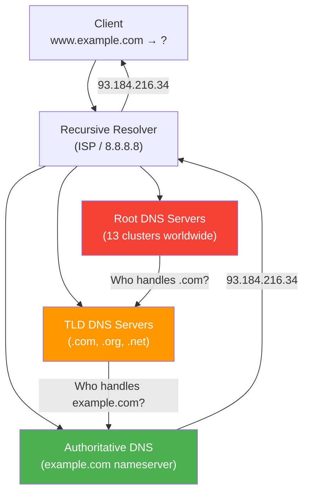
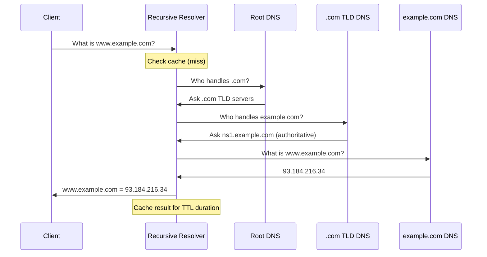
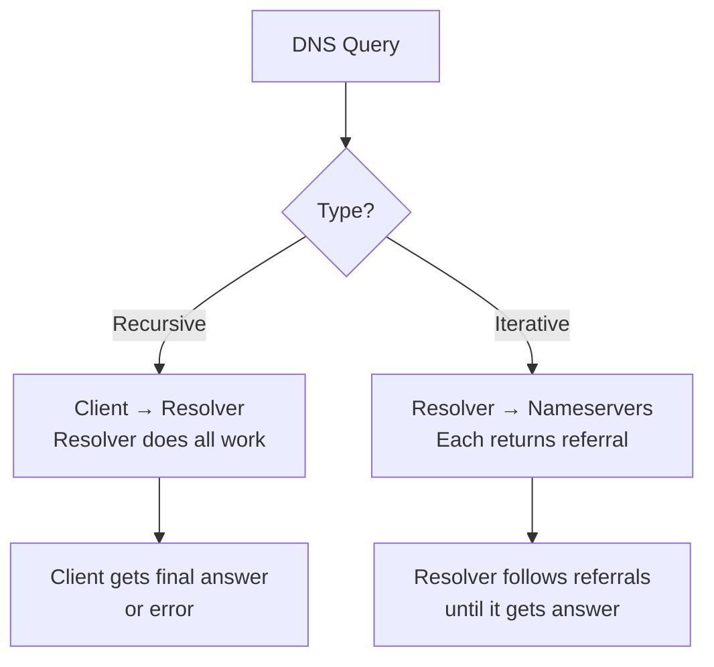

# DNS Overview

## Overview

The **Domain Name System (DNS)** is the Internet's phonebook. It translates human-readable domain names (like `www.example.com`) into IP addresses (like `93.184.216.34`) that computers use to communicate. Without DNS, you'd need to memorize IP addresses for every website you visit.

DNS is one of the most critical Internet infrastructure services — it's queried billions of times daily and is foundational to virtually every Internet application. Understanding DNS is essential for networking interviews, system administration, and web development.

## Detailed Explanation

### What is DNS?

DNS is a **hierarchical, distributed naming system** that:
1. **Translates domain names to IP addresses** (forward lookup)
2. **Translates IP addresses to domain names** (reverse lookup)
3. **Provides service discovery** (MX records for email, SRV records for services)
4. **Enables load balancing** (multiple A records, CDN DNS)
5. **Supports email routing** (MX records, SPF, DKIM)

### DNS Architecture



### DNS Hierarchy

```
Root (.)
├── .com (TLD)
│   ├── google.com
│   ├── example.com
│   └── github.com
├── .org (TLD)
│   ├── wikipedia.org
│   └── mozilla.org
├── .net (TLD)
│   └── cloudflare.net
├── .edu (TLD)
│   └── mit.edu
└── .uk (ccTLD)
    ├── co.uk
    └── ac.uk
```

### DNS Components

#### 1. DNS Resolver (Recursive)
- Client's first point of contact
- Performs the full resolution on behalf of the client
- Caches results for efficiency
- Examples: ISP resolvers, Google (8.8.8.8), Cloudflare (1.1.1.1)

#### 2. Root DNS Servers
- 13 root server clusters (A through M)
- First step in resolution (if not cached)
- Point to TLD servers
- Managed by various organizations (ICANN, Verisign, NASA, etc.)

#### 3. TLD (Top-Level Domain) Servers
- Manage top-level domains (.com, .org, .net, .uk, etc.)
- Point to authoritative nameservers for domains
- Operated by registries (Verisign for .com/.net, PIR for .org)

#### 4. Authoritative DNS Servers
- Have the actual DNS records for a domain
- Final source of truth for domain resolution
- Configured by domain owners
- Can be self-hosted or provided by DNS hosting services

### DNS Resolution Process



### DNS Port and Transport

```
Primary: UDP port 53 (most queries)
Fallback: TCP port 53 (large responses, zone transfers)

Why UDP?
  - Small queries (< 512 bytes)
  - Speed critical (every web request starts with DNS)
  - No handshake overhead

Why TCP fallback?
  - Response > 512 bytes (or EDNS0 allows larger UDP)
  - Zone transfers (AXFR/IXFR)
  - DNSSEC responses (large signatures)
```

### DNS Packet Format

```
+---------------------+
|        Header       | 12 bytes
+---------------------+
|       Question      | Query name, type, class
+---------------------+
|       Answer        | Resource records (answers)
+---------------------+
|      Authority      | NS records (authoritative)
+---------------------+
|      Additional     | Extra records (A for NS, etc.)
+---------------------+
```

### DNS Header

```
 0                   1                   2                   3
 0 1 2 3 4 5 6 7 8 9 0 1 2 3 4 5 6 7 8 9 0 1 2 3 4 5 6 7 8 9 0 1
+-+-+-+-+-+-+-+-+-+-+-+-+-+-+-+-+-+-+-+-+-+-+-+-+-+-+-+-+-+-+-+-+
|          Transaction ID       |           Flags               |
+-+-+-+-+-+-+-+-+-+-+-+-+-+-+-+-+-+-+-+-+-+-+-+-+-+-+-+-+-+-+-+-+
|        Questions Count        |       Answers Count           |
+-+-+-+-+-+-+-+-+-+-+-+-+-+-+-+-+-+-+-+-+-+-+-+-+-+-+-+-+-+-+-+-+
|      Authority Count          |       Additional Count        |
+-+-+-+-+-+-+-+-+-+-+-+-+-+-+-+-+-+-+-+-+-+-+-+-+-+-+-+-+-+-+-+-+
```

### DNS Query Types



**Recursive Query:**
```
Client asks resolver: "Please resolve www.example.com for me"
Resolver does all the work (queries root, TLD, authoritative)
Client gets the final answer
```

**Iterative Query:**
```
Resolver asks root: "Who handles .com?"
Root: "Try these TLD servers..."
Resolver asks TLD: "Who handles example.com?"
TLD: "Try these authoritative servers..."
Resolver asks authoritative: "What is www.example.com?"
Authoritative: "93.184.216.34"
```

### DNS Caching

```
Caching levels:
  1. Browser cache (minutes)
  2. OS cache (minutes to hours)
  3. Resolver cache (TTL-based)
  4. Intermediate caches (CDN, proxy)

TTL (Time To Live):
  - Set by authoritative DNS server
  - Typical: 300-3600 seconds (5 min - 1 hour)
  - Cached entries expire after TTL
  - Lower TTL = faster propagation, more queries
  - Higher TTL = less load, slower propagation
```

### DNS Protocol Evolution

```
DNS (1983):      UDP port 53, basic queries
EDNS0 (1999):    Larger UDP payloads (up to 4096 bytes)
DNSSEC (2005):   Cryptographic signatures for authenticity
DoT (2016):      DNS over TLS (encrypted, port 853)
DoH (2018):      DNS over HTTPS (encrypted, port 443)
DoQ (2022):      DNS over QUIC (encrypted, port 853)
```

## Example: Real DNS Resolution

### Dig Command

```bash
# Basic query
$ dig www.example.com

;; QUESTION SECTION:
;www.example.com.               IN      A

;; ANSWER SECTION:
www.example.com.        86400   IN      A       93.184.216.34

;; AUTHORITY SECTION:
example.com.            86400   IN      NS      a.iana-servers.net.
example.com.            86400   IN      NS      b.iana-servers.net.

;; Query time: 45 msec
;; SERVER: 8.8.8.8#53(8.8.8.8)
```

### Tracing DNS Resolution

```bash
# Trace full resolution path
$ dig +trace www.example.com

.                       518400  IN      NS      a.root-servers.net.
.                       518400  IN      NS      b.root-servers.net.
...
com.                    172800  IN      NS      a.gtld-servers.net.
com.                    172800  IN      NS      b.gtld-servers.net.
...
example.com.            172800  IN      NS      a.iana-servers.net.
example.com.            172800  IN      NS      b.iana-servers.net.
...
www.example.com.        86400   IN      A       93.184.216.34
```

### nslookup

```bash
# Windows/Linux DNS lookup
$ nslookup www.example.com
Server:     8.8.8.8
Address:    8.8.8.8#53

Non-authoritative answer:
Name:   www.example.com
Address: 93.184.216.34
```

## Interview Questions

### Q1: What is DNS and why is it needed?
**A:** DNS (Domain Name System) translates human-readable domain names into IP addresses. It's needed because humans remember names better than numbers, and IP addresses change. DNS also provides email routing (MX records), service discovery (SRV records), and load balancing (multiple A records).

### Q2: Walk me through the DNS resolution process for www.example.com.
**A:** (1) Client checks local cache. (2) Client queries recursive resolver. (3) Resolver checks its cache. (4) If cache miss, resolver queries root server → gets TLD server address. (5) Resolver queries .com TLD server → gets authoritative NS address. (6) Resolver queries authoritative NS → gets IP address. (7) Resolver returns IP to client and caches it.

### Q3: What is the difference between recursive and iterative DNS queries?
**A:** **Recursive**: Client asks resolver to do all the work. Resolver returns the final answer or error. **Iterative**: Resolver asks each DNS server, which returns a referral (next server to ask). The resolver follows referrals until it gets the answer. Client-to-resolver is recursive; resolver-to-servers is iterative.

### Q4: How does DNS caching work and what is TTL?
**A:** DNS responses are cached at multiple levels (browser, OS, resolver) to reduce query load. TTL (Time To Live) is set by the authoritative server and tells caches how long to store the record. After TTL expires, the cached entry is discarded and must be re-queried. Typical TTL is 300-3600 seconds.

### Q5: Why does DNS use UDP instead of TCP?
**A:** DNS queries are small (< 512 bytes) and need fast responses. TCP's 3-way handshake adds 1.5 RTT overhead. For a protocol used billions of times daily, this matters. UDP sends immediately. DNS falls back to TCP for large responses (> 512 bytes), zone transfers, or DNSSEC.

### Q6: What are the 13 root DNS servers?
**A:** There are 13 root server IP addresses (A through M), but they're implemented as hundreds of servers worldwide using anycast. They're the starting point for DNS resolution and point to TLD servers. They're operated by organizations like ICANN, Verisign, NASA, and the US Army.

### Q7: What is the difference between authoritative and recursive DNS?
**A:** **Authoritative DNS** has the actual DNS records for a domain — it's the source of truth. **Recursive DNS** (resolver) does the full resolution process on behalf of clients, querying root, TLD, and authoritative servers. A server can be both (authoritative for its domains, recursive for its clients).

### Q8: What is EDNS0?
**A:** EDNS0 (Extension Mechanisms for DNS, RFC 6891) extends the original DNS protocol. It allows larger UDP payloads (up to 4096 bytes vs original 512), additional flags, and options. EDNS0 is required for DNSSEC and enables modern DNS features like Client Subnet in queries.

## Common Mistakes

1. **Confusing recursive and iterative queries**: Client-to-resolver is recursive (resolver does the work). Resolver-to-servers is iterative (each returns a referral). Don't mix them up.

2. **Not understanding caching layers**: DNS is cached at browser, OS, resolver, and sometimes CDN levels. A change in DNS may not propagate immediately — you must wait for TTL to expire at each layer.

3. **Forgetting that DNS uses both UDP and TCP**: Most queries use UDP, but large responses and zone transfers use TCP. DNSSEC responses often exceed 512 bytes and trigger TCP fallback.

4. **Not knowing that 13 root servers ≠ 13 machines**: There are 13 root server *addresses*, but hundreds of physical servers worldwide using anycast. Each address represents a distributed cluster.

5. **Confusing CNAME with A records**: A records map domain to IP directly. CNAME records map domain to another domain (alias). CNAME adds an extra lookup but simplifies management.

6. **Not understanding TTL's impact on changes**: If you change a DNS record with TTL=3600 (1 hour), clients may see the old value for up to 1 hour. Lower TTL before making changes, then raise it after.

7. **Thinking DNS is just for IP addresses**: DNS provides many record types: MX (email), TXT (verification), SRV (service discovery), CNAME (aliases), PTR (reverse lookup), and more.

## Summary

| Component | Role | Example |
|-----------|------|---------|
| **Client** | Initiates DNS query | Your browser |
| **Recursive Resolver** | Performs resolution | 8.8.8.8, ISP resolver |
| **Root Server** | Points to TLD | 13 clusters (A-M) |
| **TLD Server** | Points to authoritative | .com, .org, .uk |
| **Authoritative Server** | Has actual records | ns1.example.com |

| Aspect | Detail |
|--------|--------|
| **Port** | UDP 53 (primary), TCP 53 (fallback) |
| **Hierarchy** | Root → TLD → Authoritative |
| **Caching** | TTL-based, multiple layers |
| **Query types** | Recursive (client→resolver), Iterative (resolver→servers) |
| **Security** | DNSSEC, DoH, DoT |

DNS is the foundation of Internet naming. Understanding its architecture, resolution process, caching, and security is essential for any networking professional.

## Cross-References

- [DNS Resolution](resolution.md) — Detailed resolution process
- [DNS Record Types](record-types.md) — All DNS record types
- [DNS Caching](caching.md) — Caching mechanisms and TTL
- [DNS Security](security.md) — DNSSEC, DoH, DoT
- [UDP Overview](../udp/README.md) — DNS uses UDP for queries
- [HTTP Overview](../http/README.md) — HTTP depends on DNS for name resolution
