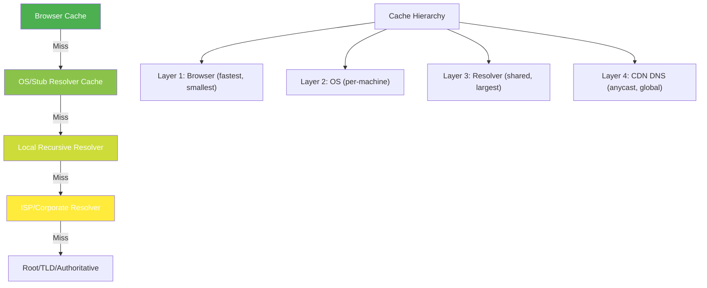
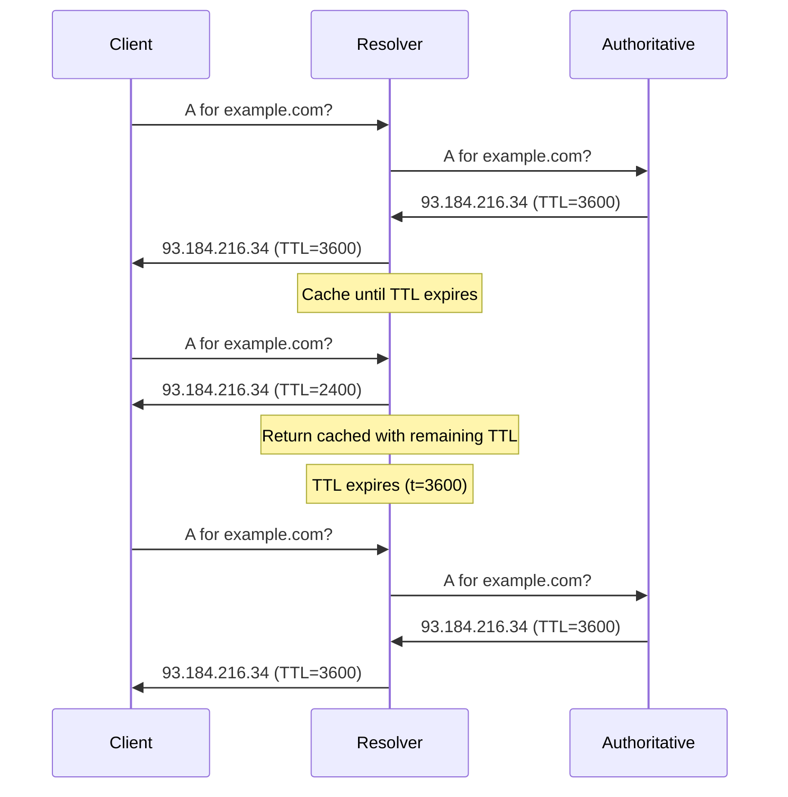
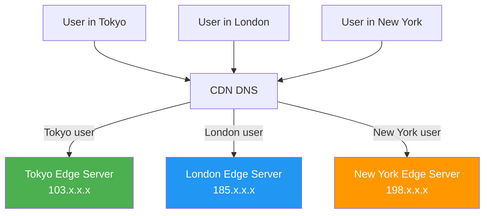
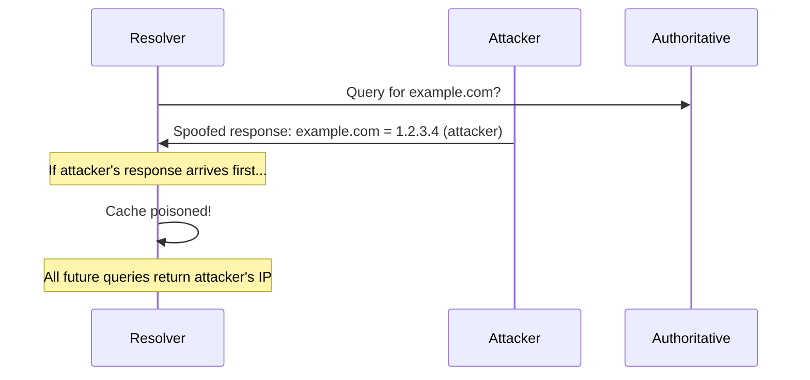

# DNS Caching

## Overview

DNS caching is the temporary storage of DNS query results at various layers to reduce latency, decrease DNS server load, and improve the overall Internet experience. Without caching, every web page load would require 3-4 DNS queries to root, TLD, and authoritative servers — adding hundreds of milliseconds to every request.

Understanding DNS caching — including TTL, negative caching, resolver behavior, and CDN DNS — is essential for DNS administration, performance optimization, and interview questions.

## Detailed Explanation

### Why DNS Caching Exists

```
Without caching (every query):
  Browser: example.com → 3-4 queries × 50ms = 150-200ms per page load
  
With caching:
  First visit:  3-4 queries × 50ms = 150-200ms
  Next visits:  Cache hit = 0ms (local lookup)
  
  For a page with 10 domains: 10 × 150ms = 1.5s saved!
```

### Caching Layers



### TTL (Time To Live)

TTL is the number of seconds a DNS record should be cached.

```
example.com.    3600    IN    A    93.184.216.34
                ^^^^
                TTL = 3600 seconds = 1 hour
```

**TTL Behavior:**
```
t=0:    Query → get answer with TTL=3600
        Cache stores: (example.com → 93.184.216.34, expires at t=3600)

t=1800: Query → cache hit, TTL remaining = 1800
        Return cached answer with TTL=1800

t=3600: Cache entry expires
        Query → cache miss → resolve fresh

t=3601: Query → must resolve again
```

**TTL Guidelines:**

| TTL | Use Case | Tradeoff |
|-----|----------|----------|
| **60s** | Rapidly changing (failover, migration) | High query load, fast propagation |
| **300s** | Standard (5 min) | Balanced |
| **3600s** | Stable services (1 hour) | Low query load, slow propagation |
| **86400s** | Very stable (1 day) | Minimal queries, very slow propagation |

### Resolver Cache Behavior



**Key insight:** The resolver returns the **remaining** TTL, not the original. This way, clients know how long their cache should last.

### Negative Caching

When a domain doesn't exist, the "not found" response is also cached:

```
Query: nonexistent.example.com
Response: NXDOMAIN (non-existent domain)

Negative cache: "This domain doesn't exist for X seconds"
Duration: SOA Minimum TTL field (typically 300-3600 seconds)
```

**Why negative caching?**
```
Without negative caching:
  - Every typo generates repeated queries
  - Attackers can flood resolvers with non-existent subdomains
  - Authoritative servers overwhelmed

With negative caching:
  - First NXDOMAIN is cached
  - Subsequent queries return cached NXDOMAIN
  - Reduces load on authoritative servers
```

**Negative caching problem:**
```
Scenario: Register new domain
  t=0: Register newdomain.com
  t=0: Query → NXDOMAIN (cached with 3600s TTL)
  t=60: Query → NXDOMAIN (from cache)
  t=1800: Query → NXDOMAIN (still cached)
  t=3600: Cache expires → resolves to new IP!

Solution: Lower SOA minimum TTL before registering
```

### Cache Flushing

```bash
# Flush DNS cache on macOS
sudo dscacheutil -flushcache
sudo killall -HUP mDNSResponder

# Flush DNS cache on Windows
ipconfig /flushdns

# Flush DNS cache on Linux (systemd-resolved)
sudo systemd-resolve --flush-caches

# Flush DNS cache on Linux (nscd)
sudo nscd --invalidate=hosts

# Check cache status
# macOS
sudo killall -INFO mDNSResponder

# Windows
ipconfig /displaydns

# Linux
resolvectl statistics
```

### CDN DNS Caching

CDNs use DNS to direct users to the nearest server:



**CDN DNS Techniques:**

1. **Short TTL (60s)**: Allows quick rerouting on failure
2. **GeoDNS**: Returns different IPs based on client location
3. **Anycast**: Same IP announced from multiple locations
4. **Latency-based routing**: Directs to lowest-latency server
5. **Load balancing**: Distributes across multiple servers

**CDN DNS Example:**
```bash
# Query from different locations
$ dig cdn.example.com @8.8.8.8
;; ANSWER SECTION:
cdn.example.com.    60    IN    A    103.21.244.1    # Tokyo

$ dig cdn.example.com @8.8.4.4
;; ANSWER SECTION:
cdn.example.com.    60    IN    A    185.199.108.1   # London
```

### Browser DNS Cache

```
Chrome DNS Cache:
  - chrome://net-internals/#dns
  - Typically caches for 1-60 minutes
  - Respects TTL from DNS response
  - Separate from OS cache

Firefox DNS Cache:
  - about:networking#dns
  - Default: 60 entries, 5 minutes
  - Configurable via network.dnsCacheExpiration
```

### OS DNS Cache

```
Windows:
  - DNS Client service (dnscache)
  - Default TTL: respects DNS response (max 1 day)
  - Cache size: ~100 entries default
  - Service: net start/stop "DNS Client"

macOS:
  - mDNSResponder handles cache
  - Also handles mDNS (.local) and LLMNR
  - Cache respects TTL

Linux:
  - systemd-resolved (modern)
  - nscd (older)
  - No cache by default in many distros
```

### Cache Poisoning (Overview)

DNS cache poisoning injects false records into resolver caches:



**Prevention:**
- DNSSEC (cryptographic signatures)
- Source port randomization
- Query ID randomization
- 0x20 encoding (mixed case)

## Example: DNS Cache Debugging

### Checking Cache Contents

```bash
# Windows - view DNS cache
$ ipconfig /displaydns

# Example output:
# Record Name . . . . . : www.example.com
# Record Type . . . . . : 1
# Time To Live . . . . : 3456
# Data Length . . . . . : 4
# Section . . . . . . . : Answer
# A (Host) Record . . . : 93.184.216.34
```

### Measuring Cache Effectiveness

```bash
# First query (cold cache)
$ time dig www.example.com
;; Query time: 45 msec

# Second query (cached)
$ time dig www.example.com
;; Query time: 0 msec

# Cache hit rate
$ dig +stats www.example.com
;; Query time: 0 msec
;; SERVER: 127.0.0.53#53
```

### TTL Impact on Performance

```
High TTL (86400s = 1 day):
  + 99.9% cache hit rate
  + Minimal authoritative server load
  - Changes take up to 24h to propagate
  - Bad for failover scenarios

Low TTL (60s):
  + Changes propagate in < 1 minute
  + Good for failover and migration
  - Higher authoritative server load
  - More queries per day
```

## Interview Questions

### Q1: How does DNS caching work?
**A:** DNS responses are cached at multiple layers (browser, OS, resolver) based on TTL. When a query arrives, the cache is checked first. If a valid (non-expired) entry exists, it's returned immediately without querying authoritative servers. The resolver returns the remaining TTL to clients, so they know when to re-query.

### Q2: What is TTL and how does it affect caching?
**A:** TTL (Time To Live) is the number of seconds a DNS record should be cached. Set by the authoritative server. Higher TTL = longer cache, less load, slower propagation. Lower TTL = shorter cache, more load, faster propagation. Typical: 300-3600 seconds. Remaining TTL decreases as the record is cached.

### Q3: What is negative caching?
**A:** When a domain doesn't exist (NXDOMAIN), the "not found" response is cached for the SOA minimum TTL. This prevents repeated queries for non-existent domains and reduces load on authoritative servers. Problem: newly registered domains must wait for negative cache to expire.

### Q4: How do CDNs use DNS for load balancing?
**A:** CDNs use short TTLs (60s) and return different IPs based on: (1) Client geolocation (GeoDNS); (2) Server load; (3) Latency measurements; (4) Health checks. This directs users to the nearest/healthiest edge server. Anycast allows the same IP from multiple locations.

### Q5: What happens when a cached DNS record expires?
**A:** The resolver must re-query the authoritative server. If the authoritative server is down, the resolver may serve stale records (if configured) or return SERVFAIL. Some resolvers implement stale cache serving for resilience.

### Q6: How do you flush DNS cache?
**A:** macOS: `sudo dscacheutil -flushcache` or `sudo killall -HUP mDNSResponder`. Windows: `ipconfig /flushdns`. Linux (systemd-resolved): `sudo systemd-resolve --flush-caches`. Each platform has different cache management.

### Q7: What is the relationship between TTL and propagation time?
**A:** When you change a DNS record, the old record remains cached at all layers until its TTL expires. Propagation time = maximum TTL across all caching layers. If TTL=3600, changes may take up to 1 hour to propagate globally. Lower TTL before making changes, then raise it after.

### Q8: What is cache poisoning and how is it prevented?
**A:** Cache poisoning injects false DNS records into resolver caches. Attackers race to respond before the authoritative server. Prevention: (1) DNSSEC — cryptographic verification; (2) Source port randomization — harder to spoof; (3) Query ID randomization; (4) 0x20 encoding — mixed case in queries.

## Common Mistakes

1. **Not understanding that TTL counts down**: The resolver returns the remaining TTL, not the original. A record with TTL=3600 cached for 1800 seconds returns TTL=1800 to clients.

2. **Forgetting about negative caching**: NXDOMAIN responses are cached too. New domains may not resolve until negative cache expires. Lower SOA minimum TTL before registering.

3. **Setting TTL too low for production**: TTL=60 means 1440 queries/day to authoritative servers per resolver. At scale, this is significant load. Use 300-3600 for most records.

4. **Not lowering TTL before migration**: If TTL=86400, it takes up to 24h for changes to propagate. Lower TTL to 60s a day before migration, then raise it after.

5. **Confusing browser cache with OS cache**: Browsers have their own DNS cache (Chrome: chrome://net-internals/#dns). Flushing OS cache doesn't flush browser cache.

6. **Not understanding CDN DNS caching**: CDNs use very short TTLs (60s) and return different IPs based on location. This is normal — the CDN controls the authoritative DNS.

7. **Forgetting that resolvers share cache**: A corporate resolver serves hundreds of users. A cached entry benefits everyone. This is why resolver cache hit rates are typically 80-95%.

## Summary

| Cache Layer | Duration | Scope | Flush Method |
|-------------|----------|-------|--------------|
| **Browser** | 1-60 min | Per-browser | Browser settings |
| **OS** | TTL-based | Per-machine | `flushdns` / `dscacheutil` |
| **Resolver** | TTL-based | Shared (many users) | Resolver restart |
| **CDN** | 60s typical | Global | CDN controls |

| Concept | Purpose | Typical Value |
|---------|---------|---------------|
| **TTL** | Cache duration | 300-3600 seconds |
| **Negative cache** | Cache NXDOMAIN | SOA minimum (300-3600s) |
| **Stale cache** | Serve expired on failure | Optional, varies |
| **Cache flush** | Force re-query | Manual intervention |

DNS caching is fundamental to Internet performance. Proper TTL management balances between load (high TTL) and agility (low TTL).

## Cross-References

- [DNS Overview](README.md) — DNS architecture
- [DNS Resolution](resolution.md) — How caching fits into resolution
- [DNS Record Types](record-types.md) — Records that are cached
- [DNS Security](security.md) — Cache poisoning prevention
- [HTTP Caching](../http/http1.md) — HTTP has its own caching mechanisms
