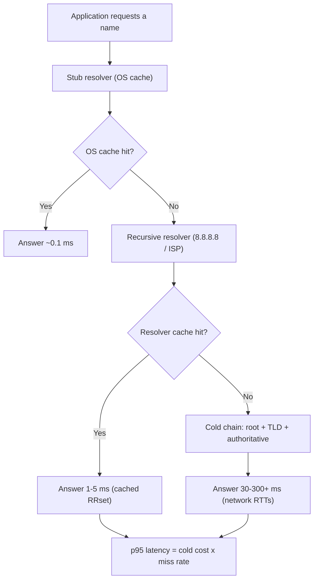
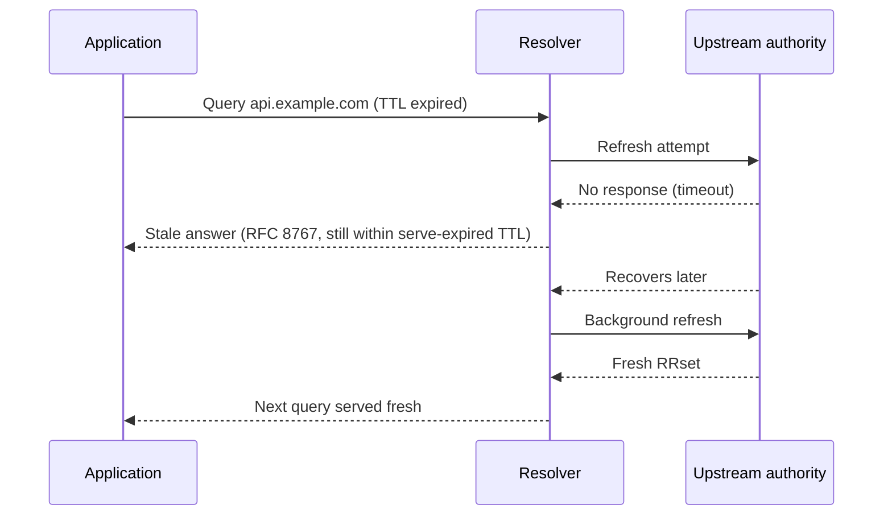

# DNS Tuning for Latency

## Overview

DNS sits in front of every network transaction, so its latency budget leaks into every page load, API call, and connection setup. This page treats DNS as a performance problem rather than a security problem: where resolution time actually goes, how to measure it honestly, and which knobs on the authoritative, resolver, zone, and client sides reliably shave milliseconds. The cryptographic chain of trust and DNSSEC failure modes are covered separately in [DNSSEC](./dnssec.md); here the focus is the tuning playbook that interviewers probe with "DNS is slow — what do you check first?".

## Where DNS Latency Actually Comes From

### The four-hop model

A lookup touches up to four hops, and each has a different cost profile and a different owner. Tuning without knowing which hop dominates is guesswork, so this model comes first and the rest of the page is per-hop work.



Three structural facts fall out of that picture. First, the cache-hit path is so cheap that resolver hit ratio, not raw RTT, dominates user-perceived latency at scale. Second, the cold chain costs one network RTT per delegation level — root, TLD, then the authoritative zone — so deep delegation and CNAME chains multiply the worst case. Third, every hop after the stub is shared infrastructure you do not fully control, which is why the highest-leverage work (anycast authorities, resolver selection, serve-stale) is about *who answers* rather than *how fast one server answers*.

### The cost table

| Hop | Typical cost (warm) | Typical cost (cold) | You control it via |
|---|---|---|---|
| Stub/OS cache | ~0.1 ms | n/a | Connection reuse, app-level caching |
| Recursive resolver (cache hit) | 1–5 ms | n/a | Resolver choice, TTL policy, cache sizing |
| Resolver → root/TLD | 10–40 ms per level | one RTT each | Anycast of root/TLD (not yours), resolver locality |
| Resolver → authoritative zone | 10–50 ms | one RTT + server processing | Anycast NS fleet, server placement, response size |
| DNSSEC overhead | +bytes, not +RTT | +TCP-fallback risk | Algorithm choice, signing scope, EDNS buffers |

### Three numbers worth having ready

A warm cache hit at a large resolver is **1–5 ms**; a cold iterative chain across root/TLD/authoritative is typically **50–300 ms** depending on geography, chain depth, and DNSSEC size; and a large production resolver serves roughly **80–95%** of queries from cache. Those three numbers explain most DNS latency behavior: the median user experience is set by cache hits, the tail is set by the cold chain, and the ratio between them is set by cache policy.

## Measuring Before Tuning

The single most common measurement mistake is averaging `dig` query times from your office. Resolver caches make most queries look fast, and your vantage point sees only one resolver's cache state — you will conclude DNS is fine while a continent's worth of cold lookups is slow. Honest measurement needs two instruments: cache-busting probes to force the cold path on demand, and real-user-monitoring percentiles for the warm path the users actually experience.

```bash
# Cold-path probe: random subdomain bypasses every cache
$ dig +stats $(openssl rand -hex 8).example.com | grep "Query time"
;; Query time: 63 msec

# Warm path for comparison
$ dig +stats example.com | grep "Query time"
;; Query time: 2 msec
```

Track the distribution, not the mean. p50 tells you about cache hits, p95/p99 about the cold chain, and a fat tail usually means one specific broken point — an expired NS glue record, an overloaded anycast site, or a resolver falling back to TCP on oversized answers. Browsers expose the cleanest field data: `domainLookupEnd - domainLookupStart` in navigation timings isolates DNS per page load, per user, per resolver. Correlate those percentiles with resolver identity where possible, because a p99 driven entirely by one ISP's overloaded resolver has a different fix than a globally slow authoritative tier.

## Authoritative-Side Tuning

The authoritative tier is where zone owners have real control, and the wins are structural rather than micro-optimizations. Four dominate.

### Serve from everywhere: anycast NS fleets

Authoritative latency is mostly network RTT, so the biggest lever is placing the service close to resolvers worldwide and announcing one IP via BGP from every site. The root system's 13 letters are served from 1,500+ instances this way, and every major managed-DNS product is anycast for exactly this reason. Anycast for authorities is the deployment RFC 4786 (BCP 126) was written for; the mechanics, failover behavior, and drawbacks are covered in depth in [Anycast and Geo-Aware Routing](../cdn/anycast-and-geo-routing.md). A single-homed authoritative server on one continent adds 100–250 ms for far-away resolvers on every cold lookup — and since every resolver on Earth pays that on every miss, the cost is multiplied by the entire cache-miss population.

### Minimal responses and delegation hygiene

Servers like BIND (`minimal-responses yes`) strip NS and glue records from answers that do not need them, cutting response size and truncation risk — and size, not round trips, is the second-order cost authorities control. Delegation hygiene is equally mechanical: keep NS sets tight (2–4 nameservers are plenty with anycast; each extra NS is more referral bytes and more failure surface), make glue addresses in-bailiwick whenever possible, and never point nameservers at CNAMEs — a resolver that hits a CNAME in a delegation must restart resolution and pay a full extra chain. Every one of these defects is invisible until a cold lookup or a resolver with a small EDNS buffer encounters it.

### Kill unnecessary CNAME chains

Each CNAME hop is a full extra query, usually to a different authoritative zone, so an extra cold RTT plus its own validation and size risks. A record like `www.example.com → CDN CNAME → CDN geo CNAME → edge` costs two or three chain steps; collapsing to one hop, or using the CDN's apex aliasing (ALIAS/ANAME-style flattening where the provider synthesizes the answer), removes a round trip on every cold resolution. Measure the chain with `dig +trace` and count the referral levels — chains of three or more are a tuning smell, and the fix belongs to the zone owner, not the resolver operator.

### EDNS, truncation, and TCP fallback

A response that exceeds the UDP buffer (traditionally 512 bytes; 1232–4096 with EDNS0) is truncated (`TC=1`) and must be retried over TCP, roughly doubling the cold cost because TCP adds a handshake and its own loss behavior. Keep answers compact: RSA/SHA-256 signatures are ~256–384 bytes each while ECDSA P-256 signatures are ~64 bytes, so switching DNSSEC algorithms alone can move a large answer back under the truncation threshold — the full DNSSEC trade-offs live in [DNSSEC](./dnssec.md). Advertising a sane EDNS buffer (many operators use 1232 bytes, the largest that avoids IPv6 fragmentation at 1500 MTU) keeps most answers on UDP without inviting IP-fragment blackholes — the fragmentation failure mode that broke DNSKEY fetches for years.

### What CDN DNS does — and why your zone is different

CDN authoritative DNS combines every trick on this page into one service: an anycast NS fleet at the top, per-query ECS-aware steering to return the best edge IP, health-checked short-TTL answers so failover is bounded in seconds, and EDNS-friendly compact responses. A typical enterprise zone needs none of the steering machinery — but it does inherit the latency physics, which is why the sensible policy is to mirror the *structural* choices (anycast NS, tight delegations, shallow CNAME chains, sane TTL tiers) and skip the *steering* ones unless you actually operate multiple regions. Borrowing a CDN's complexity without its traffic patterns only adds failure modes.

One more asymmetry is worth naming: a CDN can lower a TTL and expect resolvers to notice within minutes because it has relationships and query volume at global scale, while a small zone's TTL changes are subject to whatever the long tail of resolvers does with them. Aggressiveness that works for the biggest zones does not transfer down — plan migrations with the pessimistic TTL math, not the CDN's optimistic one.

## Resolver-Side Tuning

If you operate a resolver (Unbound, BIND, Knot Resolver, PowerDNS Recursor), most latency wins are cache-policy knobs. The table maps each knob to the latency it removes and the price it charges.

| Knob | Mechanism | Latency it removes | Cost |
|---|---|---|---|
| Bigger msg/rrset cache | Higher hit ratio | Cold-chain RTTs on hits | RAM |
| Prefetch | Refresh popular entries near TTL expiry | The expiry spike for hot records | Extra upstream queries |
| Serve-stale (RFC 8767) | Answer from expired entries when upstream is down | Outage-driven retries and timeouts | Bounded staleness |
| Aggressive NSEC use (RFC 8198) | Synthesize NXDOMAIN/NODATA from signed NSEC proof | Cold lookups for names that do not exist | Requires DNSSEC validation |
| Negative caching (RFC 2308) | Cache NXDOMAIN/NODATA per SOA minimum | Repeated misses for dead names | Delayed discovery of new names |
| QNAME minimisation (RFC 9156) | Send only the needed labels per delegation level | Privacy, not latency | Occasionally one more query |

A production Unbound config exercising most of these:

```yaml
server:
  prefetch: yes                # refresh near-expiry popular answers
  serve-expired: yes           # RFC 8767-style serve-stale
  serve-expired-ttl: 86400     # serve stale answers up to 1 day old
  aggressive-nsec: yes         # RFC 8198 synthetic negative answers
  qname-minimisation: yes      # RFC 9156
  msg-cache-size: 256m
  rrset-cache-size: 512m
  infra-host-ttl: 900          # remember RTT/health of authorities
```

And the equivalent BIND knobs:

```text
options {
    minimal-responses yes;
    stale-answer-enable yes;
    stale-answer-ttl 30;
    max-cache-size 1g;
};
```

Two subtleties deserve interview-grade phrasing. Prefetch trades upstream query volume for hit ratio: with near-expiry prefetching, hot records effectively never leave the cache, so a busy resolver's p50 drops toward the cache-hit floor — but quiet zones get no benefit, which is why serve-stale and prefetch are complements rather than alternatives. Aggressive NSEC use is the DNSSEC dividend: a signed zone proves which names do *not* exist, so the resolver caches that proof and synthesizes negative answers for any name inside the proven-empty range without asking the authority — operators deploying it reported order-of-magnitude drops in NXDOMAIN load on their authorities (RFC 8198).

Serve-stale changes the failure behavior rather than the warm path, and it is worth walking once:



The pattern to describe in interviews: the client-visible failure mode changes from timeout to slightly-old data, which is exactly the trade most services want during an authority outage.

### Cache hit ratio is the master metric

Hit ratio ties every resolver knob together: at 90% hit ratio, one cold lookup buys nine warm ones, so a 20% improvement in hit ratio cuts cold-path exposure by ~17%. Hit ratio is driven by working-set size (which the cache-size knobs bound), TTL policy (the zone-side dial below), and query locality. The diagnostic sequence for a resolver with poor latency is always the same: hit ratio first, then cold-chain cost, then per-authority RTT stats (`infra-host-ttl` territory in Unbound) — in that order, because each is an order of magnitude cheaper to check than the next.

### Resolver placement and choice

A resolver far from clients adds its RTT to every cold lookup; a resolver far from authorities adds to every miss — both matter, and they pull in opposite directions, which is why public resolvers are anycast (near clients) *and* deep-cached (few misses). Google Public DNS and Cloudflare 1.1.1.1 are anycast with enormous caches, which is why switching a client to them often lowers p50 — at the cost of authorities seeing geographically wrong client locations unless EDNS Client Subnet is in play. For latency-critical fleets, run a local caching tier (Unbound on the host or as a sidecar) in front of a shared upstream: the local tier absorbs repeat queries at ~0.1 ms and pays the upstream only on misses.

### Transport choice: DoT/DoQ connection reuse

The encrypted transports add a handshake to the first query on a connection — TLS 1.3 for DoT (RFC 7858) or QUIC for DoQ — and then amortize it across every subsequent query. A resolver that opens a new TLS session per query pays a handshake plus congestion-window ramp per lookup, which can double DNS latency for chatty clients; a resolver that pools long-lived DoT connections gets cold-chain privacy with almost no warm-path cost. The tuning rule mirrors HTTP: connection reuse beats per-query connections, and query pipelining over the pooled connection hides most of the remaining RTT.

| Transport | First-query cost | Steady-state cost | Notes |
|---|---|---|---|
| UDP (RFC 1035) | 1 RTT | 1 RTT | Fragmentation risk on big answers |
| TCP (RFC 7766) | 1-2 RTT + handshake | ~1 RTT (pooled) | Required fallback for oversized answers |
| DoT (RFC 7858) | TLS handshake + 1 RTT | ~1 RTT (pooled) | Port 853; enterprise visibility |
| DoQ | QUIC handshake + 1 RTT | ~1 RTT (pooled) | No TCP HOL; 0-RTT resumption helps |

For latency-critical internal fleets the practical pattern is UDP/TCP to a local caching resolver, then DoT/DoQ from that resolver upstream — encryption where the path is untrusted, zero extra handshakes where it is not.

## Zone-Side Choices: TTL Economics

TTL is the shared dial between authoritative load, failover agility, and cache warmth, and the arithmetic is unforgiving: a record with TTL 3600 generates at most 24 queries/day per caching resolver; the same record at TTL 60 generates 1,440 — a 60× query-volume increase for 60× agility.

| TTL | Queries/day per resolver | Agility after a change | Right for |
|---|---|---|---|
| 60 s | 1,440 | ~1 min | Failover records, CDN edges under active steering |
| 300 s | 288 | ~5 min | Load-balanced app frontends |
| 3600 s | 24 | ~1 h | Stable service endpoints |
| 86400 s | 1 | ~24 h | Truly static infrastructure (MX, quiet-zone NS) |

The interview-grade answer on TTLs has three parts. First, lowering TTL *before* a migration and raising it after is standard operating procedure — a record at TTL 86400 takes up to 24 h to converge, so the downgrade must be planned at least one old-TTL period in advance. Second, resolvers do not universally honor TTLs: some ISPs inflate them, and browsers and OSes add their own caching layers, so propagation is bounded by the slowest layer, not by your setting. Third, TTL is a blunt instrument compared to real traffic steering — if you need per-user failover, that is a GeoDNS/latency-routing decision (Route 53-style policies, covered in [Route 53](../../cloud/aws/route53.md)), not a TTL decision.

Negative caching has its own dial: RFC 2308 defines how NXDOMAIN/NODATA answers are cached for the SOA record's MINIMUM field (up to a per-implementation cap, commonly capped at 10800 s). The trade is the same shape as TTL: long negative caches protect dead-name-heavy zones from storm-level load, but a newly registered or newly added name stays invisible until the negative cache expires — which is why "lower the SOA minimum before launching" pairs with "lower the TTL before migrating". A resolver with aggressive NSEC (RFC 8198) extends this further for signed zones by caching the *proof* of non-existence rather than individual answers.

DNSSEC adds one more zone-side constraint worth remembering: signatures expire (RRSIG validity windows, commonly weeks), and a zone whose signatures lapse goes dark for validating resolvers. That is an availability, not a latency, issue — but it forecloses "set a huge TTL and forget": signed zones require automated re-signing well before expiry, as the operational practices in RFC 6781 prescribe.

## Warm-Up, Priming, and the Migration Playbook

Most DNS latency incidents are migration incidents, and they follow a script that is worth knowing by name. **Lower TTLs first**: at least one old-TTL period before the change, drop the affected records to 60–300 s so caches everywhere drain on your schedule rather than theirs. **Prime the new tier**: before cut-over, hammer the new authoritative or resolver tier with cache-busting probes (or real traffic mirrors) so its caches are warm when real users arrive — a cold resolver fleet behind a cut-over is a self-inflicted p99 incident. **Cut over in slices**: shift one region or one record set at a time and compare percentiles per slice, because a global cut-over destroys your ability to attribute a regression. **Raise TTLs last**, after the new tier has held steady for longer than the longest TTL in the zone.

The same script runs in reverse for rollback, which is why the TTL downgrade must happen *before* the first risky step, not after it fails. Teams that skip the downgrade step discover that "revert" means "wait for 24-hour caches to expire", which is not a rollback at all — it is a confession.

## Client-Side and Application Tuning

Application developers control more DNS latency than they think. Reuse connections so DNS is paid once per connection lifetime rather than per request; HTTP/2 and HTTP/3 multiplexing makes this nearly free (see [HTTP/2](../http/http2.md) and [HTTP/3](../http/http3.md)). Resolve concurrently when fanning out to multiple backends, and cache resolved names in-process with a TTL-aware cache rather than calling `getaddrinfo` per request — libc resolvers rarely cache, so the naive pattern re-pays the resolver RTT on every call. Browsers already do speculative DNS prefetch for links on a page and connection coalescing driven by HTTPS/SVCB records; server-rendered pages can assist with `<link rel="dns-prefetch">` hints for critical third-party origins.

One trap deserves its own paragraph: hard-coding `8.8.8.8` inside container images or mobile apps bypasses enterprise resolvers, breaks split-horizon zones, and couples your latency to a public service's policy changes. The robust pattern is reading the platform resolver configuration (`/etc/resolv.conf` or the OS resolver API) and layering a local cache in front of it. The same reasoning explains why "just add another public resolver to resolv.conf" is not redundancy — resolvers disagree on cache state, which can produce split-brain answers during failovers and can even widen your attack surface (resolver-targeted poisoning sees two independent targets).

## Worked Example: Shaving the p95

Consider a signed zone with a two-hop CNAME chain, single-homed authorities in one region, TTL 60, and a resolver fleet with a 90% hit ratio. A cold lookup costs roughly: 20 ms root + 30 ms TLD + 40 ms zone-1 + 40 ms zone-2 (the CNAME target) + a TCP-fallback risk from oversized DNSSEC answers ≈ 150 ms. The p95 sits near the cold path because 10% of queries miss.

Three changes, each with its own multiplier. Switch the zone to ECDSA/SHA-256 and set EDNS-aware authorities so every answer fits UDP — this kills the TCP fallback and removes tens of milliseconds from the coldest lookups. Collapse the CNAME chain by one hop — this removes ~40 ms from *every* cold lookup forever. Raise the TTL of the chain-stable records from 60 to 300 while keeping only the actively steered edge record at 60 — this cuts query volume ~5× and raises the effective hit ratio, pushing the miss rate from 10% toward 2%.

Net effect: cold cost ≈ 90 ms and the population of queries exposed to it shrinks fivefold, so the p95 drops from "near 150 ms" to "near the warm floor" — an order-of-magnitude tail reduction without touching a single application server. The lesson generalizes: in DNS the tail is the product, and the tail is made of cold chains, so every lever that shortens chains, shrinks answers, or raises hit ratios compounds with the others.

### When DNS is not the problem

Two correlation traps waste tuning effort. Shared third-party domains: a page loading fonts, analytics, and tags from five origins pays five DNS lookups you do not control — the fix is consolidation or preconnect hints, not zone tuning. Local environment artifacts: captive portals, VPN split-DNS, and corporate resolvers that intercept NXDOMAINs all distort measurements; always sanity-check one lookup against a known-good resolver before blaming the zone. And when a regression appears only for one ISP, the likeliest culprits are that ISP's resolver fleet (cache behavior, software version) rather than anything you changed — the fastest confirmation is a cache-busting probe through that same resolver.

## Interview Questions

1. **A page loads in 900 ms and 200 ms of it is DNS. Walk me through your diagnosis.**
   Split the 200 ms into warm and cold components: browser navigation timing gives per-load DNS, and cache-busting `dig` probes from several regions give the cold chain. A high p50 means the resolver path is slow — bad resolver placement or no caching tier; a high p95/p99 with a low p50 means the cold chain is the problem — count referral hops with `dig +trace`, check for TCP fallback from oversized DNSSEC answers, and check authority geography. Fix authority placement (anycast), chain depth, and response size first; resolver cache knobs second, because they only act on the hits.

2. **TTL 60 vs 3600 — what are you actually trading?**
   Query volume versus agility: TTL 60 makes a resolver re-query up to 1,440 times/day per cached entry, TTL 3600 only 24 times, so load rises ~60× as agility improves ~60×. Changes propagate in TTL time only if every caching layer honors the value — ISPs that inflate TTLs break the bound, so propagation is bounded by the slowest layer. The sophisticated answer: keep TTLs moderate (300), implement failover through anycast or health-checked latency routing at the DNS provider, and reserve TTL 60 for the handful of records that steer traffic.

3. **What is serve-stale, and when does it hurt?**
   RFC 8767 lets a recursive resolver answer from expired cache entries when it cannot refresh them — authority down, network partition. It converts outages from "NXDOMAIN or timeout" into "slightly old answer", which for most applications is a massive availability win. It hurts when data is fast-changing or security-sensitive (rate-limiting DNSBLs, some abuse-control records), and it must be bounded by a serve-expired TTL so stale data cannot persist indefinitely. Paired with prefetch it is nearly invisible: hot records are refreshed before they ever expire.

4. **How can a resolver answer NXDOMAIN without querying the authoritative server?**
   With DNSSEC plus RFC 8198 "aggressive NSEC" use: an NSEC/NSEC3 record cryptographically proves that a canonical range of names is empty, so the resolver caches the proof and synthesizes negative answers for any name inside the range until the proof's TTL expires. This is one of the few features where deploying DNSSEC *improves* latency and load — scanning storms and misconfigured clients that hammer nonexistent names stop reaching the authority at all. Without DNSSEC the resolver can only rely on plain negative caching (RFC 2308) per exact name.

5. **Why do long CNAME chains hurt, and what do you do about them?**
   Each CNAME target lives in a new authoritative zone, so every hop can add a full cold RTT, its own DNSSEC validation, and its own truncation risk — a three-hop chain turns a 60 ms cold lookup into 180+ ms for every cache miss. Remedies, in order of leverage: collapse chains at the zone owner, use apex aliasing where the provider supports it, keep the chain's stable links on long TTLs, and verify real depth with `dig +trace` rather than trusting configuration. The chain length is a zone-owner decision, which is why resolver operators often find the problem last.

6. **You operate a large resolver. Name three knobs and their failure modes.**
   Prefetch: cost is upstream query amplification for near-expiry hot records, and the failure mode is synchronized refresh storms when a popular record's TTL aligns across the fleet. Serve-stale: cost is bounded staleness; the failure mode is masking a real authority outage for days if the serve-expired window is set too long. Cache sizing: the failure mode is thrash when the working set exceeds the cache, which shows up as a hit-ratio collapse and a p95 blowout. Each knob moves a different percentile, which is exactly why you measure distributions before turning them.

## Knowing When to Stop

Tuning has diminishing returns, and the stopping rule is percentile-based rather than enthusiasm-based. Once warm-path DNS is a few milliseconds and p95 sits under roughly 20 ms, further DNS work usually buys less than a single eliminated round trip elsewhere in the page — connection reuse, TLS 1.3, or HTTP/3 setup will out-pay any remaining DNS polish. The exception is the failure path: serve-stale, health-checked steering, and anycast redundancy are availability work that happens to have latency side benefits, and they keep paying long after the mean stops moving.

## Key Takeaways

- DNS latency is a tail problem: warm hits are 1–5 ms at big resolvers, so p95/p99 is dominated by the cold chain — measure with cache-busting probes and real-user percentiles, never office-`dig` means.
- The biggest authoritative wins are structural: anycast the NS fleet (RFC 4786 is the operations guide), keep delegations tight and in-bailiwick, and minimize CNAME depth — every hop is a cold RTT.
- Response size is a latency knob: oversized answers trigger TC/TCP fallback and roughly double cold cost; ECDSA/EdDSA signatures, `minimal-responses`, and 1232-byte EDNS buffers keep answers on UDP.
- Resolver cache policy compounds: prefetch flattens expiry spikes, serve-stale (RFC 8767) converts outages into bounded staleness, aggressive NSEC (RFC 8198) makes negative answers free, negative caching (RFC 2308) is the baseline — and hit ratio is the master metric tying them together.
- TTL math: queries/day per resolver ≈ 86400/TTL — a 60× load/agility trade between 3600 and 60; lower before migrations, raise after, and use real traffic steering rather than TTL racing for failover.
- DNSSEC's latency story cuts both ways: signatures cost bytes (and TCP fallback if oversized), but NSEC proofs enable cached negative answers (RFC 8198); signature expiry is an availability risk, not a latency one ([DNSSEC](./dnssec.md) owns that story).
- Clients matter: reuse connections, cache in-process, prefetch third-party origins, and never hard-code public resolver IPs in shipped artifacts.
- Stop when the percentiles say so: under ~20 ms p95, further DNS tuning loses to connection-reuse and transport work — except for failure-path features (serve-stale, steering, anycast), which are availability wins that compound.

## References

- [RFC 2308: Negative Caching of DNS Queries](https://datatracker.ietf.org/doc/html/rfc2308)
- [RFC 2181: Clarifications to the DNS Specification (TTL semantics)](https://datatracker.ietf.org/doc/html/rfc2181)
- [RFC 6891: EDNS0](https://datatracker.ietf.org/doc/html/rfc6891)
- [RFC 7766: DNS Transport over TCP](https://datatracker.ietf.org/doc/html/rfc7766)
- [RFC 7858: Specification for DNS over TLS](https://datatracker.ietf.org/doc/html/rfc7858)
- [RFC 8767: Serving Stale Data to Improve DNS Resiliency](https://datatracker.ietf.org/doc/html/rfc8767)
- [RFC 8198: Aggressive Use of DNSSEC-Validated Cache](https://datatracker.ietf.org/doc/html/rfc8198)
- [RFC 9156: DNS Query Name Minimisation](https://datatracker.ietf.org/doc/html/rfc9156)
- [RFC 6781: DNSSEC Operational Practices, Version 2](https://datatracker.ietf.org/doc/html/rfc6781)
- [Unbound documentation (NLnet Labs)](https://unbound.docs.nlnetlabs.nl/)
- [BIND 9 documentation (ISC)](https://bind9.readthedocs.io/)
- [Knot DNS documentation (CZ.NIC)](https://www.knot-dns.cz/documentation/)
- [PowerDNS documentation](https://doc.powerdns.com/)
- [Google Public DNS documentation](https://developers.google.com/speed/public-dns)
- [Root Server Operations (instance counts, anycast map)](https://www.root-servers.org/)
- Ballani & Francis, "Towards a Global IP Anycast Service", ACM SIGCOMM 2005 (placing DNS services close to clients).

## Cross-References

- [DNS Caching](./caching.md) — TTL mechanics, cache layers, and negative caching in depth.
- [DNSSEC](./dnssec.md) — the cryptographic side of the same records this page sizes and tunes.
- [DNS Resolution](./resolution.md) — the iterative chain whose RTTs this page tries to remove.
- [DoH / DoT](./doh.md) — encrypted transports and their latency profile.
- [Anycast and Geo-Aware Routing](../cdn/anycast-and-geo-routing.md) — how one NS IP serves the world, and what it costs.
- [Route 53](../../cloud/aws/route53.md) — latency/geolocation/failover routing policies in a managed DNS.
- [Encrypted DNS](../advanced/encrypted-dns.md) — deployment context for DoH/DoT resolvers.
- [HTTP/2](../http/http2.md) — connection multiplexing that amortizes DNS cost per page.
- [UDP](../udp/README.md) — why DNS's default transport behaves the way it does under loss.
