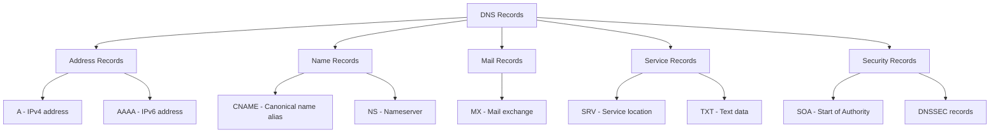
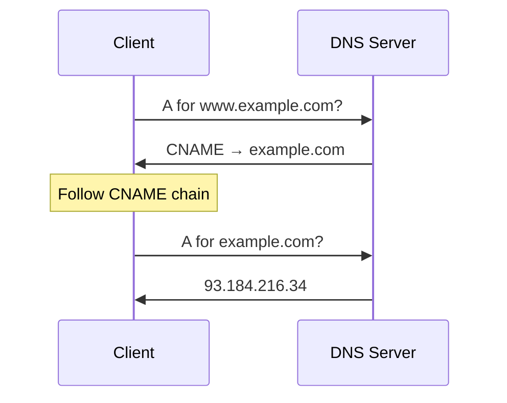
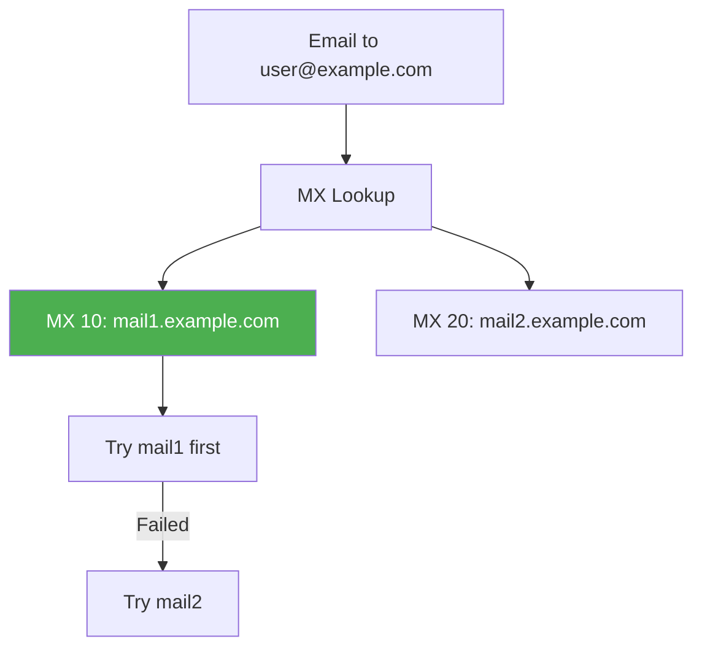

# DNS Record Types

## Overview

DNS record types define the different kinds of information stored in the DNS system. Each record type serves a specific purpose — from mapping domain names to IP addresses (A/AAAA) to routing email (MX) to verifying domain ownership (TXT). Understanding DNS record types is essential for DNS administration, web development, and interview questions.

## Detailed Explanation

### Record Format

Every DNS resource record has the same format:

```
Name        TTL    Class   Type    RDATA
example.com. 3600  IN      A       93.184.216.34
```

| Field | Description |
|-------|-------------|
| **Name** | Domain name this record applies to |
| **TTL** | Time To Live (seconds) — cache duration |
| **Class** | Usually IN (Internet) |
| **Type** | Record type (A, AAAA, MX, etc.) |
| **RDATA** | Record-specific data |

### Common DNS Record Types



### 1. A Record (Address)

Maps a domain name to an **IPv4 address**.

```
example.com.    3600    IN    A    93.184.216.34
www.example.com. 3600   IN    A    93.184.216.34
```

**Key points:**
- Most common DNS record type
- One domain can have multiple A records (load balancing)
- TTL controls caching duration
- IPv4 only (32-bit address)

```bash
$ dig A example.com
;; ANSWER SECTION:
example.com.    3600    IN    A    93.184.216.34
```

### 2. AAAA Record (Quad-A)

Maps a domain name to an **IPv6 address**.

```
example.com.    3600    IN    AAAA    2606:2800:220:1:248:1893:25c8:1946
```

**Key points:**
- IPv6 version of A record
- Called "Quad-A" because IPv6 is 4× the size of IPv4 (128 bits vs 32 bits)
- Domains typically have both A and AAAA records (dual-stack)
- 128-bit address in hexadecimal notation

```bash
$ dig AAAA example.com
;; ANSWER SECTION:
example.com.    3600    IN    AAAA    2606:2800:220:1:248:1893:25c8:1946
```

### 3. CNAME Record (Canonical Name)

Creates an **alias** — maps one domain name to another.

```
www.example.com.    3600    IN    CNAME    example.com.
cdn.example.com.    3600    IN    CNAME    d1234.cloudfront.net.
```

**Key points:**
- Creates an alias, not a direct mapping
- Must point to another domain name (not IP)
- Cannot coexist with other records for the same name
- Adds an extra lookup (CNAME → target → A)
- Often used for CDN, subdomains, service providers



**CNAME Restrictions:**
```
CANNOT have CNAME at:
  - Zone apex (example.com) — violates RFC
  - Same name as NS record
  - Same name as MX record
  - Same name as another CNAME

CAN have CNAME at:
  - Subdomains (www.example.com)
  - Service endpoints (api.example.com)
  - CDN aliases (cdn.example.com)
```

### 4. MX Record (Mail Exchange)

Routes email to the correct mail server.

```
example.com.    3600    IN    MX    10 mail1.example.com.
example.com.    3600    IN    MX    20 mail2.example.com.
```

**Key points:**
- **Priority** (lower = preferred): 10 is tried before 20
- Points to a domain name (not IP) — must have corresponding A record
- Multiple MX records for redundancy
- Used by SMTP to deliver email



### 5. NS Record (Name Server)

Delegates a domain to authoritative nameservers.

```
example.com.    86400    IN    NS    ns1.example.com.
example.com.    86400    IN    NS    ns2.example.com.
```

**Key points:**
- Defines which servers are authoritative for the domain
- Required at both parent (.com) and child (example.com) zones
- Typically 2-4 NS records for redundancy
- NS records at parent are "glue" records

```
Parent zone (.com):
  example.com.    172800    IN    NS    ns1.example.com.
  example.com.    172800    IN    NS    ns2.example.com.
  
Child zone (example.com):
  example.com.    86400    IN    NS    ns1.example.com.
  example.com.    86400    IN    NS    ns2.example.com.
  
Glue records (in parent zone):
  ns1.example.com.    172800    IN    A    192.0.2.1
  ns2.example.com.    172800    IN    A    192.0.2.2
```

### 6. TXT Record (Text)

Stores arbitrary text data — used for verification, SPF, DKIM, DMARC.

```
example.com.    3600    IN    TXT    "v=spf1 include:_spf.google.com ~all"
example.com.    3600    IN    TXT    "google-site-verification=abc123"
_dmarc.example.com.    3600    IN    TXT    "v=DMARC1; p=reject; rua=mailto:dmarc@example.com"
```

**Common TXT Record Uses:**

| Use | Example |
|-----|---------|
| **SPF** | `v=spf1 include:_spf.google.com ~all` |
| **DKIM** | `v=DKIM1; k=rsa; p=MIGfMA0GCSq...` |
| **DMARC** | `v=DMARC1; p=reject; rua=mailto:...` |
| **Domain verification** | `google-site-verification=abc123` |
| **ACME challenge** | `_acme-challenge.example.com TXT "token"` |

### 7. SOA Record (Start of Authority)

Contains zone metadata — the "master" record for a DNS zone.

```
example.com.    86400    IN    SOA    ns1.example.com. admin.example.com. (
    2024010101  ; Serial (YYYYMMDDNN)
    3600        ; Refresh (1 hour)
    900         ; Retry (15 minutes)
    604800      ; Expire (1 week)
    86400       ; Minimum TTL (1 day)
)
```

| Field | Description |
|-------|-------------|
| **MNAME** | Primary nameserver (ns1.example.com) |
| **RNAME** | Admin email (admin@example.com, dot = @) |
| **Serial** | Zone version number (increments on change) |
| **Refresh** | How often secondary checks for updates |
| **Retry** | How long to wait before retrying failed refresh |
| **Expire** | When secondary stops serving stale data |
| **Minimum** | Default TTL for negative caching (NXDOMAIN) |

### 8. SRV Record (Service)

Locates servers for specific services and protocols.

```
_sip._tcp.example.com.    3600    IN    SRV    10 60 5060 sip1.example.com.
_sip._tcp.example.com.    3600    IN    SRV    20 40 5060 sip2.example.com.
```

**Format:** `_service._protocol.domain. SRV priority weight port target`

| Field | Description |
|-------|-------------|
| **Priority** | Lower = preferred (like MX) |
| **Weight** | Relative weight for same priority (load balancing) |
| **Port** | Service port number |
| **Target** | Hostname of server |

**Common SRV Records:**
```
_sip._tcp.example.com      → SIP server
_xmpp-client._tcp.example.com → XMPP client
_minecraft._tcp.example.com   → Minecraft server
_ldap._tcp.example.com      → LDAP server
```

### 9. PTR Record (Pointer)

Provides **reverse DNS** — maps IP address to domain name.

```
34.216.184.93.in-addr.arpa.    3600    IN    PTR    www.example.com.
```

**Key points:**
- Used for reverse DNS lookups
- IP address is reversed (93.184.216.34 → 34.216.184.93)
- Uses `in-addr.arpa` (IPv4) or `ip6.arpa` (IPv6)
- Often required for email servers (anti-spam)
- Managed by IP address owner (ISP), not domain owner

### 10. CAA Record (Certification Authority Authorization)

Specifies which CAs can issue certificates for the domain.

```
example.com.    3600    IN    CAA    0 issue "letsencrypt.org"
example.com.    3600    IN    CAA    0 issuewild "*.example.com" "digicert.com"
example.com.    3600    IN    CAA    0 iodef "mailto:security@example.com"
```

### Record Type Summary Table

| Type | Purpose | RDATA Format | Example |
|------|---------|--------------|---------|
| **A** | IPv4 address | 32-bit IP | `93.184.216.34` |
| **AAAA** | IPv6 address | 128-bit IP | `2606:2800:220:1::1946` |
| **CNAME** | Alias | Domain name | `example.com.` |
| **MX** | Mail server | Priority + domain | `10 mail.example.com.` |
| **NS** | Nameserver | Domain name | `ns1.example.com.` |
| **TXT** | Text data | String | `"v=spf1 ..."` |
| **SOA** | Zone authority | Multiple fields | Serial, refresh, etc. |
| **SRV** | Service location | Priority weight port target | `10 60 5060 sip.ex.com.` |
| **PTR** | Reverse DNS | Domain name | `www.example.com.` |
| **CAA** | Certificate auth | Flags tag value | `0 issue "letsencrypt.org"` |

### DNSSEC Record Types

| Type | Purpose |
|------|---------|
| **DNSKEY** | Public key for zone signing |
| **RRSIG** | Signature for a record set |
| **DS** | Delegation Signer (hash of child's DNSKEY) |
| **NSEC/NSEC3** | Proof of non-existence |

## Example: Zone File

```bash
$ORIGIN example.com.
$TTL 3600

; SOA Record
@       IN  SOA  ns1.example.com. admin.example.com. (
            2024010101  ; Serial
            3600        ; Refresh
            900         ; Retry
            604800      ; Expire
            86400       ; Minimum TTL
        )

; NS Records
@       IN  NS      ns1.example.com.
@       IN  NS      ns2.example.com.

; A Records
@       IN  A       93.184.216.34
www     IN  A       93.184.216.34
mail    IN  A       93.184.216.35
ns1     IN  A       192.0.2.1
ns2     IN  A       192.0.2.2

; AAAA Records
@       IN  AAAA    2606:2800:220:1:248:1893:25c8:1946

; CNAME Records
cdn     IN  CNAME   d1234.cloudfront.net.
api     IN  CNAME   api-server.example.com.

; MX Records
@       IN  MX      10 mail1.example.com.
@       IN  MX      20 mail2.example.com.

; TXT Records
@       IN  TXT     "v=spf1 include:_spf.google.com ~all"
@       IN  TXT     "google-site-verification=abc123"

; SRV Records
_sip._tcp   IN  SRV  10 60 5060 sip1.example.com.
```

## Interview Questions

### Q1: What is the difference between A and AAAA records?
**A:** A records map domain names to **IPv4** addresses (32-bit, e.g., 93.184.216.34). AAAA records map to **IPv6** addresses (128-bit, e.g., 2606:2800:220:1::1946). Called "Quad-A" because IPv6 is 4× the size. Domains typically have both for dual-stack support.

### Q2: What is a CNAME record and when would you use it?
**A:** CNAME creates an alias — maps one domain to another. Use cases: (1) Point www to apex (www.example.com → example.com); (2) CDN aliases (cdn.example.com → d1234.cloudfront.net); (3) Service provider mapping (blog.example.com → blogging-platform.com). Limitation: can't coexist with other records for the same name.

### Q3: How do MX records work?
**A:** MX records route email to mail servers. They have a **priority** (lower = preferred) and point to a domain name (which must have an A record). Sending servers try the lowest priority first, falling back to higher ones. Example: MX 10 mail1.example.com, MX 20 mail2.example.com — mail1 is tried first.

### Q4: What is an SOA record?
**A:** SOA (Start of Authority) is the "master" record for a DNS zone. It contains: primary NS, admin email, serial number (version), refresh/retry/expire timers for zone transfers, and minimum TTL for negative caching. The serial number must increment on changes for secondaries to detect updates.

### Q5: What is a PTR record and why is it important?
**A:** PTR provides reverse DNS — maps IP to domain name. Uses `in-addr.arpa` with reversed IP octets. Important for: (1) Email servers — many receivers reject email from IPs without reverse DNS; (2) Security/logging — identifies hosts by name; (3) Compliance — some services require reverse DNS.

### Q6: What is an SRV record?
**A:** SRV locates servers for specific services. Format: `_service._protocol.domain. SRV priority weight port target`. Priority determines preference (like MX). Weight provides load balancing among same-priority servers. Port specifies the service port. Used for SIP, XMPP, LDAP, and other protocols.

### Q7: Why can't a CNAME exist at the zone apex?
**A:** The zone apex (e.g., example.com) must have SOA and NS records. A CNAME says "this name is an alias" — it can't coexist with other records. Since SOA and NS are mandatory at the apex, CNAME is forbidden there. Use ALIAS/ANAME records or A/AAAA records instead.

### Q8: What are TXT records used for?
**A:** TXT stores arbitrary text. Common uses: (1) **SPF** — authorized mail servers; (2) **DKIM** — email signing public keys; (3) **DMARC** — email authentication policy; (4) **Domain verification** — Google, Let's Encrypt, etc.; (5) **ACME challenges** — certificate issuance. Multiple TXT records can exist for the same name.

## Common Mistakes

1. **Using CNAME at zone apex**: CNAME can't coexist with SOA/NS at the apex. Use ALIAS/ANAME or A/AAAA records instead.

2. **Forgetting that MX points to a domain, not IP**: MX records must point to a domain name with an A record, not directly to an IP address.

3. **Not understanding CNAME chain overhead**: Each CNAME adds an extra DNS lookup. Multiple CNAME chains (CNAME → CNAME → A) add significant latency.

4. **Confusing A and AAAA**: A is IPv4 (32-bit), AAAA is IPv6 (128-bit). "Quad-A" because 128 = 4 × 32.

5. **Not incrementing SOA serial**: Zone changes require serial number increment. Secondary NS servers check serial to detect changes. Forgetting to increment means changes don't propagate.

6. **Setting TTL too low or too high**: Too low = excessive queries, high load. Too high = slow propagation of changes. Balance based on how often records change.

7. **Not understanding PTR record management**: PTR records are managed by the IP address owner (ISP), not the domain owner. You may need to request PTR setup from your ISP.

## Summary

| Record | Purpose | Points To | Common Use |
|--------|---------|-----------|------------|
| **A** | IPv4 address | IP address | Website hosting |
| **AAAA** | IPv6 address | IP address | IPv6 support |
| **CNAME** | Alias | Domain name | CDN, subdomains |
| **MX** | Mail server | Domain name | Email routing |
| **NS** | Nameserver | Domain name | Zone delegation |
| **TXT** | Text data | String | SPF, DKIM, verification |
| **SOA** | Zone authority | Multiple fields | Zone metadata |
| **SRV** | Service location | Priority weight port target | Service discovery |
| **PTR** | Reverse DNS | Domain name | IP → name lookup |
| **CAA** | Certificate auth | Flags tag value | SSL/TLS control |

DNS record types are the building blocks of the Internet's naming system. Each serves a specific purpose, and understanding them is essential for DNS administration and troubleshooting.

## Cross-References

- [DNS Overview](README.md) — DNS architecture and components
- [DNS Resolution](resolution.md) — How records are looked up
- [DNS Caching](caching.md) — How TTL affects record caching
- [DNS Security](security.md) — DNSSEC, SPF, DKIM, DMARC
- [HTTPS](../http/https.md) — TLS certificates use DNS for verification
