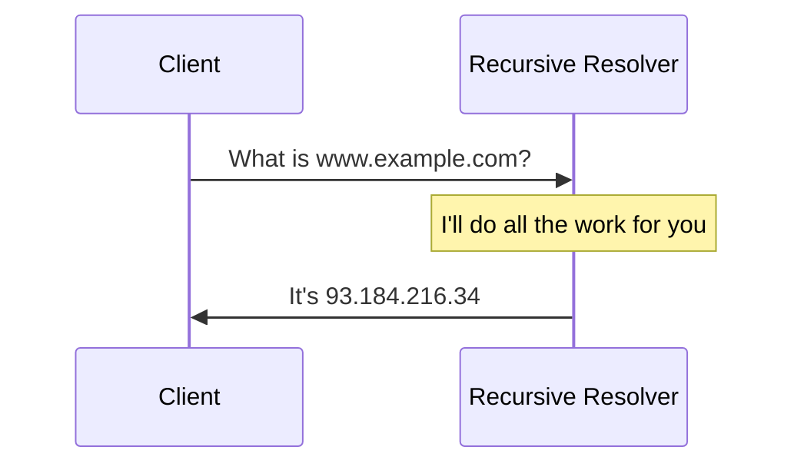
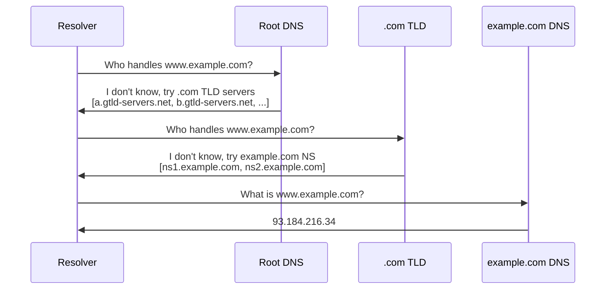
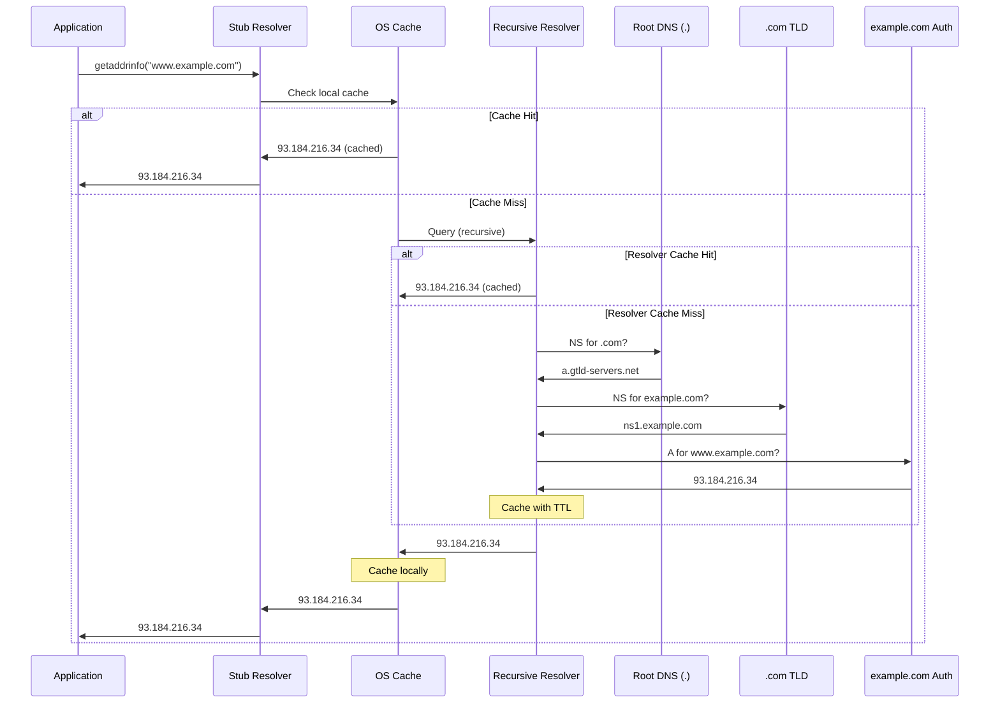
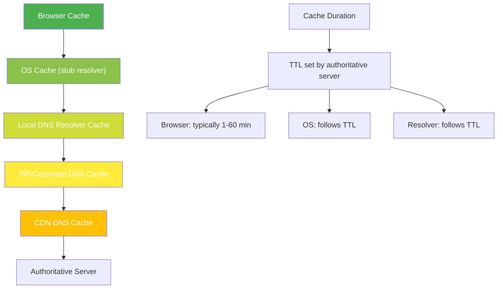
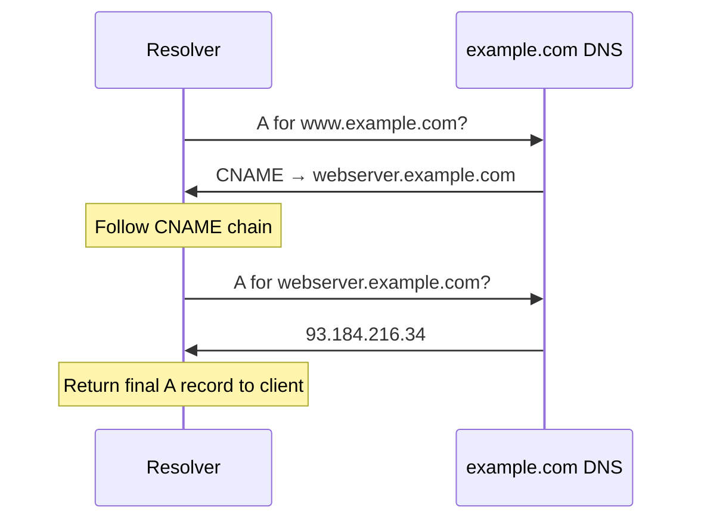
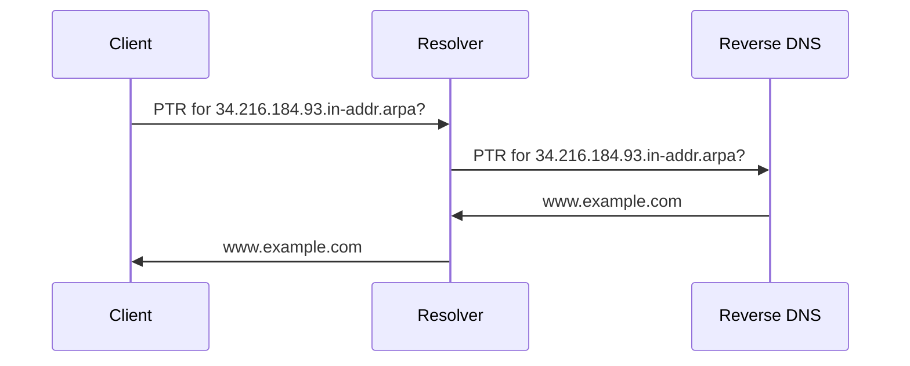

# DNS Resolution

## Overview

DNS resolution is the process of translating a domain name into an IP address. It involves multiple DNS servers working together in a hierarchical chain — from the client's local cache to root servers, TLD servers, and finally authoritative nameservers. Understanding this process is critical for debugging DNS issues, optimizing performance, and answering interview questions.

## Detailed Explanation

### Resolution Types

#### Recursive Resolution (Client → Resolver)



The client asks the resolver to handle everything. The resolver either returns a cached answer or performs the full resolution chain.

#### Iterative Resolution (Resolver → Nameservers)



Each server returns a **referral** — the next server to ask. The resolver follows the chain until it gets the final answer.

### Complete Resolution Flow



### Root Hints

Root hints tell resolvers where to find root DNS servers:

```
; Root Hints (simplified)
; Operated by various organizations worldwide
a.root-servers.net.     A       198.41.0.4
b.root-servers.net.     A       199.9.14.201
c.root-servers.net.     A       192.33.4.12
d.root-servers.net.     A       199.7.91.13
e.root-servers.net.     A       192.203.230.10
f.root-servers.net.     A       192.5.5.241
g.root-servers.net.     A       192.112.36.4
h.root-servers.net.     A       198.97.190.53
i.root-servers.net.     A       192.36.148.17
j.root-servers.net.     A       192.58.128.30
k.root-servers.net.     A       193.0.14.129
l.root-servers.net.     A       199.7.83.42
m.root-servers.net.     A       202.12.27.33
```

Each root server address is actually an **anycast** cluster — hundreds of physical servers worldwide sharing the same IP.

### TLD (Top-Level Domain) Servers

```
Generic TLDs (gTLDs):
  .com    → Verisign (a.gtld-servers.net)
  .org    → PIR (a0.org.afilias-nst.info)
  .net    → Verisign (a.gtld-servers.net)
  .edu    → Educause
  .gov    → General Services Administration

Country Code TLDs (ccTLDs):
  .uk     → Nominet
  .de     → DENIC
  .cn     → CNNIC
  .jp     → JPRS

New gTLDs (since 2012):
  .app    → Google
  .cloud  → Aruba
  .dev    → Google
```

### Authoritative Nameservers

```
Domain: example.com
Authoritative NS:
  ns1.example.com  (primary)
  ns2.example.com  (secondary)

Types:
  Primary (master): Has read-write zone file
  Secondary (slave): Copy from primary (zone transfer)
  
Zone Transfer (AXFR):
  Primary → Secondary: Full copy of zone
  Incremental (IXFR): Only changed records
```

### DNS Caching Layers



### Negative Caching

When a domain doesn't exist, the response is also cached:

```
Query: nonexistent.example.com
Response: NXDOMAIN (non-existent domain)

Negative cache: "This domain doesn't exist"
Duration: SOA minimum TTL (typically 300-3600 seconds)

Purpose: Prevent repeated queries for non-existent domains
Problem: If domain is newly registered, must wait for negative cache to expire
```

### DNS over Various Transports

```
Traditional DNS:    UDP port 53 (most queries)
                    TCP port 53 (large responses, zone transfers)
                    
DNS over TLS (DoT): TCP port 853 (encrypted)
DNS over HTTPS (DoH): HTTPS port 443 (encrypted)
DNS over QUIC (DoQ): UDP port 853 (encrypted, 0-RTT)
```

### Stub Resolver

The stub resolver is the client-side DNS library:

```c
// Application calls
struct addrinfo hints = { .ai_family = AF_INET };
struct addrinfo *result;
getaddrinfo("www.example.com", NULL, &hints, &result);
// Returns IP address from DNS

// Stub resolver reads /etc/resolv.conf
// nameserver 8.8.8.8
// nameserver 8.8.4.4

// Sends recursive query to configured resolver
// Caches results per OS policy
```

### DNS Resolution with CNAME



### DNS Resolution with Multiple Records

```
Query: example.com A
Response:
  example.com.  300  IN  A  93.184.216.34
  example.com.  300  IN  A  93.184.216.35

Client behavior:
  - Round-robin selection
  - Or use all addresses (Happy Eyeballs algorithm)
  - Failover to second if first fails
```

### Reverse DNS Resolution



Reverse DNS uses `in-addr.arpa` (IPv4) or `ip6.arpa` (IPv6) with IP octets reversed.

## Example: Debugging DNS Resolution

### Common DNS Issues

```bash
# Check if DNS is working
$ dig www.example.com @8.8.8.8
# Should return A record

# Check local resolver
$ dig www.example.com
# Compare with 8.8.8.8

# Trace resolution path
$ dig +trace www.example.com
# Shows each step: root → TLD → authoritative

# Check specific record types
$ dig MX example.com
$ dig NS example.com
$ dig TXT example.com

# Check reverse DNS
$ dig -x 93.184.216.34
```

### DNS Latency Analysis

```bash
# Measure resolution time
$ time dig www.example.com @8.8.8.8
# Query time: 45 msec

# Compare resolvers
$ dig www.example.com @8.8.8.8  # Google
$ dig www.example.com @1.1.1.1  # Cloudflare
$ dig www.example.com @9.9.9.9  # Quad9

# Check caching effectiveness
$ dig www.example.com  # First query (cold)
$ dig www.example.com  # Second query (cached, ~0ms)
```

## Interview Questions

### Q1: Walk me through DNS resolution for www.example.com.
**A:** (1) Client checks browser cache, then OS cache. (2) Stub resolver sends recursive query to configured resolver. (3) Resolver checks its cache. (4) If miss: queries root server → gets .com TLD address. (5) Queries .com TLD → gets example.com authoritative NS address. (6) Queries authoritative NS → gets A record (93.184.216.34). (7) Resolver caches result and returns to client.

### Q2: What is the difference between recursive and iterative queries?
**A:** **Recursive**: Client asks resolver to do all the work. Resolver returns the final answer or error. **Iterative**: Resolver asks each server, which returns a referral to the next server. Client-to-resolver is recursive; resolver-to-servers is iterative.

### Q3: What are root hints?
**A:** Root hints are the IP addresses of the 13 root DNS server clusters. They're pre-configured in recursive resolvers and serve as the starting point for DNS resolution when the answer isn't cached. Without root hints, resolvers wouldn't know where to start.

### Q4: How does DNS caching work at different layers?
**A:** DNS is cached at: (1) Browser — short-lived, per-origin; (2) OS/stub resolver — follows TTL; (3) Recursive resolver — TTL-based, shared across clients; (4) CDN DNS — may override TTL for load balancing. Each layer reduces query latency and load on authoritative servers.

### Q5: What is negative caching in DNS?
**A:** When a domain doesn't exist (NXDOMAIN), the response is cached to prevent repeated queries. The cache duration is the SOA minimum TTL. This prevents abuse (querying non-existent domains) but delays propagation of newly registered domains.

### Q6: How does reverse DNS resolution work?
**A:** Reverse DNS uses PTR records in the `in-addr.arpa` (IPv4) or `ip6.arpa` (IPv6) zones. The IP address octets are reversed: 93.184.216.34 → 34.216.184.93.in-addr.arpa. The PTR record maps back to a domain name. Reverse DNS is often used for logging, anti-spam, and security.

### Q7: What happens if the authoritative DNS server is down?
**A:** If the resolver has a cached answer (within TTL), resolution continues normally. If the cache is expired, the resolver tries all authoritative NS records. If all are down, the query fails (SERVFAIL). This is why domains have multiple authoritative NS servers (primary + secondary).

### Q8: What is the role of the stub resolver?
**A:** The stub resolver is the client-side DNS library (part of the OS). It receives queries from applications (via getaddrinfo), checks local cache, and forwards to the configured recursive resolver. It's "stub" because it doesn't do full resolution — it delegates to the recursive resolver.

## Common Mistakes

1. **Confusing recursive and iterative queries**: Client-to-resolver is recursive. Resolver-to-servers is iterative. Each server returns a referral, not the final answer.

2. **Not understanding caching layers**: DNS is cached at multiple levels. Changes don't propagate instantly — you must wait for TTL to expire at each layer.

3. **Forgetting about negative caching**: Non-existent domains are cached too (NXDOMAIN). Newly registered domains may not resolve until negative cache expires.

4. **Not knowing root hints**: Root hints are the starting point for resolution. They're pre-configured and rarely change, but understanding them is essential for the resolution chain.

5. **Confusing CNAME following with A record lookup**: When the authoritative server returns a CNAME, the resolver must follow the chain and query for the target's A record. This adds an extra lookup.

6. **Not understanding anycast for root servers**: There are 13 root server *addresses*, but hundreds of physical servers worldwide. Anycast routes queries to the nearest instance.

7. **Thinking DNS resolution is always a single query**: A full resolution may require 3-4 queries (root, TLD, authoritative, CNAME target). Only cached answers are single queries.

## Summary

| Step | Server | Query | Response |
|------|--------|-------|----------|
| 1 | Cache | Local lookup | Cached IP or miss |
| 2 | Root (.) | NS for .com? | a.gtld-servers.net |
| 3 | TLD (.com) | NS for example.com? | ns1.example.com |
| 4 | Auth (example.com) | A for www? | 93.184.216.34 |

| Resolution Type | Who Does Work | Use Case |
|----------------|---------------|----------|
| **Recursive** | Resolver | Client → Resolver |
| **Iterative** | Resolver follows chain | Resolver → Nameservers |

DNS resolution is a chain of referrals from root to TLD to authoritative, with caching at every layer to minimize latency and load.

## Cross-References

- [DNS Overview](README.md) — DNS architecture and components
- [DNS Record Types](record-types.md) — Record types returned in resolution
- [DNS Caching](caching.md) — Caching mechanisms and TTL management
- [DNS Security](security.md) — Securing the resolution process
- [UDP Applications](../udp/applications.md) — DNS uses UDP for queries
