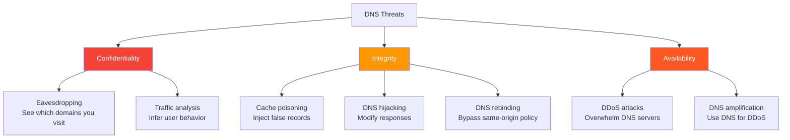
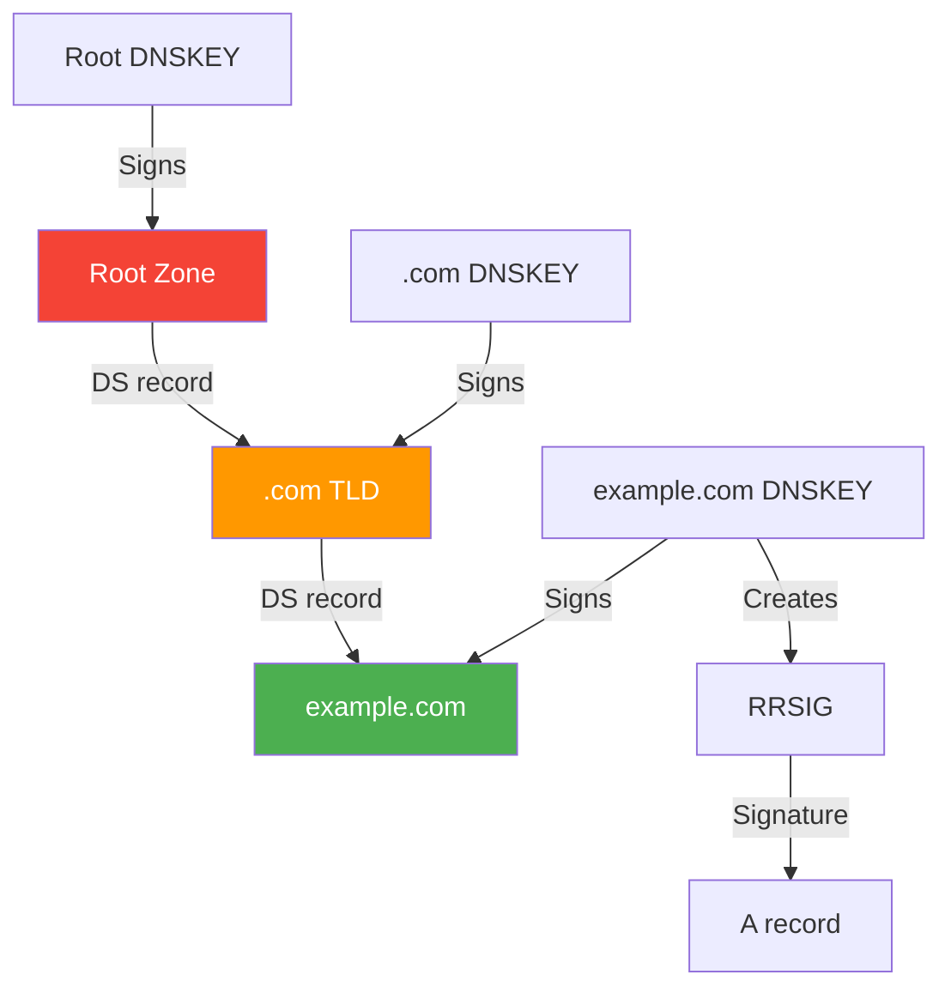
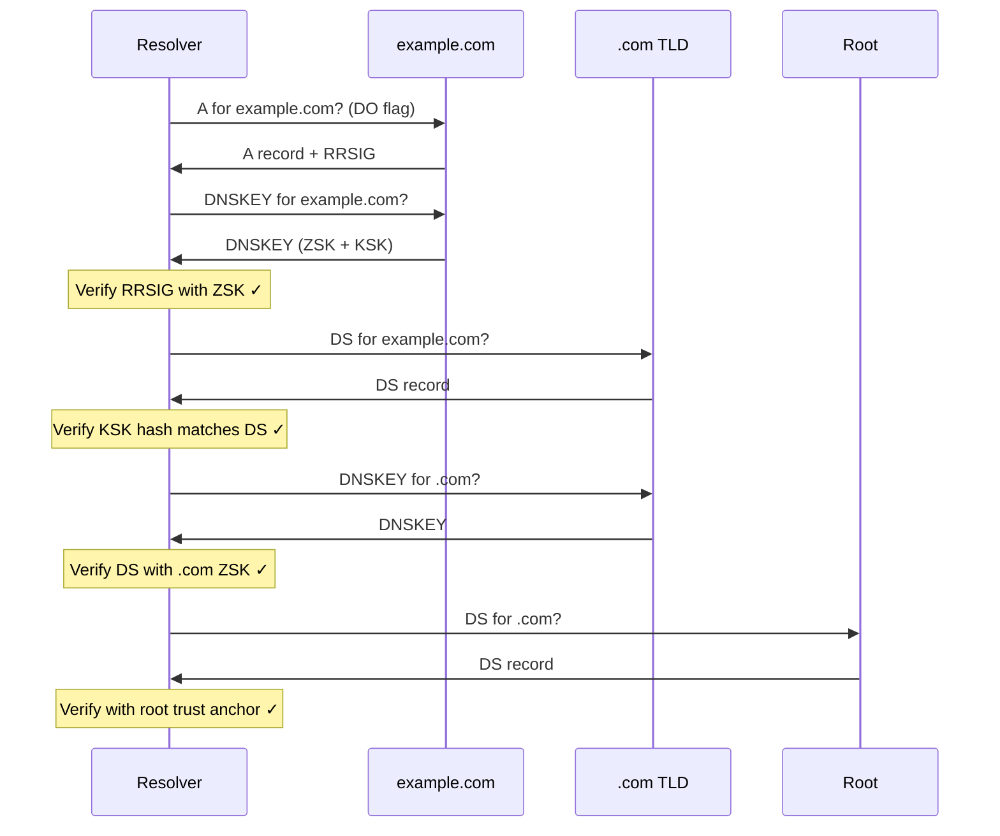
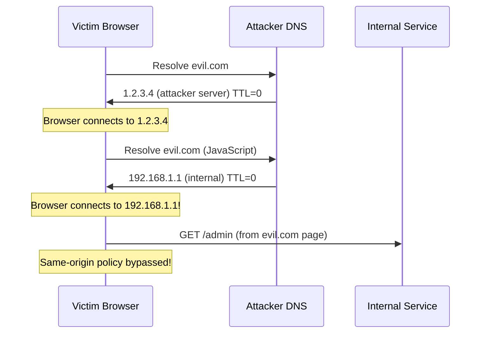
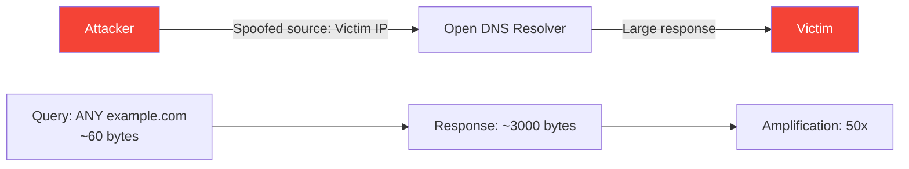

# DNS Security

## Overview

DNS was designed in 1983 without security considerations — queries and responses are sent in plaintext, there's no authentication, and cache poisoning is trivial. DNS security has evolved significantly with DNSSEC (authentication), DoH/DoT (encryption), and various anti-spoofing techniques. Understanding DNS security is critical for modern network engineering and interviews.

## Detailed Explanation

### DNS Threats



### 1. DNSSEC (DNS Security Extensions)

**Purpose:** Authenticate DNS responses — ensure they come from the authoritative server and haven't been tampered with.

**How DNSSEC Works:**



**DNSSEC Record Types:**

| Record | Purpose | Contains |
|--------|---------|----------|
| **DNSKEY** | Public key for zone | Zone signing key (ZSK), Key signing key (KSK) |
| **RRSIG** | Signature for record set | Signature over DNS records |
| **DS** | Delegation Signer | Hash of child zone's DNSKEY |
| **NSEC/NSEC3** | Authenticated denial | Proof that domain doesn't exist |

**DNSSEC Validation Chain:**

```
1. Resolver queries example.com A (with DO flag)
2. Authoritative returns: A record + RRSIG
3. Resolver fetches DNSKEY for example.com
4. Verifies RRSIG using DNSKEY
5. Fetches DS record from .com TLD
6. Verifies DNSKEY hash matches DS
7. Fetches DNSKEY for .com
8. Verifies .com DS from root
9. Fetches root DNSKEY (pre-configured trust anchor)
10. Verification complete ✓
```



**DNSSEC Signatures:**
```
RRSIG record contains:
  - Algorithm (RSA, ECDSA, Ed25519)
  - Labels (number of labels in name)
  - Original TTL
  - Signature expiration (absolute timestamp)
  - Signature inception (absolute timestamp)
  - Key tag (identifies which DNSKEY)
  - Signer's name (zone that signed)
  - Signature (cryptographic signature)
```

**DNSSEC Limitations:**
- Only authenticates, doesn't encrypt
- Increases response size (signatures)
- Adds latency (more lookups)
- Complex key management
- Not widely deployed (despite being standardized)

### 2. DNS over HTTPS (DoH)

**Purpose:** Encrypt DNS queries by sending them over HTTPS.

```
Traditional DNS:  UDP port 53, plaintext
DoH:              HTTPS port 443, encrypted
```

**DoH Request:**
```http
GET /dns-query?dns=AAABAAABAAAAAAAAA3d3dwdleGFtcGxlA2NvbQAAAQAB HTTP/2
Host: dns.google
Accept: application/dns-message
```

**DoH Response:**
```http
HTTP/2 200
Content-Type: application/dns-message
Content-Length: [binary DNS message]
```

**DoH Benefits:**
- Encrypted (prevents eavesdropping)
- Looks like normal HTTPS traffic (hard to block)
- Uses standard HTTPS infrastructure
- Works through firewalls that block port 53

**DoH Providers:**
```
Google:     https://dns.google/dns-query
Cloudflare: https://cloudflare-dns.com/dns-query
Quad9:      https://dns.quad9.net/dns-query
Mozilla:    https://mozilla.cloudflare-dns.com/dns-query
```

### 3. DNS over TLS (DoT)

**Purpose:** Encrypt DNS queries by sending them over TLS.

```
Traditional DNS:  UDP port 53, plaintext
DoT:              TCP port 853, encrypted (TLS)
```

**DoT vs DoH:**

| Aspect | DoT | DoH |
|--------|-----|-----|
| **Port** | 853 (dedicated) | 443 (shared with HTTPS) |
| **Protocol** | TCP + TLS | HTTPS (HTTP/2 + TLS) |
| **Visibility** | Can be identified by port | Blends with HTTPS traffic |
| **Blocking** | Easy to block (port 853) | Hard to block (port 443) |
| **Overhead** | Lower | Higher (HTTP headers) |
| **Adoption** | Lower | Higher (browsers support) |

### 4. DNS Rebinding Attack

**Purpose:** Bypass same-origin policy to access internal services.



**How it works:**
1. Attacker serves JavaScript from evil.com
2. DNS returns attacker's IP with TTL=0
3. JavaScript re-resolves evil.com
4. DNS now returns internal IP (192.168.1.1)
5. Browser connects to internal service
6. Same-origin policy allows it (same domain)

**Prevention:**
- DNS pinning (ignore TTL changes)
- DNS firewall (block internal IP ranges)
- Content-Security-Policy
- Don't rely on network boundaries for security

### 5. DNS Amplification Attack

**Purpose:** Use DNS servers to amplify DDoS traffic.



**Attack mechanics:**
1. Attacker sends query with spoofed source IP (victim's IP)
2. DNS resolver responds to victim (not attacker)
3. Response is much larger than query (50x amplification)
4. Many resolvers = massive traffic to victim

**Prevention:**
- BCP38/BCP84 (source address validation)
- Rate limiting on resolvers
- Response Rate Limiting (RRL)
- Don't allow open resolvers
- DNSSEC doesn't prevent this

### 6. DNS Hijacking

**Types:**
```
1. Router hijacking: Modify router's DNS settings
2. MITM attack: Intercept and modify DNS responses
3. Registrar hijacking: Compromise domain registrar
4. ISP hijacking: ISP redirects NXDOMAIN to ad pages
5. Malware: Modify local hosts file or DNS settings
```

### 7. DNS Tunneling

**Purpose:** Bypass firewalls by encoding data in DNS queries.

```
Normal DNS:     www.example.com → 93.184.216.34
DNS tunneling:  data-encoded.evil.com → TXT response with data

Data flow:
  Client → DNS query: secret-data.evil.com
  Tunnel server → DNS response: encoded data in TXT
  
  Bidirectional communication through DNS
  Very slow but hard to detect/block
```

## Example: Configuring DNS Security

### Enable DNSSEC Validation

```bash
# Unbound (recursive resolver)
server:
    module-config: "validator iterator"
    trust-anchor-file: "/var/lib/unbound/root.key"
    val-clean-additional: yes
    val-permissive-mode: no
```

### Configure DoH in Firefox

```
Settings → Privacy & Security → DNS over HTTPS
  - Increased Protection
  - Provider: Cloudflare (https://mozilla.cloudflare-dns.com/dns-query)
  - or Custom: https://your-resolver/dns-query
```

### Configure DoT in systemd-resolved

```ini
# /etc/systemd/resolved.conf
[Resolve]
DNS=1.1.1.1#cloudflare-dns.com
DNSOverTLS=yes
DNSSEC=yes
```

### Verify DNSSEC

```bash
# Check DNSSEC validation
$ dig +dnssec example.com
;; ANSWER SECTION:
example.com.    3600    IN    A       93.184.216.34
example.com.    3600    IN    RRSIG   A 13 2 3600 [...signature...]

# Check DS record
$ dig DS example.com @a.gtld-servers.net.
;; ANSWER SECTION:
example.com.    86400   IN    DS    370 13 2 [...hash...]

# Test DNSSEC failure
$ dig +dnssec dnssec-failed.org
;; ->>HEADER<<- opcode: QUERY, status: SERVFAIL
```

## Interview Questions

### Q1: What is DNSSEC and how does it work?
**A:** DNSSEC authenticates DNS responses using cryptographic signatures. Each zone signs its records with a private key (creating RRSIG records). Resolvers verify signatures using the zone's public key (DNSKEY). The trust chain goes from root (trust anchor) through TLDs to domains via DS records. DNSSEC prevents cache poisoning but doesn't encrypt queries.

### Q2: What is the difference between DoH and DoT?
**A:** Both encrypt DNS queries. **DoT** uses TLS on port 853 — dedicated port, easy to identify and block. **DoH** uses HTTPS on port 443 — blends with web traffic, harder to block. DoH has slightly more overhead (HTTP headers) but better firewall traversal. DoH is more widely adopted (browsers support it natively).

### Q3: What is DNS cache poisoning?
**A:** Cache poisoning injects false DNS records into resolver caches. Attackers race to respond to a resolver's query before the legitimate authoritative server. If the attacker's response arrives first (correct query ID, source port), the resolver caches the false record. Prevention: DNSSEC, source port randomization, query ID randomization.

### Q4: What is a DNS amplification attack?
**A:** Attackers send DNS queries with spoofed source IP (victim's IP) to open resolvers. The resolver sends large responses to the victim. A 60-byte query can generate a 3000-byte response (50x amplification). Prevention: BCP38 (source address validation), rate limiting, closing open resolvers.

### Q5: What is DNS rebinding?
**A:** DNS rebinding bypasses same-origin policy to access internal services. Attacker's domain first resolves to attacker's IP (TTL=0), then JavaScript re-resolves to internal IP (e.g., 192.168.1.1). Browser connects to internal service thinking it's the same origin. Prevention: DNS pinning, CSP, blocking internal IP ranges.

### Q6: How does DNSSEC prevent cache poisoning?
**A:** DNSSEC signs each record set with RRSIG. Resolvers verify signatures using the zone's DNSKEY. If an attacker injects a false record, the signature won't match — the resolver rejects it. The chain of trust from root (pre-configured) ensures each zone's key is authentic.

### Q7: Why isn't DNSSEC widely deployed?
**A:** Reasons: (1) Complexity — key management, zone signing, key rollover; (2) Performance — larger responses, more lookups; (3) Compatibility — not all resolvers validate; (4) Doesn't encrypt — only authenticates; (5) Deployment requires both authoritative and recursive support. DoH/DoT address encryption better.

### Q8: What is DNS tunneling and how is it detected?
**A:** DNS tunneling encodes data in DNS queries/responses to bypass firewalls. Detection: (1) Unusually long subdomain names; (2) High query volume to single domain; (3) TXT record queries with large responses; (4) Non-standard query patterns; (5) Entropy analysis of domain names.

## Common Mistakes

1. **Thinking DNSSEC encrypts DNS**: DNSSEC only authenticates (signs records). It doesn't encrypt queries — anyone can see which domains you query. Use DoH or DoT for encryption.

2. **Confusing DoH with DoT**: DoH is HTTPS on port 443. DoT is TLS on port 853. DoH is harder to block (blends with web traffic). DoT is easier to identify (dedicated port).

3. **Not understanding the DNSSEC trust chain**: Root → TLD → Domain. Each level signs the next level's key. The root key is the trust anchor (pre-configured in resolvers).

4. **Forgetting about negative caching in DNSSEC**: NSEC/NSEC3 records provide authenticated denial — proof that a domain doesn't exist. This prevents "NSEC walking" (enumerating all domains in a zone).

5. **Not realizing DNS amplification uses UDP**: DNS amplification exploits UDP's stateless nature — spoofed source IP means responses go to the victim. TCP DNS can't be used for amplification (connection required).

6. **Thinking DNSSEC prevents DDoS**: DNSSEC authenticates records but doesn't prevent DDoS. Amplification attacks use DNS for DDoS regardless of DNSSEC.

7. **Not configuring DNSSEC validation**: Even if authoritative servers sign records, resolvers must validate. Without validation, DNSSEC provides no security benefit.

## Summary

| Technology | Purpose | Port | Encryption | Authentication |
|------------|---------|------|------------|----------------|
| **DNSSEC** | Auth records | 53 | No | Yes (signatures) |
| **DoH** | Encrypt DNS | 443 | Yes (HTTPS) | Optional |
| **DoT** | Encrypt DNS | 853 | Yes (TLS) | Optional |
| **DoQ** | Encrypt DNS | 853 | Yes (QUIC) | Optional |

| Attack | Threat | Prevention |
|--------|--------|------------|
| **Cache poisoning** | False records | DNSSEC, port randomization |
| **Amplification** | DDoS | BCP38, rate limiting |
| **Rebinding** | Internal access | DNS pinning, CSP |
| **Hijacking** | Redirect traffic | DNSSEC, DoH/DoT |
| **Tunneling** | Data exfiltration | DNS monitoring, filtering |

DNS security has evolved from no security (1983) to authentication (DNSSEC) and encryption (DoH/DoT). Understanding these mechanisms is essential for modern network engineering.

## Cross-References

- [DNS Overview](README.md) — DNS architecture
- [DNS Resolution](resolution.md) — How DNSSEC fits into resolution
- [DNS Record Types](record-types.md) — DNSSEC record types (DNSKEY, RRSIG, DS)
- [DNS Caching](caching.md) — Cache poisoning prevention
- [HTTPS](../http/https.md) — TLS concepts shared with DoT/DoH
- [QUIC Protocol](../http/quic.md) — DoQ uses QUIC for DNS encryption
