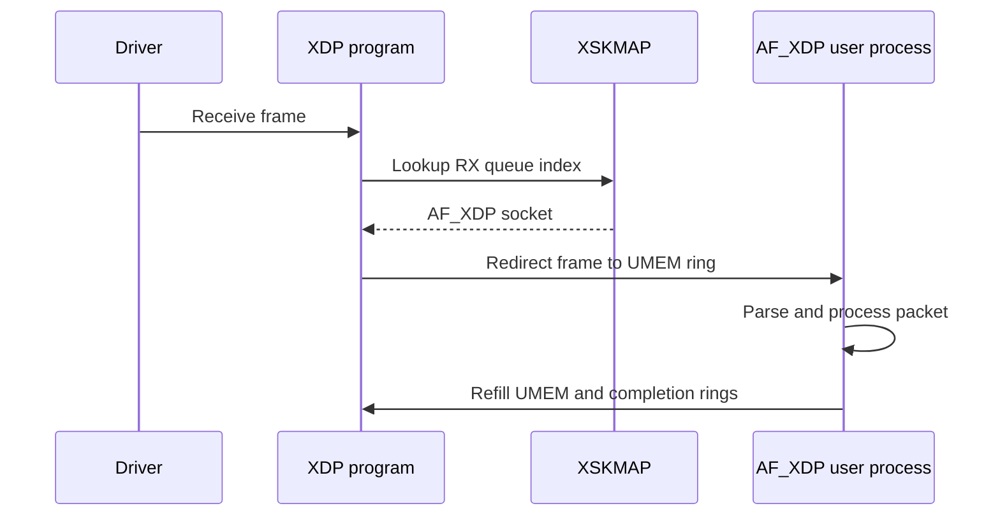

# eBPF Networking: XDP, TC, Sockets, and Cilium

**eBPF networking** places verified programs at selected points in the Linux
networking path. It can drop or redirect packets early, apply policy at
traffic-control or cgroup hooks, steer sockets, and export structured events
without writing a traditional kernel module.

This page complements the deeper [Linux kernel eBPF networking](../linux/kernel/networking/bpf-networking.md)
material with a placement-oriented map of the datapath and the trade-offs
between hooks.

## Packet path and hook placement


### XDP

XDP runs in the receive path, usually before the kernel allocates an
`sk_buff`. It is a good fit for early drop, DDoS prefiltering, L2/L3 parsing,
load-balancing decisions, and redirect to another device, CPU, or AF_XDP
socket.

XDP actions include:

- `XDP_DROP` — discard early.
- `XDP_PASS` — continue into the normal network stack.
- `XDP_TX` — transmit back through the same device when supported.
- `XDP_REDIRECT` — use a map such as DEVMAP, CPUMAP, or XSKMAP.
- `XDP_ABORTED` — exceptional/error path; observe counters and trace output.

The earliest hook has the least metadata. An XDP program may not yet have the
full socket, routing, or `sk_buff` context available later in the stack.

### TC and TCX

Traffic-control BPF programs run later and can operate on `sk_buff` metadata.
They support ingress and egress use cases, packet classification, policy,
encapsulation, NAT-related processing, traffic shaping, and redirects.
TC is more flexible than XDP but generally pays more stack-processing cost.

### Socket and cgroup hooks

Socket-level hooks operate on connection and message context rather than raw
packets:

- `sock_ops` observes TCP state and can influence selected socket behavior.
- `sk_msg` and `sk_skb` can redirect or filter stream messages and socket data.
- `sk_lookup` can choose a listening socket for an incoming flow.
- `cgroup/connect`, `cgroup/sendmsg`, and related hooks apply policy to a
  cgroup's sockets.
- `sockmap` and `sockhash` hold socket references for redirection and protocol
  acceleration.

These hooks are useful when the policy is about an application or service
identity rather than only an IP packet.

## BPF maps are the shared state plane

Programs are short-lived executions, while maps persist state between program
invocations and between kernel and user space. Common networking maps include:

| Map | Typical use |
|---|---|
| Hash / LRU hash | Connections, NAT state, policy, service backends |
| Array / per-CPU array | Counters, configuration, CPU-local statistics |
| DEVMAP | XDP redirect to network devices |
| CPUMAP | XDP steering to another CPU |
| XSKMAP | Redirect XDP frames to AF_XDP sockets |
| SOCKMAP / SOCKHASH | Socket redirection and stream acceleration |
| Ring buffer | Efficient event delivery to user space |
| LPM trie | Longest-prefix policy and routing lookups |

Map lifetime, pinning, key layout, per-CPU aggregation, and update atomicity
are part of the design. A BPF program can be verifier-safe while its map
policy is still logically incorrect or vulnerable to unbounded cardinality.

## AF_XDP and user-space packet processing

AF_XDP connects an XDP program to a user-space socket. An XSK is associated with
a network device and receive queue; an XSKMAP lets the XDP program redirect
frames to the appropriate socket. The binding must match the device and queue,
or the redirect fails and the frame may be dropped.



AF_XDP can reduce copies and avoid traversing the full stack, but the
application takes responsibility for rings, UMEM, queue affinity, backpressure,
packet drops, and protocol correctness. Use it for specialized high-rate
paths, not as a default replacement for normal sockets.

## Cilium-style cloud-native datapaths

A Kubernetes CNI can combine several hooks:

1. XDP for early prefiltering and host-facing fast paths.
2. TC for endpoint policy, routing, encapsulation, and service load balancing.
3. cgroup and socket hooks for identity-aware connection decisions.
4. BPF maps for endpoint identity, service backends, conntrack, NAT, and policy.
5. Hubble or another user-space consumer for flow observability.

The important interview distinction is that eBPF is a mechanism, not a single
network product. Cilium compiles higher-level identity and policy into a
Linux eBPF datapath; another program may use XDP only for packet filtering.

### Policy and identity

IP-only policy is insufficient in container environments where workloads move
between addresses. A CNI can associate an endpoint identity with a pod or
service and use BPF maps to apply policy before or after routing decisions.
The system must define how identities are allocated, propagated, revoked, and
observed during endpoint churn.

### Service load balancing

A BPF service implementation typically maps a virtual service key to backend
identities, chooses a backend, performs connection tracking, and handles reply
path translation. Questions to ask:

- Is selection per packet or per connection?
- Where is source preservation performed?
- How are backend updates synchronized with existing flows?
- Which hook sees the packet before or after NAT?
- How are maps resized and garbage-collected?

## CO-RE, BTF, and portability

Compile Once, Run Everywhere relies on BTF type information and libbpf CO-RE
relocations. The loader resolves field offsets and type differences against the
target kernel's BTF instead of hard-coding one kernel layout.

CO-RE improves portability but does not erase compatibility constraints:

- The required program type and hook must exist on the target kernel.
- Helpers and kfuncs have availability and stability rules.
- Verifier limits, capabilities, CONFIG options, and device drivers matter.
- A program may load successfully but observe different metadata on different
  hook contexts.

Use `bpftool feature`, `bpftool prog`, `bpftool map`, BTF inspection, and
libbpf logs to diagnose load and attach failures.

## Observability and failure modes

```bash
sudo bpftool prog show
sudo bpftool map show
sudo bpftool net
sudo bpftool btf dump file /sys/kernel/btf/vmlinux format c | head
sudo tc filter show dev eth0 ingress
ip -s link show dev eth0
```

Track:

- XDP action counters and redirect failures.
- BPF map occupancy, update failures, and per-CPU counter aggregation.
- Verifier logs, attach errors, and program replacement events.
- Socket redirect misses and unexpected fallback to the normal stack.
- Policy drops versus transport drops versus application errors.
- CPU cost at XDP, TC, socket, and user-space processing stages.

A common failure is an apparently healthy program with a full map, stale
backend entry, missing queue binding, or a policy that silently falls back to a
slower path. Instrument the decision, not only the final packet result.

## Interview questions

**Why is XDP faster than TC?**

XDP runs earlier, often before `sk_buff` allocation and most stack processing.
That reduces work for packets dropped or redirected early, but it also provides
less packet metadata and is primarily an ingress hook.

**When should you choose TC instead of XDP?**

When you need ingress and egress, rich `sk_buff` metadata, traffic-control
integration, or logic that depends on more of the network stack.

**What is an XSKMAP?**

It maps queue indices to AF_XDP sockets. The XDP program redirects frames to a
matching socket and queue; an incompatible binding does not receive the frame.

**Why do eBPF programs use maps?**

Maps provide persistent shared state and a user/kernel control plane. Programs
are invoked per event or packet, while maps hold configuration, counters,
connections, service backends, and identity policy.

**Does eBPF replace the network stack?**

No. It can run at several hooks and selectively bypass or accelerate paths, but
normal routing, TCP, socket semantics, drivers, and fallback paths still exist.

## Cross-references

- [Linux eBPF networking deep dive](../linux/kernel/networking/bpf-networking.md)
- [XDP](../linux/kernel/networking/xdp.md) and [advanced XDP](../linux/kernel/networking/xdp-advanced.md)
- [Linux networking tools](../linux/tools.md)
- [TCP/IP](../linux/networking/tcpip-suite.md)
- [Cilium and Kubernetes](../backend/containers/kubernetes.md)
- [Service mesh xDS](../backend/containers/xds-protocol.md)
- [Kernel tracing](../linux/debugging/ebpf.md)

## References

- [Linux AF_XDP documentation](https://docs.kernel.org/networking/af_xdp.html)
- [Linux XSKMAP documentation](https://docs.kernel.org/bpf/map_xskmap.html)
- [Linux SOCKMAP and SOCKHASH documentation](https://docs.kernel.org/bpf/map_sockmap.html)
- [Linux BPF maps documentation](https://docs.kernel.org/bpf/maps.html)
- [Linux networking documentation index](https://docs.kernel.org/networking/index.html)
- [eBPF Docs](https://docs.ebpf.io/)
- [Cilium eBPF introduction](https://docs.cilium.io/en/stable/concepts/ebpf/intro/)
- [Cilium BPF and XDP reference guide](https://docs.cilium.io/en/stable/reference-guides/bpf/)
