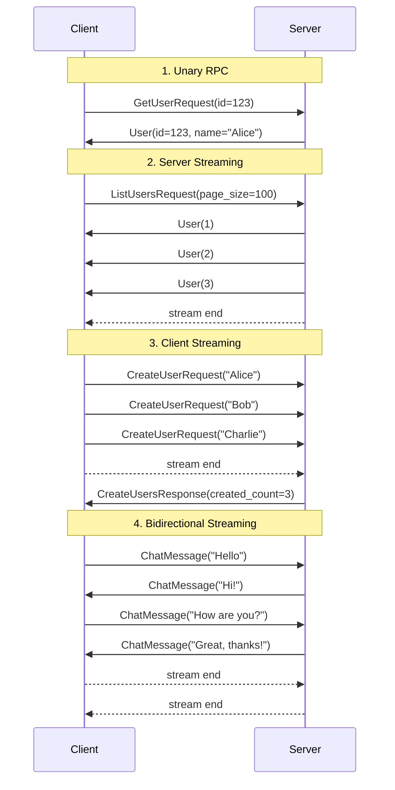
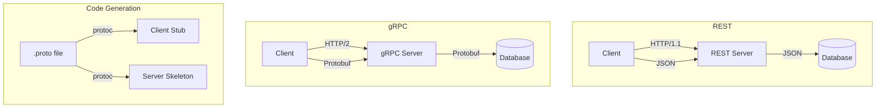
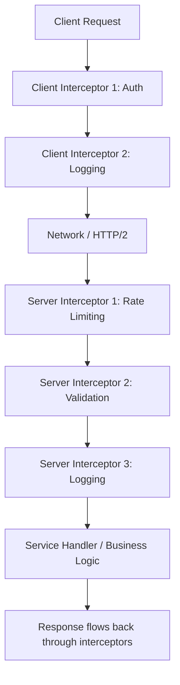
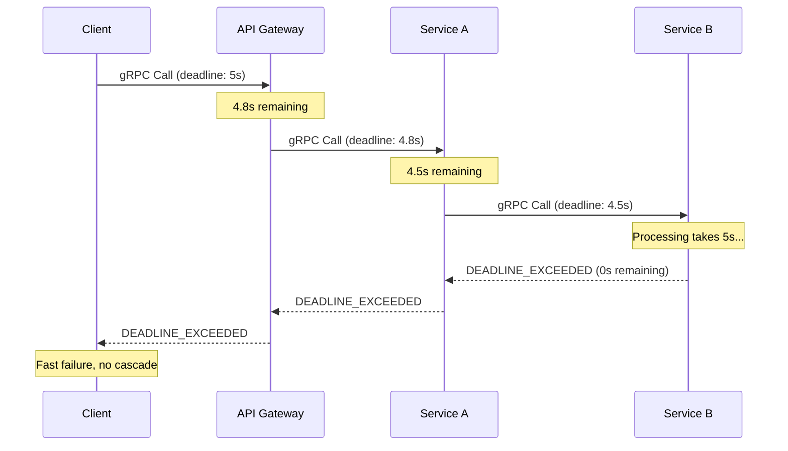

# gRPC — Google Remote Procedure Call

## Overview

gRPC is a high-performance, open-source **RPC (Remote Procedure Call) framework** developed by Google and released in 2015. It uses **Protocol Buffers (protobuf)** as its interface definition language (IDL) and serialization format, and **HTTP/2** as its transport. gRPC is designed for efficient communication between microservices, supporting **four types of streaming** and offering significant performance advantages over REST for many use cases.

| Aspect | Detail |
|---|---|
| Creator | Google (2015) |
| Transport | HTTP/2 |
| Serialization | Protocol Buffers (protobuf) |
| IDL | `.proto` files |
| Streaming | Unary, Server, Client, Bidirectional |
| Code Generation | Auto-generated clients in 10+ languages |
| Standard | gRPC specification + protobuf spec |

## Detailed Explanation

### Protocol Buffers (protobuf)

Protobuf is a language-agnostic, platform-extensible mechanism for serializing structured data. It is smaller, faster, and more efficient than JSON or XML.

**`.proto` file definition:**
```protobuf
syntax = "proto3";

package user;

import "google/protobuf/timestamp.proto";

service UserService {
  // Unary RPC
  rpc GetUser (GetUserRequest) returns (User);

  // Server streaming RPC
  rpc ListUsers (ListUsersRequest) returns (stream User);

  // Client streaming RPC
  rpc CreateUsers (stream CreateUserRequest) returns (CreateUsersResponse);

  // Bidirectional streaming RPC
  rpc Chat (stream ChatMessage) returns (stream ChatMessage);
}

message GetUserRequest {
  int32 id = 1;
}

message User {
  int32 id = 1;
  string name = 2;
  string email = 3;
  google.protobuf.Timestamp created_at = 4;
  UserStatus status = 5;
}

enum UserStatus {
  USER_STATUS_UNSPECIFIED = 0;
  USER_STATUS_ACTIVE = 1;
  USER_STATUS_INACTIVE = 2;
}

message ListUsersRequest {
  int32 page_size = 1;
  string page_token = 2;
}

message CreateUserRequest {
  string name = 1;
  string email = 2;
}

message CreateUsersResponse {
  int32 created_count = 1;
  repeated User users = 2;
}

message ChatMessage {
  string user_id = 1;
  string text = 2;
  google.protobuf.Timestamp timestamp = 3;
}
```

**Protobuf encoding advantages:**
```
JSON:    {"id": 123, "name": "Alice", "email": "alice@example.com"}
         → ~60 bytes (with quotes, colons, braces)

Protobuf: 08 7B 12 05 41 6C 69 63 65 1A 12 61 6C 69 63 65 ...
          → ~25 bytes (binary, field numbers, no key names)

Protobuf is typically 3-10x smaller and 20-100x faster to parse than JSON.
```

### gRPC Communication Patterns

gRPC supports four communication patterns:

#### 1. Unary RPC (Request-Response)
The simplest pattern — one request, one response. Similar to REST.

```
Client                          Server
  |--- Request ------------------>|
  |<-- Response ------------------|
```

```protobuf
rpc GetUser (GetUserRequest) returns (User);
```

#### 2. Server Streaming RPC
Client sends one request, server returns a stream of responses.

```
Client                          Server
  |--- Request ------------------>|
  |<-- Response 1 ----------------|
  |<-- Response 2 ----------------|
  |<-- Response 3 ----------------|
  |<-- (stream completes) --------|
```

```protobuf
rpc ListUsers (ListUsersRequest) returns (stream User);
```

**Use case:** Fetching a large result set, real-time updates from server.

#### 3. Client Streaming RPC
Client sends a stream of requests, server returns one response.

```
Client                          Server
  |--- Request 1 ---------------->|
  |--- Request 2 ---------------->|
  |--- Request 3 ---------------->|
  |--- (stream completes) ------->|
  |<-- Response ------------------|
```

```protobuf
rpc CreateUsers (stream CreateUserRequest) returns (CreateUsersResponse);
```

**Use case:** Uploading large files, batch operations, accumulating data.

#### 4. Bidirectional Streaming RPC
Both client and server send streams of messages independently.

```
Client                          Server
  |--- Message 1 ---------------->|
  |<-- Message A -----------------|
  |--- Message 2 ---------------->|
  |--- Message 3 ---------------->|
  |<-- Message B -----------------|
  |<-- Message C -----------------|
  |--- (client closes) ---------->|
  |<-- (server closes) -----------|
```

```protobuf
rpc Chat (stream ChatMessage) returns (stream ChatMessage);
```

**Use case:** Chat applications, real-time collaboration, interactive services.

### HTTP/2 Transport

gRPC leverages HTTP/2 features:

```
gRPC over HTTP/2:

POST /user.UserService/GetUser HTTP/2
Content-Type: application/grpc
TE: trailers
grpc-timeout: 5S

[protobuf-encoded request body]

HTTP/2 200
Content-Type: application/grpc
grpc-status: 0
grpc-message: OK

[protobuf-encoded response body]

Key HTTP/2 features used:
- Multiplexing: Multiple RPCs on one connection
- Header compression: HPACK reduces overhead
- Binary framing: Efficient for protobuf payloads
- Flow control: Backpressure for streaming
- Trailers: grpc-status and grpc-message in trailers
```

**gRPC message framing:**
```
Each gRPC message is wrapped in a length-prefixed frame:

┌──────────┬────────────────┬──────────────────────┐
│ Compressed│ Message Length │   Message (protobuf  │
│  (1 byte) │  (4 bytes)     │    encoded)          │
│  0 or 1   │  big-endian    │                      │
└──────────┴────────────────┴──────────────────────┘
```

### Interceptors

Interceptors are gRPC's middleware mechanism. They allow you to intercept RPC calls before they reach the handler (or before they're sent on the client side).

**Server-side interceptor:**
```python
# Python example with grpc interceptor
import grpc
import time

class LoggingInterceptor(grpc.ServerInterceptor):
    def intercept_service(self, continuation, handler_call_details):
        start = time.time()
        method = handler_call_details.method
        print(f"[gRPC] Incoming call: {method}")

        # Call the actual handler
        response = continuation(handler_call_details)

        duration = time.time() - start
        print(f"[gRPC] {method} completed in {duration:.3f}s")
        return response

# Usage
server = grpc.server(
    futures.ThreadPoolExecutor(max_workers=10),
    interceptors=[LoggingInterceptor()]
)
```

**Client-side interceptor:**
```python
class AuthInterceptor(grpc.UnaryUnaryClientInterceptor):
    def intercept_unary_unary(self, continuation, client_call_details, request):
        # Add auth token to every request
        metadata = list(client_call_details.metadata or [])
        metadata.append(('authorization', f'Bearer {get_token()}'))
        client_call_details = client_call_details._replace(metadata=metadata)
        return continuation(client_call_details, request)
```

**Common interceptor use cases:**
- Authentication/authorization
- Logging and metrics
- Rate limiting
- Request validation
- Error handling and retries
- Distributed tracing (OpenTelemetry)

### Error Handling

gRPC uses status codes (not HTTP status codes):

```
gRPC Status Codes:
  OK (0)                    — Success
  CANCELLED (1)             — Client cancelled
  UNKNOWN (2)               — Unknown error
  INVALID_ARGUMENT (3)      — Bad request
  DEADLINE_EXCEEDED (4)     — Timeout
  NOT_FOUND (5)             — Resource not found
  ALREADY_EXISTS (6)        — Conflict
  PERMISSION_DENIED (7)     — Authorization failure
  RESOURCE_EXHAUSTED (8)    — Rate limited / quota exceeded
  FAILED_PRECONDITION (9)   — Operation rejected (system state)
  ABORTED (10)              — Operation aborted (concurrency conflict)
  OUT_OF_RANGE (11)         — Operation out of range
  UNIMPLEMENTED (12)        — Method not implemented
  INTERNAL (13)             — Internal server error
  UNAVAILABLE (14)          — Service unavailable
  DATA_LOSS (15)            — Unrecoverable data loss
  UNAUTHENTICATED (16)      — Authentication required
```

**Rich error model (with details):**
```python
from grpc_status import rpc_status
from google.rpc import error_details_pb2

# Server side: create detailed error
context.abort_with_status(rpc_status.to_status(
    status_pb2.Status(
        code=code_pb2.INVALID_ARGUMENT,
        message="Validation failed",
        details=[
            error_details_pb2.BadRequest(
                field_violations=[
                    error_details_pb2.BadRequest.FieldViolation(
                        field="email",
                        description="Must be a valid email address"
                    )
                ]
            )
        ]
    )
))
```

### Deadlines and Timeouts

gRPC has built-in deadline propagation:

```
Client sets deadline: 5 seconds
  → Server receives deadline: 4.8 seconds remaining
    → Server calls Service B: 4.5 seconds remaining
      → Service B calls Service C: 4.2 seconds remaining
        → If any service exceeds its remaining time → DEADLINE_EXCEEDED

This prevents cascade failures in microservice chains.
```

```python
# Client: set deadline
stub = UserServiceStub(channel)
try:
    response = stub.GetUser(
        GetUserRequest(id=123),
        timeout=5.0  # 5 second deadline
    )
except grpc.RpcError as e:
    if e.code() == grpc.StatusCode.DEADLINE_EXCEEDED:
        print("Request timed out")
```

### Code Generation

The `protoc` compiler generates client and server code from `.proto` files:

```bash
# Generate Python code
python -m grpc_tools.protoc -I. --python_out=. --grpc_python_out=. user.proto

# Generate Go code
protoc --go_out=. --go-grpc_out=. user.proto

# Generate Java code
protoc --java_out=. --grpc-java_out=. user.proto

# Generate JavaScript/TypeScript
protoc --js_out=import_style=commonjs:. --grpc-web_out=import_style=typescript:. user.proto
```

Generated code provides:
- Type-safe message classes
- Client stubs (synchronous and asynchronous)
- Server base classes (to implement)
- Serialization/deserialization

### gRPC-Web

Browsers cannot directly use gRPC (they don't support HTTP/2 trailers or the gRPC framing protocol). **gRPC-Web** is a compatibility layer:

```
Browser → gRPC-Web Proxy (Envoy/nginx) → gRPC Server

gRPC-Web supports:
- Unary RPCs
- Server streaming (with limitations)
- No client streaming or bidirectional streaming

Alternative: gRPC-Web with WebSocket transport (grpc-websocket)
```

## Diagrams

### gRPC Communication Patterns



### gRPC vs REST Architecture



### gRPC Interceptor Chain



### Deadline Propagation in Microservices



## Interview Questions

### Q1: What are the advantages of gRPC over REST?
**A:**
| Advantage | Explanation |
|---|---|
| **Performance** | Protobuf is 3-10x smaller and 20-100x faster to parse than JSON |
| **HTTP/2** | Multiplexing, header compression, binary framing |
| **Streaming** | Native support for all four streaming patterns |
| **Code Generation** | Type-safe client/server code auto-generated from `.proto` files |
| **Contract** | `.proto` file is a strict API contract (strongly typed) |
| **Deadlines** | Built-in timeout propagation across service chains |
| **Interceptors** | Clean middleware pattern for cross-cutting concerns |

### Q2: When would you choose REST over gRPC?
**A:**
- **Browser clients** — Browsers don't natively support gRPC (need gRPC-Web proxy)
- **Simple CRUD APIs** — REST's simplicity wins for basic operations
- **Public APIs** — REST is universally understood; gRPC requires protobuf knowledge
- **Human-readable debugging** — JSON is easy to read; protobuf is binary
- **Caching** — HTTP caching works naturally with REST; gRPC uses POST which isn't cacheable by default
- **File uploads** — REST handles multipart uploads natively
- **Team familiarity** — REST has a lower learning curve

### Q3: Explain the four gRPC communication patterns.
**A:**
1. **Unary** — One request, one response (like REST). `rpc Get(Req) returns (Resp)`
2. **Server Streaming** — One request, stream of responses. Good for large result sets. `rpc List(Req) returns (stream Resp)`
3. **Client Streaming** — Stream of requests, one response. Good for uploads/batch. `rpc Upload(stream Req) returns (Resp)`
4. **Bidirectional Streaming** — Both sides stream independently. Good for chat/real-time. `rpc Chat(stream Msg) returns (stream Msg)`

### Q4: What are Protocol Buffers and why are they better than JSON?
**A:** Protocol Buffers are a binary serialization format defined in `.proto` files. Advantages over JSON:
- **Size** — Binary encoding is 3-10x smaller (no key names in wire format, varint encoding)
- **Speed** — Parsing is 20-100x faster (no string parsing, direct memory mapping)
- **Schema** — Strongly typed, versioned schema with backward compatibility
- **Code Generation** — Type-safe code in 10+ languages

Disadvantages: Not human-readable, requires compilation step, harder to debug without tools.

### Q5: How do gRPC interceptors work?
**A:** Interceptors are middleware that wrap RPC calls. They execute before (and can modify) the request and after (and can modify) the response. Client interceptors run before the call is sent; server interceptors run before the handler executes. They're used for cross-cutting concerns like auth, logging, metrics, rate limiting, and tracing. They form a chain — each interceptor can decide whether to proceed to the next or short-circuit.

### Q6: How does gRPC handle errors differently from REST?
**A:** REST uses HTTP status codes (200, 404, 500, etc.) in the response header. gRPC uses **gRPC status codes** (0-16) sent in HTTP/2 **trailers** (not headers). gRPC also supports a **rich error model** with structured error details (e.g., field violations, retry info, debug info). This is more expressive than REST's typical JSON error body. gRPC always returns HTTP 200 for the HTTP status — the actual status is in the `grpc-status` trailer.

### Q7: Why does gRPC require HTTP/2?
**A:** gRPC needs:
- **Multiplexing** — Multiple concurrent RPCs on one connection (HTTP/1.1 is head-of-line blocked)
- **Header compression** — HPACK reduces overhead of repeated headers
- **Bidirectional streaming** — HTTP/2 supports simultaneous bidirectional data flow
- **Trailers** — gRPC sends status codes in HTTP/2 trailers (HTTP/1.1 has limited trailer support)
- **Binary framing** — Efficient for protobuf's binary payloads

## Common Mistakes

1. **Using gRPC for browser clients without gRPC-Web** — Browsers can't directly use gRPC. You need a gRPC-Web proxy (Envoy, grpc-web-proxy) or consider REST/GraphQL for browser-facing APIs.

2. **Not setting deadlines** — Without deadlines, RPCs can hang indefinitely, causing cascade failures. Always set appropriate timeouts and let them propagate.

3. **Breaking backward compatibility in .proto files** — Don't remove or reuse field numbers. Add new fields as optional. Use `reserved` to prevent reuse of removed fields.

4. **Treating gRPC like REST** — Don't create one RPC per CRUD operation with request/response objects that mirror REST resources. Design RPCs around operations, not resources.

5. **Ignoring error handling** — Don't just catch generic errors. Use appropriate gRPC status codes and the rich error model for actionable error information.

6. **Not using streaming when appropriate** — If you're sending multiple related messages, consider streaming instead of making many unary calls. Streaming reduces connection overhead.

7. **Forgetting about load balancing** — gRPC's long-lived HTTP/2 connections can bypass L4 load balancers. Use L7 load balancers that understand gRPC or client-side load balancing.

8. **Hardcoding proto field numbers** — Field numbers are part of the wire format. Never change them; only add new ones. Use `reserved 2, 15, 9 to 11;` to mark removed fields.

## Summary

| Aspect | Key Takeaway |
|---|---|
| Framework | Open-source RPC framework by Google |
| Transport | HTTP/2 (multiplexing, streaming, binary) |
| Serialization | Protocol Buffers (compact, fast, typed) |
| Patterns | Unary, Server streaming, Client streaming, Bidirectional |
| Interceptors | Middleware for auth, logging, metrics, tracing |
| Error Handling | gRPC status codes (0-16) + rich error model |
| Deadlines | Built-in timeout propagation across services |
| vs REST | Faster, typed, streaming-capable; but less human-readable, harder browser support |

gRPC excels in **microservice-to-microservice** communication where performance, type safety, and streaming are critical. For public APIs and browser clients, REST or GraphQL are often more practical choices.

## Cross-References

- **[REST](./rest.md)** — The alternative API paradigm; comparison included above
- **[HTTP/2](./http2.md)** — gRPC's transport layer and why HTTP/2 is required
- **[WebSocket](./websocket.md)** — Alternative real-time/bidirectional protocol
- **[HTTP/3 & QUIC](./http3.md)** — Future transport for gRPC (experimental)
- **[HTTPS / TLS](./https.md)** — Securing gRPC with TLS
- **[Protocol Buffers]()** — Deep dive into protobuf serialization

## Cross References

- [REST](rest.md)
- [HTTP/2](http2.md)
- [HTTP/3 & QUIC](http3.md)
- [Microservices](../../distributed/microservices/README.md)
