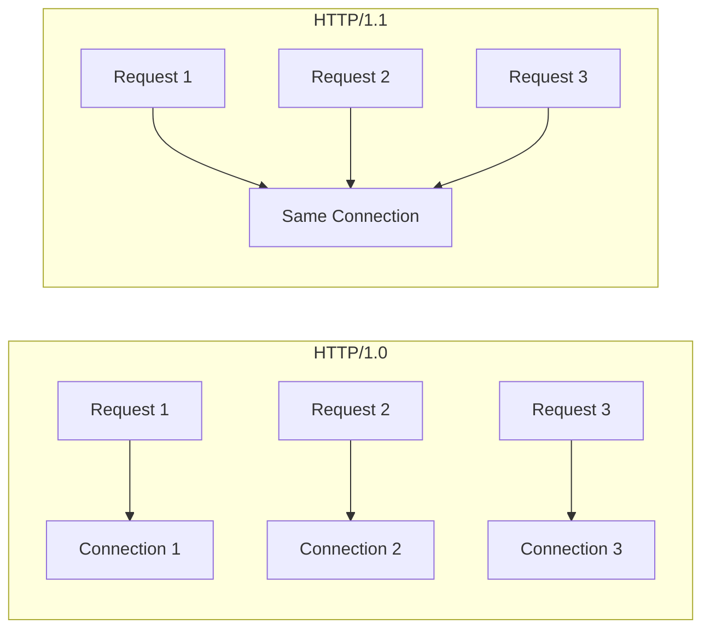
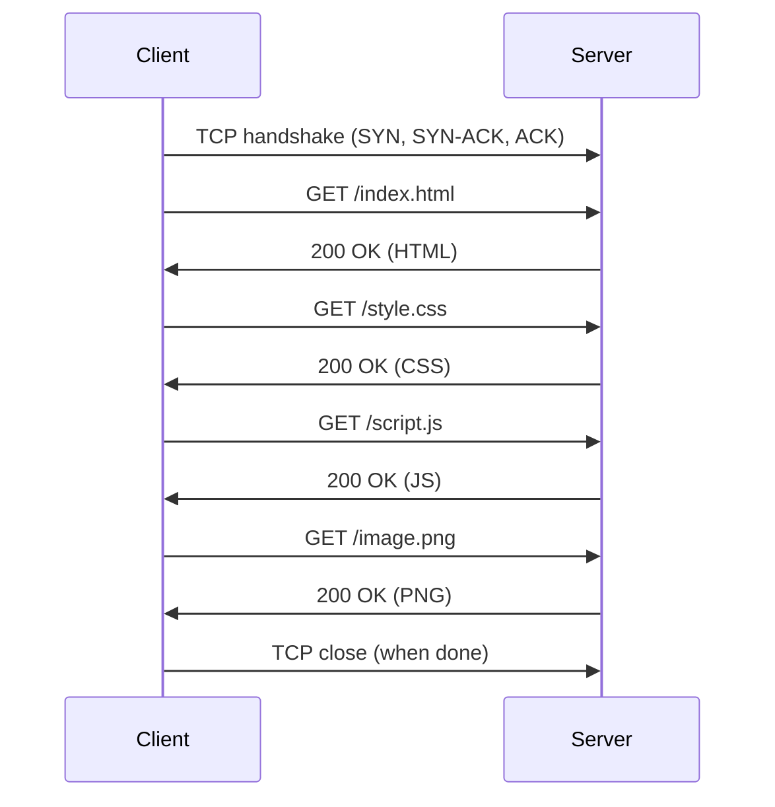
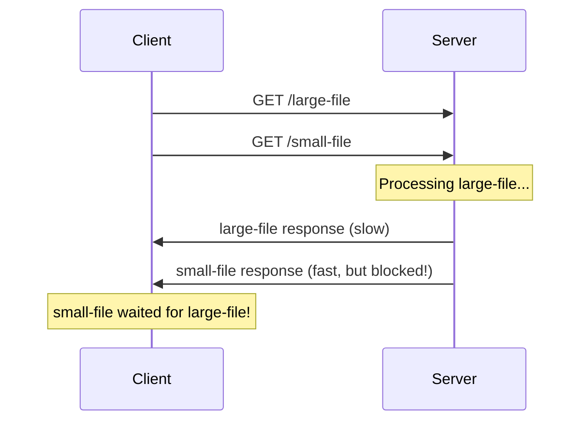
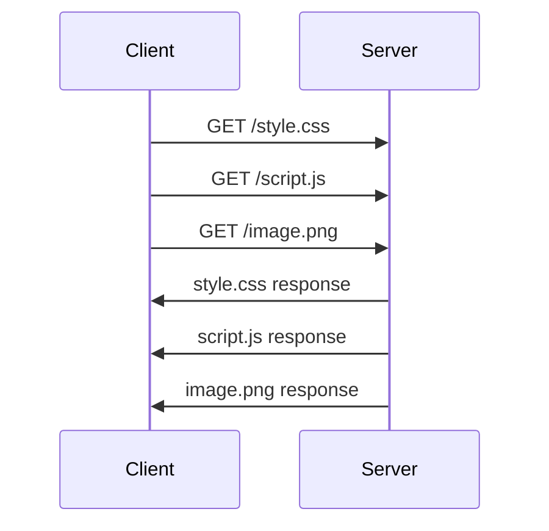
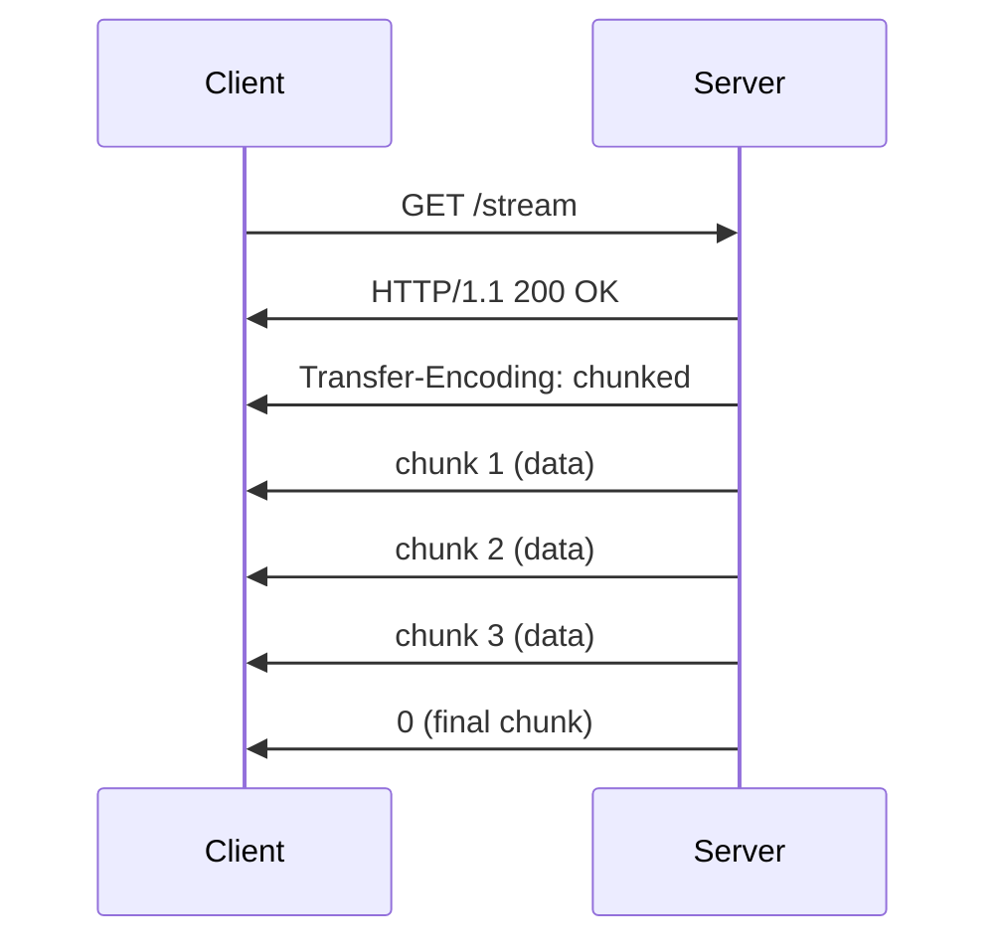

# HTTP/1.1

## Overview

HTTP/1.1 (RFC 2068, 1997; updated by RFC 9110, 2022) was the dominant version of HTTP for over two decades. It introduced **persistent connections**, **pipelining**, **chunked transfer encoding**, and many other features that made the web practical at scale. While HTTP/2 and HTTP/3 have surpassed it in performance, HTTP/1.1 remains widely used and is essential to understand.

## Detailed Explanation

### HTTP/1.0 vs HTTP/1.1



| Feature | HTTP/1.0 | HTTP/1.1 |
|---------|----------|----------|
| **Connections** | New per request | Persistent (default) |
| **Host header** | Optional | Required |
| **Pipelining** | No | Supported (rarely used) |
| **Chunked encoding** | No | Yes |
| **Cache control** | Basic (Expires) | Full (Cache-Control) |
| **Range requests** | No | Yes (partial content) |
| **Content negotiation** | Basic | Enhanced |
| **Status codes** | 14 | 40+ |

### Persistent Connections (Keep-Alive)

**The Problem with HTTP/1.0:**
```
Each request required a new TCP connection:
  TCP handshake (1.5 RTT) + HTTP request/response (1 RTT) = 2.5 RTT per resource
  
For a page with 10 resources: 25 RTT overhead!
```

**HTTP/1.1 Solution: Persistent Connections**
```
Connection: keep-alive (default in HTTP/1.1)

Single TCP connection for multiple requests:
  TCP handshake (1.5 RTT) + 10 requests (10 RTT) = 11.5 RTT
  
  Saves 13.5 RTT (54% reduction)
```



**Connection Management:**
```http
# Request: Keep connection open
Connection: keep-alive

# Request: Close after response
Connection: close

# Server: Close after response
Connection: close
```

### Head-of-Line (HOL) Blocking

**The Problem:**
```
Requests must be sent in order, responses must be received in order:

Client sends:  GET /large-file  GET /small-file
Server sends:  [large-file.....] [small-file]

The small file waits for the large file to finish!

Timeline:
  t=0: Send GET /large-file
  t=1: Send GET /small-file
  t=100: Receive large-file response
  t=101: Receive small-file response  ← 99ms wasted!
```



**This is the fundamental limitation of HTTP/1.1 that HTTP/2 solves with multiplexing.**

### HTTP Pipelining

**Concept:** Send multiple requests without waiting for responses.



**Why Pipelining Failed:**
1. **HOL blocking**: Responses must arrive in order
2. **Non-idempotent methods**: Can't safely pipeline POST
3. **Proxy issues**: Many proxies don't support pipelining
4. **Browser support**: Most browsers disabled it by default
5. **Error handling**: If one response fails, all subsequent are affected

**Result:** Pipelining is essentially dead. HTTP/2 multiplexing replaced it.

### Chunked Transfer Encoding

**Purpose:** Send response in chunks when total size is unknown.

```http
HTTP/1.1 200 OK
Content-Type: text/html
Transfer-Encoding: chunked

16\r\n
<h1>Hello, World!</h1>\r\n
0\r\n
\r\n
```

**Format:**
```
[chunk-size in hex]\r\n
[chunk-data]\r\n
[chunk-size in hex]\r\n
[chunk-data]\r\n
0\r\n
\r\n
```

**Use Cases:**
- Dynamic content (size unknown until generation complete)
- Server-sent events (streaming)
- Large responses (send as generated)



### Content-Length vs Chunked

```
Content-Length:
  - Known size upfront
  - Single chunk with exact byte count
  - Connection can be reused after exact bytes received
  
Chunked:
  - Size unknown upfront
  - Multiple chunks with size prefixes
  - Final chunk: size=0
  - Connection can be reused after final chunk
```

### Range Requests

**Purpose:** Request partial content (resume downloads, video seeking).

```http
# Request specific byte range
GET /large-file.zip HTTP/1.1
Host: example.com
Range: bytes=1000-1999

# Response with partial content
HTTP/1.1 206 Partial Content
Content-Range: bytes 1000-1999/50000
Content-Length: 1000

[bytes 1000-1999]
```

**Range Units:**
```
Range: bytes=0-499      # First 500 bytes
Range: bytes=500-999    # Second 500 bytes
Range: bytes=-500       # Last 500 bytes
Range: bytes=500-       # From byte 500 to end
```

### Cache Control (HTTP/1.1)

```http
# Response headers for caching
Cache-Control: max-age=3600        # Cache for 1 hour
Cache-Control: no-cache            # Revalidate before use
Cache-Control: no-store            # Don't cache at all
Cache-Control: public              # Cacheable by shared caches
Cache-Control: private             # Cacheable by browser only
Cache-Control: must-revalidate     # Must check with server

# Conditional requests
If-None-Match: "etag-value"        # ETag validation
If-Modified-Since: date            # Last-Modified validation

# Response (304 Not Modified)
HTTP/1.1 304 Not Modified
ETag: "etag-value"
Cache-Control: max-age=3600
```

### Content Negotiation

```http
# Client specifies preferences
Accept: text/html, application/json;q=0.9, */*;q=0.8
Accept-Language: en-US, en;q=0.9, fr;q=0.8
Accept-Encoding: gzip, deflate, br

# Server selects best match
Content-Type: application/json
Content-Language: en-US
Content-Encoding: gzip
```

### Virtual Hosting (Host Header)

```http
# HTTP/1.0: Host optional (one IP = one site)
GET /index.html HTTP/1.0

# HTTP/1.1: Host required (shared hosting)
GET /index.html HTTP/1.1
Host: www.example.com

# Multiple sites on same IP:
# www.example.com → 93.184.216.34
# www.other.com   → 93.184.216.34 (same IP!)
```

## Example: HTTP/1.1 Session

### Complete Browser Session

```http
# TCP handshake (not shown)

# Request 1: HTML page
GET /index.html HTTP/1.1
Host: www.example.com
User-Agent: Mozilla/5.0
Accept: text/html
Accept-Encoding: gzip, deflate
Connection: keep-alive

# Response 1
HTTP/1.1 200 OK
Content-Type: text/html; charset=utf-8
Content-Length: 1234
Content-Encoding: gzip
Cache-Control: max-age=3600
Connection: keep-alive

[gzipped HTML]

# Request 2: CSS (same connection!)
GET /style.css HTTP/1.1
Host: www.example.com
Accept: text/css
Accept-Encoding: gzip
Connection: keep-alive

# Response 2
HTTP/1.1 200 OK
Content-Type: text/css
Content-Length: 5678
Content-Encoding: gzip

[gzipped CSS]

# Connection close (when done)
Connection: close
```

### Chunked Response

```http
GET /api/events HTTP/1.1
Host: api.example.com
Accept: text/event-stream

HTTP/1.1 200 OK
Content-Type: text/event-stream
Transfer-Encoding: chunked

1c\r\n
event: message\ndata: Hello\n\n\r\n
1c\r\n
event: message\ndata: World\n\n\r\n
0\r\n
\r\n
```

## Interview Questions

### Q1: What are the key improvements of HTTP/1.1 over HTTP/1.0?
**A:** (1) **Persistent connections** — reuse TCP connection for multiple requests (default); (2) **Host header required** — enables virtual hosting; (3) **Chunked transfer** — send responses in chunks; (4) **Range requests** — partial content downloads; (5) **Cache-Control** — advanced caching; (6) **Pipelining** — send multiple requests (rarely used); (7) **Content negotiation** — select best representation.

### Q2: What is head-of-line blocking in HTTP/1.1?
**A:** HOL blocking means responses must be received in the order requests were sent. If the first response is slow (large file), subsequent responses wait. This limits parallelism. HTTP/1.1 works around this by opening multiple TCP connections (typically 6 per domain), but each connection still has HOL blocking.

### Q3: Why did HTTP pipelining fail?
**A:** (1) HOL blocking — responses must be in order; (2) Non-idempotent methods (POST) can't be safely pipelined; (3) Proxy compatibility issues; (4) Browser support was poor; (5) Error handling is complex. HTTP/2's multiplexing solved these issues by allowing independent streams.

### Q4: What is chunked transfer encoding?
**A:** Chunked encoding sends data in pieces when the total size is unknown. Each chunk has a size prefix (hex) followed by data. The final chunk has size 0. This allows streaming responses, dynamic content generation, and eliminates the need to buffer the entire response before sending.

### Q5: How do HTTP/1.1 persistent connections work?
**A:** By default, HTTP/1.1 keeps the TCP connection open after each request-response. Subsequent requests reuse the same connection, avoiding TCP handshake overhead. The connection is closed when either side sends `Connection: close` or after a timeout.

### Q6: What is the Host header and why is it required?
**A:** The Host header specifies which website to serve when multiple sites share an IP address (virtual hosting). HTTP/1.1 requires it; HTTP/1.0 had it optional. Without Host, the server doesn't know which site the client wants, making shared hosting impossible.

### Q7: How does HTTP/1.1 handle caching?
**A:** HTTP/1.1 introduced `Cache-Control` headers for fine-grained caching: `max-age` (cache duration), `no-cache` (revalidate), `no-store` (don't cache), `must-revalidate` (check with server). Combined with `ETag` and `If-None-Match` for conditional requests (304 Not Modified).

### Q8: How many parallel connections does a browser use for HTTP/1.1?
**A:** Browsers use 6 parallel connections per domain (their own implementation choice). The HTTP/1.1 specification (RFC 9112 §9.7) actually recommends a single-user client SHOULD NOT maintain more than 2 connections per server; the 6-connection limit is a browser convention that ignores the RFC. This partially mitigates HOL blocking but adds overhead. Sharding (using multiple domains) can increase parallelism. HTTP/2 eliminates this need with multiplexing.

## Common Mistakes

1. **Not understanding HOL blocking**: Responses arrive in request order. A slow response blocks all subsequent responses on the same connection. This is why browsers open multiple connections.

2. **Forgetting Host header is required**: HTTP/1.1 requires Host. Missing Host causes 400 Bad Request or wrong site served. Always include Host.

3. **Confusing Content-Length and Transfer-Encoding**: Content-Length is for known sizes. Transfer-Encoding: chunked is for unknown sizes. They're mutually exclusive.

4. **Not using persistent connections**: HTTP/1.1 defaults to keep-alive. Explicitly closing connections after each request wastes TCP handshake overhead. Only close when done.

5. **Thinking pipelining is widely supported**: It's not. Most browsers disable it. HTTP/2's multiplexing is the correct solution.

6. **Not understanding range requests**: Range requests enable resume downloads and video seeking. Servers respond with 206 Partial Content. Not all servers support ranges.

7. **Confusing HTTP/1.1 and HTTP/2**: HTTP/1.1 is text-based with HOL blocking. HTTP/2 is binary with multiplexing. They're very different in performance characteristics.

## Summary

| Feature | HTTP/1.1 |
|---------|----------|
| **Connections** | Persistent (keep-alive by default) |
| **Pipelining** | Supported but rarely used |
| **HOL Blocking** | Yes (responses in order) |
| **Encoding** | Text-based headers, chunked transfer |
| **Caching** | Cache-Control, ETag, If-None-Match |
| **Range** | Yes (206 Partial Content) |
| **Host** | Required |
| **Parallelism** | 6 connections per domain |

HTTP/1.1 was the workhorse of the web for 20+ years. Its limitations (HOL blocking, text-based) drove the development of HTTP/2 and HTTP/3.

## Cross-References

- [HTTP Overview](README.md) — HTTP fundamentals
- [HTTP/2](http2.md) — Multiplexing solves HOL blocking
- [HTTP/3](http3.md) — QUIC-based, no TCP HOL blocking
- [HTTPS](https.md) — TLS encryption for HTTP
- [TCP Options](../tcp/options.md) — TCP features HTTP/1.1 relies on
- [Nagle's Algorithm](../tcp/nagle.md) — Nagle + Delayed ACK interaction
