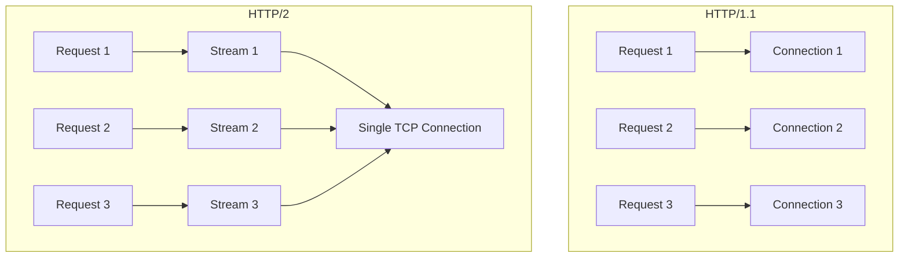
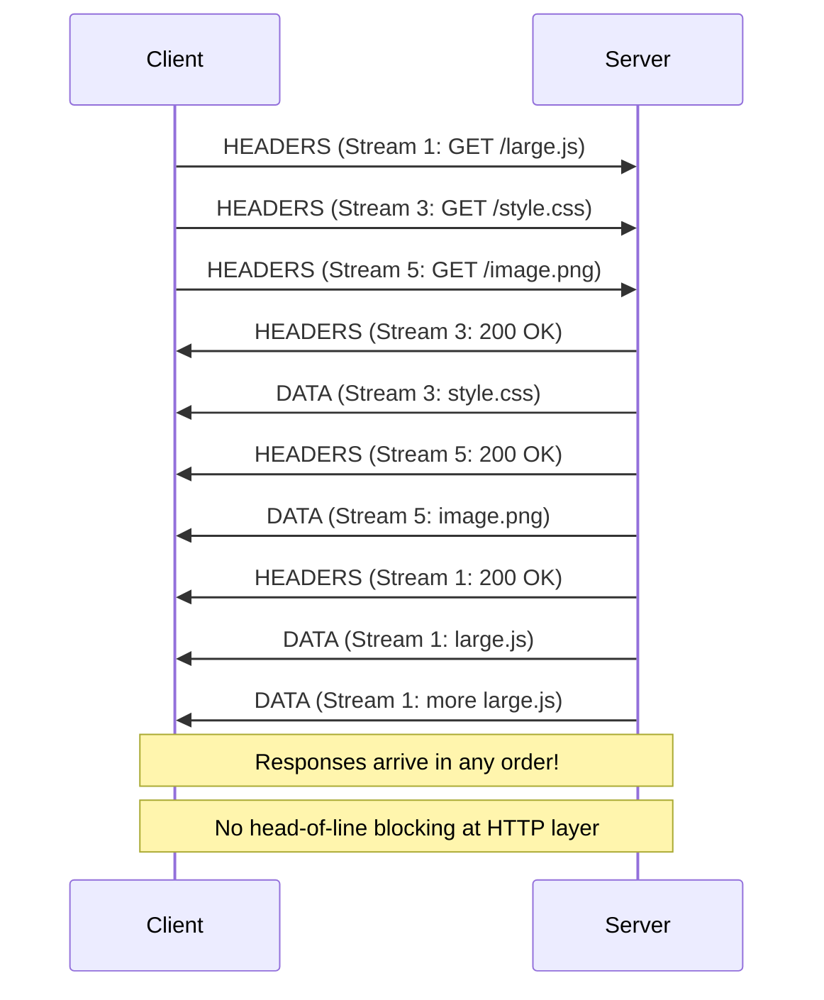
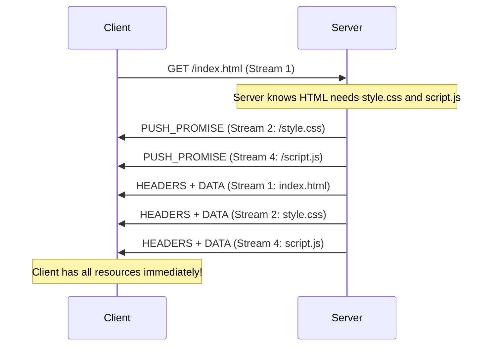

# HTTP/2

## Overview

HTTP/2 (RFC 7540, 2015) was a major revision of the HTTP protocol designed to address HTTP/1.1's performance limitations. Its key innovations are **multiplexing** (multiple requests on one connection without blocking), **binary framing** (efficient parsing), **HPACK header compression** (reduced overhead), and **server push** (proactive resource delivery).

HTTP/2 maintains full compatibility with HTTP/1.1 semantics (methods, status codes, headers) while dramatically changing the transport layer.

## Detailed Explanation

### HTTP/2 vs HTTP/1.1 Architecture



### Binary Framing Layer

HTTP/2 introduces a binary framing layer between HTTP semantics and TCP:

```
HTTP Semantics (methods, headers, status codes)
        ↓
Binary Framing Layer (frames, streams)
        ↓
TCP (reliable delivery)
```

**Frame Format:**
```
+-----------------------------------------------+
|                 Length (24 bits)               |
+---------------+---------------+---------------+
|   Type (8)    |   Flags (8)   |
+-+-------------+---------------+---------------+
|R|                 Stream ID (31 bits)          |
+-+---------------------------------------------+
|                   Frame Payload               |
+-----------------------------------------------+

Length:    24 bits (max 16,384 bytes per frame)
Type:      8 bits (DATA, HEADERS, SETTINGS, etc.)
Flags:     8 bits (END_STREAM, END_HEADERS, etc.)
R:         1 bit (reserved, must be 0)
Stream ID: 31 bits (identifies the stream)
```

### Frame Types

| Type | Code | Purpose |
|------|------|---------|
| **DATA** | 0x0 | Transfer request/response body |
| **HEADERS** | 0x1 | Transfer headers (start of request/response) |
| **PRIORITY** | 0x2 | Set stream priority/dependency |
| **RST_STREAM** | 0x3 | Terminate a stream |
| **SETTINGS** | 0x4 | Configure connection parameters |
| **PUSH_PROMISE** | 0x5 | Server push announcement |
| **PING** | 0x6 | Connection liveness check |
| **GOAWAY** | 0x7 | Graceful shutdown |
| **WINDOW_UPDATE** | 0x8 | Flow control |
| **CONTINUATION** | 0x9 | Continue header block |

### Multiplexing

**The Key Innovation:** Multiple requests and responses can be in-flight simultaneously on a single TCP connection, each identified by a unique **Stream ID**.



**Benefits:**
- No HOL blocking at the HTTP layer
- Single connection (fewer TCP handshakes, better congestion control)
- Better bandwidth utilization
- No need for domain sharding

### Streams, Messages, and Frames

```
Connection
├── Stream 1 (Request/Response pair)
│   ├── HEADERS frame (request headers)
│   ├── DATA frame (request body, if any)
│   ├── HEADERS frame (response headers)
│   └── DATA frames (response body)
│
├── Stream 3 (Another request/response)
│   ├── HEADERS frame
│   └── DATA frames
│
└── Stream 5 (Another request/response)
    └── ...

Stream ID: Odd for client-initiated, even for server-initiated
Stream 0: Connection control (SETTINGS, PING, GOAWAY)
```

### HPACK Header Compression

**Problem:** HTTP/1.1 headers are repeated with every request (Cookie, User-Agent, Accept, etc. — often 800+ bytes).

**HPACK Solution:**
1. **Static table**: 61 predefined common headers
2. **Dynamic table**: Headers learned during connection
3. **Huffman encoding**: Compress header values

```
HTTP/1.1 request headers (typical):
  Host: www.example.com (24 bytes)
  User-Agent: Mozilla/5.0... (80 bytes)
  Accept: text/html... (60 bytes)
  Cookie: session=abc... (100 bytes)
  Total: ~264 bytes per request

HTTP/2 with HPACK:
  First request: ~264 bytes (full headers)
  Subsequent requests: ~10-30 bytes (compressed references)
  
  Compression ratio: 85-95%
```

**Static Table Examples:**
```
Index 1:  :authority
Index 2:  :method = GET
Index 3:  :method = POST
Index 4:  :path = /
Index 5:  :path = /index.html
Index 8:  :status = 200
Index 13: :status = 404
...
```

### Server Push

**Purpose:** Server can proactively send resources the client will need, without waiting for the client to request them.



**Server Push Issues:**
- Can push resources client already has cached
- No standard way for client to indicate "already have it"
- Can waste bandwidth
- Most browsers have disabled or limited push
- Being replaced by 103 Early Hints

### Flow Control

HTTP/2 implements per-stream and per-connection flow control:

```
Connection-level flow control:
  - Limits total data across all streams
  - WINDOW_UPDATE on stream 0
  
Stream-level flow control:
  - Limits data per individual stream
  - WINDOW_UPDATE on specific stream
  
Both start with 65,535 bytes initial window
```

### Stream Prioritization

```
Stream dependencies and weights:

Stream 1 (HTML): weight=16
├── Stream 3 (CSS): weight=16, depends on 1
└── Stream 5 (JS): weight=8, depends on 1
    └── Stream 7 (image): weight=4, depends on 5

Higher weight = more bandwidth allocation
Dependency = must wait for parent
```

### Connection Management

**SETTINGS Frame:**
```
SETTINGS_HEADER_TABLE_SIZE: HPACK table size
SETTINGS_ENABLE_PUSH: Server push enabled
SETTINGS_MAX_CONCURRENT_STREAMS: Max parallel streams
SETTINGS_INITIAL_WINDOW_SIZE: Flow control window
SETTINGS_MAX_FRAME_SIZE: Max frame payload
SETTINGS_MAX_HEADER_LIST_SIZE: Max header size
```

**PING Frame:**
```
Client → Server: PING (8 bytes payload)
Server → Client: PING + ACK (same payload)

Purpose: Measure RTT, check connection liveness
```

**GOAWAY Frame:**
```
Server → Client: GOAWAY (last processed stream ID)

Purpose: Graceful shutdown
- Server finishes processing streams ≤ last_stream_id
- Client creates new connection for new requests
- No requests are dropped
```

### TLS Requirement

```
HTTP/2 spec doesn't require TLS, but:
  - All major browsers require HTTPS for HTTP/2
  - h2 = HTTP/2 over TLS (port 443)
  - h2c = HTTP/2 cleartext (rarely used, mostly in internal services)
  
ALPN (Application-Layer Protocol Negotiation):
  - Client sends supported protocols in TLS ClientHello
  - Server selects protocol (h2 or http/1.1)
  - No extra round trip for negotiation
```

## Example: HTTP/2 Session

### Connection Establishment

```
1. TCP handshake (1 RTT)
2. TLS handshake with ALPN (1-2 RTT)
   ClientHello: ALPN=[h2, http/1.1]
   ServerHello: ALPN=h2
3. HTTP/2 connection preface
   Client: SETTINGS frame
   Server: SETTINGS frame
4. Ready for requests
```

### Multiplexed Requests

```
Client → Server:
  Frame: HEADERS (Stream 1, GET /index.html)
  Frame: HEADERS (Stream 3, GET /style.css)
  Frame: HEADERS (Stream 5, GET /script.js)

Server → Client:
  Frame: HEADERS (Stream 3, 200 OK)
  Frame: DATA (Stream 3, style.css body)
  Frame: HEADERS (Stream 1, 200 OK)
  Frame: DATA (Stream 1, index.html body)
  Frame: HEADERS (Stream 5, 200 OK)
  Frame: DATA (Stream 5, script.js body)

Note: Responses arrive in any order (CSS first, then HTML, then JS)
```

### HPACK Compression Example

```
First request:
  :method: GET           (index 2 → 1 byte)
  :authority: www.example.com (new → ~25 bytes)
  :path: /index.html     (new → ~15 bytes)
  accept: text/html      (index 60 → 1 byte)
  Total: ~42 bytes

Second request:
  :method: GET           (index 2 → 1 byte)
  :authority: www.example.com (dynamic index → 1 byte)
  :path: /style.css      (new → ~12 bytes)
  accept: text/css       (dynamic index → 1 byte)
  Total: ~15 bytes

Compression: 64% reduction on second request
```

## Interview Questions

### Q1: What are the key improvements of HTTP/2 over HTTP/1.1?
**A:** (1) **Multiplexing** — multiple requests/responses on one connection without HOL blocking; (2) **Binary framing** — efficient parsing (vs text-based); (3) **HPACK compression** — 85-95% header compression; (4) **Server push** — proactive resource delivery; (5) **Flow control** — per-stream and per-connection; (6) **Stream prioritization** — resource ordering.

### Q2: How does HTTP/2 multiplexing work?
**A:** HTTP/2 sends multiple requests and responses as interleaved **frames** on a single TCP connection. Each request/response pair is a **stream** with a unique ID. Frames from different streams can be interleaved. Responses can arrive in any order. This eliminates HTTP-level HOL blocking.

### Q3: What is HPACK header compression?
**A:** HPACK compresses HTTP headers using: (1) **Static table** — 61 predefined common headers; (2) **Dynamic table** — headers learned during connection; (3) **Huffman encoding** — compress string values. Repeated headers (Cookie, User-Agent) are reduced to 1-2 byte references. Compression ratio: 85-95%.

### Q4: How does HTTP/2 server push work?
**A:** When a client requests a resource (e.g., HTML page), the server can proactively push related resources (CSS, JS, images) before the client requests them. The server sends PUSH_PROMISE frames to announce what it will push, then sends the data on new streams. This eliminates the request round-trip for each resource.

### Q5: Does HTTP/2 eliminate head-of-line blocking?
**A:** Partially. HTTP/2 eliminates HOL blocking at the **HTTP layer** (responses can arrive in any order). However, it still uses TCP, so there's HOL blocking at the **TCP layer** — if one TCP segment is lost, all streams are blocked until it's retransmitted. HTTP/3 (QUIC) solves this by using UDP with per-stream reliability.

### Q6: What is the HTTP/2 connection preface?
**A:** The connection preface is the first frame exchange: Client sends a MAGIC string ("PRI * HTTP/2.0\r\n\r\nSM\r\n\r\n") followed by a SETTINGS frame. Server responds with its SETTINGS frame. This establishes the HTTP/2 connection and negotiates parameters.

### Q7: How does flow control work in HTTP/2?
**A:** HTTP/2 has per-stream and per-connection flow control windows (initially 65,535 bytes). The sender can only send data within the window. The receiver sends WINDOW_UPDATE frames to increase the window. This prevents a fast sender from overwhelming a slow receiver on any individual stream.

### Q8: Why do browsers require TLS for HTTP/2?
**A:** While HTTP/2 spec allows cleartext (h2c), browsers require HTTPS for HTTP/2 because: (1) Security — encryption is essential; (2) Interception — middleboxes that don't understand HTTP/2 could break connections; (3) ALPN — protocol negotiation happens during TLS handshake; (4) Deployment — most servers only offer h2 over TLS.

## Common Mistakes

1. **Thinking HTTP/2 eliminates all HOL blocking**: It only eliminates HTTP-level HOL blocking. TCP-level HOL blocking still exists — one lost packet blocks all streams. HTTP/3 (QUIC) fixes this.

2. **Not understanding that HTTP/2 is still HTTP**: HTTP/2 changes the transport (binary framing, multiplexing) but preserves HTTP semantics (methods, status codes, headers). Applications don't need to change.

3. **Forgetting that server push is mostly deprecated**: Most browsers have disabled or limited server push. It can waste bandwidth by pushing cached resources. 103 Early Hints is the modern replacement.

4. **Not knowing HPACK compression**: HPACK is critical for HTTP/2 performance. Without it, headers (especially cookies) would consume significant bandwidth. Understanding static/dynamic tables is important.

5. **Confusing streams with connections**: HTTP/2 uses **one connection** with **multiple streams**. HTTP/1.1 uses **multiple connections** with **one request per connection**. This is a fundamental architectural difference.

6. **Not understanding SETTINGS negotiation**: Both sides exchange SETTINGS frames to configure the connection. Parameters include max concurrent streams, initial window size, and max frame size. These affect performance.

7. **Thinking HTTP/2 doesn't need TLS**: While the spec allows cleartext, all major browsers require HTTPS. In practice, HTTP/2 almost always means TLS. h2c is only used for internal services.

## Summary

| Feature | HTTP/2 |
|---------|--------|
| **Framing** | Binary frames |
| **Multiplexing** | Yes (multiple streams on one connection) |
| **HOL blocking** | HTTP-level: No; TCP-level: Yes |
| **Header compression** | HPACK (85-95% compression) |
| **Server push** | Yes (mostly deprecated) |
| **Flow control** | Per-stream and per-connection |
| **TLS** | Required by browsers (ALPN negotiation) |
| **Connection** | Single TCP connection |

HTTP/2 was a major performance improvement over HTTP/1.1, but its reliance on TCP means TCP-level HOL blocking remains. HTTP/3 addresses this with QUIC.

## Cross-References

- [HTTP Overview](README.md) — HTTP fundamentals
- [HTTP/1.1](http1.md) — Predecessor with text-based framing
- [HTTP/3](http3.md) — QUIC-based, eliminates TCP HOL blocking
- [HTTPS](https.md) — TLS concepts used by HTTP/2
- [QUIC Protocol](quic.md) — Transport for HTTP/3
- [gRPC](grpc.md) — gRPC uses HTTP/2 for multiplexing
- [WebSocket](websocket.md) — Full-duplex over HTTP/2

## Cross References

- [HTTP/1.1](http1.md)
- [HTTP/3](http3.md)
- [gRPC](grpc.md)
- [QUIC](quic.md)
