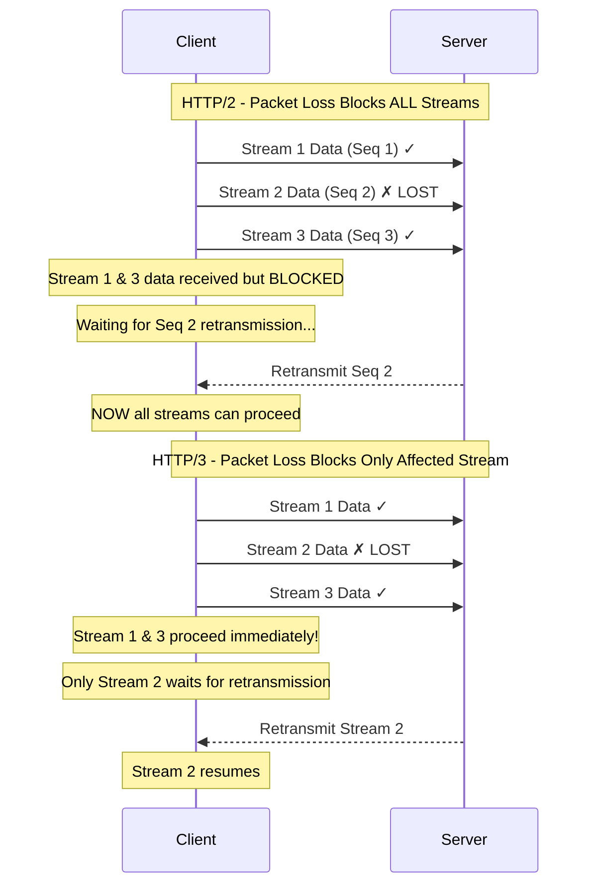
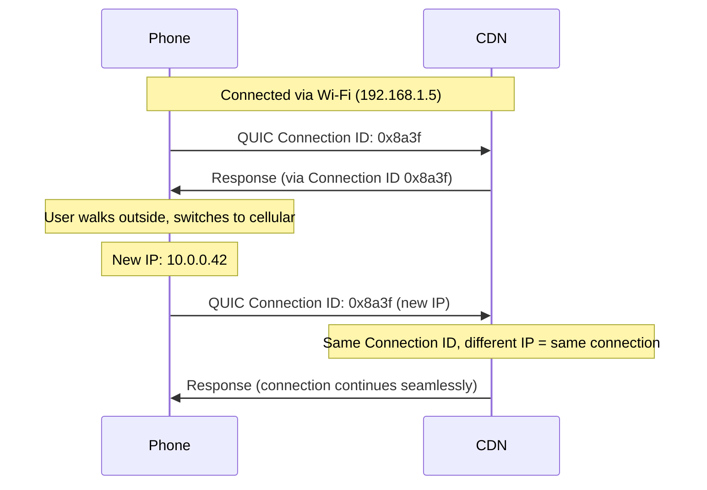
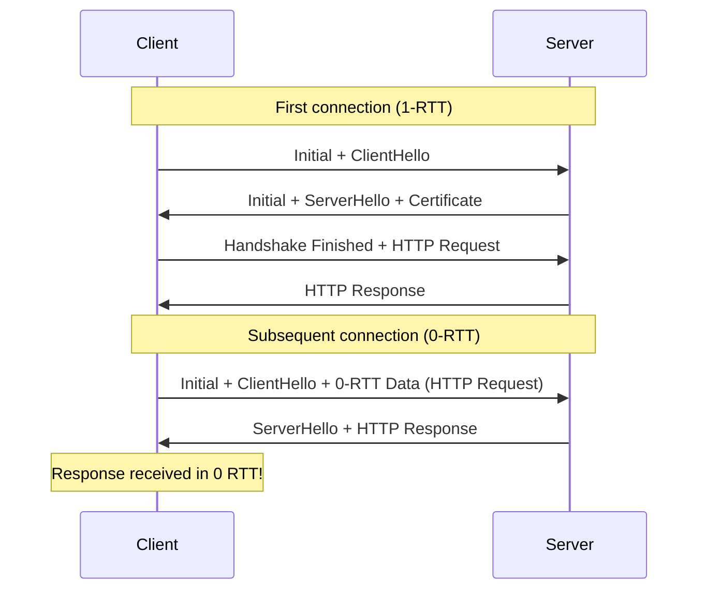

# HTTP/3 — The Next Generation of HTTP

## Overview

HTTP/3 is the third major version of the Hypertext Transfer Protocol, standardized in **RFC 9114** (June 2022). Unlike its predecessors, HTTP/3 does **not** run on TCP. Instead, it is built on top of **QUIC** (Quick UDP Internet Connections), a transport protocol that runs over **UDP**. This fundamental shift eliminates **head-of-line blocking** at the transport layer, provides **faster connection establishment** (0-RTT), and supports **connection migration** across network changes.

| Feature | HTTP/1.1 | HTTP/2 | HTTP/3 |
|---|---|---|---|
| Transport | TCP | TCP | QUIC (over UDP) |
| Multiplexing | No (pipelining only) | Yes (streams over single TCP) | Yes (independent streams) |
| HOL Blocking | Application-layer | Transport-layer | None at transport |
| Header Compression | None | HPACK | QPACK |
| Connection Setup | 1-3 RTT | 1-3 RTT + TLS | 0-1 RTT |
| Encryption | Optional (TLS) | Optional (TLS) | **Mandatory (TLS 1.3)** |
| Connection Migration | No | No | Yes (Connection ID) |

## Detailed Explanation

### Why HTTP/3 Was Needed

HTTP/2 solved many HTTP/1.1 problems (no multiplexing, uncompressed headers, inefficient connections). However, HTTP/2 still runs on TCP, which introduces a critical problem:

**TCP Head-of-Line (HOL) Blocking:** When a TCP segment is lost, *all* streams sharing that TCP connection stall waiting for retransmission — even if the other streams' data arrived fine. In HTTP/2, all streams share one TCP connection, so a single packet loss blocks everything.

```
HTTP/2 over TCP:
Stream 1: [Data A] [Data B] [Data C] ✓
Stream 2: [Data X] [LOST!] [Data Z]  ← packet lost
Stream 3: [Data P] [Data Q] [Data R] ✓

Result: ALL three streams wait for retransmission of the lost packet
because TCP sees one byte stream, not three independent streams.
```

HTTP/3 solves this by running each stream independently over QUIC. A lost packet only affects the stream it belongs to.

### QUIC: The Foundation of HTTP/3

QUIC was originally designed by Google (2012) and later standardized by the IETF. Key properties:

1. **Built on UDP** — avoids OS/kernel TCP stack limitations; can be implemented in userspace
2. **Integrated TLS 1.3** — encryption is mandatory and built into the handshake
3. **Independent streams** — each stream has its own flow control and loss recovery
4. **Connection IDs** — connections survive IP address changes (e.g., Wi-Fi → cellular)

### 0-RTT Connection Establishment

**RTT (Round-Trip Time)** is the time for a packet to travel to a server and back.

**TCP + TLS 1.3 (HTTP/2):**
```
Client                          Server
  |--- TCP SYN ------------------>|  ─┐
  |<-- TCP SYN-ACK ---------------|   │ 1 RTT (TCP)
  |--- TCP ACK ------------------>|  ─┘
  |--- TLS ClientHello --------->|  ─┐
  |<-- TLS ServerHello + Finish -|   │ 1 RTT (TLS)
  |--- TLS Finished + Data ----->|  ─┘
  Total: 2 RTT before first application data
```

**QUIC (HTTP/3) — First Connection (1-RTT):**
```
Client                          Server
  |--- QUIC Initial (ClientHello) ->|  ─┐
  |<-- QUIC Initial (ServerHello) --|   │ 1 RTT
  |--- QUIC Handshake + Data ------>|  ─┘
  Total: 1 RTT before first application data
```

**QUIC (HTTP/3) — Subsequent Connection (0-RTT):**
```
Client                          Server
  |--- QUIC Initial + 0-RTT Data -->|  ─┐
  |<-- QUIC Handshake + Response ---|   │ 0 RTT!
  Total: 0 RTT — data sent in the FIRST packet
```

**0-RTT caveat:** The data sent in 0-RTT is vulnerable to **replay attacks**. Servers must be careful about what operations they allow from 0-RTT data (idempotent requests only, like GET).

### Connection Migration

Traditional TCP connections are identified by a 4-tuple: `(source IP, source port, dest IP, dest port)`. If your IP changes (e.g., switching from Wi-Fi to cellular), the TCP connection breaks.

QUIC uses **Connection IDs** instead:

```
Traditional TCP:
  Connection = (192.168.1.5, 52000, 93.184.216.34, 443)
  Wi-Fi → Cellular: IP changes → Connection DROPS

QUIC:
  Connection = Connection ID: 0x8a3f2b...
  Wi-Fi → Cellular: IP changes, Connection ID same → Connection CONTINUES
```

This means:
- Video calls don't drop when you leave home
- Downloads continue when switching networks
- Web pages don't need to reload

### QPACK Header Compression

HTTP/2 uses **HPACK** for header compression, which relies on a single ordered stream. Since HTTP/3 streams are independent and can arrive out of order, it uses **QPACK** instead.

QPACK uses:
- **Encoder stream** — sends header table updates
- **Decoder stream** — sends acknowledgments
- **Dynamic table** — shared between client and server, but with flow control to handle out-of-order delivery

### HTTP/3 Frame Structure

HTTP/3 uses the same conceptual framing as HTTP/2 but adapted for QUIC streams:

```
Frame Format:
┌─────────────────┬──────────────────┬─────────────────┐
│  Frame Type (v) │  Frame Length (v)│  Frame Payload   │
└─────────────────┴──────────────────┴─────────────────┘
  (variable-length)  (variable-length)  (length bytes)

Key Frame Types:
  0x00 - DATA           (carries body)
  0x01 - HEADERS        (compressed headers)
  0x04 - SETTINGS       (connection settings)
  0x05 - PUSH_PROMISE   (server push)
  0x07 - GOAWAY         (graceful shutdown)
  0x0D - MAX_PUSH_ID    (limit server push)
```

### Server Push in HTTP/3

HTTP/3 retains server push but with improvements:
- A **MAX_PUSH_ID** frame limits how many pushes the server can initiate
- Push is less emphasized in HTTP/3; many implementations disable it due to limited benefits and complexity

## Diagrams

### HTTP/2 vs HTTP/3 Architecture

```mermaid
graph TB
    subgraph "HTTP/2 Stack"
        H2_APP[HTTP/2 Application Layer]
        H2_HPACK[HPACK Compression]
        H2_STREAM[Stream Multiplexing]
        H2_TLS[TLS 1.2/1.3]
        H2_TCP[TCP]
        H2_IP[IP]
    end
    H2_APP --> H2_HPACK --> H2_STREAM --> H2_TLS --> H2_TCP --> H2_IP

    subgraph "HTTP/3 Stack"
        H3_APP[HTTP/3 Application Layer]
        H3_QPACK[QPACK Compression]
        H3_STREAM[QUIC Streams]
        H3_QUIC[QUIC Transport + TLS 1.3]
        H3_UDP[UDP]
        H3_IP[IP]
    end
    H3_APP --> H3_QPACK --> H3_STREAM --> H3_QUIC --> H3_UDP --> H3_IP
```



### Head-of-Line Blocking: HTTP/2 vs HTTP/3



### Connection Migration Flow



### 0-RTT vs 1-RTT Handshake



## Interview Questions

### Q1: Why does HTTP/3 use UDP instead of TCP?
**A:** TCP enforces **ordered, reliable delivery** for the entire byte stream. When a packet is lost, *all* data on that connection is blocked until retransmission completes (transport-layer HOL blocking). QUIC over UDP provides **per-stream** reliability — a lost packet only blocks the stream it belongs to. UDP also allows QUIC to be implemented in **userspace** rather than the kernel, enabling faster iteration and deployment.

### Q2: What is 0-RTT and what are its risks?
**A:** 0-RTT allows the client to send application data in the very first packet to a server it has previously connected to, using cached cryptographic parameters. The risk is **replay attacks** — an attacker can capture and replay the 0-RTT data. Servers should only accept 0-RTT for **idempotent** operations (like GET requests) and implement anti-replay mechanisms (single-use tokens, strike registers).

### Q3: How does connection migration work in HTTP/3?
**A:** QUIC connections are identified by **Connection IDs**, not by the traditional TCP 4-tuple (IP + port pairs). When a client's IP address changes (e.g., Wi-Fi to cellular), the Connection ID remains the same, so the connection continues without re-establishment. The client simply sends packets from the new IP with the same Connection ID.

### Q4: Does HTTP/3 completely eliminate head-of-line blocking?
**A:** HTTP/3 eliminates HOL blocking at the **transport layer** — a lost QUIC packet only blocks the stream it belongs to. However, **application-layer** HOL blocking can still exist if the application itself has dependencies (e.g., waiting for a CSS file before rendering). HTTP/3 also still uses a single **QUIC congestion window** per connection, so severe congestion can affect throughput across all streams.

### Q5: Why does HTTP/3 use QPACK instead of HPACK?
**A:** HPACK (used in HTTP/2) requires a **single ordered stream** because it maintains a dynamic table where both encoder and decoder must see headers in the same order. In HTTP/3, QUIC streams can deliver data **out of order**. QPACK solves this by using separate encoder/decoder streams and allowing references to the dynamic table with flow control, handling the out-of-order delivery problem.

### Q6: How can you tell if a website uses HTTP/3?
**A:** Several methods:
1. Browser DevTools → Network tab → Protocol column shows "h3"
2. Response header `Alt-Svc: h3=":443"; ma=86400` advertises HTTP/3 support
3. Chrome://net-internals/#http3 shows active HTTP/3 connections
4. `curl --http3 https://example.com` (if compiled with HTTP/3 support)

## Common Mistakes

1. **Assuming HTTP/3 is always faster** — For small payloads on fast networks, the difference from HTTP/2 may be negligible. HTTP/3 shines on **lossy networks** and **high-latency connections**.

2. **Ignoring UDP firewall issues** — Some corporate firewalls block or throttle UDP traffic. HTTP/3 may fail silently, and clients should fall back to HTTP/2 over TCP.

3. **Enabling 0-RTT for non-idempotent requests** — 0-RTT data can be replayed. Never process mutations (POST, PUT, DELETE) from 0-RTT without anti-replay protection.

4. **Confusing QUIC streams with TCP connections** — QUIC streams are lightweight and created within a single connection. They are not equivalent to opening multiple TCP connections.

5. **Expecting universal support** — As of 2024, HTTP/3 is supported by ~30% of websites. Older clients, some CDNs, and many enterprise environments still rely on HTTP/2 or HTTP/1.1.

6. **Not handling fallback** — Always support HTTP/2 and HTTP/1.1 as fallbacks. The `Alt-Svc` header mechanism allows graceful negotiation.

## Summary

| Aspect | Key Takeaway |
|---|---|
| Transport | QUIC over UDP, not TCP |
| Encryption | Mandatory TLS 1.3 |
| HOL Blocking | Eliminated at transport layer |
| Connection Setup | 1-RTT first, 0-RTT subsequent |
| Migration | Seamless via Connection IDs |
| Header Compression | QPACK (out-of-order safe) |
| Status | RFC 9114, ~30% web adoption (2024) |

HTTP/3 represents a fundamental rethinking of web transport. By moving from TCP to QUIC, it addresses long-standing performance issues while adding modern features like connection migration and mandatory encryption. Its adoption is accelerating as CDNs, browsers, and servers all implement support.

## Cross-References

- **[QUIC Protocol](./quic.md)** — Deep dive into the transport layer that powers HTTP/3
- **[HTTPS / TLS](./https.md)** — TLS 1.3 integration in QUIC and certificate handling
- **[HTTP/2](./http2.md)** — The predecessor and why HTTP/3 was needed
- **[TCP vs UDP](../tcp/README.md)** — Understanding the transport layer shift
- **[WebSocket](./websocket.md)** — Real-time protocols and how HTTP/3 affects them
- **[Performance Optimization](../tcp/congestion-control.md)** — How HTTP/3 fits into web performance strategies

## Cross References

- [HTTP/2](http2.md)
- [QUIC](quic.md)
- [UDP](../udp/README.md)
