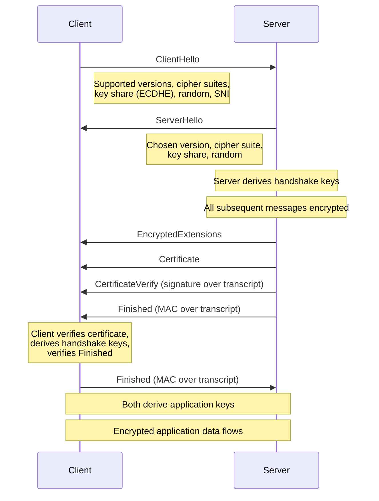
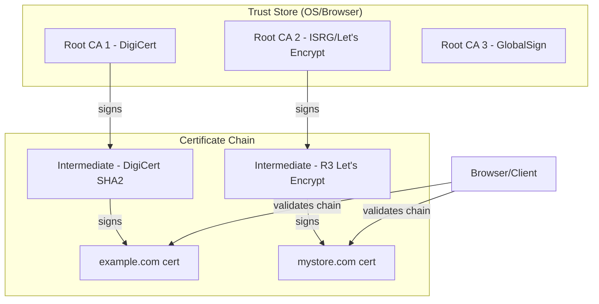
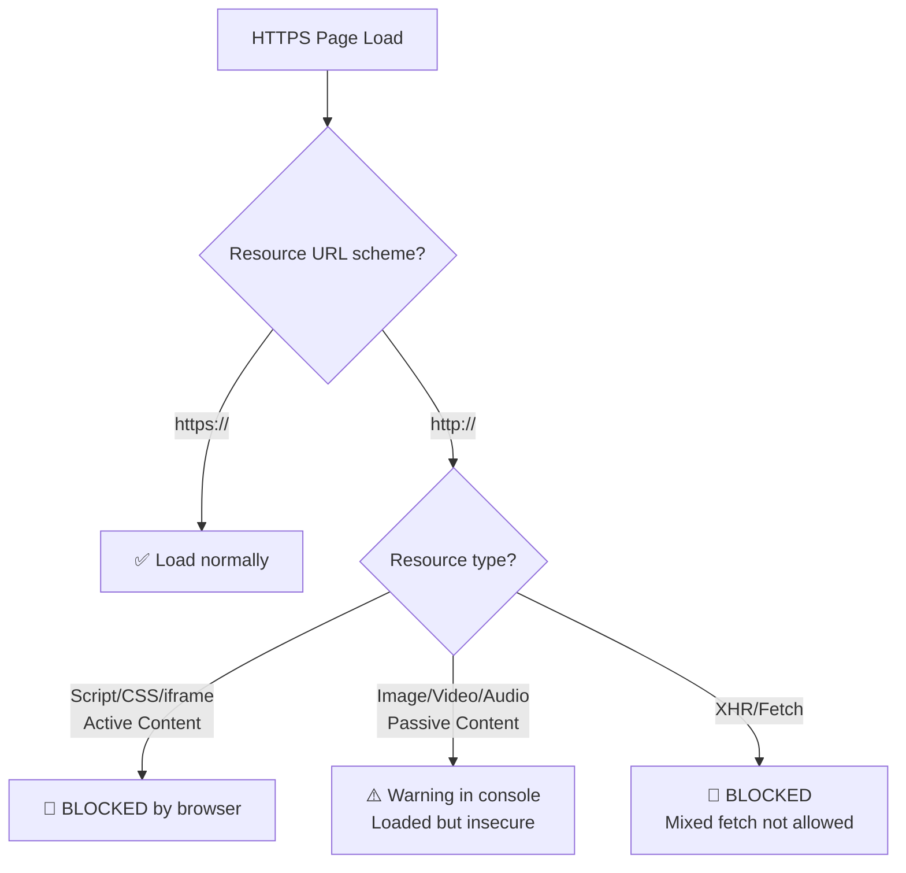
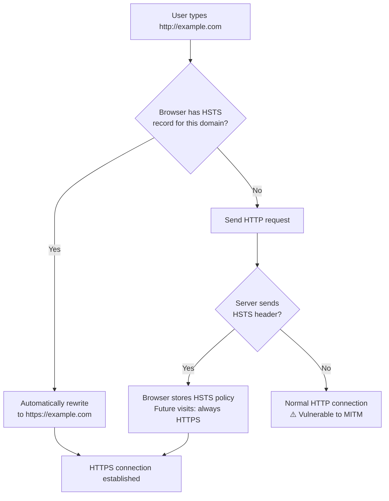

# HTTPS — Securing HTTP with TLS

## Overview

HTTPS (HyperText Transfer Protocol Secure) is HTTP wrapped in **TLS (Transport Layer Security)** encryption. It provides three critical security guarantees:

1. **Confidentiality** — Data is encrypted; eavesdroppers cannot read it
2. **Integrity** — Data cannot be tampered with in transit without detection
3. **Authentication** — You are communicating with the real server, not an impersonator

As of 2024, over **95% of web traffic** uses HTTPS. Browsers mark HTTP sites as "Not Secure." HTTPS is no longer optional — it is the baseline.

| Property | HTTP | HTTPS |
|---|---|---|
| Port | 80 | 443 |
| Encryption | None | TLS 1.2/1.3 |
| URL Scheme | `http://` | `https://` |
| Certificate | None | Required (X.509) |
| Performance | Baseline | Slight overhead (negligible with TLS 1.3) |
| SEO | Penalized | Boosted by Google |

## Detailed Explanation

### The TLS Handshake

The TLS handshake establishes a secure channel between client and server. It negotiates cryptographic parameters, authenticates the server (and optionally the client), and derives session keys.

#### TLS 1.2 Handshake (2-RTT)

```
Client                                      Server
  |                                            |
  |--- ClientHello --------------------------->|
  |    (supported TLS versions, cipher suites, |
  |     random number, extensions)             |
  |                                            |
  |<-- ServerHello ----------------------------|
  |    (chosen TLS version, cipher suite,      |
  |     random number, certificate,            |
  |     ServerKeyExchange, ServerHelloDone)    |
  |                                            |
  |--- ClientKeyExchange --------------------->|
  |    (pre-master secret encrypted with       |
  |     server's public key)                   |
  |--- [ChangeCipherSpec] -------------------->|
  |--- Finished (encrypted) ------------------>|
  |                                            |
  |<-- [ChangeCipherSpec] ---------------------|
  |<-- Finished (encrypted) -------------------|
  |                                            |
  |<========= Encrypted Application Data ======>|
```

#### TLS 1.3 Handshake (1-RTT)

TLS 1.3 streamlined the handshake significantly:

```
Client                                      Server
  |                                            |
  |--- ClientHello --------------------------->|
  |    (supported cipher suites, key share,    |
  |     supported_versions, random)            |
  |                                            |
  |<-- ServerHello ----------------------------|
  |    (chosen cipher suite, key share,        |
  |     encrypted_extensions, certificate,     |
  |     certificate_verify, finished)          |
  |                                            |
  |--- Finished (encrypted) ------------------>|
  |                                            |
  |<========= Encrypted Application Data ======>|
```

**Key improvements in TLS 1.3:**
- Only **1-RTT** handshake (vs 2-RTT in TLS 1.2)
- **0-RTT resumption** possible (data in first flight)
- Removed insecure features (RSA key exchange, static DH, CBC mode ciphers, compression)
- All handshake messages after ServerHello are **encrypted**
- Simplified to only 5 cipher suites (all AEAD-based)

### X.509 Certificates

An X.509 certificate is a digital document that binds a **public key** to an **identity** (domain name, organization). It is signed by a **Certificate Authority (CA)**.

**Certificate structure:**
```
Certificate:
    Data:
        Version: 3 (0x2)
        Serial Number: 0x0a:b3:...
    Signature Algorithm: sha256WithRSAEncryption
        Issuer: C=US, O=Let's Encrypt, CN=R3
        Validity:
            Not Before: Jan  1 00:00:00 2024 GMT
            Not After : Mar 31 23:59:59 2024 GMT
        Subject: CN=example.com
        Subject Public Key Info:
            Public Key Algorithm: rsaEncryption
                Public-Key: (2048 bit)
                Modulus: ...
        X509v3 extensions:
            X509v3 Subject Alternative Name:
                DNS:example.com, DNS:www.example.com
            X509v3 Key Usage: Digital Signature, Key Encipherment
            X509v3 Extended Key Usage: TLS Web Server Authentication
    Signature Algorithm: sha256WithRSAEncryption
         ...
```

### Certificate Chains

No certificate is trusted in isolation. Trust flows through a **chain**:

```
Root CA Certificate (self-signed, trusted)
  └── Intermediate CA Certificate (signed by Root)
        └── Server Certificate (signed by Intermediate)
```

**Why intermediates?** Root CAs are kept offline for security. Intermediates sign day-to-day certificates. If an intermediate is compromised, only its issued certificates are affected (not the root).

**Chain verification steps:**
1. Each certificate's signature is verified using the issuer's public key
2. Validity dates are checked
3. Certificate revocation status is checked (CRL or OCSP)
4. The chain must end at a **trusted root** in the client's trust store

```
Example chain for google.com:

[DSTRootCA_X3]  ← Trusted root (in your OS/browser)
  |
  └── [ISRGRootX1]  ← Let's Encrypt Root (cross-signed)
        |
        └── [R3]  ← Let's Encrypt Intermediate
              |
              └── [google.com]  ← Server certificate
```

### Certificate Types

| Type | Validation Level | Cost | Issuance Time | Use Case |
|---|---|---|---|---|
| **DV** (Domain Validation) | Domain ownership only | Free (Let's Encrypt) | Minutes | Most websites |
| **OV** (Organization Validation) | Organization identity verified | $50-200/year | 1-3 days | Business sites |
| **EV** (Extended Validation) | Rigorous organization vetting | $150-500/year | 1-2 weeks | Banks, e-commerce |

### HSTS (HTTP Strict Transport Security)

HSTS is a security policy mechanism that tells browsers to **always use HTTPS** for a domain, even if the user types `http://`.

**How it works:**
1. Server sends header: `Strict-Transport-Security: max-age=31536000; includeSubDomains; preload`
2. Browser records this and automatically converts all future HTTP requests to HTTPS
3. Even `http://example.com` becomes `https://example.com` before any network request

**HSTS Header Fields:**
```
Strict-Transport-Security: max-age=31536000; includeSubDomains; preload

max-age:           Duration in seconds (31536000 = 1 year)
includeSubDomains: Apply to all subdomains too
preload:           Allow inclusion in browser's built-in HSTS preload list
```

**HSTS Preload List:**
- Browsers ship with a hardcoded list of HSTS domains
- Eliminates the **first visit vulnerability** (before the browser has seen the HSTS header)
- Submit at: `hstspreload.org`
- Examples: `google.com`, `facebook.com`, `github.com`

**Attack prevented by HSTS — SSL Stripping:**
```
Without HSTS:
User types: http://bank.com
Attacker (MITM) intercepts, serves HTTP version
User sees HTTP site, attacker reads all traffic

With HSTS:
User types: http://bank.com
Browser internally redirects to https://bank.com (before any network request)
Attacker cannot intercept
```

### Mixed Content

Mixed content occurs when an HTTPS page loads resources (scripts, images, stylesheets) over HTTP.

**Types:**
- **Mixed Active Content** — Scripts, stylesheets, iframes loaded over HTTP. **Blocked by browsers** because attackers can modify them.
- **Mixed Passive Content** — Images, audio, video loaded over HTTP. **Warning only** (displayed but loaded) in most browsers, but can leak data.

```
HTTPS page: https://example.com

❌ Mixed Active (BLOCKED):
   <script src="http://cdn.example.com/app.js">
   <link href="http://cdn.example.com/style.css">
   <iframe src="http://other.com/widget">

⚠️ Mixed Passive (WARNING):
   
   <video src="http://cdn.example.com/video.mp4">
```

**Fix:** Ensure ALL resources use `https://` or use protocol-relative URLs: `//cdn.example.com/resource`

### Certificate Pinning

**HPKP (HTTP Public Key Pinning)** was a mechanism to pin specific certificate public keys to a domain. It has been **deprecated** because misconfiguration could lock users out of a site permanently.

Modern alternatives:
- **Certificate Transparency (CT)** — All issued certificates are logged in public, append-only logs
- **Expect-CT header** — Enforces CT compliance
- **CAA DNS records** — Specify which CAs can issue certificates for your domain

## Diagrams

### TLS 1.3 Handshake Flow



### Certificate Chain Validation



### Mixed Content Blocking



### HSTS Flow



## Interview Questions

### Q1: What is the difference between TLS 1.2 and TLS 1.3?
**A:**
| Aspect | TLS 1.2 | TLS 1.3 |
|---|---|---|
| Handshake RTTs | 2-RTT | 1-RTT (0-RTT resumption) |
| Key Exchange | RSA, DHE, ECDHE | ECDHE or DHE only (forward secrecy mandatory) |
| Cipher Suites | Many (including insecure ones) | 5 AEAD-only suites |
| Encryption of Handshake | Partial (after ServerHello) | Full (after ServerHello) |
| 0-RTT | Not supported | Supported (with replay risks) |
| Static RSA Key Exchange | Supported | Removed (no forward secrecy) |
| Compression | Supported | Removed (CRIME attack) |

### Q2: What is forward secrecy and why does it matter?
**A:** Forward secrecy (or perfect forward secrecy, PFS) ensures that even if the server's long-term private key is compromised, **past session keys cannot be derived**. TLS 1.3 mandates ephemeral key exchange (ECDHE), so each session uses unique, temporary keys. If an attacker records encrypted traffic and later steals the server's private key, they still cannot decrypt past sessions. TLS 1.2 allowed RSA key exchange, which did NOT provide forward secrecy — compromising the private key would reveal all past sessions.

### Q3: How does a browser verify a certificate?
**A:** The browser:
1. Checks the **signature chain** — each cert is signed by the next issuer up to a trusted root
2. Verifies the **validity period** — cert is not expired or not-yet-valid
3. Checks the **domain name** — Subject Alternative Name (SAN) matches the requested domain
4. Checks **revocation status** via OCSP stapling, OCSP, or CRL
5. Verifies **Certificate Transparency** logs (if required)
6. Checks key usage extensions are appropriate

### Q4: What is OCSP Stapling?
**A:** OCSP (Online Certificate Status Protocol) lets clients check if a certificate has been revoked. Without stapling, the client must contact the CA's OCSP server, adding latency and a privacy leak (the CA knows which sites you visit). With **OCSP Stapling**, the server periodically fetches a signed, timestamped OCSP response from the CA and "staples" it to the TLS handshake. The client can verify the response without contacting the CA directly. This is faster and more private.

### Q5: Explain the SSL Stripping attack and how HSTS prevents it.
**A:** In SSL Stripping, a MITM attacker intercepts the initial HTTP request (before any redirect to HTTPS) and serves an HTTP version of the site to the victim while maintaining an HTTPS connection to the real server. The victim sees `http://` in the URL and all traffic flows through the attacker in plaintext.

HSTS prevents this by having the browser **internally rewrite** HTTP URLs to HTTPS before making any network request. Once the browser has seen the HSTS header (or has the domain in the preload list), it will never attempt an HTTP connection, eliminating the window for SSL stripping.

### Q6: What happens if a certificate expires?
**A:** Browsers display a **full-page security warning** (e.g., `NET::ERR_CERT_DATE_EXPIRED`). Users cannot proceed without explicitly bypassing the warning. In practice:
- Most users will not bypass → site is effectively down
- API clients may refuse to connect → services break
- Browsers are increasingly removing the "proceed anyway" option
- Certificate renewal should be automated (Let's Encrypt uses 90-day certs with auto-renewal)

## Common Mistakes

1. **Not redirecting HTTP to HTTPS** — Users may still type `http://`. Always redirect HTTP → HTTPS at the server level (301 permanent redirect).

2. **Forgetting to renew certificates** — Expired certificates cause downtime. Use automated renewal (certbot, ACME) and monitoring.

3. **Loading mixed content** — One `http://` image/script on an HTTPS page triggers browser warnings or blocks. Audit all resource URLs.

4. **Not implementing HSTS** — Without HSTS, the first visit is vulnerable to SSL stripping. At minimum, set `Strict-Transport-Security` with a reasonable `max-age`.

5. **Using self-signed certificates in production** — Browsers will show scary warnings. Self-signed certs are fine for development but never for production.

6. **Ignoring certificate chain completeness** — Servers must send the full chain (server cert + intermediates). Missing intermediates cause validation failures on some clients that don't have them cached.

7. **Hardcoding certificate pins** — If you pin to a specific certificate and forget to update before renewal, your site becomes inaccessible. Certificate Transparency + CAA records are safer alternatives.

8. **Confusing encryption with authentication** — HTTPS encrypts AND authenticates. Encryption alone (like a self-signed cert) doesn't prevent MITM attacks because there's no trusted third party vouching for the server's identity.

## Summary

| Aspect | Key Takeaway |
|---|---|
| Purpose | Confidentiality, Integrity, Authentication |
| TLS 1.3 | 1-RTT handshake, mandatory forward secrecy, 0-RTT resumption |
| Certificates | X.509, signed by CA, validated via chain to trusted root |
| Certificate Types | DV (free), OV (business), EV (rigorous) |
| HSTS | Forces HTTPS, prevents SSL stripping |
| Mixed Content | HTTP resources on HTTPS pages → warnings/blocks |
| OCSP Stapling | Server provides revocation proof, faster and more private |

HTTPS is the foundation of web security. Understanding TLS handshakes, certificate chains, and security headers like HSTS is essential for both building secure applications and answering network security interview questions.

## Cross-References

- **[HTTP/3 & QUIC](./http3.md)** — TLS 1.3 is built into QUIC's handshake
- **[HTTP/2](./http2.md)** — HTTP/2 with TLS is the current standard deployment
- **[TCP & UDP](../tcp/README.md)** — TLS runs on top of TCP (or QUIC for HTTP/3)
- **[Security Fundamentals](../security/README.md)** — Broader security concepts
- **[DNS](../dns/README.md)** — DNS CAA records control certificate issuance
- **[WebSocket](./websocket.md)** — WebSocket connections use `wss://` (WebSocket over TLS)

## Cross References

- [TLS](../security/tls.md)
- [SSL](../security/ssl.md)
- [HTTP/1.1](http1.md)
- [Certificates](../security/tls.md)
