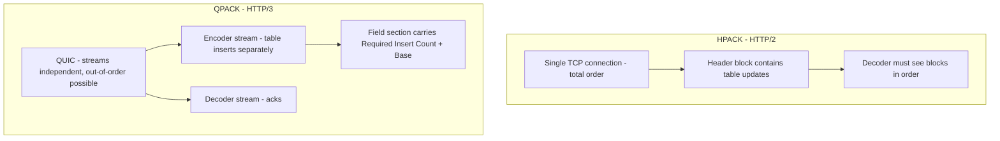
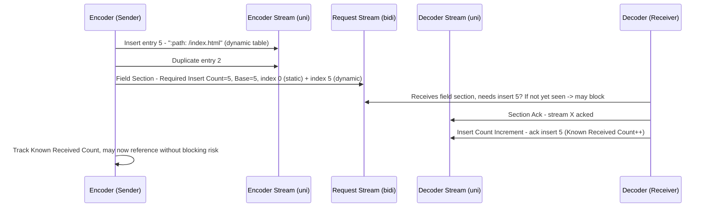
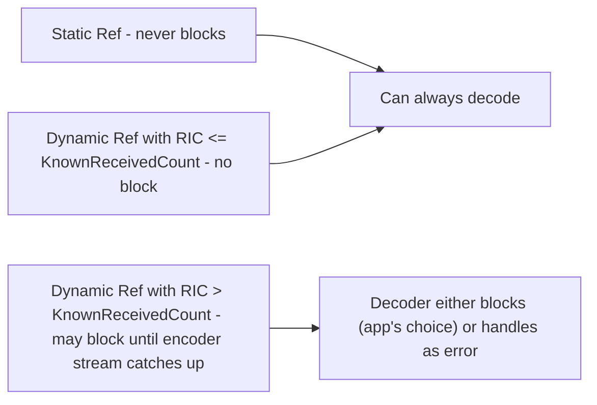
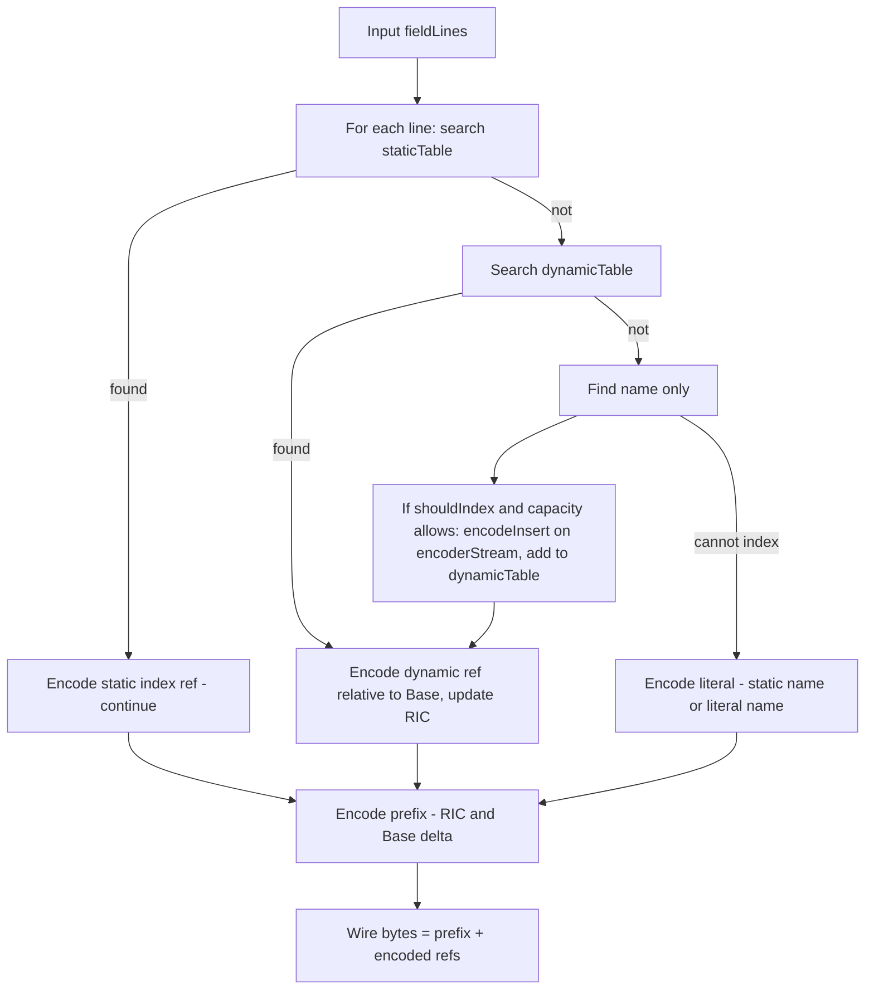
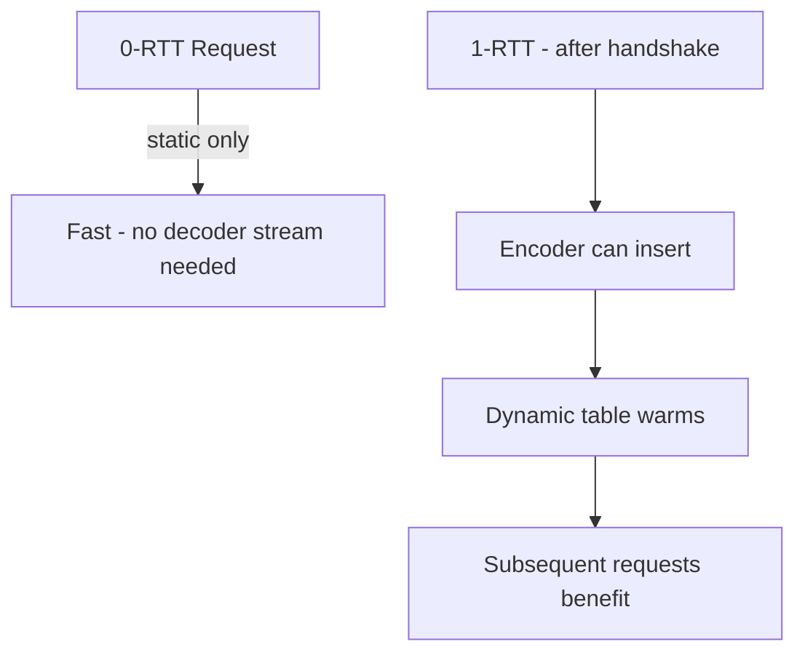

# QPACK — Header Compression for HTTP/3

## Overview

**QPACK** is the header compression mechanism for **HTTP/3**, standardized in **RFC 9204 (June 2022)**. It is the successor to **HPACK (RFC 7541)** used in HTTP/2. Because HTTP/3 runs over **QUIC**, where streams are independent and can arrive **out of order**, HPACK's requirement for in-order delivery would cause head-of-line blocking. QPACK solves this by decoupling table updates onto unidirectional streams with explicit synchronization.

In short: HPACK = one ordered stream modifies table in place. QPACK = separate encoder/decoder streams + Required Insert Count + Base to enable out-of-order decoding without blocking unless opted in.

> Prerequisites: [HTTP/3](./http3.md) and [QUIC](./quic.md). For HTTP/2's compression, see [HTTP/2](./http2.md#hpack-header-compression).

## Why Not HPACK?

If HTTP/3 used HPACK, loss of a packet containing a dynamic table update would block *all* subsequent header blocks waiting for that update, even on unrelated streams — reintroducing TCP-like HOL blocking. QPACK avoids this via **asynchronous table updates**.

## Components

### Tables

- **Static Table**: 99 predefined entries (RFC 9204 §3.1). Same as HPACK's core but expanded: `:method: GET`, `:status: 200`, `content-type`, etc. Immutable, no synchronization needed.
- **Dynamic Table**: initially empty, FIFO, size controlled by `SETTINGS_QPACK_MAX_TABLE_CAPACITY` (default 0 means disabled). Entries are field lines (`name: value`) inserted by encoder, referenced by index.

| Table | Entries | Mutable? | Synchronization |
|-------|---------|----------|-----------------|
| Static | 0-98 | No | None |
| Dynamic | 0..N (capacity-limited) | Yes via encoder stream | Via encoder/decoder streams + counts |

Dynamic table entries have **Absolute Index** ever-increasing, and **Relative Index** relative to a **Base**.

### Streams

HTTP/3 defines critical unidirectional streams (RFC 9114 §6.2):

- **Encoder Stream** (type 0x02): client->server and server->client (one each direction) carries **Encoder Instructions**: Set Dynamic Table Capacity, Insert with Name Reference, Insert with Literal Name, Duplicate.
- **Decoder Stream** (type 0x03): opposite direction carries **Decoder Instructions**: Section Acknowledgment, Stream Cancellation, Insert Count Increment.

- **Request Streams (0x00)**: carry **Field Sections** (encoded headers/trailers) with prefix: **Required Insert Count** and **Base** (delta or sign).

## Required Insert Count and Base

Every field section prefix encodes two integers (RFC 9204 §4.5.1):

- **Required Insert Count (RIC)**: smallest absolute index such that all dynamic table entries needed by this section have index < RIC. Decoded as `RIC = (EncodedRIC % (2*MaxEntries) +1)` if non-zero; 0 means no dynamic references. Decoder blocks until it has received all inserts up to RIC-1 on encoder stream.
- **Base**: reference point for relative indices. Encoder chooses Base close to RIC to minimize blocked streams. Encoding:
  - If `Base >= RIC`: `Base = RIC + delta` (positive).
  - Else: `Base = RIC - delta -1` (negative, allows referencing entries above Base as well).

This design gives encoder flexibility:

**Blocking vs Non-blocking**: HTTP/3 settings `SETTINGS_QPACK_BLOCKED_STREAMS` limits how many streams may be blocked simultaneously. Encoder can avoid blocking by:

- Only referencing entries with `AbsIndex <= KnownReceivedCount` (no risk).
- Or sending Insert first, then delaying field section until ack (costs 1 RTT).
- Most implementations use **speculative insert + opportunistic reference**, and encoder tracks acknowledgments to avoid over-blocking.

## Wire Format

### Encoder Instructions (on encoder stream)

Per RFC 9204 §4.3.2:

| Bits prefix | Type | Fields |
|-------------|------|--------|
| `1T` (1-bit prefix) | Insert with Name Reference | Static/Dynamic flag, name index, H flag, value literal (Huffman?) |
| `01H` (3-bit prefix) | Insert with Literal Name | H flag, name literal (possibly Huffman) + value |
| `001` | Set Dynamic Table Capacity | New capacity (5-bit prefix varint) |
| `000` | Duplicate | Relative index of entry to duplicate |

Capacities are **varint** with N-bit prefix per RFC 9204 §4.1.1 (same as HPACK integer encoding).

### Decoder Instructions

| Prefix | Type |
|--------|------|
| `00` | Section Ack — stream ID where field section was processed |
| `01` | Stream Cancellation — decoder won't process stream, even if it referenced table (allows encoder to reclaim, may not need to keep entries for that stream) |
| `10` | Insert Count Increment — ack of inserts, increments Known Received Count |

### Field Line Representations

Inside a field section (request stream), after prefix:

- `1` + T flag + index: Indexed field (static if T=1, else dynamic relative to Base)
- `01` + ...: Literal with Name Ref (static/dynamic)
- `001` + ...: Literal with Literal Name

Each representation has `N` (Never Indexed) and `H` (Huffman) bits as in HPACK but extended with relative indexing.

## Encoding Algorithm (Single-Pass Example from RFC)

Full reference algorithm in RFC 9204 Appendix C. Production encoders use heuristics: `shouldIndex` typically true for custom headers used repeatedly, false for sensitive values like `authorization` or one-off `cookie`.

## HPACK vs QPACK — Deep Comparison

| Aspect | HPACK (HTTP/2) | QPACK (HTTP/3) |
|--------|----------------|----------------|
| Transport | TCP total order | QUIC streams, out-of-order |
| Table modification in | Same stream as header block | Separate encoder stream |
| Blocking | Cannot happen (in-order) | May block if RIC > known inserts; app chooses to block or fail |
| Dynamic table sin | Encoder can insert any entry at any time, but updates in-stream | Updates on uni stream, acked via decoder stream |
| Header ACK | Implicit (TCP order) | Explicit Section Ack + Insert Count Increment |
| Table size negotiation | `SETTINGS_HEADER_TABLE_SIZE` | `SETTINGS_QPACK_MAX_TABLE_CAPACITY` + `SETTINGS_QPACK_BLOCKED_STREAMS` |
| Static table size | 61 entries | 99 entries (expanded for common HTTP/3 usage) |
| Never Indexed | Separate representation | N bit in representations |
| Huffman | Optional, static code | Same code table (RFC 7541 Appendix B) |
| Security | No CRIME-like leakage due to separate compression context per connection | Same, plus limits on blocked streams and table size mitigate DoS |

## Flow Control and Security

- **DoS**: Decoder limits memory by advertising `MAX_TABLE_CAPACITY` and `BLOCKED_STREAMS`. Encoder cannot force decoder beyond those. If encoder stream grows too large without Decoder ack (stalled), connection error.
- **Decompression Bomb**: Based on max table size and max field section size (`SETTINGS_MAX_FIELD_SECTION_SIZE`).
- **Same-Compression Attack Mitigations**: QPACK isolated from user-controlled data across connections, never indexed sensitive headers by default.

## Real-World Behavior

- **Chrome/Firefox**: Enable QPACK by default, dynamic table initially small (often 4KB or 0 for first request due to 0-RTT considerations).
- **Cloudflare / Fastly / Akamai**: Server encoder often disabled dynamic table for 0-RTT (to avoid blocking). Dynamic table progressively enabled after 1 RTT when Known Received Count >0.
- **0-RTT and QPACK**: 0-RTT requests cannot use dynamic table (decoder hasn't received encoder stream yet). They use only static table + literals. After handshake, encoder streams populate.
- **Performance**: Header compression ratio ~ 30% reduction vs uncompressed; dynamic table improves repeat requests (cookies, user-agent) by ~10-20%, but benefit smaller in HTTP/3 vs HTTP/2 because of extra sync overhead and fewer opportunities for reuse due to blocking avoidance.

## Observability

- `qlog` (QUIC logging, draft-ietf-qlog) captures `qpack:encoder_instructions`, `decoder_instructions`, `blocked_streams`.
- Chrome `net-internals/#http3` shows QPACK table size, blocked count.
- Wireshark dissects QPACK on `quic` + `http3` profiles — look for Frame Type `0x200` (QPACK encoder) `0x201` (decoder).

## Interview Questions

**Q: Why does QPACK need separate encoder/decoder streams?**
Because QUIC streams are independent. If table updates were inlined with header blocks (like HPACK over TCP), a lost packet containing a table update would block all later header blocks until retransmission — reintroducing transport HOL blocking. Separate streams let decoder choose to block only streams that need that update, or use only static references.

**Q: Explain RIC and Base.**
RIC is the minimum state of dynamic table required to decode a field section. Base is reference for relative indices; entries with absolute index < Base are referenced as `Base - index`, entries >= Base as `Base + index`. Together they bound what decoder needs: if encoder has sent all inserts up to RIC but decoder hasn't received yet, decoder may block until encoder stream catches up.

**Q: What causes QPACK blocking and how to avoid it?**
Encoder refers to an entry not yet received by decoder (RIC > Known Received Count). Avoid by only referencing entries known to be acked, or by delaying field section until ack, or setting `BLOCKED_STREAMS=0` to force encoders to avoid blocking (degrade to static + literals).

**Q: HPACK vs QPACK static table?**
HPACK 61 entries, QPACK 99 — added entries like `:protocol`, `content-encoding: br`, `cache-control: max-age` common in web.

**Q: Can 0-RTT use QPACK dynamic table?**
No (or limited). In 0-RTT, decoder hasn't received encoder stream yet, so dynamic references would guarantee blocking. RFC recommends using only static + literals for 0-RTT, then warming table after.

**Q: Why two decoder instructions: Section Ack and Insert Count Increment?**
Section Ack acknowledges processing of a specific request stream's field section, which implicitly acknowledges all inserts up to its RIC for that stream. Insert Count Increment is explicit ack of encoder stream inserts, increasing Known Received Count so encoder knows it's safe to reference them without blocking risk. Both help encoder eviction policy.

## Common Misconfigurations

- Setting `MAX_TABLE_CAPACITY=0` disables dynamic table — valid for constrained proxies but loses compression.
- Large dynamic table on high-loss network increases blocking: better small table or no dynamic.
- Forgetting `SETTINGS_QPACK_BLOCKED_STREAMS` -> decoder may be forced to buffer unbound blocked streams: memory DoS.
- Indexing Authorization: should be `Never Indexed` — avoid leaking into table that might be compressed with attacker-controlled requests.

## Cross-References

- [HTTP/3](./http3.md) — stack, 0-RTT, migration
- [QUIC](./quic.md) — transport under HTTP/3
- [HTTP/2](./http2.md) — HPACK context
- [TLS Deep Dive](../security/tls-deep-dive.md) — TLS 1.3 integration in QUIC
- [CDN](../cdn/README.md) — real deployments

## References

- RFC 9204 — QPACK: Field Compression for HTTP/3: https://www.rfc-editor.org/rfc/rfc9204.html [IETF]
- RFC 9204 Japanese translation overview & encoder/decoder state tracking details [tex2e][greenbytes]
- RFC 9114 — HTTP/3 spec referencing QPACK settings [RFC Editor]
- RFC 7541 — HPACK for comparison [RFC Editor]
- Cloudflare Blog — QPACK deployment, 0-RTT considerations: https://blog.cloudflare.com [Cloudflare]
- LiteSpeed & Fastly QPACK implementation notes — static table expansion rationale [greenbytes docs]
