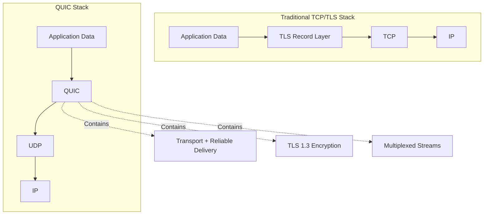
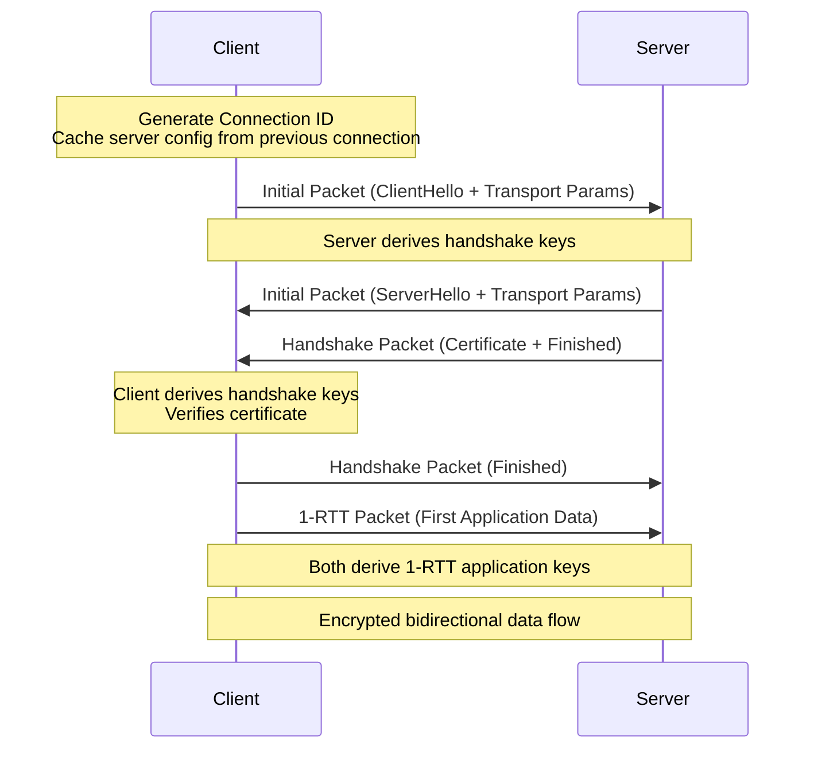
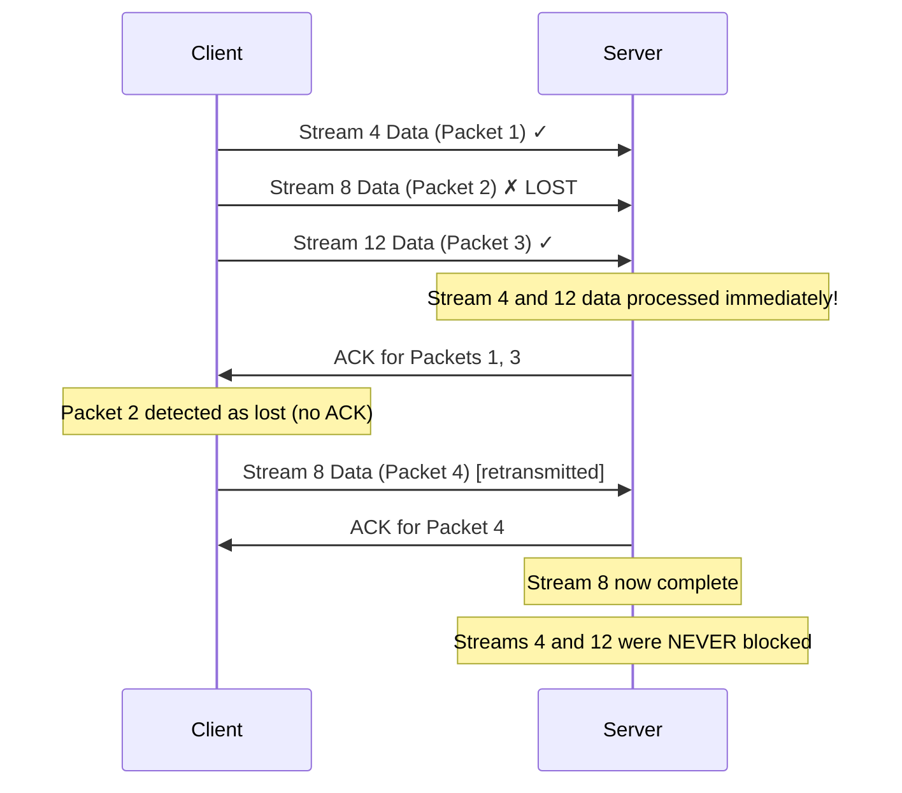
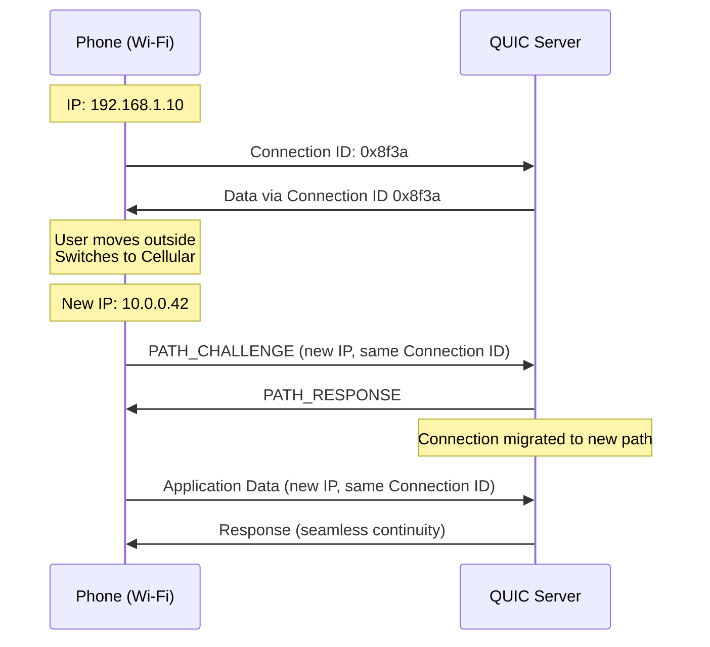

# QUIC — Quick UDP Internet Connections

## Overview

QUIC is a **general-purpose transport protocol** originally designed by Google in 2012 and standardized by the IETF in **RFC 9000** (May 2021). It runs over **UDP** and provides **reliable, multiplexed, encrypted** connections — essentially combining the best features of TCP, TLS, and HTTP/2 into a single protocol. QUIC is the transport layer that powers **HTTP/3**.

| Property | TCP | QUIC |
|---|---|---|
| Transport | Kernel-space | Userspace (over UDP) |
| Connection ID | 4-tuple (IP + ports) | Connection ID (survives IP changes) |
| Encryption | Optional (TLS separate) | Mandatory (TLS 1.3 integrated) |
| Streams | Single byte stream | Multiple independent streams |
| HOL Blocking | Yes (transport-level) | No (per-stream) |
| Handshake | 1-3 RTT (+ TLS) | 1-RTT (0-RTT resumption) |
| Loss Recovery | Per-connection | Per-stream |
| Congestion Control | Cubic/Reno (OS-managed) | Pluggable (userspace) |

## Detailed Explanation

### Why Build on UDP?

QUIC needed a transport that:
1. **Bypasses OS kernel limitations** — TCP changes require OS updates. QUIC in userspace can iterate rapidly.
2. **Exists in every network** — UDP is universally available; inventing a new IP protocol number would face middlebox interference.
3. **Allows custom framing** — QUIC builds its own reliable, ordered delivery on top of UDP's unreliable, unordered datagrams.

**Key insight:** UDP is just the delivery mechanism. QUIC implements all the reliability, ordering, and congestion control that TCP provides — but with modern improvements.

```
Traditional Stack:          QUIC Stack:
┌──────────────┐           ┌──────────────┐
│   HTTP/2     │           │   HTTP/3     │
├──────────────┤           ├──────────────┤
│   HPACK      │           │   QPACK      │
├──────────────┤           ├──────────────┤
│   TLS 1.2    │           │   QUIC       │
├──────────────┤           │  (transport  │
│   TCP        │           │   + TLS 1.3  │
├──────────────┤           │   + streams) │
│   IP         │           ├──────────────┤
└──────────────┘           │   UDP        │
                           ├──────────────┤
                           │   IP         │
                           └──────────────┘
```

### QUIC Packet Structure

QUIC packets are carried inside UDP datagrams:

```
UDP Datagram:
┌─────────────────────────────────────┐
│ UDP Header (src port, dst port,     │
│             length, checksum)       │
├─────────────────────────────────────┤
│ QUIC Packet(s)                      │
│ ┌─────────────────────────────────┐ │
│ │ Header Form (1 bit)            │ │
│ │ Fixed Bit (1 bit)              │ │
│ │ Packet Type (2 bits)           │ │
│ │ Reserved Bits (2 bits)         │ │
│ │ Packet Number Length (2 bits)  │ │
│ │ Version (32 bits) [long hdr]   │ │
│ │ Destination Connection ID      │ │
│ │ Source Connection ID           │ │
│ │ Packet Number                  │ │
│ │ Packet Payload                 │ │
│ └─────────────────────────────────┘ │
└─────────────────────────────────────┘
```

**Packet Types:**
| Type | Purpose |
|---|---|
| Initial | First packet, contains TLS ClientHello/ServerHello |
| Handshake | Carries TLS handshake completion |
| 0-RTT | Early application data (client only, replay-vulnerable) |
| 1-RTT (Short Header) | Normal data transfer after handshake |

### Connection Establishment

#### 1-RTT Handshake (New Connection)

```
Client                                          Server
  |                                               |
  |--- UDP: Initial Packet ---------------------->|
  |    (ClientHello, transport parameters,        |
  |     Destination Connection ID, Token)         |
  |                                               |
  |<-- UDP: Initial Packet -----------------------|
  |    (ServerHello, transport parameters)        |
  |<-- UDP: Handshake Packet ---------------------|
  |    (Certificate, CertificateVerify, Finished) |
  |                                               |
  |--- UDP: Handshake Packet -------------------->|
  |    (Finished)                                 |
  |--- UDP: 1-RTT Packet (Application Data) ----->|
  |                                               |
  |<========= Encrypted Data ===================>|
```

#### 0-RTT Resumption (Returning Client)

```
Client                                          Server
  |                                               |
  |--- UDP: Initial + 0-RTT Packets ------------->|
  |    (ClientHello + cached transport params     |
  |     + HTTP Request in 0-RTT data)             |
  |                                               |
  |<-- UDP: Initial + Handshake + 1-RTT Packets --|
  |    (ServerHello + Certificate + Finished      |
  |     + HTTP Response)                          |
  |                                               |
  |<========= Encrypted Data ===================>|
```

### Multiplexed Streams

QUIC provides **native stream multiplexing**. Each stream is an independent, ordered byte stream with its own flow control.

```
QUIC Connection
├── Stream 0 (control stream, unidirectional)
├── Stream 1 (control stream, unidirectional)
├── Stream 2 (encoder stream)
├── Stream 3 (decoder stream)
├── Stream 4 (request/response, bidirectional) ← HTTP request 1
├── Stream 8 (request/response, bidirectional) ← HTTP request 2
├── Stream 12 (request/response, bidirectional) ← HTTP request 3
└── ...

Streams are identified by a stream ID:
- Bit 0: 0 = client-initiated, 1 = server-initiated
- Bit 1: 0 = bidirectional, 1 = unidirectional
- Remaining bits: stream number

Stream 0b00 = client-initiated, bidirectional
Stream 0b01 = server-initiated, bidirectional
Stream 0b10 = client-initiated, unidirectional
Stream 0b11 = server-initiated, unidirectional
```

**Independent streams mean:**
- Stream 1 losing a packet does NOT block Stream 2
- Each stream has its own receive buffer
- Flow control operates at both stream and connection level

### Flow Control

QUIC implements flow control at **two levels**:

```
Connection-level flow control:
┌──────────────────────────────────────┐
│  Connection receive window: 10 MB    │
│  ┌──────────┐ ┌──────────┐ ┌──────┐ │
│  │ Stream 4 │ │ Stream 8 │ │ S 12 │ │
│  │  2 MB    │ │  3 MB    │ │ 1 MB │ │
│  └──────────┘ └──────────┘ └──────┘ │
│  Total used: 6 MB / 10 MB allowed   │
└──────────────────────────────────────┘

Stream-level flow control:
┌─────────────────────────────┐
│  Stream 4 receive window    │
│  ┌───┬───┬───┬───┬───┬───┐ │
│  │ ✓ │ ✓ │ ✓ │   │   │   │ │
│  └───┴───┴───┴───┴───┴───┘ │
│  Consumed: 3/6 blocks       │
│  Can receive more: yes      │
└─────────────────────────────┘
```

### Loss Detection and Recovery

QUIC's loss detection is more sophisticated than TCP's:

```
TCP Loss Recovery:
- Uses sequence numbers and cumulative ACKs
- Retransmission is ambiguous (which packet was lost?)
- RTO (Retransmission Timeout) is coarse-grained

QUIC Loss Recovery:
- Each packet has a unique, monotonically increasing Packet Number
- ACK frames acknowledge ranges of packet numbers
- Explicit packet number → no retransmission ambiguity
- Uses time-based loss detection (not just duplicate ACKs)
- Per-stream retransmission (retransmit the STREAM frame, not the packet)
```

**QUIC ACK Frame:**
```
ACK Frame:
┌──────────────────────────────────────┐
│ Largest Acknowledged (variable)      │
│ ACK Delay (variable)                 │
│ ACK Range Count (variable)           │
│ First ACK Range (variable)           │
│ ACK Ranges:                          │
│   [Gap, ACK Range Length] pairs...   │
│ ECN Counts (optional)                │
└──────────────────────────────────────┘

Example: ACK for packets 1,2,3,5,6,7,10
  Largest Acknowledged: 10
  First ACK Range: 0 (10-0 = 10, then...)
  Ranges: {10-8}, gap, {6-4}, gap, {2-0}
```

### Congestion Control

QUIC supports **pluggable congestion control** algorithms. The default is similar to TCP Cubic, but implementations can experiment freely:

```
QUIC Congestion Control (RFC 9002):
1. Slow Start: exponentially grow window
2. Congestion Avoidance: linearly grow window
3. Recovery: on loss, reduce window

Key differences from TCP:
- QUIC uses packet-level granularity (not byte-level)
- Pacing: send packets evenly over time, not in bursts
- ECN support for early congestion signaling
- Can implement new algorithms without kernel changes
```

### Connection Migration

```
Connection Migration Scenario:

1. Client connects from Wi-Fi:
   Client IP: 192.168.1.10:51234
   Connection ID: 0x8f3a2b
   Server IP: 93.184.216.34:443

2. Client walks outside, switches to cellular:
   Client IP: 10.0.0.42:62100  (NEW IP, NEW PORT)
   Connection ID: 0x8f3a2b  (SAME!)
   Server IP: 93.184.216.34:443

3. Server receives packet from new IP with same Connection ID
   → Server updates peer address, connection continues

Key: Connection ID is the identity, not the IP:port tuple
```

**Probing vs Migration:**
- **Path Probing:** Client sends PATH_CHALLENGE on new path, server responds with PATH_RESPONSE
- **Migration:** After probing succeeds, client switches to the new path
- **Server-initiated migration** is NOT supported (servers cannot change addresses)

## Diagrams

### QUIC vs TCP Stack Comparison



### QUIC Connection Establishment



### Stream Multiplexing with Independent Loss Recovery



### Connection Migration



## Interview Questions

### Q1: Why does QUIC use UDP instead of creating a new transport protocol?
**A:** Three reasons:
1. **Middlebox traversal** — Firewalls and NATs only reliably allow TCP and UDP. A new IP protocol number would be dropped by many middleboxes.
2. **OS/kernel limitations** — TCP is implemented in the OS kernel. Changes require OS updates. QUIC runs in userspace over UDP, enabling rapid iteration.
3. **Universal availability** — UDP is available on every OS and network, making QUIC deployable everywhere.

### Q2: How does QUIC solve TCP's head-of-line blocking?
**A:** TCP presents a single ordered byte stream. If packet N is lost, all data after N is blocked even if it's for different HTTP streams. QUIC provides **independent streams** — each stream has its own sequence space and flow control. A lost packet on Stream 1 only blocks Stream 1; Streams 2, 3, etc. continue processing their received data.

### Q3: What is the difference between QUIC streams and TCP connections?
**A:**
| Aspect | TCP Connection | QUIC Stream |
|---|---|---|
| Creation | 3-way handshake (expensive) | Lightweight frame (trivial) |
| Number | Limited by OS (thousands) | Millions per connection |
| Independence | Each is separate | All share one connection |
| Loss Impact | Per-connection | Per-stream |
| Identification | IP:port 4-tuple | Stream ID (integer) |

### Q4: Explain 0-RTT in QUIC and its security implications.
**A:** When a client reconnects to a server it has previously connected to, it can cache the server's transport parameters and TLS session ticket. On reconnection, the client sends application data in the **Initial packet** alongside the TLS ClientHello — this is 0-RTT. The data is encrypted but vulnerable to **replay attacks** because there's no way for the server to verify freshness before processing it. Servers should only allow **idempotent** operations (GET requests) in 0-RTT data and implement anti-replay mechanisms like strike registers or single-use tokens.

### Q5: How does congestion control differ between QUIC and TCP?
**A:** TCP's congestion control (Cubic/Reno) is implemented in the kernel and is difficult to change. QUIC's congestion control is implemented in **userspace**, making it pluggable and experimentable. QUIC also uses **pacing** (sending packets evenly over time rather than in bursts) and supports **ECN** (Explicit Congestion Notification) for early congestion signaling. The RFC 9002 default algorithm is similar to Cubic but operates at packet granularity.

### Q6: Can QUIC work over networks that block UDP?
**A:** If UDP is completely blocked, QUIC fails. However:
- Most networks allow UDP on port 443
- Clients typically **fall back to TCP** (HTTP/2) if QUIC fails
- Some implementations support **QUIC over TCP** tunneling (though this reintroduces HOL blocking)
- The `Alt-Svc` header allows graceful fallback negotiation

## Common Mistakes

1. **Assuming QUIC is always faster** — On networks with no packet loss and low latency, the difference from TCP is minimal. QUIC's advantages shine on **lossy** and **high-latency** networks.

2. **Forgetting about UDP firewall rules** — Enterprise and institutional networks often block or throttle UDP. Always implement TCP fallback.

3. **Enabling 0-RTT for non-idempotent operations** — 0-RTT data can be replayed. Never allow POST, PUT, DELETE, or any mutation in 0-RTT without anti-replay protection.

4. **Confusing QUIC with HTTP/3** — QUIC is the transport protocol; HTTP/3 is the application protocol that runs on QUIC. Other protocols could theoretically run on QUIC too.

5. **Not accounting for CPU overhead** — QUIC encryption happens in userspace (no hardware acceleration like kernel TLS). High-throughput servers may see higher CPU usage compared to TCP+TLS in the kernel.

6. **Assuming connection migration is free** — While QUIC supports migration, the server must validate the new path (PATH_CHALLENGE/PATH_RESPONSE). There's also a window where packets from the old and new paths may interleave.

7. **Ignoring load balancer compatibility** — Traditional L4 load balancers use the TCP 4-tuple. QUIC uses Connection IDs, requiring updated or QUIC-aware load balancers.

## Summary

| Aspect | Key Takeaway |
|---|---|
| Protocol | Transport protocol built on UDP |
| Standard | RFC 9000 (transport), RFC 9001 (TLS), RFC 9002 (loss detection) |
| Encryption | Mandatory TLS 1.3 integrated into handshake |
| Streams | Independent, per-stream flow control and loss recovery |
| Connection Setup | 1-RTT new, 0-RTT resumption |
| Migration | Connection ID-based, survives IP changes |
| Congestion Control | Pluggable, userspace, pacing-aware |
| Primary Use | HTTP/3 transport layer |

QUIC represents the most significant change to internet transport protocols in decades. By combining transport, encryption, and multiplexing into a single protocol built on UDP, it addresses fundamental limitations of TCP while enabling faster, more resilient connections.

## Cross-References

- **[HTTP/3](./http3.md)** — The application protocol that runs on QUIC
- **[HTTPS / TLS](./https.md)** — TLS 1.3 details, certificates, and handshake flow
- **[TCP & UDP](../tcp/README.md)** — Understanding the transport layer QUIC builds upon
- **[WebSocket](./websocket.md)** — How real-time protocols compare to QUIC-based approaches
- **[Performance Optimization](../tcp/congestion-control.md)** — QUIC's role in web performance
- **[Network Fundamentals](../osi/README.md)** — OSI model and where QUIC fits
