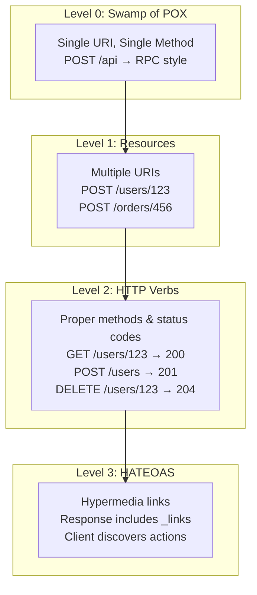
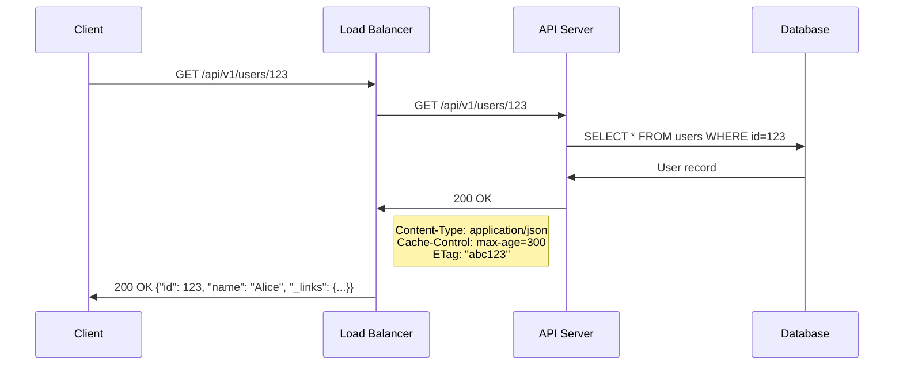
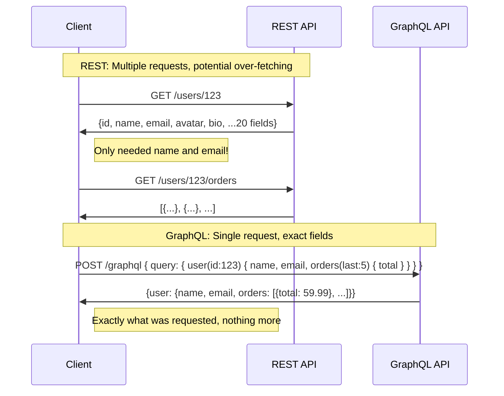

# REST — Representational State Transfer

## Overview

REST (Representational State Transfer) is an **architectural style** for designing networked applications, defined by Roy Fielding in his 2000 doctoral dissertation. It is not a protocol or a standard — it is a set of **constraints** that, when applied to web services, produce scalable, maintainable, and interoperable APIs. The vast majority of web APIs today are RESTful (or claim to be).

| Aspect | Detail |
|---|---|
| Creator | Roy Fielding (2000) |
| Type | Architectural style (not a protocol) |
| Transport | HTTP |
| Data Format | Typically JSON (also XML, YAML, etc.) |
| Statelessness | Required — each request is self-contained |
| Resource Identification | URIs (Uniform Resource Identifiers) |
| Standard | No official RFC; defined by constraints in Fielding's dissertation |

## Detailed Explanation

### The Six REST Constraints

For an API to be truly RESTful, it must satisfy **all six** constraints:

#### 1. Client-Server Architecture
The client and server are separated. The client handles the user interface; the server handles data storage and business logic. They communicate through a uniform interface.

```
Client (UI/Logic) ←── Uniform Interface ──→ Server (Data/Business Logic)

Benefits:
- Independent evolution (change UI without changing server)
- Separation of concerns
- Scalability (scale client and server independently)
```

#### 2. Statelessness
Each request from client to server must contain **all information** needed to understand and process the request. The server does not store any client context between requests.

```
Stateless:
  GET /orders/123
  Authorization: Bearer eyJhbGciOi...  ← Authentication in every request
  ← Server does NOT remember who you are between requests

Stateful (NOT RESTful):
  POST /login  {username, password}   ← Server creates session
  GET /orders/123                     ← Server uses stored session
  ← Server remembers client state
```

**Implications:**
- No server-side sessions
- Authentication must be in every request (tokens, API keys)
- Enables horizontal scaling (any server can handle any request)
- Trade-off: larger requests (must send auth/context every time)

#### 3. Cacheability
Responses must explicitly indicate whether they are cacheable or not. This prevents clients from reusing stale data.

```
Cache-Control: max-age=3600         ← Cache for 1 hour
Cache-Control: no-store             ← Never cache
ETag: "abc123"                      ← Cache validator
Last-Modified: Wed, 21 Oct 2024...  ← Cache validator

Cacheable: GET /products/123        ← Safe to cache
Not cacheable: POST /orders         ← Side effects, don't cache
```

#### 4. Uniform Interface
The defining constraint of REST. All communication happens through a **standardized** interface with four sub-constraints:

**a) Resource Identification in Requests:**
Resources are identified by URIs.
```
/users/123          → User resource
/users/123/orders   → Orders of user 123
/products/456       → Product resource
```

**b) Resource Manipulation Through Representations:**
Clients hold a *representation* of the resource (JSON, XML), not the resource itself. To modify a resource, the client sends a representation back.

```
GET /users/123
→ Response: {"id": 123, "name": "Alice", "email": "alice@example.com"}

PUT /users/123
→ Body: {"id": 123, "name": "Alice Smith", "email": "alice@new.com"}
```

**c) Self-Descriptive Messages:**
Each message contains enough information to describe how to process it.
```
Content-Type: application/json    ← How to parse the body
Accept: application/json          ← What format the client wants
```

**d) HATEOAS (Hypermedia as the Engine of Application State):**
Responses include links that tell the client what actions are available next.

#### 5. Layered System
The architecture is composed of hierarchical layers. A client cannot tell whether it is connected directly to the end server or to an intermediary.

```
Client → Load Balancer → API Gateway → Cache → Application Server → Database

Client doesn't know (or care) about the layers in between.
```

#### 6. Code on Demand (Optional)
Servers can extend client functionality by sending executable code (e.g., JavaScript). This is the **only optional** constraint.

### HATEOAS — Hypermedia as the Engine of Application State

HATEOAS is the most overlooked REST constraint. It means responses include **hypermedia links** that guide the client through available actions.

```json
// GET /orders/123
{
  "id": 123,
  "status": "processing",
  "total": 59.99,
  "items": [
    {"product": "Widget", "quantity": 2, "price": 29.99}
  ],
  "_links": {
    "self": {"href": "/orders/123"},
    "cancel": {"href": "/orders/123/cancel", "method": "POST"},
    "payment": {"href": "/orders/123/payment"},
    "customer": {"href": "/users/456"}
  }
}
```

**Why HATEOAS matters:**
- Clients discover actions dynamically (no hardcoded URLs)
- Server can change URL structure without breaking clients
- API is self-documenting
- Client state transitions are driven by server-provided links

**Reality check:** Very few production APIs fully implement HATEOAS. Most "REST APIs" are actually "HTTP APIs" or "RPC over HTTP."

### Richardson Maturity Model

Leonard Richardson proposed a model to classify how "RESTful" an API is:

```
Level 0: The Swamp of POX (Plain Old XML)
  - Single URI, single HTTP method
  - Everything is POST
  - Essentially RPC over HTTP

  POST /api
  <action>getUser</action>
  <userId>123</userId>

Level 1: Resources
  - Separate URIs for different resources
  - Still using single HTTP method

  POST /users/123
  <action>get</action>

Level 2: HTTP Verbs
  - Proper use of HTTP methods (GET, POST, PUT, DELETE)
  - Proper status codes (200, 201, 404, etc.)
  - This is where MOST "REST APIs" actually are

  GET /users/123           → 200 OK
  POST /users              → 201 Created
  PUT /users/123           → 200 OK
  DELETE /users/123        → 204 No Content

Level 3: HATEOAS
  - Responses include hypermedia links
  - Client navigates the API through links
  - True REST (as Fielding defined it)

  GET /users/123
  {
    "name": "Alice",
    "_links": {
      "self": "/users/123",
      "orders": "/users/123/orders",
      "edit": {"href": "/users/123", "method": "PUT"}
    }
  }
```

### HTTP Methods and CRUD Operations

| HTTP Method | CRUD Operation | Idempotent | Safe | Example |
|---|---|---|---|---|
| GET | Read | Yes | Yes | `GET /users/123` |
| POST | Create | No | No | `POST /users` |
| PUT | Update (replace) | Yes | No | `PUT /users/123` |
| PATCH | Update (partial) | No* | No | `PATCH /users/123` |
| DELETE | Delete | Yes | No | `DELETE /users/123` |
| HEAD | Read headers | Yes | Yes | `HEAD /users/123` |
| OPTIONS | Allowed methods | Yes | Yes | `OPTIONS /users/123` |

**Idempotent:** Multiple identical requests produce the same result as a single request.
**Safe:** The request does not modify the resource.

### Status Codes

```
1xx: Informational
  100 Continue
  101 Switching Protocols

2xx: Success
  200 OK                    ← Successful GET, PUT, PATCH
  201 Created               ← Successful POST (include Location header)
  202 Accepted              ← Request accepted for async processing
  204 No Content            ← Successful DELETE (no body)

3xx: Redirection
  301 Moved Permanently
  302 Found
  304 Not Modified          ← Cached version is still valid

4xx: Client Error
  400 Bad Request           ← Invalid input
  401 Unauthorized          ← Authentication required
  403 Forbidden             ← Authenticated but not authorized
  404 Not Found             ← Resource doesn't exist
  405 Method Not Allowed
  409 Conflict              ← Resource state conflict
  422 Unprocessable Entity  ← Validation errors
  429 Too Many Requests     ← Rate limited

5xx: Server Error
  500 Internal Server Error ← Unhandled exception
  502 Bad Gateway           ← Upstream service error
  503 Service Unavailable   ← Server overloaded/maintenance
  504 Gateway Timeout
```

### URL Design Best Practices

```
✅ Good:
  /users                    → Collection of users
  /users/123                → Specific user
  /users/123/orders         → Orders of user 123
  /users/123/orders/456     → Specific order of user 123
  /products?category=electronics&sort=price  → Filtering & sorting

❌ Bad:
  /getUsers                 → Verb in URL (not RESTful)
  /user                     → Inconsistent pluralization
  /users/123/delete         → Action in URL (use DELETE method)
  /api/v1/getUserById?id=123 → RPC style, not REST

Rules:
- Use nouns, not verbs
- Use plural nouns consistently
- Use nested resources for relationships
- Use query parameters for filtering, sorting, pagination
- Version your API: /api/v1/users or Accept header
```

### REST vs GraphQL

| Aspect | REST | GraphQL |
|---|---|---|
| Endpoints | Multiple (one per resource) | Single (`/graphql`) |
| Data Fetching | Fixed structure per endpoint | Client specifies exact fields |
| Over-fetching | Common (extra fields) | Eliminated |
| Under-fetching | Common (need multiple requests) | Eliminated (single query) |
| Caching | HTTP caching (simple) | Complex (query-level) |
| Versioning | URL/header versioning | Schema evolution (no versions) |
| File Upload | Native (multipart/form-data) | Multipart spec (less standard) |
| Real-time | WebSocket (separate) | Subscriptions (built-in) |
| Learning Curve | Low | Higher |
| Tooling | Universal | Maturing |
| Error Handling | HTTP status codes | Always 200, errors in body |

**GraphQL query example:**
```graphql
# Single request gets exactly what's needed
query {
  user(id: 123) {
    name
    email
    orders(last: 5) {
      total
      status
    }
  }
}
```

**Equivalent REST calls:**
```
GET /users/123          → Get user (may include extra fields)
GET /users/123/orders?limit=5  → Get orders (separate request)
```

### Error Response Format

```json
// Consistent error structure
{
  "error": {
    "code": "VALIDATION_ERROR",
    "message": "Invalid input data",
    "details": [
      {
        "field": "email",
        "message": "Must be a valid email address"
      },
      {
        "field": "age",
        "message": "Must be between 0 and 150"
      }
    ],
    "timestamp": "2024-01-15T10:30:00Z",
    "requestId": "req_abc123"
  }
}
```

## Diagrams

### Richardson Maturity Model



### REST Request-Response Flow



### REST vs GraphQL Data Fetching



### REST API Resource Relationship

```mermaid
graph TB
    USERS[/users<br/>Collection] --> USER1[/users/123<br/>Resource]
    USERS --> USER2[/users/456<br/>Resource]
    USER1 --> ORDERS[/users/123/orders<br/>Sub-collection]
    ORDERS --> ORDER1[/users/123/orders/789<br/>Resource]
    ORDER1 --> ITEMS[/users/123/orders/789/items<br/>Sub-collection]
    PRODUCTS[/products<br/>Collection] --> PRODUCT1[/products/101<br/>Resource]
    ORDER1 -.->|references| PRODUCT1
```

## Interview Questions

### Q1: What are the six constraints of REST?
**A:**
1. **Client-Server** — Separation of concerns between UI and data/business logic
2. **Stateless** — Each request contains all necessary information; no server-side session
3. **Cacheable** — Responses indicate cacheability to improve performance
4. **Uniform Interface** — Standardized way to interact with resources (URIs, representations, self-descriptive messages, HATEOAS)
5. **Layered System** — Client cannot tell if connected directly or through intermediaries
6. **Code on Demand** (optional) — Server can send executable code to extend client

### Q2: What is HATEOAS and why is it important?
**A:** HATEOAS means responses include hypermedia links that tell the client what actions are available. For example, an order response might include links for "cancel," "pay," or "track." This allows clients to navigate the API dynamically without hardcoded URLs. In practice, most APIs don't fully implement HATEOAS, but it represents the ideal of a self-describing, evolvable API.

### Q3: What is the difference between PUT and PATCH?
**A:**
- **PUT** replaces the **entire resource**. If you omit a field, it may be set to null/default. PUT is **idempotent** — sending the same PUT multiple times produces the same result.
- **PATCH** applies a **partial update**. You send only the fields to change. PATCH is **not necessarily idempotent** (though it can be).

```json
// PUT /users/123 (replace entire user)
{"name": "Alice", "email": "alice@new.com"}  // age is now null

// PATCH /users/123 (update email only)
{"email": "alice@new.com"}  // name and age unchanged
```

### Q4: Explain the Richardson Maturity Model.
**A:** It classifies APIs on a scale from 0 to 3:
- **Level 0** — Single endpoint, single method (RPC over HTTP)
- **Level 1** — Multiple URIs for different resources
- **Level 2** — Proper HTTP methods and status codes (where most "REST" APIs are)
- **Level 3** — HATEOAS with hypermedia links (true REST per Fielding's definition)

Most production APIs are at Level 2. Full Level 3 (HATEOAS) adoption is rare.

### Q5: When would you choose GraphQL over REST?
**A:** Choose GraphQL when:
- Clients need **different data shapes** for different views (mobile vs desktop)
- You want to eliminate **over-fetching** (getting more data than needed) and **under-fetching** (needing multiple requests)
- Your data is highly **interconnected** (graph-like relationships)
- You need a **strong type system** and schema-first development
- Multiple teams consume the same API with different needs

Choose REST when:
- You have simple, resource-oriented CRUD operations
- HTTP caching is important
- File uploads are common
- Your team is more familiar with REST
- You need maximum interoperability

### Q6: How do you version a REST API?
**A:** Common approaches:
1. **URL versioning** — `/api/v1/users`, `/api/v2/users` (most common, explicit)
2. **Header versioning** — `Accept: application/vnd.myapi.v2+json`
3. **Query parameter** — `/users?version=2` (less common)
4. **Custom header** — `X-API-Version: 2`

Best practices: Support old versions for a deprecation period, use semantic versioning, document breaking changes, and provide migration guides.

## Common Mistakes

1. **Using verbs in URLs** — `/getUsers`, `/createOrder` is RPC, not REST. Use nouns: `GET /users`, `POST /orders`.

2. **Ignoring HTTP status codes** — Returning 200 for everything with `{"success": true/false}` wastes HTTP's built-in semantics. Use 201 for creation, 204 for deletion, 404 for not found, etc.

3. **Not using proper HTTP methods** — Using `POST /deleteUser/123` instead of `DELETE /users/123`. HTTP methods have specific semantics.

4. **Over-nesting resources** — `/users/123/orders/456/items/789/reviews/101` is too deep. Keep nesting to 2-3 levels max. Use top-level resources with filters: `GET /reviews?item_id=789`.

5. **Not paginating collection responses** — `GET /users` returning millions of records will crash your server and client. Always paginate: `GET /users?page=1&limit=20`.

6. **Confusing 401 and 403** — 401 = "I don't know who you are" (unauthenticated). 403 = "I know who you are, but you can't do this" (unauthorized).

7. **Not making PUT idempotent** — If `PUT /users/123` creates a new resource on the first call and fails on the second, it's not idempotent. Ensure repeated PUT requests produce the same result.

8. **Breaking the statelessness constraint** — Storing session state on the server and relying on it for request processing violates REST. Use tokens (JWT) for stateless authentication.

## Summary

| Aspect | Key Takeaway |
|---|---|
| Definition | Architectural style, not a protocol |
| Constraints | Client-server, stateless, cacheable, uniform interface, layered, code-on-demand |
| HATEOAS | Responses include hypermedia links for discoverability |
| Richardson Model | Levels 0-3; most APIs are Level 2 |
| Methods | GET (read), POST (create), PUT (replace), PATCH (partial), DELETE (remove) |
| vs GraphQL | REST is resource-oriented; GraphQL is query-oriented |
| Best Practices | Nouns in URLs, proper status codes, pagination, versioning |

REST's simplicity, HTTP-native design, and broad tooling support have made it the dominant API paradigm. While GraphQL offers advantages for complex data needs, REST remains the default choice for most web services.

## Cross-References

- **[GraphQL (within this page)](#rest-vs-graphql)** — Comparison with the query-oriented alternative
- **[gRPC](./grpc.md)** — RPC-style alternative with protobuf and streaming
- **[HTTPS / TLS](./https.md)** — Securing REST APIs with TLS
- **[HTTP/2](./http2.md)** — HTTP/2 benefits for REST (multiplexing, header compression)
- **[WebSocket](./websocket.md)** — Real-time alternatives to REST polling
- **[HTTP Status Codes](./status-codes.md)** — Detailed status code reference

## Cross References

- [gRPC](grpc.md)
- [HTTP/1.1](http1.md)
- [API Gateways](../../distributed/microservices/api-gateways.md)
- [Microservices](../../distributed/microservices/README.md)
