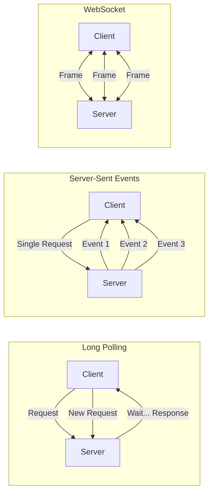
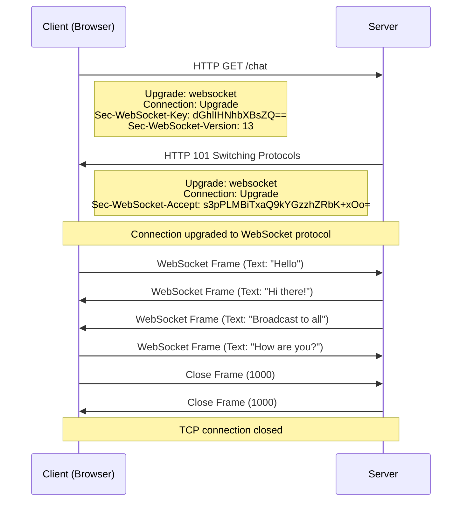
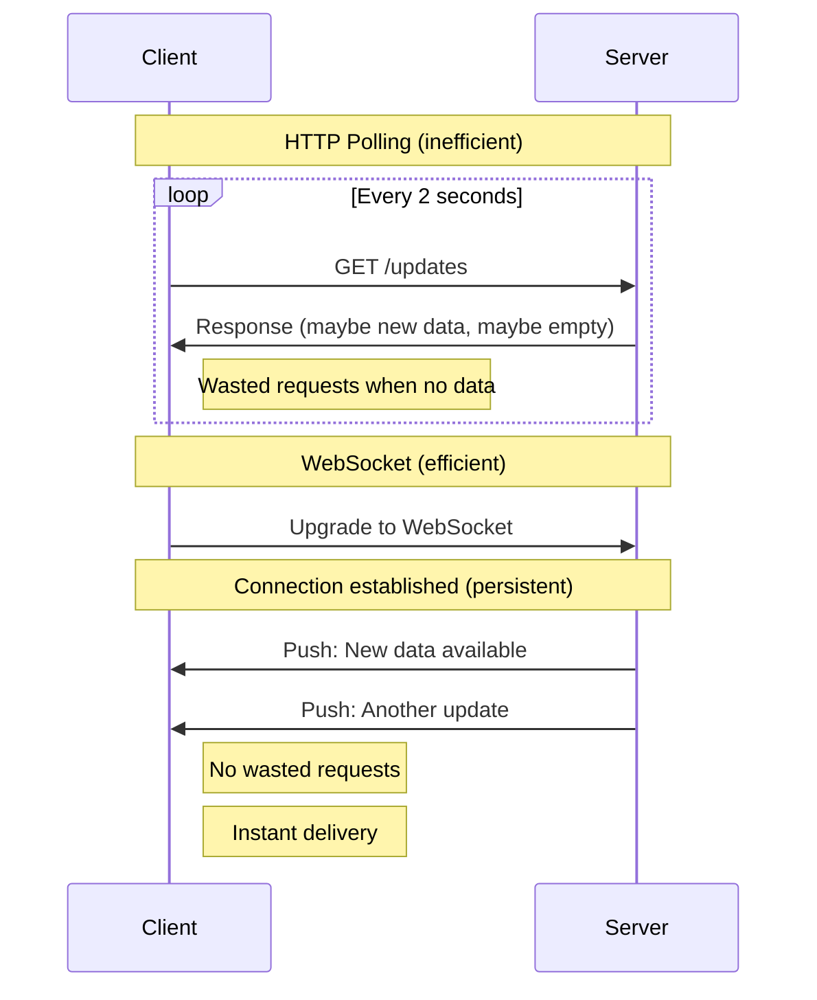
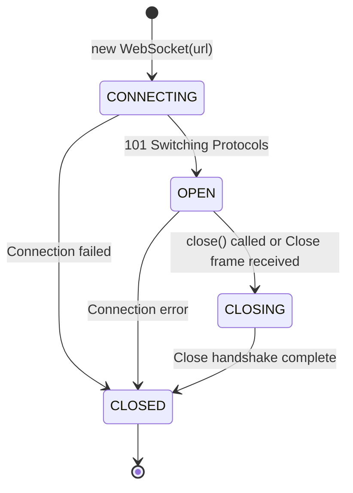
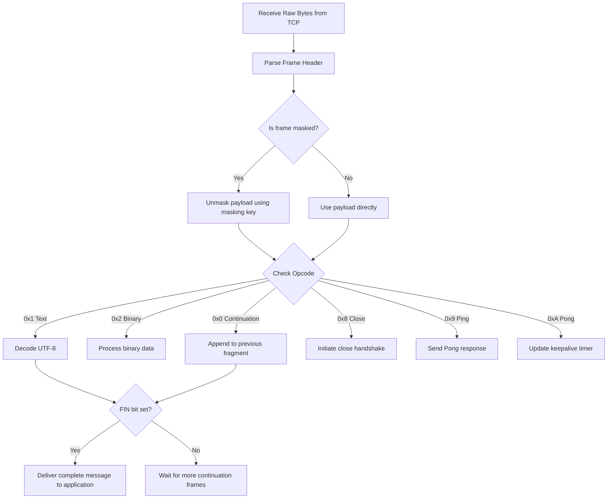

# WebSocket — Full-Duplex Communication

## Overview

WebSocket is a communication protocol that provides **full-duplex, bidirectional** communication over a single TCP connection. Defined in **RFC 6455** (2011), it enables real-time data transfer between client and server without the overhead of repeated HTTP requests. Unlike HTTP's request-response model, WebSocket allows **either side** to send data at any time once the connection is established.

| Feature | HTTP | WebSocket | SSE (Server-Sent Events) |
|---|---|---|---|
| Direction | Client → Server (request-response) | Bidirectional | Server → Client only |
| Connection | New per request (or reused) | Persistent, single | Persistent, single |
| Protocol | `http://` / `https://` | `ws://` / `wss://` | `http://` / `https://` |
| Overhead | Headers per request | Minimal frames after handshake | Headers per event |
| Real-time | Polling required | Native | Native (server push) |
| Binary Support | Yes (via body) | Yes (native frames) | No (text only) |
| Auto-reconnect | N/A | Manual implementation | Built-in (`EventSource`) |

## Detailed Explanation

### The WebSocket Handshake

WebSocket starts with an **HTTP Upgrade** request. This is the only HTTP exchange — after that, the protocol switches to WebSocket frames.

```
Client → Server (HTTP Upgrade Request):
GET /chat HTTP/1.1
Host: example.com
Upgrade: websocket
Connection: Upgrade
Sec-WebSocket-Key: dGhlIHNhbXBsZSBub25jZQ==
Sec-WebSocket-Version: 13
Origin: https://example.com
Sec-WebSocket-Protocol: chat, superchat
Sec-WebSocket-Extensions: permessage-deflate

Server → Client (HTTP 101 Switching Protocols):
HTTP/1.1 101 Switching Protocols
Upgrade: websocket
Connection: Upgrade
Sec-WebSocket-Accept: s3pPLMBiTxaQ9kYGzzhZRbK+xOo=
Sec-WebSocket-Protocol: chat
```

**Key handshake details:**
- `Sec-WebSocket-Key` — Random base64-encoded nonce (client-generated)
- `Sec-WebSocket-Accept` — Server computes `SHA1(key + "258EAFA5-E914-47DA-95CA-C5AB0DC85B11")` and base64-encodes it. This proves the server understands WebSocket.
- `Sec-WebSocket-Version` — Must be 13 (the RFC version)
- `Sec-WebSocket-Protocol` — Subprotocol negotiation (optional)
- `Sec-WebSocket-Extensions` — Extension negotiation (e.g., compression)

### WebSocket Frame Format

After the handshake, communication uses binary frames:

```
Frame Format:
 0                   1                   2                   3
 0 1 2 3 4 5 6 7 8 9 0 1 2 3 4 5 6 7 8 9 0 1 2 3 4 5 6 7 8 9 0 1
+-+-+-+-+-------+-+-------------+-------------------------------+
|F|R|R|R| opcode|M| Payload len |    Extended payload length    |
|I|S|S|S|  (4)  |A|     (7)     |           (16/64)             |
|N|V|V|V|       |S|             |   (if payload len==126/127)   |
| |1|2|3|       |K|             |                               |
+-+-+-+-+-------+-+-------------+ - - - - - - - - - - - - - - - +
|     Extended payload length continued, if payload len == 127  |
+ - - - - - - - - - - - - - - - +-------------------------------+
|                               | Masking-key, if MASK set to 1 |
+-------------------------------+-------------------------------+
| Masking-key (continued)       |          Payload Data         |
+-------------------------------- - - - - - - - - - - - - - - - +
:                     Payload Data continued ...                :
+ - - - - - - - - - - - - - - - - - - - - - - - - - - - - - - - +
|                     Payload Data (continued)                  |
+---------------------------------------------------------------+
```

**Frame Fields:**
| Field | Bits | Description |
|---|---|---|
| FIN | 1 | 1 = final fragment of a message |
| RSV1-3 | 3 | Reserved (used by extensions like compression) |
| Opcode | 4 | Frame type |
| MASK | 1 | 1 = payload is masked (client→server MUST be masked) |
| Payload Length | 7/7+16/7+64 | Length of payload data |
| Masking Key | 32 | XOR mask (if MASK=1) |
| Payload | Variable | Application data |

**Opcodes:**
| Opcode | Type | Description |
|---|---|---|
| 0x0 | Continuation | Continuation frame |
| 0x1 | Text | UTF-8 text data |
| 0x2 | Binary | Binary data |
| 0x8 | Close | Connection close |
| 0x9 | Ping | Heartbeat request |
| 0xA | Pong | Heartbeat response |

### Message Fragmentation

Large messages can be split across multiple frames:

```
Sending "Hello, World!" in fragments:

Frame 1: FIN=0, Opcode=0x1 (Text), Payload="Hello, "
Frame 2: FIN=0, Opcode=0x0 (Continuation), Payload="World"
Frame 3: FIN=1, Opcode=0x0 (Continuation), Payload="!"

Receiver concatenates payloads to reconstruct "Hello, World!"
```

### Masking

All frames from **client to server** MUST be masked with a random 32-bit key. This prevents **cache poisoning attacks** on intermediary proxies.

```
Masking algorithm:
masked_byte[i] = original_byte[i] XOR masking_key[i % 4]

Client sends:     [0x48, 0x65, 0x6C, 0x6C, 0x6F]  ("Hello")
Masking key:      [0x37, 0xFA, 0x21, 0x3D]
Masked payload:   [0x7F, 0x9F, 0x4D, 0x51, 0x58]

Server unmasks:   XOR same key → "Hello"
```

Server-to-client frames are **NOT masked**.

### Connection Lifecycle

```
States:
CONNECTING → OPEN → CLOSING → CLOSED
    ↑                               |
    └───────────────────────────────┘

1. CONNECTING: HTTP Upgrade handshake in progress
2. OPEN: Handshake complete, bidirectional communication
3. CLOSING: Close frame sent/received, waiting for acknowledgment
4. CLOSED: Connection terminated
```

### Ping/Pong (Keep-Alive)

WebSocket has built-in heartbeat frames:
- Either side can send a **Ping** frame
- The other side MUST respond with a **Pong** frame
- Used to detect dead connections and keep NAT/proxy mappings alive

```
Client → Server: Ping (opcode 0x9, payload: timestamp)
Server → Client: Pong (opcode 0xA, payload: same timestamp)

If no Pong received within timeout → connection is dead
```

### Close Handshake

```
Graceful Close:
Client → Server: Close frame (opcode 0x8, status code + reason)
Server → Client: Close frame (opcode 0x8, status code + reason)
TCP connection closed

Close Status Codes:
  1000 - Normal closure
  1001 - Going away (page unloaded, server shutting down)
  1002 - Protocol error
  1003 - Unsupported data type
  1006 - Abnormal closure (no close frame received)
  1007 - Invalid frame payload data
  1008 - Policy violation
  1009 - Message too big
  1011 - Server error
  1012-2999 - Reserved
  3000-3999 - Registered by libraries
  4000-4999 - Private use
```

### WebSocket vs SSE vs Long Polling



**When to use what:**

| Use Case | Best Choice | Why |
|---|---|---|
| Live chat | WebSocket | Bidirectional, low latency |
| Stock ticker | SSE or WebSocket | Server pushes updates |
| Notifications | SSE | Simple, auto-reconnect |
| Multiplayer game | WebSocket | Bidirectional, binary support |
| Form submission | HTTP | Request-response is fine |
| IoT telemetry | WebSocket | Persistent, efficient |
| Live dashboard | SSE | Server pushes data, simpler |

### Subprotocols

WebSocket supports **subprotocol negotiation** during the handshake:

```
Client: Sec-WebSocket-Protocol: graphql-ws, graphql-transport-ws
Server: Sec-WebSocket-Protocol: graphql-transport-ws

Common subprotocols:
- graphql-ws / graphql-transport-ws — GraphQL subscriptions
- wamp — Web Application Messaging Protocol
- stomp — Simple Text Oriented Messaging Protocol
- mqtt — Message Queuing Telemetry Transport (over WebSocket)
```

### Extensions

```
Client: Sec-WebSocket-Extensions: permessage-deflate; client_max_window_bits
Server: Sec-WebSocket-Extensions: permessage-deflate

permessage-deflate: Compresses frames using zlib/deflate
  - Can significantly reduce bandwidth for text-heavy payloads
  - Both sides negotiate compression parameters
```

## Diagrams

### WebSocket Handshake Flow



### WebSocket vs HTTP Polling



### WebSocket Connection State Machine



### Frame Processing Flow



## Interview Questions

### Q1: How does WebSocket differ from HTTP?
**A:** HTTP is **half-duplex** (request-response): the client sends a request, the server sends a response, then the connection is typically closed or returned to a pool. WebSocket is **full-duplex**: after an initial HTTP handshake ("Upgrade"), both client and server can send messages at any time over a persistent connection. WebSocket has much lower overhead per message (no HTTP headers) and lower latency (no request-response cycle).

### Q2: Why does the WebSocket handshake use HTTP?
**A:** The HTTP Upgrade mechanism is used for **compatibility** with existing infrastructure (proxies, load balancers, firewalls). By starting as an HTTP request, WebSocket can traverse the same infrastructure that handles regular web traffic. The `Upgrade: websocket` header signals the protocol switch. This also means WebSocket works through port 80/443 without special firewall rules.

### Q3: Why must client-to-server WebSocket frames be masked?
**A:** Masking prevents **cache poisoning attacks** against intermediary proxies. Without masking, an attacker could craft WebSocket frames that look like valid HTTP responses to a proxy, causing the proxy to cache malicious content. The random masking key ensures the payload on the wire doesn't contain predictable byte sequences. Server-to-client frames don't need masking because the server is trusted.

### Q4: How do you handle WebSocket reconnection?
**A:** WebSocket has no built-in reconnection. You must implement it manually:
```javascript
function connect() {
    const ws = new WebSocket(url);
    ws.onclose = (event) => {
        if (!event.wasClean) {
            // Exponential backoff: 1s, 2s, 4s, 8s...
            const delay = Math.min(1000 * 2 ** retries, 30000);
            setTimeout(connect, delay);
            retries++;
        }
    };
    ws.onopen = () => { retries = 0; };
}
```
Key considerations: exponential backoff, jitter, message queueing during disconnection, and resuming from last known state.

### Q5: When would you choose SSE over WebSocket?
**A:** Choose SSE when:
- Data flows **server → client only** (no client-to-server messages needed)
- You want **automatic reconnection** built into the browser
- You're working with **text-only** data
- Simplicity matters (SSE is just an HTTP endpoint)
- You need HTTP/2 multiplexing (SSE shares the connection with other requests)

Choose WebSocket when you need **bidirectional** communication, **binary** data support, or **lower latency**.

### Q6: Can WebSocket work with load balancers?
**A:** Yes, but with considerations:
- The initial HTTP handshake goes through the load balancer normally
- Once upgraded, the **persistent TCP connection** must stay pinned to the same backend server
- L4 (TCP) load balancers work naturally (they forward TCP connections)
- L7 (HTTP) load balancers must support WebSocket and maintain connection affinity
- **Sticky sessions** or consistent hashing on the client IP helps ensure connections reach the same server
- Health checks must account for long-lived WebSocket connections

## Common Mistakes

1. **Not handling reconnection** — WebSocket connections will drop (network issues, server restarts, load balancer timeouts). Always implement reconnection with exponential backoff.

2. **Forgetting heartbeat/ping-pong** — Without keep-alive, NAT timeouts and load balancers may silently close idle connections. Implement ping/pong or application-level heartbeats.

3. **Not securing WebSocket** — Use `wss://` (WebSocket over TLS) in production. Unencrypted `ws://` is vulnerable to eavesdropping and MITM attacks.

4. **Sending too-large messages** — WebSocket has no built-in message size limit. Set server-side limits and handle fragmentation. Very large messages can cause memory issues.

5. **Using WebSocket for request-response** — If you only need request-response patterns, HTTP/2 is more appropriate. WebSocket's persistent connection wastes resources for infrequent requests.

6. **Not handling binary vs text frames** — Sending binary data as text (base64) wastes bandwidth. Use binary frames for non-text data.

7. **Ignoring backpressure** — If one side sends data faster than the other can process, buffers grow unbounded. Implement flow control at the application level.

8. **Cross-origin issues** — WebSocket doesn't enforce same-origin policy like HTTP. Validate the `Origin` header server-side to prevent unauthorized connections.

## Summary

| Aspect | Key Takeaway |
|---|---|
| Protocol | Full-duplex, bidirectional over single TCP connection |
| Handshake | HTTP Upgrade (101 Switching Protocols) |
| Frame Format | 2-14 byte header + payload, opcode-based |
| Masking | Client→server frames must be masked |
| Security | Use `wss://` (TLS), validate Origin header |
| Keep-Alive | Ping/pong frames for connection health |
| vs SSE | WebSocket is bidirectional; SSE is server→client only |
| vs HTTP Polling | WebSocket eliminates overhead of repeated requests |

WebSocket is the go-to protocol for real-time, bidirectional web communication. Its ability to maintain a persistent, low-overhead connection makes it ideal for chat applications, live dashboards, multiplayer games, and collaborative editing tools.

## Cross-References

- **[HTTP/2](./http2.md)** — HTTP/2 Server Push vs WebSocket for server-initiated data
- **[HTTP/3 & QUIC](./http3.md)** — How QUIC's multiplexing compares to WebSocket's single-stream approach
- **[HTTPS / TLS](./https.md)** — Securing WebSocket with `wss://`
- **[TCP & UDP](../tcp-udp.md)** — WebSocket runs on TCP; understanding TCP's role
- **[gRPC](./grpc.md)** — gRPC streaming as an alternative to WebSocket
- **[REST](./rest.md)** — When request-response is sufficient vs when WebSocket is needed
