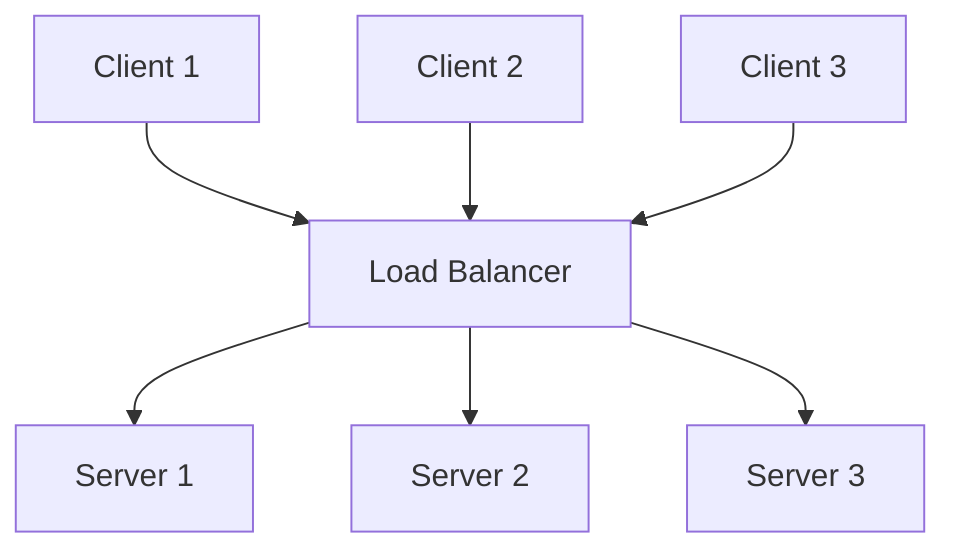

# Load Balancing

Load balancing distributes incoming network traffic across multiple servers to ensure no single server bears too much demand. It improves **availability**, **scalability**, and **performance** of applications.

## Overview

When a client sends a request, the load balancer decides which backend server should handle it. This is transparent to the client — they see a single IP address.

## Why Load Balancing Matters

- **High availability**: If a server fails, traffic is routed to healthy servers
- **Scalability**: Add more servers behind the load balancer as traffic grows
- **Performance**: Distributes load so no single server is overwhelmed
- **SSL termination**: Offload encryption/decryption from backend servers
- **Session persistence**: Route related requests to the same server

## Load Balancer Types

| Type | Layer | Examples | Use Case |
|------|-------|----------|----------|
| **Layer 4 (Transport)** | TCP/UDP | HAProxy, AWS NLB, LVS | High throughput, low latency |
| **Layer 7 (Application)** | HTTP/HTTPS | Nginx, AWS ALB, Envoy | Content-based routing, SSL offload |
| **DNS-based** | DNS | Route 53, Cloudflare | Geographic distribution |
| **Hardware** | L4/L7 | F5 BIG-IP, Citrix ADC | Enterprise data centers |

## Key Concepts

- **Virtual IP (VIP)**: The IP address clients connect to
- **Backend pool**: Group of servers behind the load balancer
- **Health checks**: Periodic probes to verify server availability
- **Session affinity (sticky sessions)**: Route same client to same server
- **SSL offloading**: Terminate TLS at the load balancer
- **Connection draining**: Gracefully remove servers from rotation

## Interview Questions

1. **Q: What's the difference between L4 and L7 load balancing?**
   A: L4 load balancers route based on IP/port (TCP/UDP level) — fast, no content inspection. L7 load balancers inspect HTTP headers, URLs, cookies — slower but more flexible (content routing, caching, compression).

2. **Q: What is a health check?**
   A: A periodic probe (HTTP GET, TCP connect, or custom script) to verify a server is responsive. If a server fails health checks, the load balancer stops sending traffic to it until it recovers.

3. **Q: What is session affinity?**
   A: Also called sticky sessions — ensuring a client's requests go to the same backend server. Implemented via cookies, IP hash, or custom headers. Necessary for stateful applications but reduces fault tolerance.

## Summary

Load balancing is essential for scalable, highly available systems. The choice between L4 and L7, the algorithm used, and the ability to handle health checks and session persistence are all key interview topics.

## Cross-References

- [L4 vs L7](l4-vs-l7.md)
- [Algorithms](algorithms.md)
- [Reverse Proxy](reverse-proxy.md)
- [CDN](../cdn/README.md)
- [BGP](../routing/bgp.md) — BGP load balancing

## Cross References

- [Algorithms](algorithms.md)
- [L4 vs L7](l4-vs-l7.md)
- [Reverse Proxy](reverse-proxy.md)
- [Consistent Hashing](../../distributed/partitioning/consistent-hashing.md)
- [Service Discovery](../../distributed/microservices/discovery.md)
