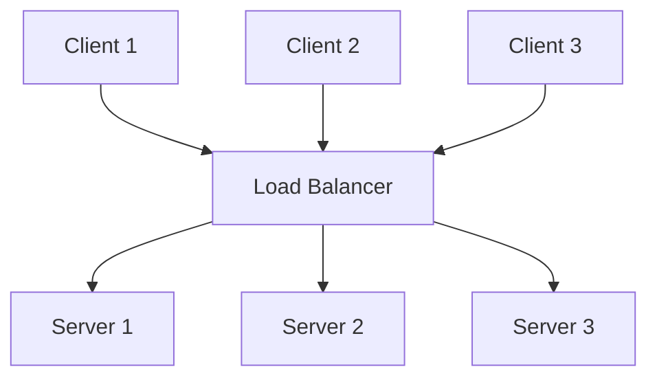
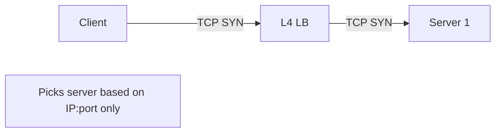
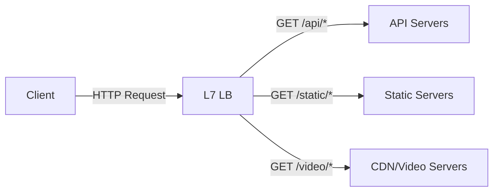
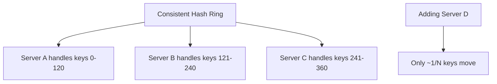
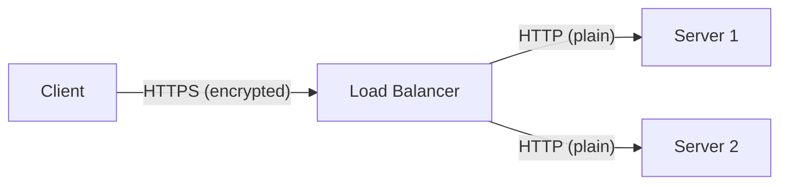
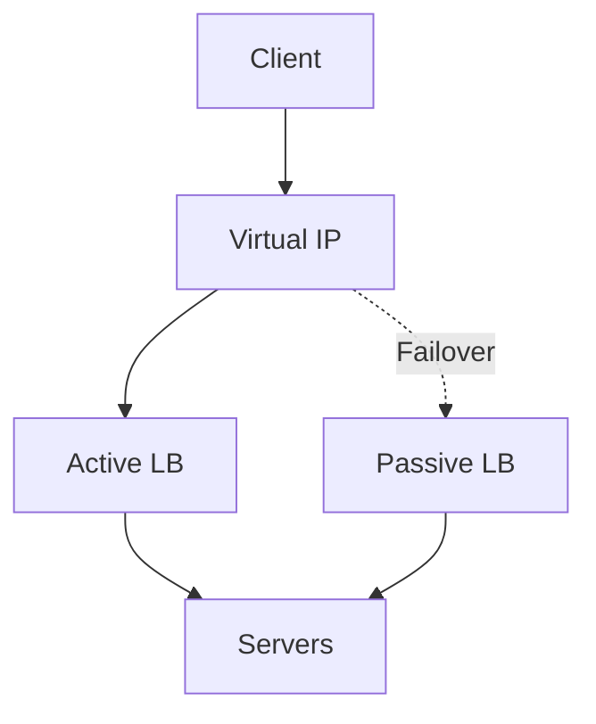
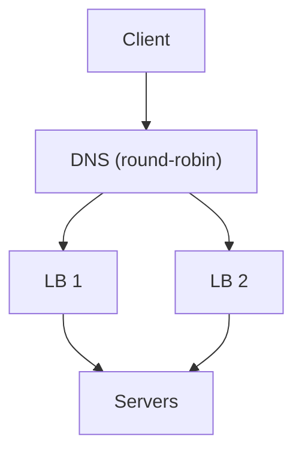

# Load Balancing

Load balancing distributes incoming network traffic across multiple servers to ensure no single server bears too much demand. It improves **availability**, **scalability**, and **performance** of applications. Load balancers are a foundational component of any production system serving significant traffic.

## Overview

When a client sends a request, the load balancer decides which backend server should handle it. This is transparent to the client — they see a single IP address.



## Why Load Balancing Matters

- **High availability**: If a server fails, traffic is routed to healthy servers
- **Scalability**: Add more servers behind the load balancer as traffic grows
- **Performance**: Distributes load so no single server is overwhelmed
- **SSL termination**: Offload encryption/decryption from backend servers
- **Session persistence**: Route related requests to the same server
- **Flexibility**: Blue-green deployments, canary releases, A/B testing

## Load Balancer Types

### Layer 4 (Transport) vs Layer 7 (Application)

| Aspect | L4 (Transport) | L7 (Application) |
|--------|----------------|-------------------|
| **Inspects** | IP + Port | HTTP headers, URL, cookies, body |
| **Speed** | Faster (less processing) | Slower (more inspection) |
| **Routing** | IP/port based | Content-based (URL, headers) |
| **SSL** | Pass through | Terminate and re-encrypt |
| **Use case** | High throughput, low latency | Content routing, API gateways |
| **Examples** | HAProxy (TCP), AWS NLB, LVS | Nginx, HAProxy (HTTP), AWS ALB, Envoy |

### L4 Load Balancing

Routes based on TCP/UDP information only. Doesn't inspect application data.



**Advantages**: Very fast, low overhead, works with any TCP/UDP protocol.
**Disadvantages**: No content-based routing, can't inspect HTTP headers.

### L7 Load Balancing

Inspects application-layer data for smarter routing decisions.



**Advantages**: Content-based routing, caching, compression, request modification.
**Disadvantages**: Higher latency, more CPU-intensive, terminates SSL.

### DNS-Based Load Balancing

Returns different IP addresses for the same domain.

```
example.com → 203.0.113.1 (US East)
example.com → 198.51.100.1 (EU West)
```

**Advantages**: Simple, geographic distribution.
**Disadvantages**: DNS TTL caching, no health checks at DNS level, slow failover.

---

## Algorithms

| Algorithm | How It Works | Best For |
|-----------|-------------|----------|
| **Round Robin** | Cyclic rotation through servers | Equal-capacity servers |
| **Weighted Round Robin** | More requests to higher-weight servers | Mixed-capacity servers |
| **Least Connections** | Route to server with fewest active connections | Varying request durations |
| **Weighted Least Connections** | Least connections adjusted by weight | Mixed capacity + varying duration |
| **IP Hash** | Hash client IP → consistent server | Session affinity |
| **Least Response Time** | Route to fastest-responding server | Latency-sensitive apps |
| **Random** | Random server selection | Simple, statistically even |
| **Resource-Based** | Route based on server CPU/memory metrics | Dynamic environments |

### Round Robin

```
Request 1 → Server A
Request 2 → Server B
Request 3 → Server C
Request 4 → Server A (cycle repeats)
```

Simple but doesn't account for server capacity or current load.

### Weighted Round Robin

```
Server A (weight 5): Gets 5/10 of requests
Server B (weight 3): Gets 3/10 of requests
Server C (weight 2): Gets 2/10 of requests
```

### Least Connections

```
Server A: 10 active connections → Skip
Server B: 3 active connections → Route here
Server C: 7 active connections → Skip
```

Better for requests with varying processing times (API calls, database queries).

### IP Hash

```
hash(client_ip) % num_servers = server_index
```

Ensures the same client always reaches the same server (session affinity without cookies).

### Consistent Hashing

A refinement that minimizes redistribution when servers are added/removed:



Used by: CDNs, distributed caches (Memcached, Redis Cluster), database sharding.

---

## Health Checks

Load balancers periodically probe backend servers to verify availability.

### Check Types

| Type | What It Does | When to Use |
|------|-------------|-------------|
| **TCP Connect** | Can we establish a TCP connection? | Simple L4 health check |
| **HTTP GET** | Does the server return 2xx? | Web servers |
| **HTTP POST** | Can the server handle requests? | API servers |
| **Custom Script** | Check disk, DB, dependencies | Complex health logic |

### Health Check Configuration

```yaml
health_check:
  protocol: HTTP
  port: 8080
  path: /health
  interval: 10s        # Check every 10 seconds
  timeout: 5s          # Fail if no response in 5s
  healthy_threshold: 2 # 2 consecutive successes = healthy
  unhealthy_threshold: 3 # 3 consecutive failures = unhealthy
  expected_status: 200
```

### Health Check Responses

| Status | Meaning | LB Action |
|--------|---------|-----------|
| **200 OK** | Healthy | Continue sending traffic |
| **503** | Unhealthy | Remove from rotation |
| **Timeout** | Unresponsive | Remove from rotation |

### Deep Health Checks

Basic checks verify the server is running. Deep checks verify it can actually serve requests:

```
GET /health/deep
→ Checks: Database connection ✓
→ Checks: Cache connection ✓
→ Checks: Disk space ✓
→ Returns 200 only if all pass
```

---

## Sticky Sessions (Session Affinity)

Route all requests from a specific client to the same backend server.

### Why Sticky Sessions?

- **Session state**: Server stores session data in memory (shopping cart, auth state)
- **Connection state**: WebSocket connections, database connections
- **Caching**: Server-local cache benefits from repeated requests

### Implementation Methods

| Method | How | Pros | Cons |
|--------|-----|------|------|
| **Cookie-based** | LB inserts cookie identifying server | Reliable, client-independent | Requires L7 |
| **IP Hash** | Hash client IP to server | Works at L4 | NAT breaks it (many clients = 1 IP) |
| **URL Parameter** | Route based on URL parameter | Flexible | Application must cooperate |
| **Custom Header** | Route based on header value | Very flexible | Requires L7 |

### Cookie-Based Example

```
Client → LB → Server A
Response: Set-Cookie: SERVERID=A; Path=/

Client → LB (cookie: SERVERID=A) → Server A
```

### Problems with Sticky Sessions

- **Uneven load**: Popular sessions can overload specific servers
- **Reduced fault tolerance**: If the server fails, session state is lost
- **Scaling difficulty**: Can't easily remove servers (session migration needed)

**Better alternative**: Store session state externally (Redis, database) so any server can handle any request.

---

## SSL/TLS Termination

The load balancer handles SSL encryption/decryption, so backend servers receive plain HTTP.



### Benefits

- **Offload CPU**: SSL handshakes are CPU-intensive; centralize at LB
- **Centralized certificates**: Manage certs in one place
- **Backend simplicity**: Servers handle plain HTTP

### SSL Passthrough

Alternative: LB passes encrypted traffic to backend (end-to-end encryption).


Use when: Backend needs to see client certificates, or you need end-to-end encryption for compliance.

---

## High Availability for Load Balancers

The load balancer itself is a single point of failure. Solutions:

### Active-Passive



- Heartbeat monitors active LB
- Passive takes over via VRRP/keepalived if active fails
- Failover time: seconds

### Active-Active



- Both LBs handle traffic
- DNS or Anycast distributes across them
- Better utilization, no idle standby

---

## Interview Questions

1. **Q: What's the difference between L4 and L7 load balancing?**
   A: L4 routes based on IP/port (TCP/UDP level) — fast, no content inspection. L7 inspects HTTP headers, URLs, cookies — slower but enables content-based routing, caching, compression, SSL termination. Use L4 for raw throughput (databases, game servers). Use L7 for web applications (URL routing, A/B testing).

2. **Q: What is a health check?**
   A: Periodic probe (HTTP GET, TCP connect, or custom script) to verify a server is responsive. If a server fails consecutive health checks, the LB removes it from rotation. Deep health checks verify dependencies (database, cache) too. Thresholds prevent flapping (e.g., 3 failures to remove, 2 successes to restore).

3. **Q: What is session affinity and why is it problematic?**
   A: Sticky sessions route a client's requests to the same server. Necessary when server stores session state in memory. Problems: uneven load distribution, reduced fault tolerance (server failure loses sessions), harder scaling. Better: externalize session state to Redis/database.

4. **Q: How would you handle 10x traffic growth?**
   A: (1) Add more servers behind the LB (horizontal scaling). (2) Use L7 LB for efficient routing. (3) Enable caching at the LB. (4) SSL termination at LB offloads backend. (5) CDN for static content. (6) Consider DNS-based geographic distribution. (7) Auto-scaling groups for elastic capacity.

5. **Q: What happens when a load balancer itself fails?**
   A: Single point of failure. Solutions: (1) Active-passive with VRRP/keepalived failover. (2) Active-active with DNS or Anycast. (3) Cloud-managed LBs (AWS ALB, GCP LB) that are inherently redundant. Failover time: seconds for active-passive, immediate for active-active.

6. **Q: Explain consistent hashing.**
   A: Maps both servers and keys to positions on a hash ring. A key is assigned to the next server clockwise on the ring. When a server is added/removed, only ~1/N of keys need remapping (vs 1/N for simple modular hashing). Used by CDNs, distributed caches, and database sharding.

7. **Q: Round Robin vs Least Connections — when to use which?**
   A: Round Robin when all servers have equal capacity and requests have similar duration. Least Connections when request durations vary (some take 10ms, others 10s) — it naturally balances load by sending new requests to less-busy servers. Weighted variants for mixed-capacity pools.

8. **Q: What is SSL termination and when would you not use it?**
   A: LB decrypts HTTPS, sends plain HTTP to backends. Benefits: CPU offload, centralized cert management. Don't use when: (1) compliance requires end-to-end encryption, (2) backends need client certificates, (3) you don't trust the internal network. Use SSL passthrough in those cases.

## Summary

Load balancing is essential for scalable, highly available systems. L4 vs L7 is the fundamental architectural choice. Algorithms range from simple (Round Robin) to sophisticated (Least Connections, Consistent Hashing). Health checks, session management, and SSL handling are critical operational concerns. The load balancer itself must be made highly available.

## Cross-References

- [L4 vs L7](l4-vs-l7.md)
- [Algorithms](algorithms.md)
- [Reverse Proxy](reverse-proxy.md)
- [CDN](../cdn/README.md)
- [BGP](../routing/bgp.md) — BGP load balancing
- [Consistent Hashing](../../distributed/partitioning/consistent-hashing.md)
- [Service Discovery](../../distributed/microservices/discovery.md)
- [DNS](../dns/README.md)

## References

- [Nginx Load Balancing](https://nginx.org/en/docs/http/load_balancing.html)
- [HAProxy Configuration Manual](https://www.haproxy.com/documentation/haproxy-configuration-manual/)
- [AWS ELB Documentation](https://docs.aws.amazon.com/elasticloadbalancing/)
- [Google Cloud Load Balancing](https://cloud.google.com/load-balancing)
- [Envoy Proxy](https://www.envoyproxy.io/)
- Kurose & Ross, *Computer Networking*, Chapter 4: Network Layer
- [Consistent Hashing Paper](https://www.cs.princeton.edu/courses/archive/fall07/cos518/papers/chash.pdf) — Karger et al.
