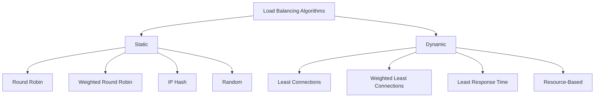
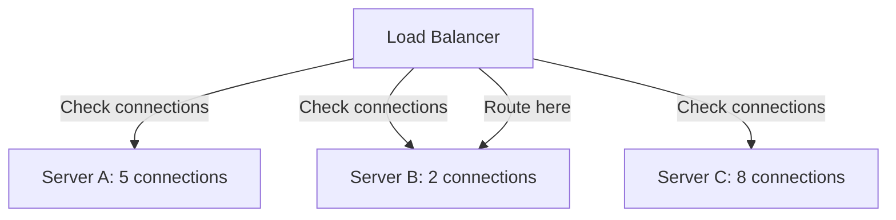
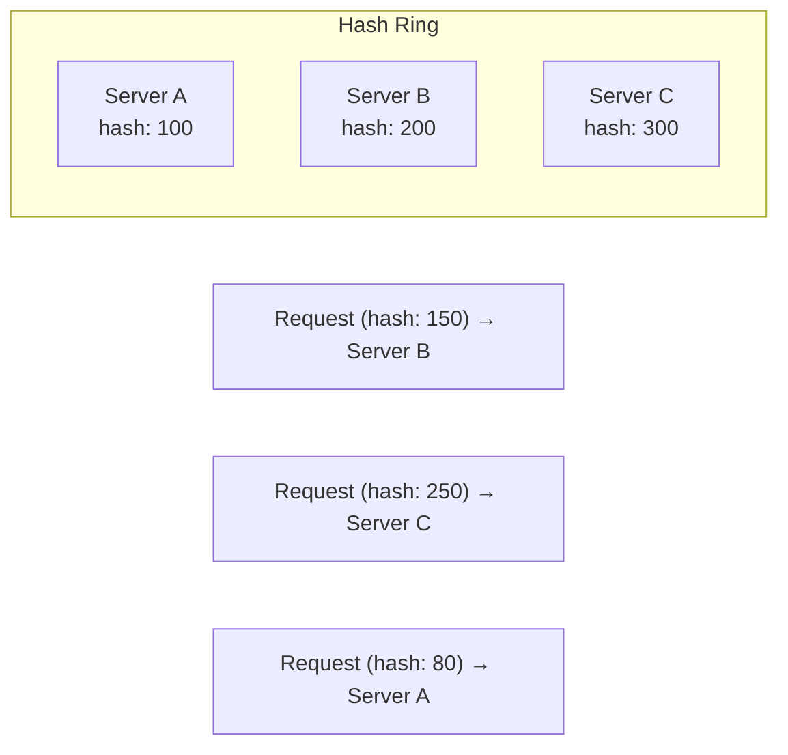

# Load Balancing Algorithms

## Overview

The load balancing algorithm determines how traffic is distributed across backend servers. The choice of algorithm affects performance, fairness, and resource utilization.

## Common Algorithms



## Static Algorithms

### Round Robin

Requests are distributed sequentially across servers.

```
Request 1 → Server A
Request 2 → Server B
Request 3 → Server C
Request 4 → Server A
Request 5 → Server B
...
```

**Pros**: Simple, fair distribution
**Cons**: Ignores server capacity and current load
**Use case**: Servers with equal capacity and similar request processing times

### Weighted Round Robin

Like round robin but servers receive requests proportional to their weight.

```
Server A (weight 5): Gets 5/10 of requests
Server B (weight 3): Gets 3/10 of requests
Server C (weight 2): Gets 2/10 of requests
```

**Pros**: Accounts for different server capacities
**Cons**: Weights are static; doesn't adapt to current load
**Use case**: Heterogeneous server pools

### IP Hash

A hash of the client's IP address determines which server receives the request.

```
hash(client_ip) % num_servers = server_index
```

**Pros**: Same client always goes to same server (natural session affinity)
**Cons**: Can create uneven distribution if client IPs are clustered
**Use case**: Stateful applications requiring session persistence

### Random

A server is selected randomly (possibly with weights).

**Pros**: Simple, statistically even over time
**Cons**: Short-term imbalances possible
**Use case**: Large number of requests, stateless servers

## Dynamic Algorithms

### Least Connections

Routes to the server with the fewest active connections.



**Pros**: Adapts to current load; handles varying request durations
**Cons**: Doesn't account for server capacity differences
**Use case**: Requests with variable processing times

### Weighted Least Connections

Combines least connections with server weights.

```
score = active_connections / weight
Route to server with lowest score
```

**Example**:
- Server A: 10 connections, weight 5 → score = 2.0
- Server B: 4 connections, weight 3 → score = 1.33 ← **Route here**
- Server C: 6 connections, weight 2 → score = 3.0

### Least Response Time

Routes to the server with the fastest response time (and fewest connections).

**Pros**: Naturally favors high-performance servers
**Cons**: Response time fluctuates; requires monitoring
**Use case**: Performance-critical applications

### Resource-Based (Adaptive)

The load balancer queries servers for CPU/memory/connection metrics and routes accordingly.

**Pros**: Most intelligent; adapts to actual server state
**Cons**: Complex; requires agent on servers or API
**Use case**: Large-scale, heterogeneous environments

## Algorithm Comparison

| Algorithm | State-Aware | Capacity-Aware | Session Affinity | Complexity |
|-----------|------------|---------------|-----------------|------------|
| Round Robin | No | No | No | Low |
| Weighted RR | No | Yes (static) | No | Low |
| IP Hash | No | No | Yes (natural) | Low |
| Random | No | No | No | Low |
| Least Conn | Yes | No | No | Medium |
| Weighted Least Conn | Yes | Yes | No | Medium |
| Least Response Time | Yes | Yes | No | High |
| Resource-Based | Yes | Yes (dynamic) | No | High |

## Consistent Hashing

A special hashing technique that minimizes redistribution when servers are added or removed.



**How it works**:
1. Servers are placed on a hash ring (0 to 2^32)
2. Requests are hashed and routed clockwise to the nearest server
3. When a server is added/removed, only nearby requests are redistributed

**Use case**: Distributed caches (Memcached, Redis), CDN, distributed databases

## Interview Questions

1. **Q: What's the difference between round robin and least connections?**
   A: Round robin distributes requests sequentially regardless of server load. Least connections routes to the server with the fewest active connections. Least connections is better when request processing times vary significantly.

2. **Q: When would you use consistent hashing?**
   A: When you need minimal redistribution when adding/removing servers. Common in distributed caches (Memcached) and CDNs. Without consistent hashing, adding a server would rehash almost all keys.

3. **Q: What is the problem with IP hash for session affinity?**
   A: If many clients share the same IP (NAT, corporate proxy), they all go to the same server. Also, if the number of servers changes, the mapping changes (breaking sessions).

4. **Q: How does weighted least connections work?**
   A: It divides active connections by the server's weight. The server with the lowest ratio gets the next request. This accounts for both current load and server capacity.

5. **Q: What algorithm would you use for a database connection pool?**
   A: Least connections — database queries have variable execution times, and you don't want to overload a server that's processing slow queries.

## Common Mistakes

- Using round robin when request times vary (creates imbalance)
- Using IP hash when many clients share IPs (NAT)
- Not adjusting weights when server capacities differ
- Forgetting that consistent hashing still needs virtual nodes for even distribution
- Confusing session affinity (feature) with IP hash (algorithm)

## Summary

Static algorithms (round robin, weighted RR, IP hash) are simple but don't adapt. Dynamic algorithms (least connections, least response time) respond to real-time conditions. Consistent hashing minimizes redistribution. Choose based on your application's needs for fairness, affinity, and adaptability.

## Cross-References

- [Load Balancing Overview](README.md)
- [L4 vs L7](l4-vs-l7.md) — Different layers enable different algorithms
- [Reverse Proxy](reverse-proxy.md) — Where algorithms are implemented
- [CDN](../cdn/README.md) — Uses consistent hashing

## Cross References

- [L4 vs L7](l4-vs-l7.md)
- [Consistent Hashing](../../distributed/partitioning/consistent-hashing.md)
- [OS Scheduling](../../os/scheduling/README.md)
