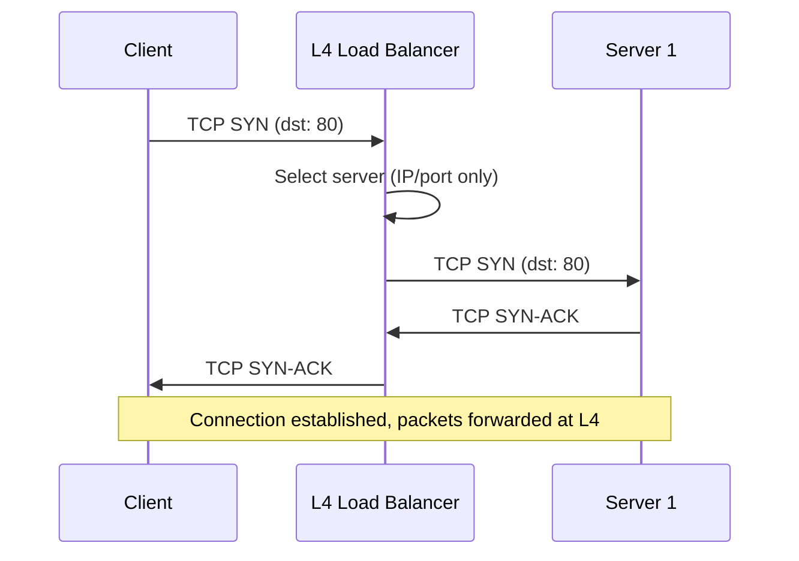
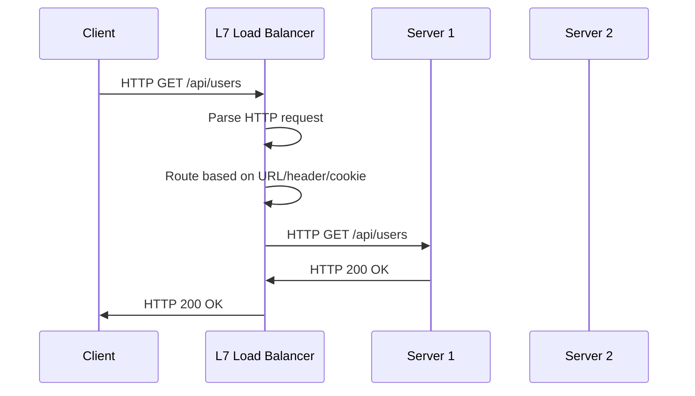
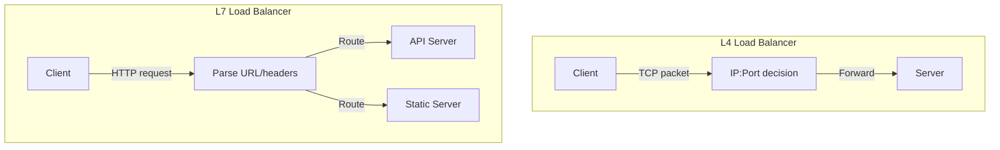
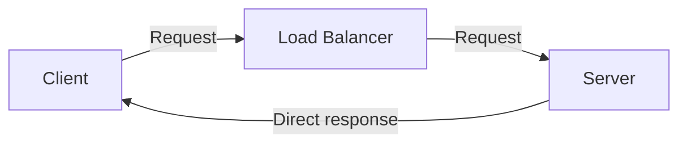

# Layer 4 vs Layer 7 Load Balancing

## Overview

The "layer" refers to the OSI model layer at which the load balancer operates. This determines what information is available for routing decisions, which directly impacts performance, flexibility, and features.

## Layer 4 Load Balancing

L4 load balancers operate at the **transport layer** (TCP/UDP). They make routing decisions based on source/destination IP addresses and ports only.

### How It Works

### Characteristics

| Feature | L4 |
|---------|-----|
| **Inspects** | IP header + TCP/UDP header |
| **Routing based on** | Source/dest IP, source/dest port |
| **Speed** | Very fast (minimal processing) |
| **Content awareness** | None |
| **SSL termination** | No (pass-through) |
| **Connection handling** | NAT or DSR (Direct Server Return) |
| **Throughput** | Very high |
| **Examples** | Linux LVS, AWS NLB, HAProxy (TCP mode) |

### Use Cases

- High-throughput applications (gaming, streaming, IoT)
- Non-HTTP protocols ( databases, custom TCP protocols)
- When you need minimal latency
- When backend servers handle their own SSL

## Layer 7 Load Balancing

L7 load balancers operate at the **application layer** (HTTP/HTTPS). They inspect full request content to make routing decisions.

### How It Works

### Characteristics

| Feature | L7 |
|---------|-----|
| **Inspects** | Full HTTP request (headers, URL, body) |
| **Routing based on** | URL path, hostname, headers, cookies |
| **Speed** | Slower (full request parsing) |
| **Content awareness** | Full |
| **SSL termination** | Yes (decrypts and re-encrypts) |
| **Connection handling** | Two separate connections (client-LB, LB-server) |
| **Throughput** | Lower than L4 |
| **Examples** | Nginx, HAProxy (HTTP mode), AWS ALB, Envoy |

### Use Cases

- Web applications (HTTP/HTTPS)
- Content-based routing (API vs static files)
- SSL offloading
- URL rewriting, header manipulation
- WebSocket load balancing
- A/B testing, canary deployments

## Detailed Comparison

| Aspect | L4 | L7 |
|--------|-----|-----|
| **OSI Layer** | Transport (4) | Application (7) |
| **Protocol** | TCP, UDP | HTTP, HTTPS, gRPC, WebSocket |
| **Latency** | Lower | Higher |
| **Throughput** | Higher | Lower |
| **Content routing** | No | Yes (URL, headers, cookies) |
| **SSL offload** | No | Yes |
| **Caching** | No | Yes |
| **Compression** | No | Yes |
| **WebSocket support** | Pass-through | Native handling |
| **Connection reuse** | No | Yes (keep-alive to backends) |
| **Health checks** | TCP connect | HTTP GET, custom scripts |
| **Sticky sessions** | IP-based | Cookie-based |
| **Cost** | Lower (less CPU) | Higher (more CPU) |

## Direct Server Return (DSR)

With L4 load balancing, the server can respond directly to the client, bypassing the load balancer on the return path:

**Pros**: Load balancer isn't a bottleneck for response traffic
**Cons**: Requires server to be configured with VIP, can't do SSL offloading

## Interview Questions

1. **Q: When would you choose L4 over L7?**
   A: Choose L4 when: you need maximum throughput/minimum latency, you're load balancing non-HTTP protocols (databases, custom TCP), or you need pass-through SSL (server handles its own TLS). Choose L7 when: you need content-based routing, SSL offloading, or HTTP-specific features.

2. **Q: What is SSL termination at the load balancer?**
   A: The load balancer decrypts incoming HTTPS traffic, inspects it (for L7 routing), then optionally re-encrypts it before sending to the backend. This offloads CPU-intensive TLS from backend servers and enables content inspection.

3. **Q: Can an L7 load balancer handle non-HTTP traffic?**
   A: Technically, it could inspect any text-based protocol at L7, but it's designed for HTTP/HTTPS. For non-HTTP protocols (MySQL, Redis, custom binary), use L4 load balancing.

4. **Q: What is connection draining?**
   A: When removing a server from the pool, the load balancer stops sending new connections but allows existing connections to complete gracefully. This prevents dropping active sessions during maintenance.

5. **Q: How does L7 load balancing affect latency compared to L4?**
   A: L7 adds latency because it must: 1) Establish a TCP connection with the client, 2) Read the full HTTP request (or at least headers), 3) Make a routing decision, 4) Establish a separate connection to the backend. L4 just forwards packets after the initial connection setup.

## Common Mistakes

- Using L7 when L4 would suffice (unnecessary overhead)
- Using L4 when you need content routing (can't inspect URLs)
- Not understanding that L7 creates two separate TCP connections
- Forgetting that SSL termination at L7 means traffic is unencrypted between LB and backend (unless re-encrypted)
- Confusing health checks (L4 = TCP connect, L7 = HTTP GET with expected response)

## Summary

L4 load balancing is fast and simple — routes by IP/port. L7 is feature-rich — routes by content (URL, headers, cookies). Choose L4 for raw performance and non-HTTP protocols. Choose L7 for web applications needing content routing, SSL offloading, and HTTP features.

## Cross-References

- [Load Balancing Overview](README.md)
- [Algorithms](algorithms.md)
- [Reverse Proxy](reverse-proxy.md)
- [TLS](../security/tls.md) — SSL termination
- [CDN](../cdn/README.md) — L7 load balancing at edge
