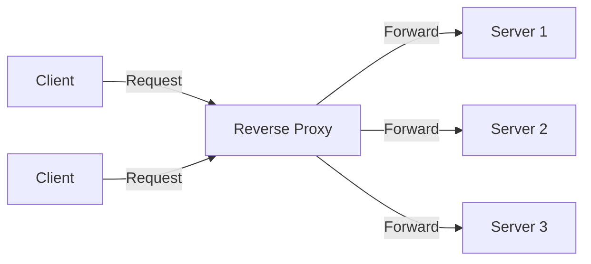
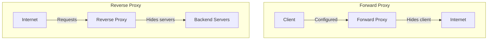
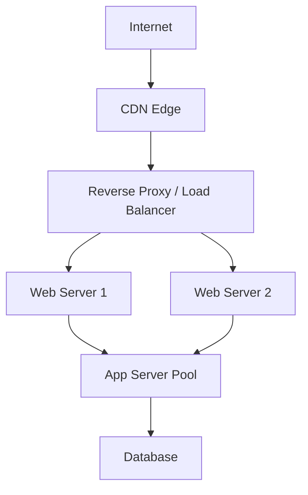

# Reverse Proxy

## Overview

A reverse proxy is a server that sits between clients and backend servers, forwarding client requests to the appropriate backend. Unlike a forward proxy (which hides the client), a reverse proxy hides the backend servers.



## Forward Proxy vs Reverse Proxy

| Aspect | Forward Proxy | Reverse Proxy |
|--------|--------------|---------------|
| **Hides** | Client | Server |
| **Client aware** | Yes (configured on client) | No (transparent) |
| **Use case** | Bypass geo-blocks, caching, anonymity | Load balancing, SSL offload, security |
| **Example** | Corporate proxy, VPN | Nginx, HAProxy, Cloudflare |



## What a Reverse Proxy Does

| Function | Description |
|----------|-------------|
| **Load balancing** | Distributes requests across backend servers |
| **SSL termination** | Handles TLS encryption/decryption |
| **Caching** | Stores frequently requested content |
| **Compression** | Compresses responses (gzip, brotli) |
| **Security** | Hides backend topology, blocks attacks |
| **Rate limiting** | Throttles excessive requests |
| **URL rewriting** | Modifies request/response URLs |
| **Authentication** | Centralizes auth before reaching backends |
| **Logging** | Centralized access logs |
| **WebSocket proxying** | Handles WebSocket upgrades |

## Reverse Proxy in Architecture



## Nginx as Reverse Proxy

```nginx
http {
    upstream backend {
        least_conn;
        server 10.0.0.1:8080 weight=3;
        server 10.0.0.2:8080 weight=2;
        server 10.0.0.3:8080 backup;
    }

    server {
        listen 443 ssl;
        server_name example.com;
        
        ssl_certificate /etc/ssl/cert.pem;
        ssl_certificate_key /etc/ssl/key.pem;

        location /api/ {
            proxy_pass http://backend;
            proxy_set_header Host $host;
            proxy_set_header X-Real-IP $remote_addr;
            proxy_set_header X-Forwarded-For $proxy_add_x_forwarded_for;
            proxy_set_header X-Forwarded-Proto $scheme;
        }

        location /static/ {
            root /var/www;
            expires 30d;
        }
    }
}
```

## HAProxy as Reverse Proxy

```
frontend http_front
    bind *:443 ssl crt /etc/ssl/cert.pem
    acl is_api path_beg /api
    use_backend api_servers if is_api
    default_backend web_servers

backend web_servers
    balance roundrobin
    server web1 10.0.0.1:8080 check
    server web2 10.0.0.2:8080 check

backend api_servers
    balance leastconn
    server api1 10.0.0.3:8080 check
    server api2 10.0.0.4:8080 check
```

## X-Forwarded-For Header

When a reverse proxy forwards a request, it adds headers to preserve original client information:

```
X-Forwarded-For: 203.0.113.50, 10.0.0.1
X-Forwarded-Proto: https
X-Forwarded-Host: example.com
X-Real-IP: 203.0.113.50
```

**Without these headers**, backend servers see the reverse proxy's IP as the client IP.

## Reverse Proxy vs API Gateway

| Feature | Reverse Proxy | API Gateway |
|---------|--------------|-------------|
| **Primary function** | Traffic routing | API management |
| **Layer** | L4/L7 | L7 (API-specific) |
| **Rate limiting** | Basic | Advanced (per-endpoint) |
| **Auth** | Basic (IP, HTTP auth) | OAuth, JWT, API keys |
| **Transformation** | Minimal | Request/response transformation |
| **Monitoring** | Basic logs | API analytics |
| **Examples** | Nginx, HAProxy | Kong, AWS API Gateway, Apigee |

## Interview Questions

1. **Q: What is a reverse proxy and why use one?**
   A: A reverse proxy sits between clients and backend servers, forwarding requests transparently. Benefits: load balancing, SSL termination, caching, security (hides backend topology), compression, centralized logging, and rate limiting.

2. **Q: What's the difference between a reverse proxy and a load balancer?**
   A: A reverse proxy is a broader concept — it can do load balancing, caching, SSL termination, etc. A load balancer specifically distributes traffic. Many reverse proxies (Nginx, HAProxy) also function as load balancers.

3. **Q: What is SSL termination at a reverse proxy?**
   A: The reverse proxy handles TLS encryption/decryption. Clients connect via HTTPS to the proxy, which decrypts the request and forwards it to backends over HTTP (or re-encrypted HTTPS). This offloads TLS from backend servers.

4. **Q: Why is X-Forwarded-For important?**
   A: Without it, backend servers only see the reverse proxy's IP address. X-Forwarded-For preserves the original client IP, which is critical for logging, rate limiting, geo-IP, and security decisions.

5. **Q: Can a reverse proxy be a single point of failure?**
   A: Yes. Mitigation: deploy multiple reverse proxies with a virtual IP (VIP) using keepalived/VRRP, or use DNS-based load balancing across multiple proxy instances.

6. **Q: What's the difference between proxy_pass and reverse proxy?**
   A: proxy_pass is the Nginx directive that configures reverse proxying. A reverse proxy is the architectural concept. proxy_pass is how Nginx implements it.

## Common Mistakes

- Forgetting to set X-Forwarded-For headers
- Not handling WebSocket upgrades (Connection: Upgrade, Upgrade: websocket)
- Single point of failure (no HA for the proxy itself)
- SSL termination exposing unencrypted traffic between proxy and backend (use re-encryption)
- Not configuring connection timeouts properly (causes hanging connections)

## Summary

A reverse proxy is a critical infrastructure component that sits between clients and backends. It provides load balancing, SSL termination, caching, security, and more. Nginx and HAProxy are the most common implementations. Proper header forwarding (X-Forwarded-For) and high availability are essential considerations.

## Cross-References

- [Load Balancing Overview](README.md)
- [L4 vs L7](l4-vs-l7.md)
- [Algorithms](algorithms.md)
- [TLS](../security/tls.md) — SSL termination
- [CDN](../cdn/README.md) — CDN edge nodes are reverse proxies
- [Firewalls](../security/firewalls.md) — Security functions
