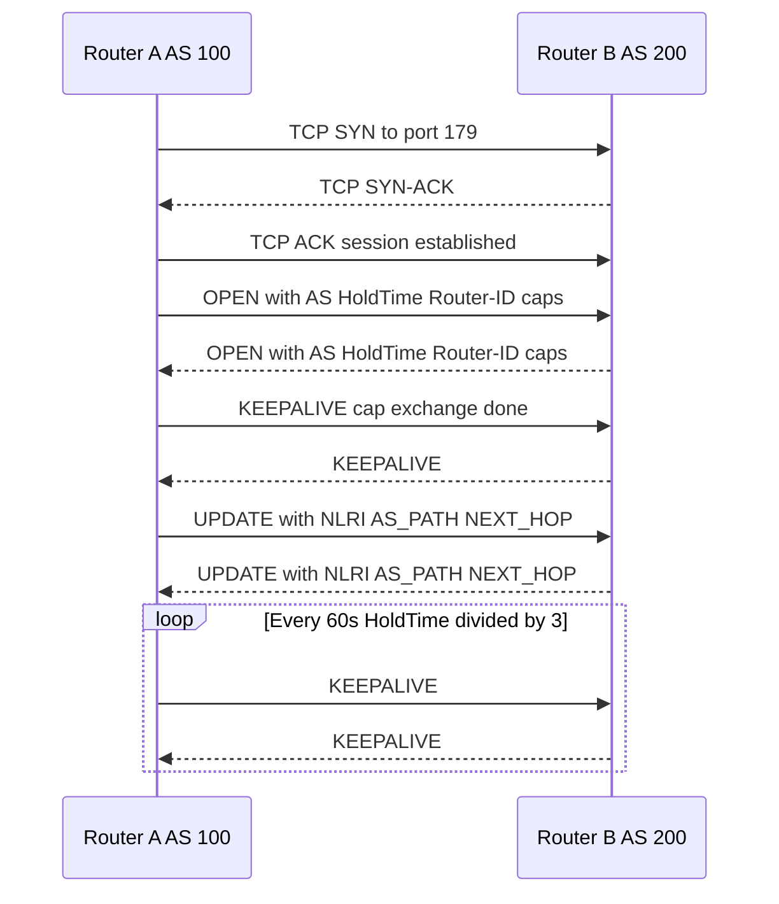
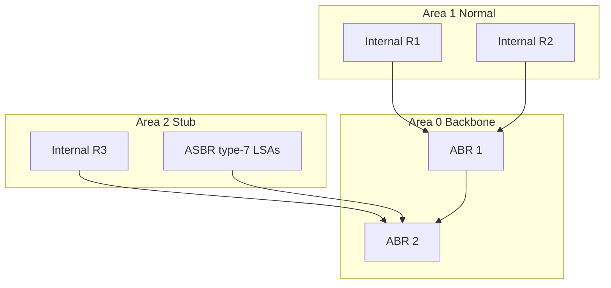
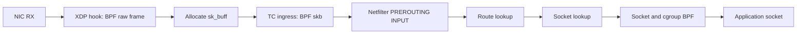
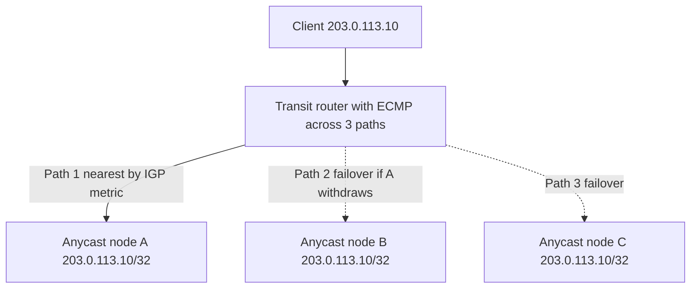

# Networking — Advanced

> *"The network is the computer."* — John Gage (Sun Microsystems, 1984)

This page is the consolidated advanced-networking deep dive for placement
interviews. It maps directly to **Section 42 of `src/index.md`** and stitches
together topics otherwise scattered across the routing, TCP, eBPF, and
security sub-folders. The treatment follows *TCP/IP Illustrated, Volume 1*
(Stevens) for protocol fundamentals and *Routing TCP/IP, Volume I & II*
(Doyle) for control-plane behaviour, then layers in modern data-center
practice (VXLAN/EVPN, SDN, P4, eBPF, Cilium-style datapaths) and
congestion-control theory from the BBR paper (Cardwell et al., 2017).
Placement candidates get filtered out on questions like *Why does BGP use
TCP and OSPF does not?*, *VXLAN vs Geneve?*, *XDP vs netfilter?*, or *When
is BBR worse than CUBIC?* — answering those requires a control-plane /
data-plane / kernel-hook mental model, which this page builds.

## 1. Routing Protocols

Routing protocols split into three families: **distance-vector**
(RIP, EIGRP), **link-state** (OSPF, IS-IS), and **path-vector** (BGP). The
fundamental trade-off is between convergence speed, scalability, and policy
expressiveness.

### 1.1 BGP — Border Gateway Protocol (RFC 4271)

BGP is a **path-vector** Exterior Gateway Protocol running over TCP/179.
It exchanges reachability as NLRI decorated with path attributes such as
`AS_PATH`, `NEXT_HOP`, `LOCAL_PREF`, `MED`, and `COMMUNITIES`. Loop
detection is structural: a router rejects any UPDATE whose `AS_PATH`
contains its own AS number. BGP is policy-driven, not shortest-path; the
13-step decision process (weight → local-pref → locally originated →
AS-path length → origin → MED → eBGP-over-iBGP → IGP metric to next-hop →
oldest → lowest router ID) expresses rich traffic-engineering intent.
iBGP requires a full mesh of \\(n(n-1)/2\\) sessions or a route-reflector /
confederation hierarchy. See [BGP](routing/bgp.md).

### 1.2 OSPF — Open Shortest Path First (RFC 2328)

OSPF is a **link-state** IGP running directly on IP protocol 89. It floods
Link-State Advertisements inside an area; each router maintains an identical
LSDB and computes routes with Dijkstra's SPF. The hierarchy is area-based:
a backbone **Area 0** to which all non-backbone areas must attach, with ABRs
(Area Border Routers) summarizing between them. OSPF supports VLSM/CIDR,
converges in seconds, and has no RIP-style hop limit. Stub, NSSA, and
totally-stubby area types trade off external routing detail for smaller
LSDBs. See [OSPF](routing/ospf.md).

### 1.3 IS-IS (ISO 10589, RFC 1195)

IS-IS is also link-state and also runs Dijkstra, but is transported directly
over Layer 2 (no IP dependency) and uses a TLV encoding that makes extension
cheap. Its hierarchy is **Level 1 / Level 2 / Level 1-2** rather than Area 0;
the backbone is the contiguous set of L2 routers. ISPs and hyper-scale
providers prefer IS-IS for its scaling behaviour and because it keeps working
even when the IP control plane is broken. See [IS-IS](routing/isis.md).

### 1.4 RIP (RFC 1058 / 2453 / 2080)

RIP is a **distance-vector** protocol using Bellman-Ford, with hop count as
the metric and a 15-hop diameter cap (16 = unreachable). Historically
important and a useful interview baseline; rarely deployed beyond small or
legacy networks. See [RIP](routing/rip.md).

### Routing Protocol Comparison

| Protocol | Family | Transport | Metric | Convergence | Loop Prevention | Scope |
|---|---|---|---|---|---|---|
| **BGP-4** | Path-vector | TCP 179 | AS-path + policy | Slow (minutes) | AS_PATH contains own AS | Inter-AS (Internet) |
| **OSPFv2/v3** | Link-state | IP proto 89 | Cost (1–65535) | Fast (seconds) | SPF tree, sequence nums | Intra-AS IGP |
| **IS-IS** | Link-state | L2 (no IP) | Cost (wide metric) | Fast (seconds) | SPF + LSP seq nums | Intra-AS IGP, ISP scale |
| **RIPv2/ng** | Distance-vector | UDP 520 | Hop count (≤15) | Slow (30s+holddown) | Split horizon, poison reverse | Small networks |
| **EIGRP** | Advanced DV | IP proto 88 | Composite (BW+delay) | Very fast (FSM) | Feasible distance condition | Cisco-origined IGP |

### BGP Peering Sequence

### OSPF Area Hierarchy

## 2. Software-Defined Networking (SDN)

SDN separates the **control plane** (decision-making) from the **data plane**
(forwarding) and centralizes the former in a controller that programs
forwarding state into switches via a southbound API.

- **OpenFlow** (ONF spec, v1.0 → v1.5) is the canonical southbound protocol.
  The controller installs flow entries (match fields + actions) into a switch
  flow table; misses go to the controller as `PACKET_IN`, which decides and
  installs a new entry. The match-action model is conceptually similar to a
  hardware TCAM.
- **P4** (P4-16 language spec) is a domain-specific language for programming
  the data plane itself. Where OpenFlow fixes the match-action vocabulary,
  P4 lets you define the parser, headers, pipeline stages, and deparser.
  Targets include programmable NICs (Intel Tofino, AMD Pensando) and
  software switches. Distinction: OpenFlow programs *existing* tables; P4
  *defines* what the tables look like.
- **Open vSwitch (OVS)** is the production-grade software switch used by
  KVM, Xen, and most CNIs that need OpenFlow. It exposes `ovs-vswitchd` and
  an `ovsdb` management plane, driven by controllers such as **ONOS**,
  **OpenDaylight**, **RYU**, or **Faucet**. Modern cloud-native stacks
  increasingly replace the controller + OpenFlow model with eBPF programs
  attached at XDP/TC hooks (Cilium, Calico eBPF dataplane), trading the
  centralized controller for in-kernel distributed policy.

## 3. Network Virtualization and Overlays

Overlays build virtual L2/L3 networks on top of an underlay IP fabric by
encapsulating tenant frames inside outer UDP/IP headers. This decouples
tenant addressing from physical topology, which is what makes multi-tenant
clouds and Kubernetes networking tractable.

- **VXLAN (RFC 7348)** encapsulates an L2 frame in UDP over port 4789,
  using a 24-bit VNI to identify the virtual network (16M segments vs
  VLAN's 4k). A **VTEP** (VXLAN Tunnel Endpoint) maps inner
  MAC→remote-VTEP-IP, learning the mapping from traffic. Flood-and-learn
  VXLAN scales poorly; production deployments use **EVPN** as the control
  plane.
- **Geneve (RFC 8926)** is the VXLAN successor (OVS/Cilium/VMware
  coalition). It keeps the VXLAN envelope (UDP/6081, 24-bit VNI) but adds
  **TLV options** so new metadata (policy, service chaining, observability)
  can be added without a new encapsulation. Cilium and OVN both default to
  Geneve.
- **GRETAP / IP-in-IP.** GRETAP (GRE over Ethernet, IP proto 47) carries
  L2 frames and predates VXLAN; lacks the VNI scaling and UDP-friendly
  ECMP hashing of VXLAN but is still used for site-to-site tunnels.
  IP-in-IP (proto 4) carries L3 only and is used by some Kubernetes CNIs
  (Calico BGP mode) for pod-to-pod traffic across nodes without NAT.
- **EVPN (RFC 7432)** is a BGP address family (AFI 25, SAFI 70) that
  distributes MAC and IP reachability across the overlay. A VTEP learns a
  local MAC and advertises it as an EVPN route (type 2 for MAC/IP, type 3
  for BUM auto-discovery, type 5 for IP prefix routing). EVPN over VXLAN is
  the de-facto data-center overlay control plane.
- **Linux building blocks.** Network namespaces isolate the stack
  (interfaces, routes, iptables, sockets) per container. **VETH pairs**
  wire namespaces together or to a bridge. The **Linux bridge** is a
  software L2 switch. **Bonds** (`teamd` or in-kernel) aggregate links for
  redundancy (active-backup) or throughput (LACP / 802.3ad). **TUN/TAP**
  moves packets between kernel and user space (OpenVPN, QEMU).

### Overlay Technology Comparison

| Overlay | Encap | Port | Segment ID | L2/L3 | ECMP-friendly | Typical Use |
|---|---|---|---|---|---|---|
| **VXLAN** | UDP/IP | 4789 | 24-bit VNI | L2 | Yes (UDP 5-tuple) | DC overlay, NSX |
| **Geneve** | UDP/IP | 6081 | 24-bit VNI + TLV | L2/L3 | Yes | Cilium, OVN, modern DC |
| **GRETAP** | GRE/IP | proto 47 | key (32-bit) | L2 | Poor | Site-to-site L2 |
| **IP-in-IP** | IP | proto 4 | none | L3 | Yes | Calico BGP mode |
| **WireGuard** | UDP/IP | dynamic | 32-bit peer | L3 (routed) | Yes | Modern VPN |
| **IPsec ESP** | ESP/IP | proto 50 | SPI (32-bit) | L3 | Mixed (UDP encap helps) | Site VPN, BGP sec |

## 4. Linux Packet Processing Hooks

Modern Linux exposes several programmable and fixed hooks in the packet path.
Knowing their order, context, and cost is the difference between a correct
CNI/firewall design and one that quietly relies on the slow path.

- **XDP (eXpress Data Path)** runs BPF programs at the earliest RX point,
  often before `sk_buff` allocation. Best for DDoS pre-filtering, L4 load
  balancing, early drop. Actions: `XDP_PASS`, `XDP_DROP`, `XDP_TX`,
  `XDP_REDIRECT`, `XDP_ABORTED`. Ingress only.
- **TC (Traffic Control)** BPF programs run after `sk_buff` allocation, on
  both ingress and egress. They see rich metadata (skb mark, conntrack state,
  socket) and are the right hook for per-endpoint policy, NAT, encap, shaping.
- **conntrack** (`nf_conntrack`) is the kernel's connection-state table:
  tracks {src,dst,proto,sport,dport,state} per flow, enabling stateful firewall
  rules and NAT. Large or asymmetric flows exhaust the table;
  `nf_conntrack: table full, dropping packet` is a classic production incident.
  The Cilium dataplane ships its own BPF conntrack for the same purpose,
  avoiding the kernel table for pod traffic.
- **NAT / iptables / nftables.** NAT rewrites address/port tuples;
  `iptables -t nat` (or `nft`) drives SNAT/DNAT/masquerade. **iptables** is
  the legacy {filter,nat,mangle,raw} framework; rules are O(n) per packet
  and chain traversal is a known Kubernetes bottleneck at thousands of
  services. **nftables** is the successor: unified syntax, native sets/maps,
  faster incremental updates, same Netfilter backend. Newer Kubernetes
  (kube-proxy nft mode) and most distros default to it.

### Linux Packet Processing Hooks Comparison

| Hook | Location | Context | Direction | Use case | Cost |
|---|---|---|---|---|---|
| **XDP** | Driver RX, pre-skb | raw frame | ingress | DDoS drop, L4 LB, redirect | lowest |
| **TC BPF** | After skb alloc | `sk_buff` | ingress + egress | policy, NAT, encap, shaping | low |
| **Netfilter/iptables** | IP stack hooks | skb + ct | ingress + egress | firewall, NAT, mangle | medium |
| **nftables** | Netfilter backend | skb + ct + sets | ingress + egress | same, with sets/maps | medium |
| **conntrack** | Netfilter core | flow tuple | bidirectional | state for NAT/firewall | table lookup |
| **Socket BPF** | cgroup/sock ops | socket + msg | ingress + egress | identity policy, sockmap | low |
| **AF_XDP** | XDP redirect | UMEM ring | ingress (RX) | user-space high-rate path | low + userspace |

### Linux Packet Path (RX)

## 5. Anycast, ECMP, Multicast, IGMP, IPv6

- **Anycast** advertises the **same prefix from multiple geographically
  distributed nodes**; BGP delivers packets to the topologically nearest
  announcement. It powers global DNS (8.8.8.8, 1.1.1.1) and many CDN edges.
  Caveat: it works for stateless or short-lived UDP/TCP-handshake traffic;
  long-lived TCP can shift mid-flow to another node on BGP convergence,
  breaking the connection.
- **ECMP** (Equal-Cost Multi-Path) forwards across multiple equal-cost
  next-hops. Linux `ip route` supports it natively (`nexthop` groups since
  kernel 5.x). Hashing is on a 5-tuple so flows stay on one path while
  aggregate bandwidth is spread. Pitfall: VXLAN/GRE tunnels need UDP outer
  headers for the ECMP hash to vary across inner flows.
- **Multicast** (RFC 1112) delivers one packet to a group identified by a
  224.0.0.0/4 (IPv4) or ff00::/8 (IPv6) address. **IGMP** (IPv4) and **MLD**
  (IPv6) are the host↔router signalling protocols; **PIM** builds the
  distribution tree across routers. Used in financial market data, IPTV, and
  cluster discovery (mDNS, OSPF hellos), but frequently disabled on public
  clouds.
- **IPv6 routing notes.** No broadcast (use multicast); NDP replaces ARP;
  link-local `fe80::/10` for router discovery; SLAAC (RFC 4862) for
  self-assignment. OSPFv3 (RFC 5340) and multi-topology IS-IS carry IPv6
  natively; BGP uses MP-BGP (AFI 2, SAFI 1 for unicast, SAFI 65 for 6PE).

### Anycast and ECMP Traffic Flow

## 6. MPLS, Tunnels, VPNs, and DNSSEC

- **MPLS** inserts a 4-byte **shim header** between L2 and L3 carrying a
  20-bit label. LSRs forward on the label rather than the IP header, enabling
  fast hardware switching and traffic engineering (TE tunnels with RSVP-TE
  bandwidth reservations). L3VPN (RFC 4364), VPLS, and 6PE all ride MPLS.
- **GRE / IPsec / WireGuard.** GRE (IP proto 47) is a generic encapsulation;
  GRETAP carries L2. IPsec (ESP proto 50; AH proto 51; IKE for key exchange,
  UDP/500 or UDP/4500 for NAT traversal) is the standards-based site-to-site
  VPN (see [IPsec](security/ipsec.md)). WireGuard is a modern UDP VPN using
  Noise_IK, ChaCha20-Poly1305, and Curve25519 — smaller code base, faster
  handshake, roamed-friendly (see [WireGuard](../linux/networking/wireguard.md)).
- **DNSSEC** (RFCs 4033–4035) signs DNS records with asymmetric keys so
  resolvers verify authenticity and integrity. Each zone has a KSK
  (key-signing, long-lived) and a ZSK (zone-signing, rotated more often);
  the DS record in the parent chains trust from the root. Gotcha: DNSSEC
  does **not** provide confidentiality — responses are still cleartext;
  DoH/DoT (TLS) provides confidentiality in transit.

## 7. Congestion Control Deep Dive

Congestion control decides how much data a TCP sender can have in flight —
the biggest determinant of WAN throughput, latency, and fairness. See
[TCP congestion control](tcp/congestion-control.md) for the slow-start /
congestion-avoidance / fast-retransmit / fast-recovery skeleton common to
all variants.

- **Reno / NewReno.** TCP Reno (1988, Jacobson) introduced AIMD: additive
  increase of 1 MSS per RTT, multiplicative decrease of ½ on loss, three
  duplicate ACKs as a loss signal. NewReno (RFC 6582) handles multiple
  drops per window by tracking partial ACKs during recovery.
- **Vegas** (Brakmo & Peterson, 1995) detects congestion by **RTT
  increase** rather than loss — it compares expected rate (`cwnd/min_RTT`)
  to actual rate (`cwnd/RTT`) and reduces `cwnd` when actual falls short.
  Lower queuing delay, but loses fairness against loss-based competitors.
- **CUBIC** (default Linux since 2.6.19) uses a cubic window function
  \\(W(t) = C \\cdot (t - K)^3 + W_{max}\\) where \\(W_{max}\\) is the window
  at the last loss and \\(K\\) is the time to reach \\(W_{max}\\) again. Growth
  is driven by **time since loss**, not ACK arrivals, making it RTT-fair
  and aggressive on high-BDP paths. Reduces `cwnd` by 30% (β = 0.7) rather
  than Reno's 50%. See [TCP CUBIC](tcp/cubic.md).
- **BBR** (Cardwell et al., 2017) is **model-based**: it estimates `BtlBw`
  (max delivery rate over 10 RTTs) and `RTprop` (min RTT over 10 s), then
  paces at `BtlBw` with inflight limited to the BDP
  \\(\\text{BDP} = \\text{BtlBw} \\times \\text{RTprop}\\). Four states: Startup
  → Drain → ProbeBW → ProbeRTT; ProbeBW cycles gains
  (1.25, 1.0, 1.0, 1.0, 0.75, 1.0, 1.0, 1.0) per RTT to probe for bandwidth
  without sustained queues. See [TCP BBR](tcp/bbr.md).

### Congestion Control Algorithm Comparison

| Algorithm | Signal | Window growth | Decrease on loss | Pacing | RTT-fairness | Best for |
|---|---|---|---|---|---|---|
| **Reno** | Loss (3 dup-ACK) | +1 MSS/RTT (AIMD) | ½ cwnd | no | poor | low-BDP legacy |
| **NewReno** | Loss + partial ACK | +1 MSS/RTT | ½ cwnd | no | poor | multi-drop recovery |
| **Vegas** | RTT increase (delay) | linear, RTT-aware | ¼ cwnd | no | good in isolation | low-latency LAN |
| **CUBIC** | Loss | cubic in time-since-loss | 0.7× cwnd | no | better than Reno | high-BDP default |
| **BBR v1** | Model (BtlBw + RTprop) | state-machine paced | loss not primary | yes | mixed (BBR v2 fixes) | WAN, CDN, shallow buffers |
| **BBR v2** | Model + loss/ECN | state-machine paced | partial | yes | improved | production WAN |

### Operating Points

\\[ \\text{BDP} = \\text{BtlBw} \\times \\text{RTprop}, \\qquad
   W_{\\text{opt}} \\approx \\text{BDP} \\]

BBR targets \\(W_{\\text{opt}}\\); CUBIC overshoots into the buffer and rides
the loss cliff. On a 100 Mbps × 50 ms path the BDP is 625 KB — CUBIC will
fill a 256 KB buffer and inflate measured RTT to ~70 ms, while BBR holds
~625 KB inflight and keeps RTT close to 50 ms.

## 8. DDoS Mitigation, Load Balancing, Service Mesh

- **DDoS mitigation.** Volumetric attacks (UDP reflection, amplification)
  are best mitigated upstream by a scrubbing service or Anycast dispersion;
  protocol attacks (SYN floods) by SYN cookies, rate limits, and XDP early
  drop; application attacks (HTTP floods) by L7 WAFs. Rule of thumb:
  **filter as early as possible** — XDP before netfilter, netfilter before
  the application, Anycast before any of them.
- **Network load balancing.** L4 balancers (IPVS, Maglev, Google Andromeda,
  AWS NLB) hash a flow 5-tuple to a backend and either DNAT (full-proxy
  state) or DSR (direct server return). Consistent hashing (Maglev)
  minimizes reshuffle when backends change. L7 balancers (Envoy, HAProxy,
  nginx) terminate TLS, inspect HTTP, route per path/header. See [LB
  algorithms](load-balancing/algorithms.md) and [L4 vs L7](load-balancing/l4-vs-l7.md).
- **Service mesh.** A service mesh (Istio, Linkerd, Consul) inserts a
  sidecar proxy (Envoy is the dominant data plane) per pod, intercepting
  all traffic for mTLS, retry, timeout, circuit-breaking, traffic splitting.
  The **control plane** (Istiod) distributes configuration via xDS APIs.
  Trade-off: a mesh decouples app code from network policy at the cost of an
  extra hop, ~1 ms added latency, and operational complexity. eBPF-based
  meshes (Cilium Service Mesh) handle L4 policy in-kernel while keeping
  Envoy for L7, reducing that overhead.

## Interview Questions

**Q1. Why does BGP use TCP while OSPF uses IP directly?**
A: BGP carries inter-AS policy and large routing tables between potentially
non-adjacent peers; TCP gives reliable, ordered transport and session
management "for free." OSPF hellos and LSAs flood on a link-local multicast
group where reliability is cheaper in-protocol and where IP multicast is the
natural distribution tree.

**Q2. When would you choose IS-IS over OSPF?**
A: At very large ISP or hyper-scale scope, IS-IS's L2 transport, TLV
extensibility, simpler backbone (contiguous L2 routers vs strict Area 0),
and superior flooding efficiency win. OSPF is preferred in enterprise
campus where IP-based operation and broader vendor familiarity matter.

**Q3. VXLAN vs Geneve, and why does Kubernetes increasingly prefer Geneve?**
A: VXLAN fixed an 8-byte header with no extension space; Geneve keeps the
same envelope (UDP, 24-bit VNI) but adds TLV options for policy, service
chaining, and telemetry. CNIs like Cilium and OVN need to carry
identity/policy metadata in the encapsulation, which Geneve supports
natively.

**Q4. Where does XDP sit relative to netfilter, and why does it matter for
DDoS mitigation?**
A: XDP runs at the driver RX path before `sk_buff` allocation, so
`XDP_DROP` discards a packet before the kernel enters Netfilter, conntrack,
or the IP stack. For a SYN flood at 20 Mpps that is the difference between
the host surviving and conntrack table exhaustion.

**Q5. Why does iBGP require a full mesh, and how do you scale it?**
A: iBGP routers do not re-advertise routes learned from one iBGP peer to
another (loop prevention). The two scale-out patterns are **route
reflectors** (clients peer only with the RR, which reflects routes) and
**confederations** (sub-ASes that behave as eBGP internally and present a
single AS externally).

**Q6. What is BDP, and why does it matter for congestion control?**
A: The Bandwidth-Delay Product is \\(\\text{BtlBw} \\times \\text{RTprop}\\) —
the amount of data needed to fill the pipe. Loss-based algorithms like
CUBIC tend to overshoot BDP and fill buffers (bufferbloat); BBR explicitly
estimates BDP and paces at it, keeping queues short and RTT low. A sender
that cannot get `cwnd ≥ BDP` underutilizes the path.

**Q7. What is EVPN, and what problem does it solve over plain VXLAN?**
A: EVPN is a BGP address family that distributes MAC and IP reachability
across the overlay. Plain VXLAN uses flood-and-learn, which scales poorly
(multicast in the underlay, unknown-unicast flooding). EVPN replaces that
with explicit BGP advertisements: a VTEP learns a local MAC and advertises
it as a type-2 route, so remote VTEPs install the mapping without ever
flooding for it.

**Q8. Why is anycast used for DNS but risky for general TCP?**
A: Anycast advertises the same prefix from multiple sites; BGP sends the
packet to the nearest. For stateless DNS (single UDP query/response) this is
ideal — closer resolver, automatic failover. For long-lived TCP, a BGP
withdraw mid-flow can reroute the connection to a different node that has
no socket for it, breaking the connection. Anycast TCP works only when
sessions are short (CDN edges) or when state is replicated.

## Common Mistakes

- Confusing **path-vector** (BGP) with **distance-vector** (RIP). BGP's
  vector is AS-path, not hop count.
- Assuming OSPF Area 0 is "where the routers live." Area 0 is the logical
  backbone; physical placement is independent.
- Treating VXLAN and Geneve as interchangeable. Geneve's TLV options are
  why Cilium and OVN adopted it.
- Forgetting that XDP is **ingress only** with limited metadata — it is
  not a replacement for TC.
- Expecting BBR to dominate every workload. On deep-buffer DC links with
  mixed traffic, BBR v1 can be unfair to CUBIC and produce more
  retransmissions.
- Believing DNSSEC provides confidentiality. It only authenticates;
  DoH/DoT provides confidentiality.
- Confusing iptables and nftables. nftables is the successor and reuses
  the Netfilter backend; `iptables-nft` is a compat shim.
- Treating ECMP as load balancing. ECMP is per-flow static hashing — it
  does not react to backend load and does not migrate existing flows.

## Summary

| Theme | Key takeaway |
|---|---|
| **Routing** | BGP = policy across ASes; OSPF/IS-IS = fast IGP; RIP = baseline only |
| **SDN** | OpenFlow programs existing tables; P4 defines them; eBPF replaces the controller for cloud-native |
| **Overlays** | VXLAN/Geneve + EVPN is the modern DC overlay; Geneve's TLV options are the differentiator |
| **Linux hooks** | Earliest = cheapest: XDP → TC → Netfilter → socket; pick the latest hook that still meets the need |
| **Anycast/ECMP** | Stateless-friendly, failover-fast; ECMP needs 5-tuple hashing and UDP-encap for tunnels |
| **Congestion control** | Loss-based (Reno/CUBIC) vs model-based (BBR); BDP is the key invariant |
| **Service mesh** | Sidecar proxy for policy; eBPF dataplanes reduce the cost |

## Cross-References

- Routing: [BGP](routing/bgp.md), [OSPF](routing/ospf.md), [IS-IS](routing/isis.md),
  [RIP](routing/rip.md), [Static vs Dynamic](routing/static-vs-dynamic.md)
- Data plane: [eBPF networking](ebpf-networking.md), [SDN overview](wireless/sdn.md)
- TCP: [congestion control](tcp/congestion-control.md), [CUBIC](tcp/cubic.md),
  [BBR](tcp/bbr.md), [Reno](tcp/reno.md)
- L7/LB: [Load balancing algorithms](load-balancing/algorithms.md),
  [L4 vs L7](load-balancing/l4-vs-l7.md)
- Security: [Firewalls](security/firewalls.md), [IPsec](security/ipsec.md),
  [TLS deep dive](security/tls-deep-dive.md), [VPN](security/vpn.md)
- Linux: [fundamentals](../linux/networking/fundamentals.md),
  [WireGuard](../linux/networking/wireguard.md),
  [routing-protocols](../linux/networking/routing-protocols.md),
  [IPv6](../linux/networking/ipv6.md)
- [NAT](tcp-ip/nat.md), [IPv6](tcp-ip/ipv6.md), [DNS security](dns/security.md),
  [Networking overview](overview.md)

## References

- W. Richard Stevens. *TCP/IP Illustrated, Volume 1: The Protocols.*
  Addison-Wesley, 2nd ed., 2011.
- Jeff Doyle and Jennifer Carroll. *Routing TCP/IP, Volume I*, 2nd ed.
  Cisco Press, 2005.
- RFC 4271 (BGP-4); RFC 2328 (OSPFv2); RFC 7348 (VXLAN); RFC 8926 (Geneve);
  RFC 7432 (EVPN); RFC 1112 (IP Multicast).
- ONF OpenFlow Switch Specification (v1.5.1); P4 Language Specification (P4-16).
- [Linux networking docs](https://docs.kernel.org/networking/);
  [Cilium docs](https://docs.cilium.io/).
- Neal Cardwell et al. *BBR: Congestion-Based Congestion Control.* ACM Queue, 2017.
- Brakmo & Peterson. *TCP Vegas: End to End Congestion Avoidance on a Global
  Internet.* IEEE JSAC, 1995.
