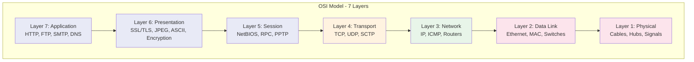
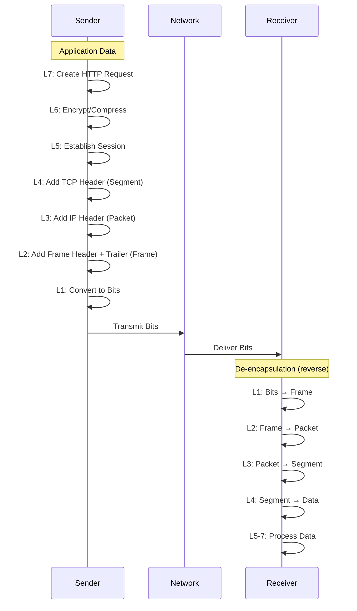

# The OSI Model

> *"All problems in computer science can be solved by another level of indirection."* — David Wheeler

## Overview

The **Open Systems Interconnection (OSI) Model** is a conceptual framework that standardizes network communication into **seven distinct layers**. Developed by the ISO in 1984, it provides a universal language for describing how different network systems communicate.

## Why the OSI Model Matters

- **Troubleshooting**: Isolate problems to a specific layer
- **Standardization**: Vendors can build interoperable products
- **Interviews**: Foundation for nearly every networking question
- **Design Thinking**: Layered abstraction enables modular system design

## The Seven Layers

## Memory Aids

### Mnemonic (Top to Bottom)
**A**ll **P**eople **S**eem **T**o **N**eed **D**ata **P**rocessing

### Mnemonic (Bottom to Top)
**P**lease **D**o **N**ot **T**hrow **S**ausage **P**izza **A**way

## Layer Characteristics

| Layer | Name | PDU | Device | Key Function |
|-------|------|-----|--------|--------------|
| 7 | Application | Data | - | User-facing services |
| 6 | Presentation | Data | - | Encryption, compression |
| 5 | Session | Data | - | Session management |
| 4 | Transport | Segment/Datagram | - | End-to-end delivery |
| 3 | Network | Packet | Router | Routing, logical addressing |
| 2 | Data Link | Frame | Switch | MAC addressing, error detection |
| 1 | Physical | Bit | Hub/Cable | Bit transmission |

## Encapsulation Process

## OSI vs TCP/IP Model

| Aspect | OSI Model | TCP/IP Model |
|--------|-----------|-------------|
| Layers | 7 | 4 (or 5) |
| Development | ISO (1984) | DARPA (1970s) |
| Approach | Theoretical | Practical |
| Usage | Teaching/reference | Actual Internet |
| Layer 3-4 | Separate Transport & Network | Transport & Internet |
| Layer 5-7 | Separate Session/Presentation/App | Single Application layer |

## Interview Questions

### Beginner

**Q1: What is the OSI model and why is it important?**
The OSI model is a 7-layer conceptual framework for understanding network communication. It standardizes how data moves from application to physical transmission, enabling interoperability between different vendors and technologies. It's important because it provides a common vocabulary for troubleshooting and designing networks.

**Q2: What is encapsulation in networking?**
Encapsulation is the process of adding protocol-specific headers (and sometimes trailers) to data as it passes down the OSI layers. Each layer adds its own control information, creating a nested structure. At the receiving end, de-encapsulation removes these headers layer by layer.

**Q3: What is the difference between a hub, switch, and router?**
- **Hub** (Layer 1): Broadcasts incoming bits to all ports; no intelligence
- **Switch** (Layer 2): Uses MAC addresses to forward frames to specific ports
- **Router** (Layer 3): Uses IP addresses to route packets between different networks

### Intermediate

**Q4: Why does the TCP/IP model merge the top three OSI layers into one?**
In practice, the functions of Session, Presentation, and Application layers are tightly coupled. A single application (like a web browser) handles all three: managing sessions (cookies), presentation (TLS, content encoding), and application logic (HTTP). The separation in OSI is useful for teaching but doesn't reflect how protocols are actually implemented.

**Q5: At which layer does a firewall operate, and how does it differ by layer?**
- **Layer 3/4 (Network/Transport)**: Packet filtering based on IP addresses and port numbers (e.g., iptables)
- **Layer 7 (Application)**: Deep packet inspection, can filter based on content, URLs, application behavior (e.g., WAF)

**Q6: Explain the concept of PDUs at each layer.**
Protocol Data Units (PDUs) are the units of data at each layer:
- Layer 7-5: **Data** (application payload)
- Layer 4: **Segment** (TCP) or **Datagram** (UDP)
- Layer 3: **Packet** (with IP header)
- Layer 2: **Frame** (with MAC header and trailer)
- Layer 1: **Bits** (electrical/optical signals)

### Advanced / FAANG-Level

**Q7: A user reports "the internet is slow." Walk me through OSI-layer troubleshooting.**
Systematic bottom-up approach:
1. **Physical**: Check cable connections, Wi-Fi signal strength, link lights on NIC/switch
2. **Data Link**: Verify MAC address learning, check for CRC errors, collisions, VLAN misconfiguration
3. **Network**: Check IP configuration, traceroute for routing issues, DNS resolution, MTU/fragmentation
4. **Transport**: Check for packet loss (TCP retransmissions), port availability, firewall blocks
5. **Session**: Verify session establishment, check for session timeouts
6. **Presentation**: Check TLS handshake failures, certificate issues, encoding problems
7. **Application**: Check HTTP status codes, application errors, CDN issues, server-side problems

**Q8: How does MPLS relate to the OSI model, and why is it called "Layer 2.5"?**
MPLS (Multiprotocol Label Switching) operates between Layer 2 and Layer 3. It uses labels (short, fixed-length identifiers) to make forwarding decisions, combining the speed of Layer 2 switching with the routing intelligence of Layer 3. Routers (called Label Switch Routers) forward packets based on labels rather than IP lookups, enabling traffic engineering and VPNs.

**Q9: In a microservices architecture, how do the OSI layers manifest differently than in traditional monolithic applications?**
In microservices:
- **Layer 7** becomes critical: Service meshes (Envoy, Istio) operate here with L7 load balancing, routing, retries
- **Layer 4-7**: gRPC, HTTP/2 multiplexing between services
- **Layer 3**: Container networking (overlay networks like VXLAN, Calico)
- **Layer 2**: Virtual network interfaces, bridge networks in Docker/Kubernetes
- The traditional boundaries blur: a service mesh proxy handles L4-L7 in a sidecar pattern

## Common Mistakes

1. ❌ Confusing OSI with TCP/IP model — OSI is theoretical, TCP/IP is practical
2. ❌ Thinking each layer adds only a header — Layer 2 adds both header AND trailer (FCS)
3. ❌ Assuming routers operate at Layer 2 — switches do; routers are Layer 3
4. ❌ Forgetting that encryption can happen at multiple layers (TLS at L4/L7, IPsec at L3, MACsec at L2)
5. ❌ Believing data flows strictly top-down — in reality, layers can be bypassed or combined

## Summary

- The OSI model has **7 layers**: Physical, Data Link, Network, Transport, Session, Presentation, Application
- **Encapsulation** adds headers at each layer going down; **de-encapsulation** removes them going up
- TCP/IP model is the practical implementation with **4 layers**
- Each layer serves a specific purpose and communicates with its peer layer on the remote host
- Understanding layers helps with **troubleshooting**, **protocol design**, and **interview answers**

## Cross-References

- [TCP/IP Suite](../tcp-ip/README.md) — The practical implementation
- [TCP Protocol](../tcp/README.md) — Layer 4 deep dive
- [HTTP & Web Protocols](../http/README.md) — Layer 7 protocols
- [Physical Layer](physical.md) — Detailed Layer 1 coverage
- [Data Link Layer](data-link.md) — Detailed Layer 2 coverage

## Cross References

- [TCP/IP Stack](../tcp-ip/README.md)
- [Transport Layer - TCP](../tcp/README.md)
- [HTTP Protocol](../http/README.md)
- [Network Security](../security/README.md)
