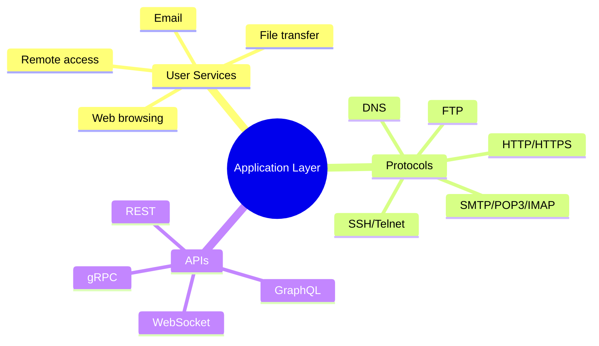
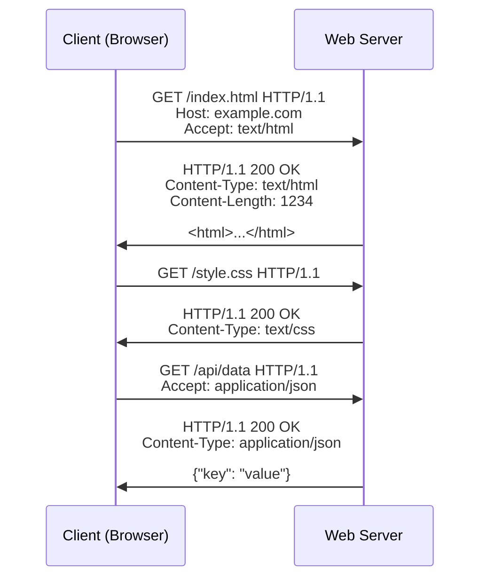
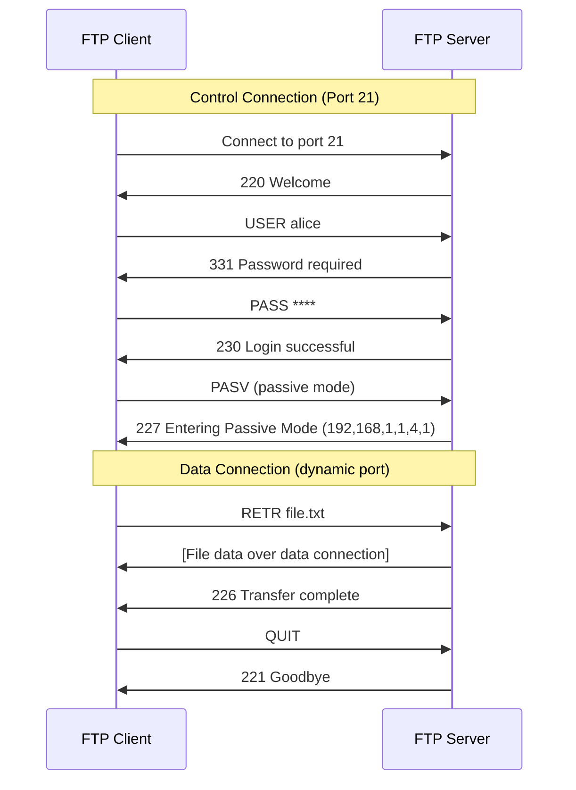
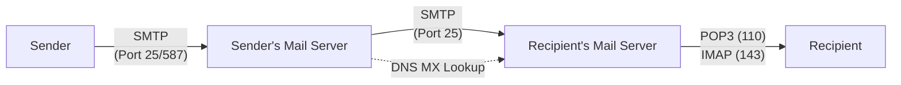
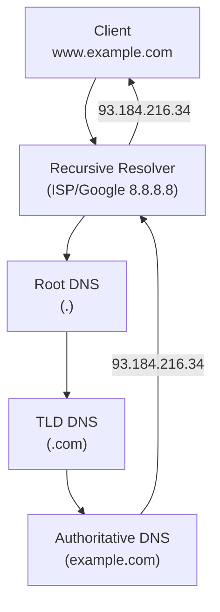
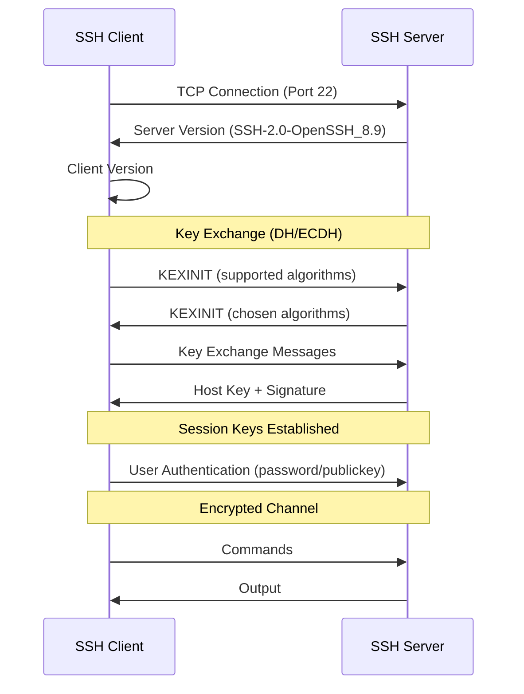
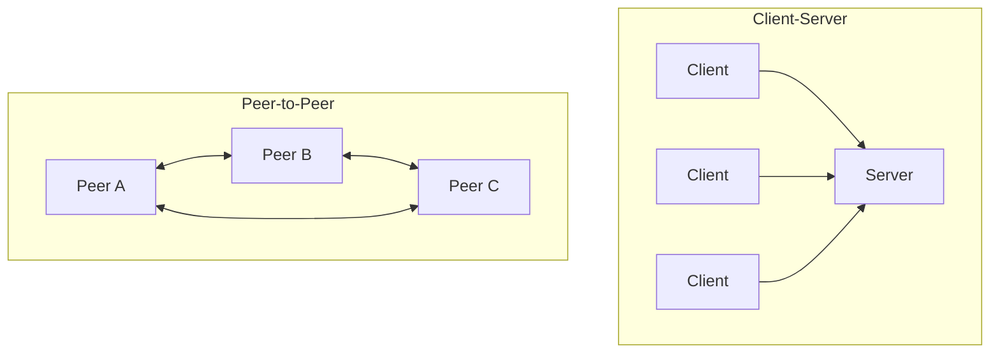

# Application Layer (Layer 7)

> *"The Application Layer is where users interact with the network — every protocol you've heard of (HTTP, DNS, SMTP) lives here."*

## Overview

The **Application Layer** is the topmost layer of the OSI model. It provides network services directly to end-user applications. This is where protocols like HTTP, FTP, SMTP, DNS, and SSH operate. It's the layer closest to the user and furthest from the physical network.

## Core Responsibilities



## Major Application Layer Protocols

### Protocol Overview

| Protocol | Port | Transport | Purpose |
|----------|------|-----------|---------|
| **HTTP** | 80 | TCP | Web browsing |
| **HTTPS** | 443 | TCP+TLS | Secure web |
| **FTP** | 20/21 | TCP | File transfer |
| **SSH** | 22 | TCP | Secure remote access |
| **Telnet** | 23 | TCP | Remote terminal (insecure) |
| **SMTP** | 25/587 | TCP | Email sending |
| **DNS** | 53 | UDP/TCP | Name resolution |
| **DHCP** | 67/68 | UDP | IP configuration |
| **SNMP** | 161/162 | UDP | Network management |
| **NTP** | 123 | UDP | Time synchronization |

## HTTP (HyperText Transfer Protocol)



### HTTP Methods

| Method | Purpose | Idempotent | Safe | Request Body |
|--------|---------|-----------|------|-------------|
| **GET** | Retrieve resource | ✅ | ✅ | No |
| **POST** | Create resource | ❌ | ❌ | Yes |
| **PUT** | Replace resource | ✅ | ❌ | Yes |
| **PATCH** | Partial update | ❌ | ❌ | Yes |
| **DELETE** | Remove resource | ✅ | ❌ | Optional |
| **HEAD** | Headers only | ✅ | ✅ | No |
| **OPTIONS** | Allowed methods | ✅ | ✅ | No |

### HTTP Status Codes

| Range | Category | Examples |
|-------|----------|---------|
| **1xx** | Informational | 100 Continue, 101 Switching Protocols |
| **2xx** | Success | 200 OK, 201 Created, 204 No Content |
| **3xx** | Redirection | 301 Moved Permanently, 302 Found, 304 Not Modified |
| **4xx** | Client Error | 400 Bad Request, 401 Unauthorized, 403 Forbidden, 404 Not Found |
| **5xx** | Server Error | 500 Internal Server Error, 502 Bad Gateway, 503 Service Unavailable |

## FTP (File Transfer Protocol)



- **Two connections**: Control (port 21) and Data (port 20 or dynamic)
- **Active mode**: Server connects back to client (firewall issues)
- **Passive mode**: Client connects to server's data port (preferred)
- **Insecure**: Credentials sent in plaintext (use SFTP/SCP instead)

## Email Protocols



| Protocol | Direction | Purpose |
|----------|-----------|---------|
| **SMTP** | Sending | Transfer email between servers (port 25) and client to server (port 587) |
| **POP3** | Retrieval | Download email to client, usually delete from server |
| **IMAP** | Retrieval | Sync email across devices, keep on server |

### SMTP Flow
```smtp
S: 220 mail.example.com ESMTP
C: HELO client.example.com
S: 250 Hello
C: MAIL FROM:<alice@example.com>
S: 250 OK
C: RCPT TO:<bob@example.com>
S: 250 OK
C: DATA
S: 354 Start mail input
C: Subject: Hello
C: 
C: This is the email body.
C: .
S: 250 OK: Message queued
C: QUIT
S: 221 Bye
```

## DNS (Domain Name System)



(Detailed coverage in [DNS Section](../dns/README.md))

## SSH (Secure Shell)



### SSH Features
- **Encryption**: All traffic encrypted (AES, ChaCha20)
- **Authentication**: Password, public key, certificate
- **Port forwarding**: Tunnel other protocols through SSH
- **File transfer**: SFTP, SCP over SSH tunnel
- **X11 forwarding**: Remote GUI applications

## Application Layer Architecture Patterns

### Client-Server vs P2P



| Aspect | Client-Server | Peer-to-Peer |
|--------|--------------|-------------|
| Centralization | Central server | Decentralized |
| Scalability | Server bottleneck | Scales with peers |
| Management | Easy | Complex |
| Examples | Web, email | BitTorrent, Blockchain |

## Interview Questions

### Beginner

**Q1: What is the Application Layer?**
The Application Layer is the top layer of the OSI model where network applications and their protocols reside. It provides services directly to users: web browsing (HTTP), email (SMTP/IMAP), file transfer (FTP), name resolution (DNS), and remote access (SSH). Despite its name, it doesn't include the applications themselves — it includes the protocols applications use to communicate.

**Q2: What's the difference between HTTP and HTTPS?**
HTTP sends data in plaintext; HTTPS wraps HTTP in TLS encryption. HTTPS provides:
- **Encryption**: Data can't be read by eavesdroppers
- **Authentication**: Server identity verified via certificates
- **Integrity**: Data can't be tampered with in transit
HTTPS uses port 443; HTTP uses port 80.

**Q3: Why do we need DNS?**
Humans remember names (google.com), but computers route using IP addresses (142.250.185.78). DNS translates human-readable domain names to IP addresses. Without DNS, you'd have to memorize IP addresses for every website. DNS is like the Internet's phone book.

### Intermediate

**Q4: Explain the difference between POP3 and IMAP.**
- **POP3**: Downloads email to the client, typically deletes from server. Email exists on one device. Simple, low server storage.
- **IMAP**: Keeps email on the server, syncs across devices. Supports folders, flags, search. Higher server storage needs.
- Modern choice: **IMAP** (or cloud-based like Gmail) — users expect multi-device access.

**Q5: How does passive FTP solve firewall issues?**
In active FTP, the server connects back to the client on a dynamic port — firewalls block this incoming connection. In passive FTP:
1. Client sends PASV command
2. Server responds with a port number to connect to
3. Client initiates BOTH connections (control + data) to the server
4. Firewall only needs outbound rules, which are typically allowed

**Q6: Compare REST and GraphQL at the Application Layer.**
| Aspect | REST | GraphQL |
|--------|------|---------|
| Endpoints | Multiple (/users, /posts) | Single (/graphql) |
| Data fetching | Fixed structure per endpoint | Client specifies exact fields |
| Over-fetching | Common | Eliminated |
| Under-fetching | Multiple requests needed | Single request |
| Caching | HTTP caching works well | Complex (POST-based) |
| Learning curve | Lower | Higher |

### Advanced / FAANG-Level

**Q7: Design an email delivery system for 100 million users.**
Architecture:
1. **Inbound (SMTP)**: MX records → Load balancers → SMTP servers (Postfix) → Spam filter (SpamAssassin) → Queue (RabbitMQ)
2. **Storage**: Distributed mail store (Cassandra for metadata, S3 for attachments)
3. **Outbound (IMAP)**: IMAP servers (Dovecot) → Load balancers → Clients
4. **Web interface**: Web servers → API servers → Mail store
5. **Anti-spam**: SPF, DKIM, DMARC verification; ML-based filtering
6. **Push notifications**: IMAP IDLE or FCM/APNs for mobile
7. **Search**: Elasticsearch for full-text search
8. **Reliability**: Multi-region, DNS failover, message replication

**Q8: How would you design a global DNS infrastructure?**
Design:
1. **Anycast routing**: Same IP announced from multiple locations (Cloudflare, Google model)
2. **Hierarchical caching**: Browser → OS → Recursive resolver → Root → TLD → Authoritative
3. **GeoDNS**: Return different IPs based on client location
4. **Load balancing**: DNS-based load balancing across data centers
5. **DDoS protection**: Rate limiting, caching, Anycast distribution
6. **DNSSEC**: Cryptographic signatures for DNS responses
7. **Monitoring**: Real-time query analytics, anomaly detection
8. **Redundancy**: Multiple authoritative servers, diverse networks

**Q9: Explain the evolution from HTTP/1.0 to HTTP/3 and the problems each solved.**
1. **HTTP/1.0** (1996): One request per TCP connection. Problem: TCP handshake overhead for every resource.
2. **HTTP/1.1** (1997): Persistent connections, pipelining. Problem: Head-of-line blocking, no multiplexing.
3. **HTTP/2** (2015): Binary framing, multiplexing, header compression, server push. Problem: TCP-level head-of-line blocking (one lost packet blocks all streams).
4. **HTTP/3** (2022): QUIC over UDP, per-stream reliability, 0-RTT, connection migration. Solves TCP HOL blocking.

Each generation solved the previous one's fundamental limitation.

## Common Mistakes

1. ❌ Thinking the Application Layer includes the actual application — it's the protocols, not the software
2. ❌ Confusing HTTP methods — GET is idempotent and safe, POST is neither
3. ❌ Forgetting that FTP uses two connections — control and data
4. ❌ Assuming DNS only does forward lookups — reverse lookups (PTR) and other types exist
5. ❌ Using Telnet for remote access — always use SSH (encrypted)

## Summary

- Application Layer provides **network services to applications** via protocols
- **HTTP**: Web protocol, request-response, stateless
- **DNS**: Name resolution, hierarchical, cached
- **Email**: SMTP (send), IMAP/POP3 (retrieve)
- **SSH**: Encrypted remote access and file transfer
- **FTP**: File transfer with separate control/data connections
- Architecture patterns: Client-Server, P2P, Microservices

## Cross-References

- [HTTP Deep Dive](../http/README.md) — HTTP/1.1, HTTP/2, HTTP/3
- [DNS Deep Dive](../dns/README.md) — Resolution, records, security
- [REST](../http/rest.md) — API design patterns
- [WebSocket](../http/websocket.md) — Full-duplex communication
- [gRPC](../http/grpc.md) — High-performance RPC

## Cross References

- [HTTP](../http/README.md)
- [DNS](../dns/README.md)
- [gRPC](../http/grpc.md)
- [REST](../http/rest.md)
- [Presentation Layer](presentation.md)
