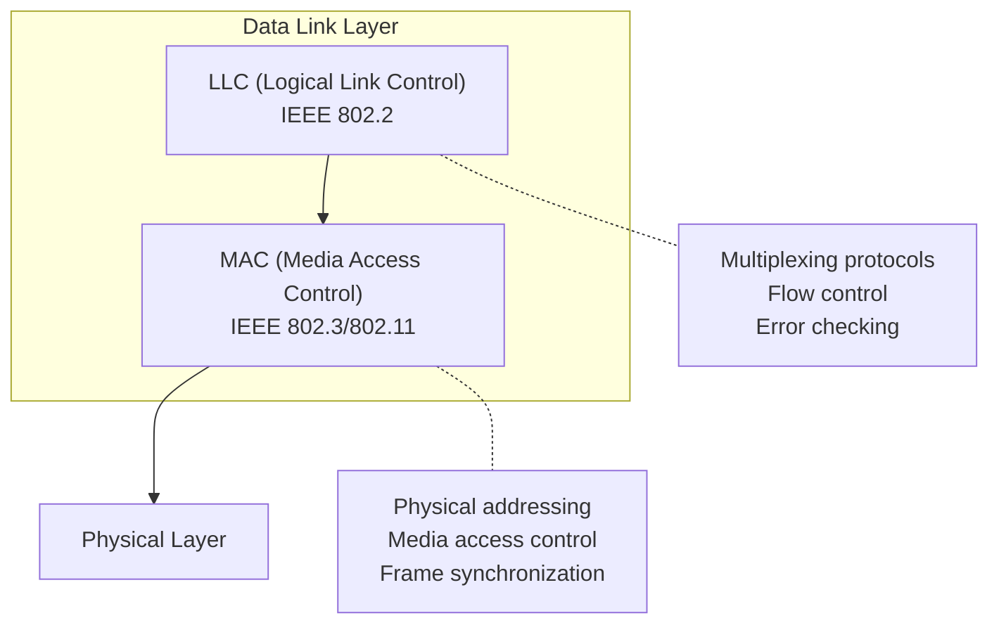
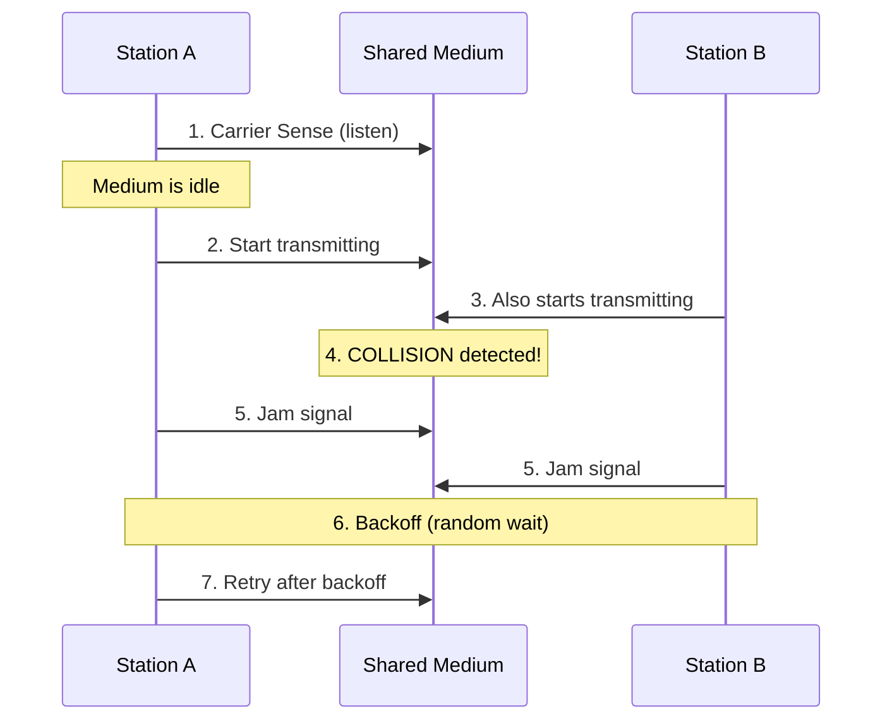
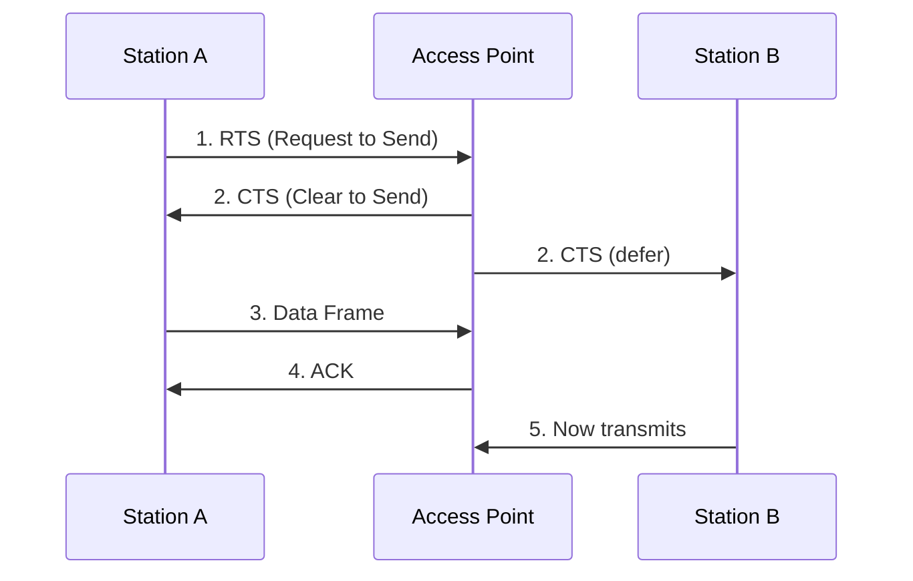
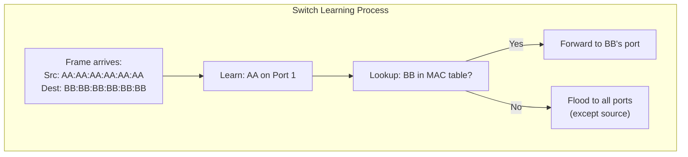
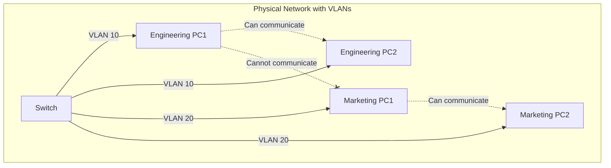
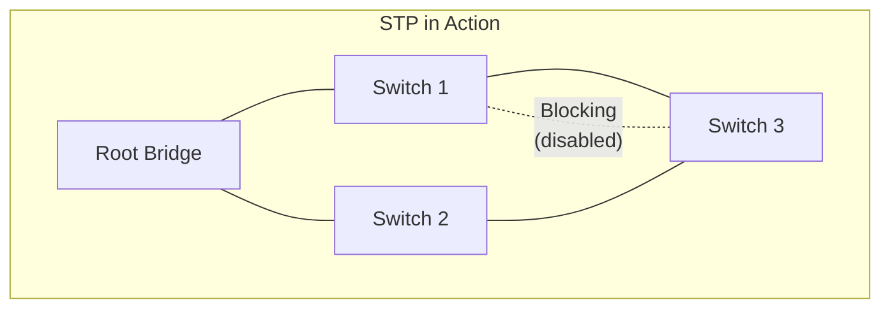

# Data Link Layer (Layer 2)

> *"The Data Link Layer is where raw bits become meaningful frames — the first layer that understands 'packets'."*

## Overview

The **Data Link Layer** provides node-to-node data transfer between two directly connected nodes. It takes raw bits from the Physical Layer and organizes them into **frames**, handles **error detection/correction**, and manages **access to the shared medium**.

## Sub-layers



### MAC Sub-layer
- **Physical addressing** (MAC addresses — 48-bit, burned into NIC)
- **Media access control** (who gets to transmit when)
- **Frame delimiting** (start/end markers)

### LLC Sub-layer
- **Protocol multiplexing** (identifying Network Layer protocol)
- **Flow control** (preventing receiver overflow)
- **Error detection** (checksum verification)

## Frame Structure

### Ethernet Frame (IEEE 802.3)

```
┌──────────┬──────────┬───────────┬──────┬─────────┬─────┐
│ Preamble │ Dest MAC │ Src MAC   │ Type │ Payload │ FCS │
│ 8 bytes  │ 6 bytes  │ 6 bytes   │2 bytes│46-1500B │4 B  │
└──────────┴──────────┴───────────┴──────┴─────────┴─────┘
```

| Field | Size | Purpose |
|-------|------|---------|
| **Preamble** | 8 bytes | Synchronization (101010... pattern) |
| **Destination MAC** | 6 bytes | Target device's hardware address |
| **Source MAC** | 6 bytes | Sender's hardware address |
| **EtherType** | 2 bytes | Network layer protocol (0x0800=IPv4, 0x0806=ARP, 0x86DD=IPv6) |
| **Payload** | 46-1500 bytes | Network layer data (padded if < 46 bytes) |
| **FCS** | 4 bytes | Frame Check Sequence (CRC-32) |

### MTU and Frames
- **MTU (Maximum Transmission Unit)**: 1500 bytes for standard Ethernet
- **Jumbo Frames**: 9000 bytes (used in data centers for efficiency)
- If payload > MTU, the Network Layer must **fragment** the packet

## MAC Addresses

```
Example: 00:1A:2B:3C:4D:5E

┌─────────────────┬─────────────────┐
│   OUI (3 bytes) │  NIC (3 bytes)  │
│  00:1A:2B       │  3C:4D:5E       │
│  (Manufacturer) │  (Device ID)    │
└─────────────────┴─────────────────┘
```

- **48 bits** (6 bytes), written as 12 hex digits
- **First 24 bits**: OUI (Organizationally Unique Identifier) — identifies manufacturer
- **Last 24 bits**: Device identifier — unique within that manufacturer
- **Special addresses**:
  - `FF:FF:FF:FF:FF:FF` — Broadcast
  - Bit 0 of first octet: 0 = unicast, 1 = multicast

### MAC vs IP Address

| Aspect | MAC Address | IP Address |
|--------|------------|------------|
| Layer | Data Link (L2) | Network (L3) |
| Scope | Local network segment | Global (routed) |
| Assignment | Hardware-burned or spoofed | Configured or DHCP |
| Format | 48-bit hex | 32-bit (IPv4) or 128-bit (IPv6) |
| Changes? | Usually fixed | Changes per network |

## Media Access Control Methods

### CSMA/CD (Ethernet - Legacy)



**Steps**: **C**arrier **S**ense → **M**ultiple **A**ccess → **C**ollision **D**etection

- **Listen before transmitting**: Check if medium is busy
- **Collision detection**: Monitor for signal degradation during transmission
- **Binary exponential backoff**: Wait time doubles with each collision
- **Note**: CSMA/CD is largely obsolete — modern Ethernet uses switches with full-duplex

### CSMA/CA (Wi-Fi - 802.11)



**Steps**: **C**arrier **S**ense → **M**ultiple **A**ccess → **C**ollision **A**voidance

- **Cannot detect collisions** (wireless — can't listen while transmitting)
- **Avoids collisions** using RTS/CTS handshake and ACK
- **Hidden node problem**: Two stations can hear AP but not each other

### Token Passing (Legacy)

- A **token** circulates the network
- Only the station holding the token can transmit
- No collisions, deterministic access
- Used in Token Ring (IEEE 802.5) and FDDI — now obsolete

## Switching Concepts

### MAC Address Learning



1. Switch receives frame
2. **Learns** source MAC → port mapping
3. **Looks up** destination MAC in forwarding table
4. **Forwards** to specific port OR **floods** if unknown

### VLANs (Virtual LANs)



- **Logically segments** a physical network
- **802.1Q tag** (4 bytes) inserted in frame header: PRI(3b) | CFI(1b) | VLAN ID(12b)
- Benefits: Security isolation, broadcast domain reduction, flexible grouping

## Error Detection

### CRC (Cyclic Redundancy Check)

```
Generator Polynomial: x³² + x²⁶ + x²³ + ... + x² + x + 1 (CRC-32)

Sender:
  1. Append 32 zero bits to data
  2. Divide by generator polynomial (XOR)
  3. Replace zeros with remainder (FCS)

Receiver:
  1. Divide received data + FCS by same polynomial
  2. If remainder = 0: No errors detected
  3. If remainder ≠ 0: Error detected, discard frame
```

- **CRC-32** used in Ethernet: detects all burst errors ≤ 32 bits
- **Not error correction** — only detection. Retransmission needed.

### Parity Check

- **Simple parity**: Add 1 bit to make total number of 1s even (or odd)
- **2D parity**: Arrange bits in matrix, compute parity for each row and column
- Can detect and locate single-bit errors (2D only)

## Spanning Tree Protocol (STP)

Prevents **loops** in switched networks with redundant paths.



1. **Elect Root Bridge** (lowest Bridge ID)
2. **Select Root Ports** (best path to root on each switch)
3. **Select Designated Ports** (best path on each segment)
4. **Block remaining ports** to eliminate loops

**Variants**: STP (802.1D), RSTP (802.1w — rapid convergence), MSTP (802.1s — multiple spanning trees)

## Interview Questions

### Beginner

**Q1: What is a MAC address and how is it different from an IP address?**
A MAC address is a 48-bit hardware identifier burned into the Network Interface Card (NIC). It operates at Layer 2 and is used for local network communication. An IP address is a logical address (Layer 3) that can change based on network location and is used for routing across networks. MAC = local delivery; IP = global routing.

**Q2: What is a frame and how does it differ from a packet?**
A frame is a Layer 2 PDU that includes MAC addresses, EtherType, payload, and error-checking (FCS). A packet is a Layer 3 PDU that includes IP addresses and routing information. A frame encapsulates a packet — the packet sits inside the frame's payload field.

**Q3: Why do we need the Data Link Layer?**
The Data Link Layer is necessary because:
- Physical layer only sends raw bits with no addressing
- Need to identify which device should receive the data
- Need error detection (bits can flip during transmission)
- Need to control access to shared media (prevent collisions)
- Need flow control to prevent overwhelming slow receivers

### Intermediate

**Q4: Explain CSMA/CD and why it's mostly obsolete.**
CSMA/CD (Carrier Sense Multiple Access with Collision Detection) works by: (1) listening before transmitting, (2) detecting collisions during transmission, (3) sending a jam signal and backing off with exponential random delay. It's obsolete because modern Ethernet uses switches with dedicated collision domains per port and full-duplex communication — collisions simply can't happen.

**Q5: How does a switch learn MAC addresses?**
When a switch receives a frame, it: (1) reads the source MAC address and records it with the incoming port in its MAC address table, (2) looks up the destination MAC — if found, forwards to that port only; if not found, floods to all ports except source. The table entries age out (typically 300 seconds) to handle moved devices.

**Q6: What problem does STP solve and how?**
STP prevents broadcast storms and frame loops in networks with redundant switch links. It works by: electing a root bridge (lowest priority/MAC), calculating the shortest path to the root from each switch, and blocking redundant ports. This creates a loop-free tree topology while maintaining backup paths that can be activated if a link fails.

### Advanced / FAANG-Level

**Q7: How does VXLAN work and why is it important in modern data centers?**
VXLAN (Virtual Extensible LAN) is a Layer 2 overlay on Layer 3 networks. It encapsulates Ethernet frames in UDP packets with a 24-bit VNI (VXLAN Network Identifier), supporting 16 million virtual networks (vs 4094 with 802.1Q VLANs). In modern data centers (cloud, Kubernetes), VXLAN enables:
- Multi-tenant isolation at massive scale
- Layer 2 adjacency across Layer 3 boundaries (VM migration)
- Network virtualization decoupled from physical topology

**Q8: Compare ARP, RARP, and their modern replacements.**
- **ARP**: Maps IP → MAC (broadcasts "who has this IP?"). Security risk: ARP spoofing
- **RARP**: Maps MAC → IP (diskless workstation boot). Obsolete
- **Modern replacements**: 
  - ARP → **NDP (Neighbor Discovery Protocol)** in IPv6 using ICMPv6 multicast
  - RARP → **DHCP** for dynamic IP assignment
  - Security: **Dynamic ARP Inspection** and **802.1X** for port-based authentication

**Q9: Design a Layer 2 network for a 1000-server data center with microsegmentation.**
Design considerations:
- **Clos/Fat-Tree topology**: Leaf-spine architecture for predictable latency
- **EVPN-VXLAN**: Overlay for L2 connectivity over L3 fabric
- **Microsegmentation**: Security groups at vSwitch level (NSX-T, Calico)
- **MLAG**: Multi-chassis LAG for server redundancy without STP
- **DCBX**: Data Center Bridging for lossless Ethernet (iSCSI, RoCE)
- **Monitoring**: sFlow/NetFlow on every leaf for visibility

## Common Mistakes

1. ❌ Thinking MAC addresses are globally unique — they should be, but MAC spoofing is trivial
2. ❌ Confusing collision domain with broadcast domain — switches break collision domains, routers break broadcast domains
3. ❌ Forgetting that ARP operates between Layer 2 and Layer 3
4. ❌ Assuming switches are "just like hubs" — switches are intelligent, hubs are dumb
5. ❌ Mixing up MTU and MSS — MTU is L2 max (1500B), MSS is L4 max (MTU - headers)

## Summary

- Data Link Layer provides **node-to-node delivery** using MAC addresses
- Organizes bits into **frames** with headers and error-checking (FCS/CRC)
- **MAC address**: 48-bit hardware identifier for local delivery
- **CSMA/CD** (Ethernet) and **CSMA/CA** (Wi-Fi) manage media access
- **Switches** learn MAC addresses and forward frames intelligently
- **VLANs** logically segment networks; **STP** prevents loops
- Modern innovations: VXLAN, EVPN, microsegmentation for cloud-scale networks

## Cross-References

- [Physical Layer](physical.md) — Raw bit transmission
- [Network Layer](network.md) — IP addressing and routing
- [ARP](../tcp-ip/arp.md) — Address resolution protocol
- [Subnetting](../tcp-ip/subnetting.md) — How L2 and L3 addressing interact
