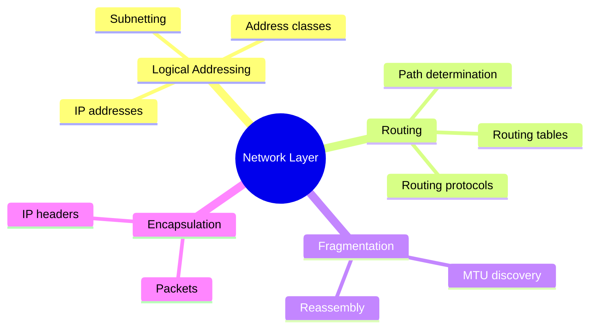
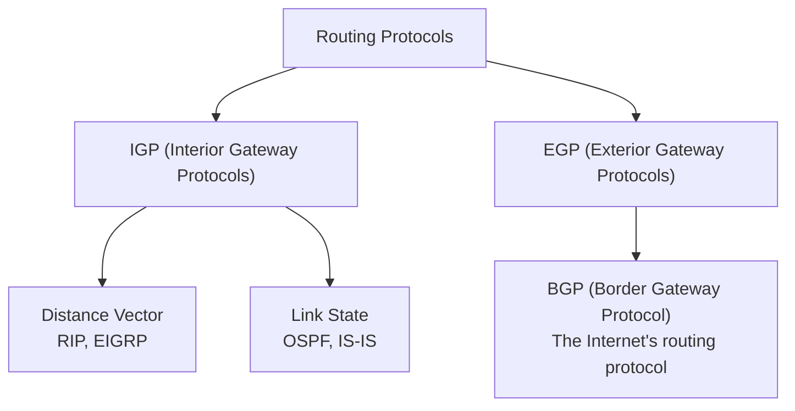
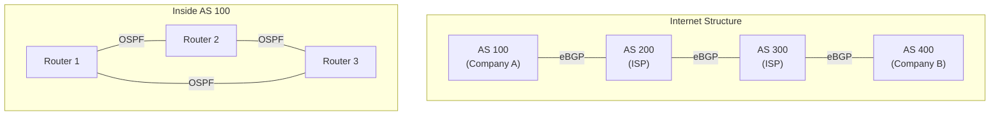
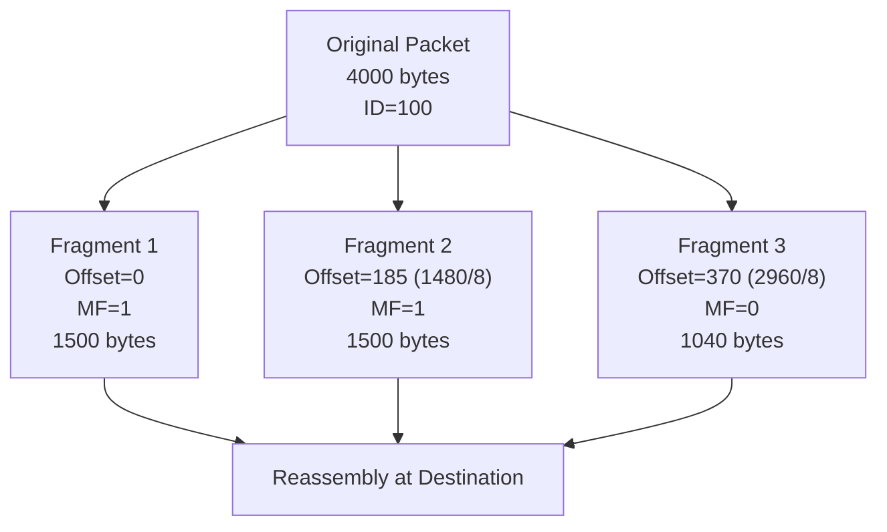
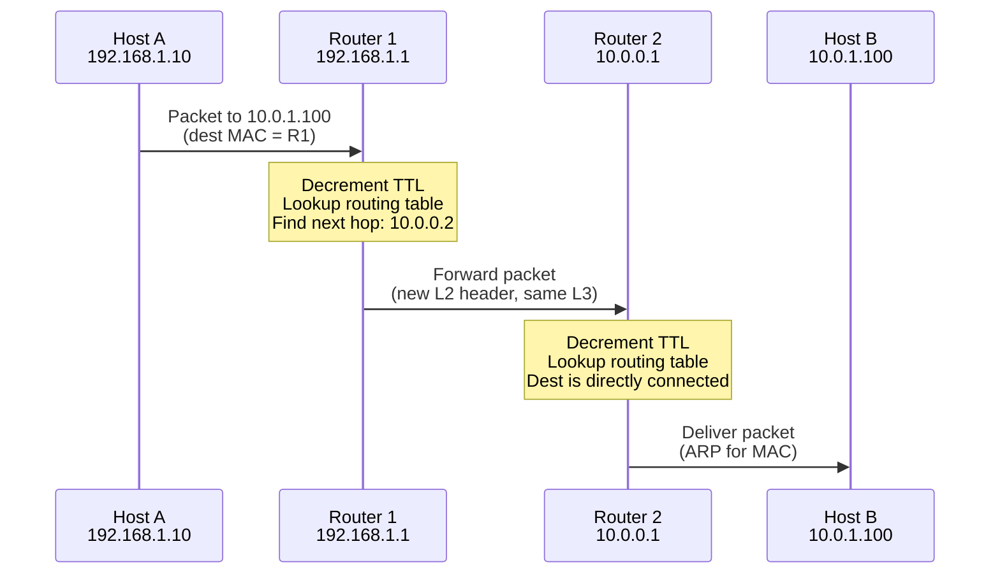

# Network Layer (Layer 3)

> *"The Network Layer is the Internet's postal system — it knows how to get a packet from any source to any destination across the globe."*

## Overview

The **Network Layer** provides **end-to-end logical addressing** and **routing** across multiple networks. It determines the best path from source to destination, handles packet fragmentation, and manages the logical topology of the network.

## Responsibilities



### Core Functions

1. **Logical Addressing**: IP addresses identify devices globally
2. **Routing**: Determine best path across multiple networks
3. **Fragmentation/Reassembly**: Break packets too large for underlying network
4. **Quality of Service**: Traffic prioritization and handling

## IP Addressing (Overview)

### IPv4 Address Structure
```
192.168.1.100
├── Network Part (first N bits)
└── Host Part (remaining bits)

Binary: 11000000.10101000.00000001.01100100
```

### Address Classes (Legacy)

| Class | Range | Default Mask | Networks | Hosts/Network |
|-------|-------|-------------|----------|---------------|
| A | 1.0.0.0 – 126.255.255.255 | /8 (255.0.0.0) | 126 | 16,777,214 |
| B | 128.0.0.0 – 191.255.255.255 | /16 (255.255.0.0) | 16,384 | 65,534 |
| C | 192.0.0.0 – 223.255.255.255 | /24 (255.255.255.0) | 2,097,152 | 254 |
| D | 224.0.0.0 – 239.255.255.255 | - | Multicast | - |
| E | 240.0.0.0 – 255.255.255.255 | - | Reserved | - |

### Special Addresses
- `0.0.0.0` — Default route / "any address"
- `127.0.0.1` — Loopback (localhost)
- `255.255.255.255` — Limited broadcast
- `10.0.0.0/8`, `172.16.0.0/12`, `192.168.0.0/16` — Private ranges (RFC 1918)
- `169.254.0.0/16` — Link-local (APIPA)

## Routing

### Routing Table

```bash
$ ip route show
default via 192.168.1.1 dev eth0
192.168.1.0/24 dev eth0 scope link
10.0.0.0/8 via 192.168.1.254 dev eth0
```

Each entry: **Destination** | **Next Hop** | **Interface** | **Metric**

### Routing Protocols



| Protocol | Type | Algorithm | Metric | Convergence | Use Case |
|----------|------|-----------|--------|-------------|----------|
| **RIP** | Distance Vector | Bellman-Ford | Hop count (max 15) | Slow | Small networks |
| **OSPF** | Link State | Dijkstra SPF | Cost (bandwidth) | Fast | Enterprise |
| **EIGRP** | Hybrid (DUAL) | DUAL | Composite | Fast | Cisco-only |
| **IS-IS** | Link State | SPF | Metric | Fast | ISP backbone |
| **BGP** | Path Vector | Best path selection | AS path, policies | Moderate | Internet backbone |

### OSPF vs BGP



- **OSPF** runs **inside** an autonomous system (intra-AS routing)
- **BGP** runs **between** autonomous systems (inter-AS routing)
- BGP is the **routing protocol of the Internet** — it determines how traffic crosses organizational boundaries

## IP Packet Structure

### IPv4 Header (20-60 bytes)

```
 0                   1                   2                   3
 0 1 2 3 4 5 6 7 8 9 0 1 2 3 4 5 6 7 8 9 0 1 2 3 4 5 6 7 8 9 0 1
├─┼─┼─┼─┼─┼─┼─┼─┼─┼─┼─┼─┼─┼─┼─┼─┼─┼─┼─┼─┼─┼─┼─┼─┼─┼─┼─┼─┼─┼─┼─┼─┤
│Version│  IHL  │    DSCP   │ECN│         Total Length              │
├───────┴───────┼───────────┴───┼───────────────────────────────────┤
│         Identification         │Flags│     Fragment Offset        │
├───────────────┼───────────────┼─────┴─────────────────────────────┤
│  Time to Live │   Protocol    │        Header Checksum            │
├───────────────┴───────────────┼───────────────────────────────────┤
│                      Source IP Address                            │
├──────────────────────────────────────────────────────────────────┤
│                    Destination IP Address                         │
├──────────────────────────────────────────────────────────────────┤
│                    Options (if IHL > 5)                           │
└──────────────────────────────────────────────────────────────────┘
```

| Field | Size | Purpose |
|-------|------|---------|
| **Version** | 4 bits | IP version (4 for IPv4) |
| **IHL** | 4 bits | Header length in 32-bit words (5 = 20 bytes) |
| **DSCP** | 6 bits | Differentiated Services (QoS) |
| **ECN** | 2 bits | Explicit Congestion Notification |
| **Total Length** | 16 bits | Total packet size (max 65,535 bytes) |
| **Identification** | 16 bits | Fragment identification |
| **Flags** | 3 bits | Don't Fragment, More Fragments |
| **Fragment Offset** | 13 bits | Position of fragment in original packet |
| **TTL** | 8 bits | Hop limit (decremented each router) |
| **Protocol** | 8 bits | Upper layer protocol (6=TCP, 17=UDP, 1=ICMP) |
| **Header Checksum** | 16 bits | Error detection for header only |
| **Source/Dest IP** | 32 bits each | Logical addresses |

## Fragmentation



- **MTU** of Ethernet = 1500 bytes
- If packet > MTU, router **fragments** it
- **Don't Fragment (DF) bit**: If set and packet is too big → router drops it and sends ICMP "Fragmentation Needed"
- **Path MTU Discovery**: Source sends with DF=1, discovers smallest MTU on path

## Routing Process



Key observations:
- **IP addresses** stay the same end-to-end (logical path)
- **MAC addresses** change at each hop (physical delivery)
- **TTL** decrements at each router (prevents infinite loops)

## Interview Questions

### Beginner

**Q1: What is the difference between routing and forwarding?**
- **Routing** is the process of determining the path packets should take (building routing tables using protocols like OSPF, BGP)
- **Forwarding** is the actual movement of a packet from input to output port based on the routing table
- Routing = planning the map; Forwarding = driving the route

**Q2: Why do we need both MAC and IP addresses?**
MAC addresses handle local delivery within a network segment (Layer 2). IP addresses handle routing across multiple networks (Layer 3). When a packet travels across the Internet, the IP address stays constant (identifying the final destination), but the MAC address changes at each hop (identifying the next immediate device). Without IP, you couldn't route across networks; without MAC, you couldn't deliver locally.

**Q3: What is TTL and why is it important?**
TTL (Time To Live) is an 8-bit field in the IP header that's decremented by 1 at each router. When it reaches 0, the packet is discarded and an ICMP "Time Exceeded" message is sent back. This prevents packets from looping forever in the network due to routing loops. The traceroute tool uses TTL to discover the path to a destination.

### Intermediate

**Q4: Explain OSPF's link-state database and SPF algorithm.**
Each OSPF router builds a complete map of the network topology (link-state database) by flooding Link-State Advertisements (LSAs). Using Dijkstra's Shortest Path First algorithm, each router independently calculates the shortest path to every destination. This is different from RIP which only knows about neighbors. OSPF converges faster because every router has the full picture and can recalculate immediately when a link changes.

**Q5: How does Path MTU Discovery work?**
1. Source sends packet with DF (Don't Fragment) bit set
2. If a router on the path has an MTU smaller than the packet, it drops the packet
3. Router sends back ICMP "Fragmentation Needed" with the MTU of the bottleneck link
4. Source reduces packet size and retries
5. Process repeats until packets reach the destination
6. This avoids fragmentation overhead (which hurts performance)

**Q6: Compare OSPF and BGP.**
| Aspect | OSPF | BGP |
|--------|------|-----|
| Scope | Intra-AS (within organization) | Inter-AS (between organizations) |
| Algorithm | Dijkstra SPF | Path vector |
| Metric | Cost (bandwidth-based) | AS path, local preference, MED |
| Transport | IP protocol 89 (raw) | TCP port 179 |
| Convergence | Fast (seconds) | Slower (minutes) |
| Scale | Hundreds of routers | Internet-scale (900k+ prefixes) |

### Advanced / FAANG-Level

**Q7: How does BGP determine the "best path" when multiple routes exist to the same destination?**
BGP's best path selection algorithm (simplified):
1. **Highest LOCAL_PREF** (local policy)
2. **Shortest AS_PATH** (fewest autonomous systems traversed)
3. **Lowest origin type** (IGP < EGP < Incomplete)
4. **Lowest MED** (multi-exit discriminator)
5. **eBGP over iBGP** (external routes preferred)
6. **Lowest IGP metric to next hop** (closest exit)
7. **Oldest route** (stability)
8. **Lowest router ID** (tiebreaker)

**Q8: A company has a /24 prefix announced via two ISPs. How do you ensure inbound traffic uses the primary ISP?**
Strategies:
1. **AS_PATH prepending**: Make the backup path appear longer by repeating your AS number
2. **MED (Multi-Exit Discriminator)**: Signal preferred path to specific neighbor AS
3. **Community-based**: Use ISP communities to influence local preference in their network
4. **DNS-based**: Return different IP addresses from DNS based on health
5. **BGP communities + local pref**: Ask ISPs to set local preference based on communities you tag

**Q9: Design an IP addressing scheme for a company with 5 offices, each needing 500 hosts, with room for growth.**
```
Headquarters: 10.1.0.0/22 (1022 hosts, room for 500+)
Office 2:     10.2.0.0/22
Office 3:     10.3.0.0/22
Office 4:     10.4.0.0/22
Office 5:     10.5.0.0/22
WAN Links:    10.100.0.0/24 (point-to-point /30s)
Future:       10.6.0.0/22 through 10.255.0.0/22
```
- Use /22 per office (1022 hosts) for 500 hosts + growth
- Summarize to 10.0.0.0/8 at border for BGP
- Use RFC 1918 private addressing internally
- NAT at each office for Internet access

## Common Mistakes

1. ❌ Confusing routing with forwarding — routing is path selection, forwarding is packet movement
2. ❌ Forgetting TTL is decremented at each hop — traceroute depends on this
3. ❌ Assuming IP is reliable — it's best-effort, no guarantees (TCP adds reliability)
4. ❌ Mixing up ARP with routing — ARP resolves IP to MAC locally; routing is for remote destinations
5. ❌ Thinking NAT is part of the IP standard — it's a workaround for IPv4 exhaustion

## Summary

- Network Layer provides **logical addressing (IP)** and **routing** across networks
- **IPv4** uses 32-bit addresses; **IPv6** uses 128-bit addresses
- **Routing protocols**: OSPF (intra-AS), BGP (inter-AS, Internet backbone)
- **Fragmentation** handles MTU differences; Path MTU Discovery optimizes it
- **IP is unreliable** — no delivery guarantees, ordering, or duplicate protection
- **TTL** prevents infinite loops; each router decrements by 1

## Cross-References

- [IPv4](../tcp-ip/ipv4.md) — Detailed IPv4 coverage
- [IPv6](../tcp-ip/ipv6.md) — Next generation addressing
- [Subnetting](../tcp-ip/subnetting.md) — Dividing networks efficiently
- [ICMP](../tcp-ip/icmp.md) — Network layer error reporting
- [ARP](../tcp-ip/arp.md) — Address resolution

## Cross References

- [Data Link Layer](data-link.md)
- [IP Protocol](../tcp-ip/ip.md)
- [Routing](../routing/README.md)
- [Subnetting](../tcp-ip/subnetting.md)
