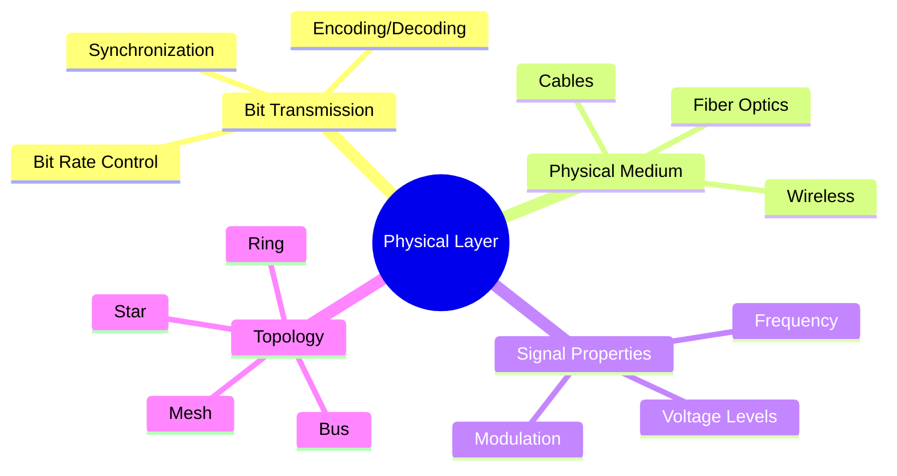
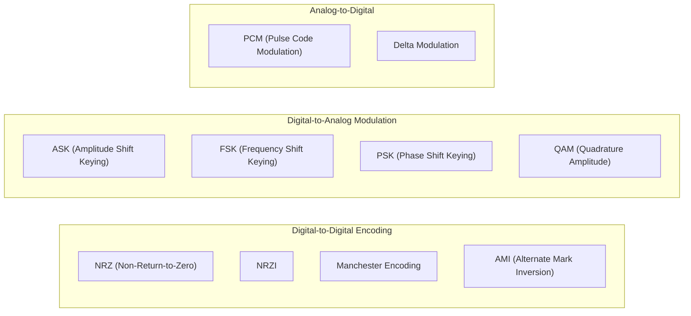
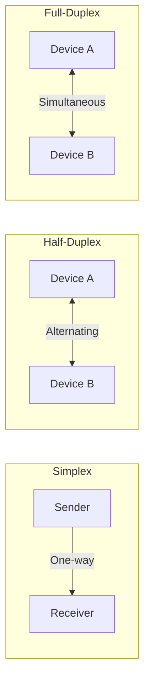
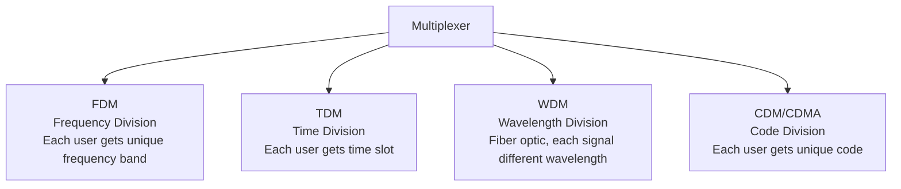

# Physical Layer (Layer 1)

> *"The Physical Layer is where the rubber meets the road — or rather, where the electrons meet the wire."*

## Overview

The **Physical Layer** is the lowest layer of the OSI model. It deals with the raw transmission of bits over a physical medium. It defines electrical, mechanical, and procedural specifications for activating, maintaining, and deactivating physical connections.

## Responsibilities



### Core Functions

1. **Bit Encoding**: Converting bits to electrical, optical, or radio signals
2. **Data Rate Control**: How many bits per second (bandwidth)
3. **Synchronization**: Ensuring sender and receiver agree on bit timing
4. **Physical Topology**: How devices are physically connected
5. **Transmission Mode**: Simplex, half-duplex, or full-duplex

## Transmission Media

### Guided (Wired)

| Medium | Speed | Distance | Cost | Use Case |
|--------|-------|----------|------|----------|
| **Cat 5e (UTP)** | 1 Gbps | 100m | Low | LAN, home networks |
| **Cat 6/6a** | 10 Gbps | 100m/55m | Medium | Enterprise LAN |
| **Cat 8** | 40 Gbps | 30m | High | Data centers |
| **Coaxial** | 1 Gbps | 500m | Medium | Cable TV, legacy |
| **Single-mode Fiber** | 100+ Gbps | 100+ km | High | Long-haul, WAN |
| **Multi-mode Fiber** | 100 Gbps | 2 km | Medium | Data centers, campus |

### Unguided (Wireless)

| Technology | Standard | Speed | Range |
|-----------|---------|-------|-------|
| **Wi-Fi 6** | 802.11ax | 9.6 Gbps | ~100m |
| **Wi-Fi 7** | 802.11be | 46 Gbps | ~100m |
| **Bluetooth 5.3** | IEEE 802.15.1 | 50 Mbps | ~240m |
| **5G NR** | 3GPP | 20 Gbps | ~500m (mmWave) |
| **Satellite (Starlink)** | - | 300 Mbps | Global |

## Signal Encoding Techniques



### Manchester Encoding
Used in classic Ethernet (10BASE-T):
- **Low-to-High** transition = bit `0`
- **High-to-Low** transition = bit `1`
- Advantage: Self-clocking (no separate clock signal needed)

## Transmission Modes



- **Simplex**: One-way only (TV broadcast, keyboard to CPU)
- **Half-Duplex**: Both ways, but one at a time (walkie-talkie)
- **Full-Duplex**: Simultaneous both ways (telephone, modern Ethernet)

## Key Devices

| Device | Layer | Function |
|--------|-------|----------|
| **Hub** | 1 | Broadcasts bits to all ports |
| **Repeater** | 1 | Regenerates signal to extend distance |
| **Modem** | 1 | Modulates/demodulates signals (digital↔analog) |
| **Transceiver** | 1 | Converts between different media types |

## Nyquist & Shannon Theorems

### Nyquist Theorem (Noiseless Channel)
```
Maximum Data Rate = 2 × B × log₂(V) bits/sec
```
- B = bandwidth (Hz)
- V = number of discrete signal levels

### Shannon Theorem (Noisy Channel)
```
Maximum Data Rate = B × log₂(1 + S/N) bits/sec
```
- B = bandwidth (Hz)
- S/N = signal-to-noise ratio
- **Shannon limit**: Theoretical maximum regardless of encoding

**Example**: A telephone line with 3000 Hz bandwidth and S/N ratio of 30 dB:
```
S/N = 10^(30/10) = 1000
Max Rate = 3000 × log₂(1 + 1000) = 3000 × 9.97 ≈ 29,900 bps
```

## Multiplexing Techniques



| Technique | Domain | Example |
|-----------|--------|---------|
| **FDM** | Frequency | Radio stations, cable TV |
| **TDM** | Time | T1/E1 lines, GSM |
| **WDM** | Wavelength | Fiber optic backbone |
| **CDM** | Code | 3G cellular, GPS |

## Interview Questions

### Beginner

**Q1: What does the Physical Layer do?**
The Physical Layer transmits raw bits over a physical medium. It defines electrical signals, cable specifications, data rates, and how devices physically connect. It doesn't understand frames or packets — just bits (0s and 1s).

**Q2: What's the difference between a hub and a switch?**
A hub (Layer 1) broadcasts all incoming bits to every port. A switch (Layer 2) reads MAC addresses and forwards frames only to the intended recipient. Hubs create one collision domain; switches create separate collision domains per port.

**Q3: What is Manchester encoding and why is it used?**
Manchester encoding embeds clock information in the data signal by using transitions in the middle of each bit period. A low-to-high = 0, high-to-low = 1. This self-clocking property means no separate clock wire is needed, and it's easy to detect if the signal is absent (no transitions).

### Intermediate

**Q4: Explain the Shannon limit. What does it mean practically?**
Shannon's theorem gives the theoretical maximum data rate for a noisy channel: C = B × log₂(1 + S/N). Practically, it means there's a hard ceiling on how fast you can transmit over any channel. To increase capacity, you must increase bandwidth or signal-to-noise ratio. This is why fiber (huge bandwidth) outperforms copper.

**Q5: Why do we need different encoding schemes?**
Different schemes optimize for different goals:
- **NRZ**: Simple but has synchronization problems with long runs of same bit
- **Manchester**: Self-clocking but doubles bandwidth requirement (2 baud per bit)
- **4B/5B**: Solves NRZ clocking issues by ensuring enough transitions
- **PAM-5**: Used in Gigabit Ethernet for higher data density

**Q6: Compare single-mode and multi-mode fiber.**
- **Multi-mode**: Larger core (50-62.5μm), cheaper, uses LED, shorter distance (up to 2km), modal dispersion limits speed
- **Single-mode**: Smaller core (9μm), expensive, uses laser, long distance (100+ km), higher bandwidth, no modal dispersion

### Advanced / FAANG-Level

**Q7: How does 5G NR achieve its high data rates?**
5G uses multiple physical layer innovations:
1. **mmWave spectrum** (24-100 GHz): Massive bandwidth available
2. **Massive MIMO**: 64-256 antenna elements for spatial multiplexing
3. **Beamforming**: Focused signal toward specific users
4. **OFDM with flexible numerology**: Adaptable subcarrier spacing
5. **Carrier aggregation**: Combining multiple frequency bands
6. **Low latency**: Mini-slot scheduling (as low as 0.125ms)

**Q8: A company needs to connect two data centers 50km apart with 400 Gbps. Design the physical layer.**
Solution:
- **Medium**: Single-mode fiber (OS2) for the 50km distance
- **Transceiver**: 400G-ZR coherent optics (800GHz spacing)
- **Encoding**: DP-16QAM (Dual Polarization 16-QAM) for spectral efficiency
- **Amplification**: EDFAs (Erbium-Doped Fiber Amplifiers) at intervals if needed
- **Redundancy**: Diverse fiber paths (different physical routes)
- **WDM**: DWDM to aggregate multiple channels on same fiber
- **Monitoring**: OTDR for fiber health, BERT for bit error rate testing

## Common Mistakes

1. ❌ Confusing bandwidth (Hz) with data rate (bps) — they're related but different
2. ❌ Thinking fiber is always faster than copper — it depends on the transceiver, not just the medium
3. ❌ Forgetting that hubs are obsolete — switches replaced them long ago
4. ❌ Assuming wireless = Wi-Fi — many wireless technologies exist (Bluetooth, cellular, satellite)
5. ❌ Mixing up simplex/half-duplex/full-duplex — know the distinctions clearly

## Summary

- Physical Layer transmits **raw bits** over physical media
- Media types: **guided** (copper, fiber) and **unguided** (wireless)
- Key concepts: encoding, modulation, multiplexing, Nyquist/Shannon limits
- Devices: hubs, repeaters, modems — all operate on raw signals
- Modern innovations: fiber optics, 5G, Wi-Fi 6/7 push physical layer limits

## Cross-References

- [Data Link Layer](data-link.md) — What happens to bits after transmission
- [OSI Model Overview](README.md) — How Physical fits in the stack
- [TCP/IP Physical](../tcp-ip/README.md) — Real-world physical implementations

## Cross References

- [Data Link Layer](data-link.md)
- [Wireless / WiFi](../wireless/wifi.md)
- [I/O Buses](../../arch/io/buses.md)
- [Physical Media](../../arch/io/pcie.md)
