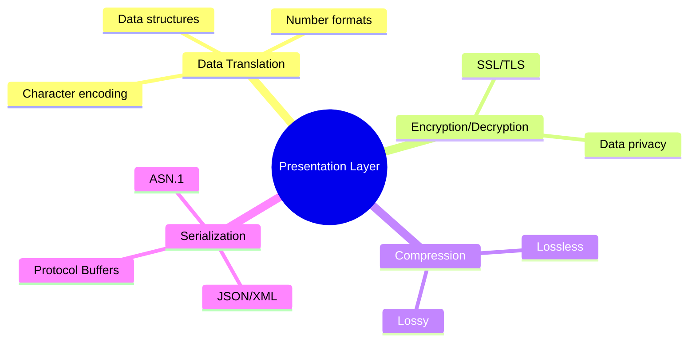
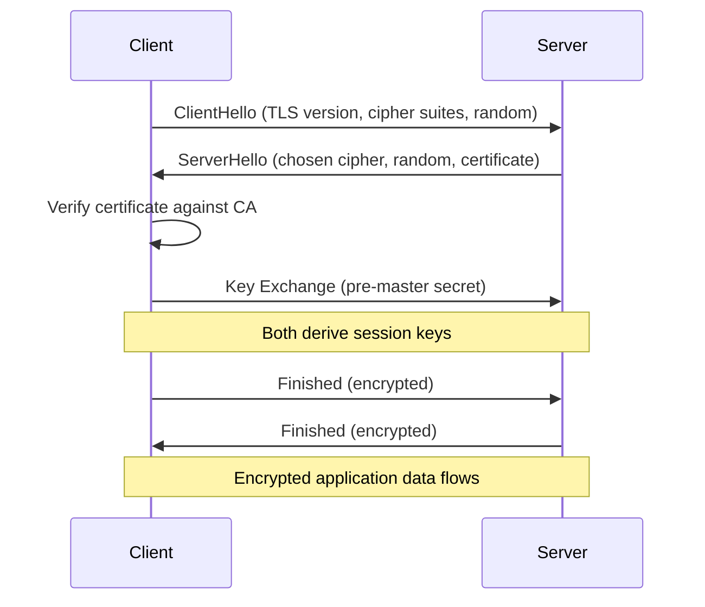
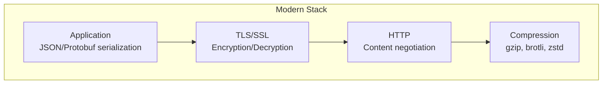

# Presentation Layer (Layer 6)

> *"The Presentation Layer is the translator — it ensures both sides speak the same language."*

## Overview

The **Presentation Layer** handles **data representation**, **encryption/decryption**, and **compression/decompression**. It ensures that data sent by one system's application layer can be read by another system's application layer, regardless of differences in internal data formats.

## Core Responsibilities



## Data Representation

### Character Encoding

| Encoding | Bits per Char | Characters | Use Case |
|----------|--------------|------------|----------|
| **ASCII** | 7 bits | 128 | English text, legacy |
| **UTF-8** | 1-4 bytes | 1.1M+ | Web standard, Unicode |
| **UTF-16** | 2 or 4 bytes | 1.1M+ | Java, Windows internals |
| **UTF-32** | 4 bytes | 1.1M+ | Fixed-width, rarely used |
| **Latin-1** | 8 bits | 256 | Western European |

```
ASCII: 'A' = 0x41 = 01000001
UTF-8: '€' = 0xE2 0x82 0xAC (3 bytes)
UTF-16: '€' = 0x20AC (2 bytes)
```

### Byte Order (Endianness)

```
Value: 0x12345678

Big-Endian (Network Order):
  Address:  0  1  2  3
  Bytes:    12 34 56 78  (most significant byte first)

Little-Endian (x86):
  Address:  0  1  2  3
  Bytes:    78 56 34 12  (least significant byte first)

Network byte order = Big-Endian
Use htons()/htonl() to convert host → network order
```

## Data Serialization Formats

### Comparison

| Format | Human-Readable | Size | Speed | Schema | Use Case |
|--------|---------------|------|-------|--------|----------|
| **JSON** | ✅ | Large | Slow | Optional | Web APIs, config |
| **XML** | ✅ | Very Large | Slow | XSD/DTD | Enterprise, SOAP |
| **Protocol Buffers** | ❌ | Small | Fast | Required | gRPC, Google internal |
| **MessagePack** | ❌ | Small | Fast | Optional | High-performance APIs |
| **Avro** | ❌ | Small | Fast | Required | Hadoop, Kafka |
| **ASN.1** | ❌ | Small | Fast | Required | Telecom, certificates |

### JSON Example
```json
{
  "name": "Alice",
  "age": 30,
  "scores": [95, 87, 92]
}
```

### Protocol Buffers Example
```protobuf
message Person {
  string name = 1;
  int32 age = 2;
  repeated int32 scores = 3;
}
```

Binary encoding of the same data:
- JSON: ~60 bytes
- Protobuf: ~20 bytes (67% smaller)

## Encryption at the Presentation Layer

### SSL/TLS (Primarily at Layers 5-7)



### Encryption Types

| Type | Key Usage | Examples | Use Case |
|------|-----------|----------|----------|
| **Symmetric** | Same key for encrypt/decrypt | AES-256, ChaCha20 | Bulk data encryption |
| **Asymmetric** | Public/private key pair | RSA, ECDSA, Ed25519 | Key exchange, signatures |
| **Hashing** | One-way function | SHA-256, SHA-3, BLAKE2 | Integrity verification |

## Compression

### Lossless Compression
- **gzip**: DEFLATE algorithm, widely used in HTTP
- **Brotli**: Google's algorithm, better ratio than gzip for web content
- **zstd (Zstandard)**: Facebook's algorithm, fast with good ratio
- **LZ77/LZ78**: Foundation algorithms for most lossless compression

### Lossy Compression (for media)
- **JPEG**: Images, lossy, adjustable quality
- **PNG**: Images, lossless
- **MP3/AAC**: Audio
- **H.264/H.265/AV1**: Video

### HTTP Content Encoding
```http
# Client advertises supported encodings
Accept-Encoding: gzip, br, zstd

# Server responds with compressed content
Content-Encoding: br
Content-Type: application/json
```

## Presentation Layer in Practice

In modern networks, the Presentation Layer is rarely a distinct protocol. Instead:

1. **TLS/SSL**: Handles encryption (Layer 4-7 boundary)
2. **HTTP headers**: Content-Type, Content-Encoding handle format and compression
3. **Application code**: Serialization/deserialization happens in the application

### Where Presentation Happens



## Interview Questions

### Beginner

**Q1: Why do we need a Presentation Layer?**
Different systems may store data differently (different character encodings, byte orders, number formats). The Presentation Layer ensures that data from one system can be correctly interpreted by another. Without it, a big-endian system sending data to a little-endian system would produce garbled results.

**Q2: What is the difference between lossless and lossy compression?**
- **Lossless**: Original data can be perfectly reconstructed. Used for text, code, executables. Examples: gzip, brotli
- **Lossy**: Some data is permanently discarded for smaller size. Used for media where exact reproduction isn't needed. Examples: JPEG, MP3

**Q3: What is TLS and where does it fit in the OSI model?**
TLS (Transport Layer Security) encrypts communication between client and server. It spans the Presentation and Session layers: key exchange and certificate verification (Session), encryption/decryption (Presentation). In practice, TLS is often considered Layer 4-7, wrapping around TCP to provide a secure transport channel.

### Intermediate

**Q4: Compare JSON and Protocol Buffers for API communication.**
| Aspect | JSON | Protocol Buffers |
|--------|------|-----------------|
| Readability | Human-readable | Binary |
| Size | Larger | 3-10x smaller |
| Parsing speed | Slower | Faster |
| Schema | Optional | Required (.proto) |
| Tooling | Universal | Google ecosystem |
| Use case | Public APIs, config | Internal services, gRPC |

Choose JSON for public APIs (debuggability), Protobuf for internal microservices (performance).

**Q5: How does content negotiation work in HTTP?**
The client sends headers indicating its capabilities:
```http
Accept: application/json
Accept-Encoding: gzip, br
Accept-Language: en-US, en
```
The server selects the best match and responds:
```http
Content-Type: application/json
Content-Encoding: br
Content-Language: en-US
```
This is Presentation Layer functionality implemented at the Application Layer.

**Q6: Explain endianness and why it matters in networking.**
Endianness is the byte order in which multi-byte values are stored. Big-endian stores the most significant byte first; little-endian stores the least significant byte first. Network protocols use big-endian (network byte order) as a standard. When a little-endian machine (x86) communicates over the network, it must convert using `htonl()`/`htons()`. Failure to do this causes data corruption.

### Advanced / FAANG-Level

**Q7: Design a serialization format for a high-frequency trading system.**
Requirements: Minimal latency, cross-platform, schema evolution, compact wire format.

Design:
1. **Binary encoding**: No parsing overhead (like Protobuf but faster)
2. **Fixed-width fields**: Avoid varint decoding — use fixed 8-byte integers, 8-byte doubles
3. **Schema registry**: Centralized schema store, versioned schemas
4. **Zero-copy deserialization**: Map buffer directly to struct (like FlatBuffers)
5. **Byte order**: Define as little-endian (most hardware is LE now, avoid conversion)
6. **Optional fields**: Bitmask for presence (1 bit per optional field)
7. **Alignment**: Natural alignment for CPU cache efficiency
8. **Compression**: None (latency-sensitive) or lightweight (zstd level 1)

Example format: SBE (Simple Binary Encoding) used in financial protocols.

**Q8: How does HTTP/3's QUIC handle encryption at the transport level?**
QUIC integrates TLS 1.3 directly into the transport handshake:
1. **1-RTT handshake**: Combines transport + crypto handshake
2. **0-RTT resumption**: Returning clients send encrypted data immediately
3. **Everything encrypted**: Headers + payload (TCP headers are plaintext)
4. **Connection migration**: Connection ID survives IP address changes
5. **No separate TLS layer**: Crypto is built into QUIC, not layered on top

This is a paradigm shift from TCP + TLS where they're separate layers.

**Q9: How would you handle schema evolution in a microservices architecture with Protobuf?**
Best practices:
1. **Field numbers are permanent**: Never reuse removed field numbers
2. **Additive changes only**: New fields with defaults, never remove or change types
3. **Reserved fields**: Mark removed fields as reserved to prevent reuse
4. **Versioned packages**: `package v2;` for breaking changes
5. **Schema registry**: Confluent Schema Registry or Buf's BSR for central management
6. **Compatibility checks**: CI/CD validates backward/forward compatibility
7. **Wrapper types**: Use `google.protobuf.StringValue` for nullable fields

## Common Mistakes

1. ❌ Forgetting to handle character encoding — UTF-8 mismatch causes mojibake (乱码)
2. ❌ Assuming big-endian everywhere — x86/x64 are little-endian
3. ❌ Using JSON for high-performance internal APIs — binary formats are much faster
4. ❌ Mixing TLS versions — TLS 1.0/1.1 are deprecated, use 1.2+
5. ❌ Not compressing HTTP responses — gzip/brotli can reduce transfer size by 70%+

## Summary

- Presentation Layer handles **data format translation**, **encryption**, and **compression**
- In practice, these functions are embedded in **TLS**, **HTTP headers**, and **application code**
- **Character encoding**: UTF-8 is the web standard
- **Serialization**: JSON (readable) vs Protobuf (fast) — choose based on use case
- **Encryption**: TLS 1.3 provides confidentiality and integrity
- **Compression**: gzip, brotli, zstd for reducing transfer size

## Cross-References

- [HTTPS](../http/https.md) — TLS in practice
- [gRPC](../http/grpc.md) — Protocol Buffers + HTTP/2
- [Session Layer](session.md) — Session management
- [HTTP](../http/README.md) — Content negotiation

## Cross References

- [Session Layer](session.md)
- [Application Layer](application.md)
- [TLS/SSL](../security/tls.md)
- [HTTP Compression](../http/http2.md)
