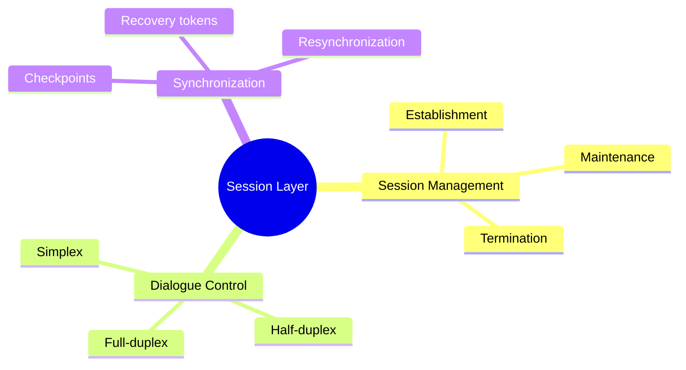
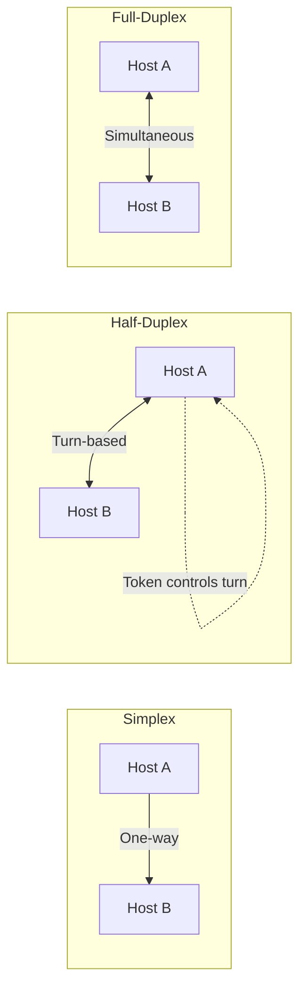
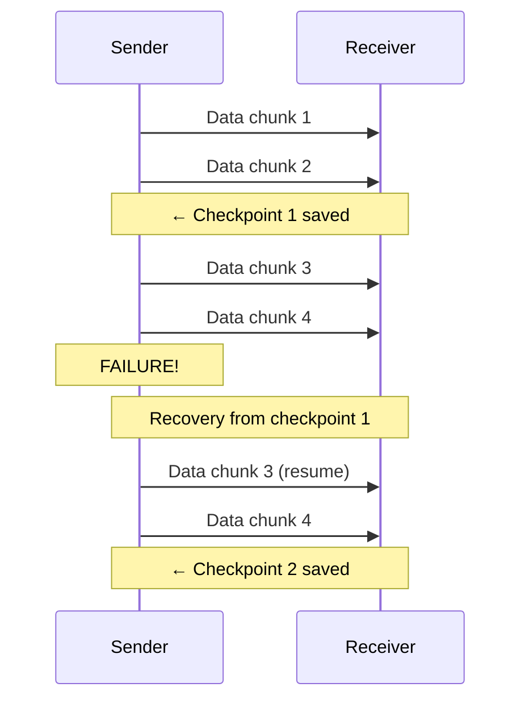
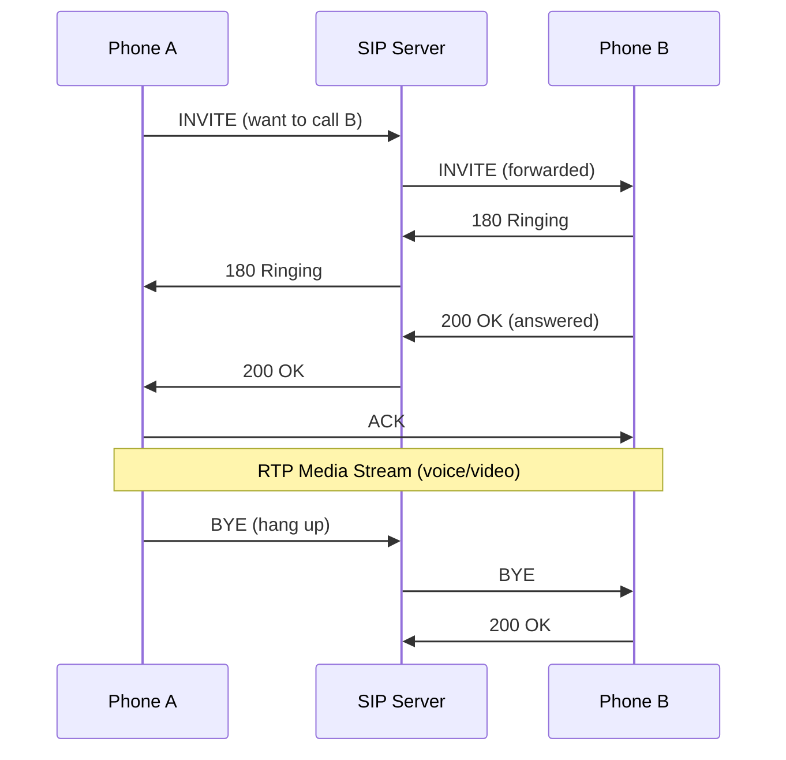

# Session Layer (Layer 5)

> *"The Session Layer manages conversations — it's the conductor that starts, maintains, and ends dialogues between applications."*

## Overview

The **Session Layer** establishes, manages, and terminates sessions between applications. It handles dialogue control (who talks when), synchronization (checkpoints for recovery), and session recovery (resuming after interruptions).

## Core Responsibilities



## Dialogue Control Modes



### Half-Duplex with Token
- Only the token holder can send data
- Prevents simultaneous speaking (collisions at application level)
- Example: Remote procedure calls where you send a request and wait for response

## Synchronization and Checkpoints



- **Checkpoints**: Save points in long data transfers
- If failure occurs, resume from last checkpoint instead of restarting
- Critical for large file transfers, database replication, streaming

## Real-World Session Layer Protocols

| Protocol | Purpose | Session Features |
|----------|---------|-----------------|
| **NetBIOS** | LAN name/service discovery | Session establishment, names |
| **RPC (Remote Procedure Call)** | Execute code on remote host | Call/reply sessions |
| **PPTP** | VPN tunneling | Tunnel sessions |
| **L2TP** | VPN tunneling | Tunnel sessions with IPsec |
| **SIP** | VoIP signaling | Call session setup/teardown |
| **SOCKS** | Proxy protocol | Proxy session management |

### SIP (Session Initiation Protocol) Example



## Session Layer in Modern Networks

In practice, the Session Layer is rarely implemented as a distinct layer. Its functions are typically embedded in:

1. **Application protocols** (HTTP cookies, WebSocket sessions)
2. **Transport layer** (TCP connection state)
3. **Application frameworks** (session middleware in web apps)

### HTTP Session Management

```http
# Server sets session cookie
HTTP/1.1 200 OK
Set-Cookie: session_id=abc123; HttpOnly; Secure; SameSite=Strict

# Client sends cookie with each request
GET /dashboard HTTP/1.1
Cookie: session_id=abc123
```

## Interview Questions

### Beginner

**Q1: What does the Session Layer do?**
The Session Layer manages dialogues between applications. It establishes sessions (conversations), controls who speaks when (dialogue control), adds checkpoints for recovery, and terminates sessions when done. Think of it as the protocol layer that manages "phone calls" between applications.

**Q2: Why are checkpoints important?**
Checkpoints allow recovery from failures without restarting from the beginning. If you're transferring a 1GB file and the connection drops at 800MB, checkpoints let you resume from the last checkpoint instead of starting over. This saves time and bandwidth.

**Q3: How do HTTP sessions work if there's no dedicated Session Layer protocol?**
HTTP is stateless, so sessions are managed at the Application Layer using cookies, tokens, or URL parameters. The server stores session data (in memory, database, or cache) and uses the session identifier sent by the client to retrieve it. This is application-level session management.

### Intermediate

**Q4: Compare session management in HTTP/1.1 vs HTTP/2.**
- **HTTP/1.1**: One request per TCP connection (or pipelining, rarely used). Session state via cookies. Keep-alive connections reuse TCP but still one request at a time.
- **HTTP/2**: Multiple streams over one TCP connection (multiplexing). Each stream is independent. Sessions managed via cookies or tokens. Header compression (HPACK) reduces overhead.
- Key difference: HTTP/2's multiplexing means session state can span concurrent streams, but the session mechanism (cookies) remains the same.

**Q5: What is the difference between a session and a connection?**
- **Connection**: A physical/logical link at the Transport Layer (TCP connection). Identified by (src_ip, src_port, dst_ip, dst_port). Exists only while both sides maintain it.
- **Session**: A logical dialogue at a higher layer. Can span multiple connections. Identified by session tokens/IDs. Can persist beyond a single connection (e.g., HTTP sessions survive TCP connection closes).

**Q6: How does WebSocket maintain a persistent session?**
WebSocket upgrades an HTTP connection to a full-duplex, persistent channel:
1. Client sends HTTP Upgrade header
2. Server responds with 101 Switching Protocols
3. Both sides can send messages anytime (no request-response pattern)
4. Connection stays open until either side sends a Close frame
5. Session state is maintained by the underlying TCP connection + application-level framing

### Advanced / FAANG-Level

**Q7: Design a session management system for a distributed application with 10 million concurrent users.**
Architecture:
1. **Session storage**: Redis Cluster (fast, supports TTL, atomic operations)
   - Sharded by session_id hash
   - Replication for fault tolerance
2. **Session ID generation**: Cryptographically random, 128-bit tokens
3. **Session creation**: On login, generate ID, store in Redis with TTL (e.g., 30 min)
4. **Session validation**: Middleware extracts session_id from cookie/header, looks up Redis
5. **Session refresh**: Extend TTL on each request (sliding expiration)
6. **Session invalidation**: On logout, delete from Redis; on security events, invalidate all user sessions
7. **Sticky sessions**: NOT used — all instances can validate any session via shared Redis
8. **Serialization**: JSON or MessagePack for session data

**Q8: How do modern microservices handle session state across service boundaries?**
Patterns:
1. **Stateless services + external store**: JWT tokens (no server-side state) or Redis sessions
2. **API Gateway**: Centralized session management at the gateway layer
3. **Service mesh**: Envoy/Istio handle connection-level session affinity
4. **Event sourcing**: Session state derived from event log, not stored directly
5. **Distributed cache**: Hazelcast, Infinispan for in-memory session replication

The trend is toward **stateless services** with **externalized session state** — services don't hold session data themselves.

## Common Mistakes

1. ❌ Thinking the Session Layer is always separate — in practice, it's embedded in applications
2. ❌ Confusing sessions with connections — sessions can span multiple connections
3. ❌ Forgetting that HTTP is stateless — sessions require explicit mechanisms (cookies, tokens)
4. ❌ Assuming sessions are secure by default — session hijacking is a real threat
5. ❌ Mixing up session timeout vs connection timeout — they're different things

## Summary

- Session Layer manages **dialogues** between applications: establishment, maintenance, termination
- **Dialogue control**: Simplex, half-duplex, full-duplex communication modes
- **Checkpoints**: Enable recovery without restarting from scratch
- In modern networks, session management is typically in **application protocols** (cookies, tokens)
- Key distinction: **session** (logical dialogue) vs **connection** (physical/logical link)

## Cross-References

- [Transport Layer](transport.md) — Connection management
- [HTTP](../http/README.md) — Application-level session management
- [WebSocket](../http/websocket.md) — Persistent session protocol
- [REST](../http/rest.md) — Stateless session design
