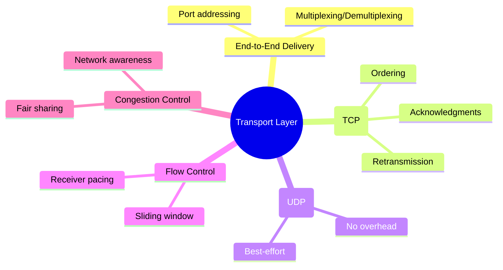
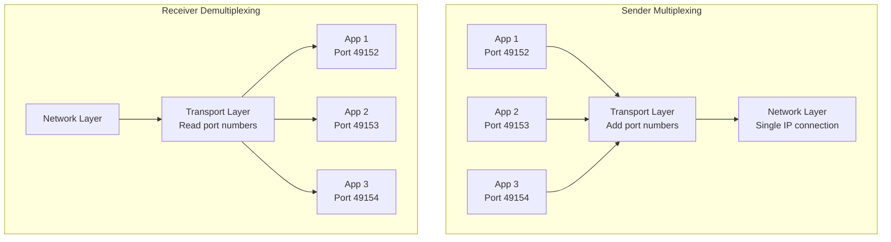
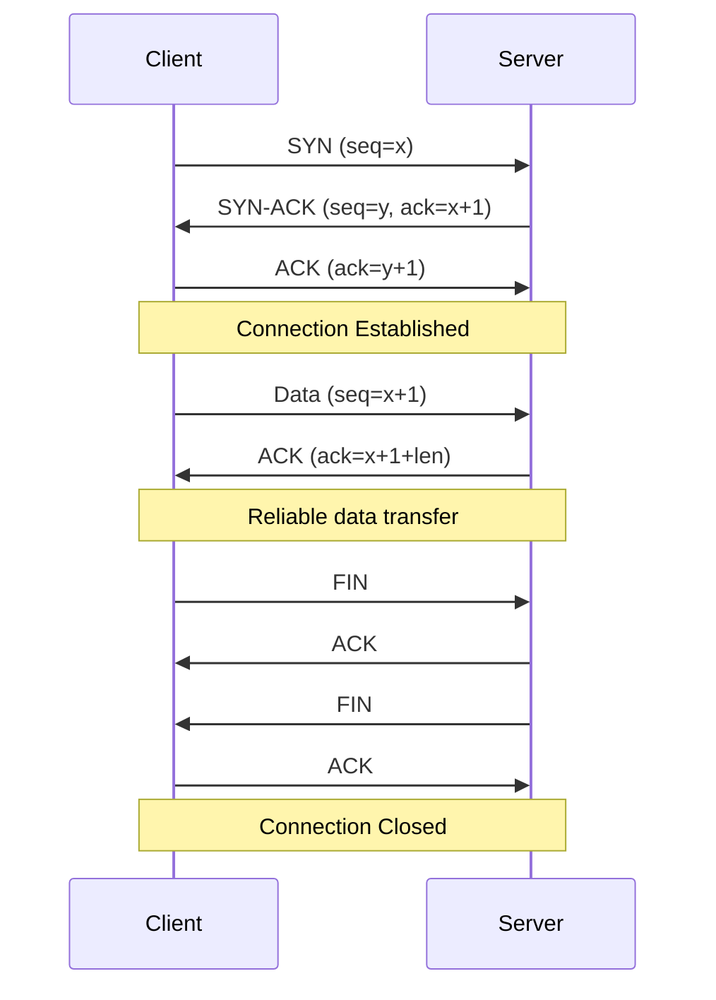
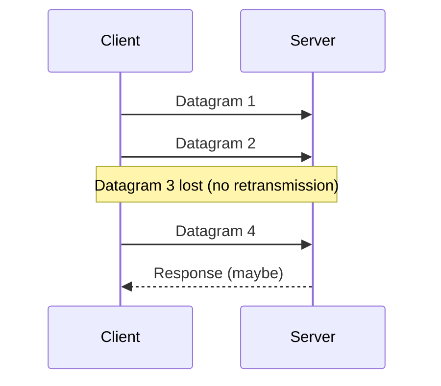

# Transport Layer (Layer 4)

> *"The Transport Layer is where reliability meets efficiency — TCP gives you certainty, UDP gives you speed."*

## Overview

The **Transport Layer** provides **end-to-end communication** between applications running on different hosts. It's the bridge between the application layer above and the network layer below, offering either reliable (TCP) or fast (UDP) delivery.

## Core Responsibilities



## Port Numbers

```
Source Port (16 bits) + Destination Port (16 bits) = Socket Pair
Example: 192.168.1.10:49152 → 93.184.216.34:443
```

| Range | Type | Examples |
|-------|------|---------|
| 0-1023 | **Well-known** | HTTP(80), HTTPS(443), SSH(22), DNS(53) |
| 1024-49151 | **Registered** | MySQL(3306), PostgreSQL(5432), Redis(6379) |
| 49152-65535 | **Ephemeral/Dynamic** | Client-side temporary ports |

### Common Ports to Memorize

| Port | Protocol | Service |
|------|----------|---------|
| 20/21 | FTP | File Transfer (data/control) |
| 22 | SSH | Secure Shell |
| 23 | Telnet | Remote terminal (insecure) |
| 25 | SMTP | Email sending |
| 53 | DNS | Domain Name System |
| 67/68 | DHCP | Dynamic Host Configuration |
| 80 | HTTP | Web (unencrypted) |
| 110 | POP3 | Email retrieval |
| 143 | IMAP | Email retrieval |
| 443 | HTTPS | Web (encrypted) |
| 993/995 | IMAPS/POP3S | Encrypted email |

## Multiplexing and Demultiplexing



- **Multiplexing**: Multiple applications share one network connection
- **Demultiplexing**: Incoming data delivered to correct application via port numbers
- A **socket** = (IP address, port number) uniquely identifies a connection endpoint

## TCP vs UDP at a Glance

| Feature | TCP | UDP |
|---------|-----|-----|
| Connection | Connection-oriented | Connectionless |
| Reliability | Guaranteed delivery | Best-effort |
| Ordering | Ordered | No ordering |
| Flow control | Yes (sliding window) | No |
| Congestion control | Yes | No |
| Header size | 20-60 bytes | 8 bytes |
| Speed | Slower (overhead) | Faster |
| Use case | Web, email, file transfer | Video, DNS, gaming |

## TCP Overview (Detailed in [TCP Section](../tcp/README.md))



## UDP Overview (Detailed in [UDP Section](../udp/README.md))



## Socket Programming

### TCP Socket API

```python
# Server
import socket
server = socket.socket(socket.AF_INET, socket.SOCK_STREAM)
server.bind(('0.0.0.0', 8080))
server.listen(5)                    # Listen for connections
conn, addr = server.accept()        # Accept connection
data = conn.recv(1024)              # Receive data
conn.send(b'Hello')                 # Send data
conn.close()                        # Close connection

# Client
client = socket.socket(socket.AF_INET, socket.SOCK_STREAM)
client.connect(('server_ip', 8080)) # 3-way handshake happens here
client.send(b'Request')             # Send data
response = client.recv(1024)        # Receive response
client.close()                      # 4-way teardown happens here
```

### UDP Socket API

```python
# Server
import socket
server = socket.socket(socket.AF_INET, socket.SOCK_DGRAM)
server.bind(('0.0.0.0', 5353))
data, addr = server.recvfrom(1024)  # Receive with sender address
server.sendto(b'Response', addr)    # Send to specific address

# Client
client = socket.socket(socket.AF_INET, socket.SOCK_DGRAM)
client.sendto(b'Query', ('server_ip', 5353))  # No connection needed
response, addr = client.recvfrom(1024)
```

## Interview Questions

### Beginner

**Q1: Why do we need the Transport Layer if we already have IP addresses?**
IP addresses identify hosts, but a single host runs many applications simultaneously. Port numbers (Transport Layer) identify which application should receive the data. Without ports, your web browser and email client couldn't share the same network connection. The Transport Layer also adds reliability (TCP) and flow control that IP doesn't provide.

**Q2: When would you choose UDP over TCP?**
Choose UDP when:
- **Low latency matters more than reliability**: Online gaming, video calls, live streaming
- **Simple request-response**: DNS queries, NTP time sync
- **Application handles reliability**: QUIC (HTTP/3) implements its own reliability on UDP
- **Broadcast/multicast needed**: DHCP, service discovery
- **Overhead is unacceptable**: IoT devices, real-time sensor data

**Q3: What is a socket?**
A socket is one endpoint of a two-way communication link. It's identified by the combination of (IP address, port number). A TCP connection is defined by a 4-tuple: (source IP, source port, dest IP, dest port). The socket API (bind, listen, accept, connect, send, recv) is the programming interface for network communication.

### Intermediate

**Q4: Explain how multiplexing works at the Transport Layer.**
Transport Layer multiplexing allows multiple applications to share the same IP connection. At the sender, data from different applications is tagged with their source port numbers and the destination port (multiplexing). At the receiver, the Transport Layer reads the destination port and delivers data to the correct application socket (demultiplexing). This is why you can browse the web (port 443) while downloading a file (port 22) on the same machine.

**Q5: What happens when a TCP segment arrives but the application is slow to read?**
TCP's flow control kicks in:
1. The receiver's buffer fills up as the application is slow
2. The receiver advertises a smaller window size (rwnd) in ACK packets
3. If rwnd reaches 0, the sender stops sending
4. The sender periodically sends "window probe" segments to check if space has freed up
5. When the application reads data, buffer space opens, and a larger rwnd is advertised

**Q6: Why doesn't UDP have flow or congestion control?**
UDP is designed to be minimal. Adding flow/congestion control would add overhead and latency, defeating UDP's purpose. Instead, applications that need these features can implement them at the application layer (like QUIC does). This design philosophy gives developers flexibility — they can choose exactly which reliability features they need.

### Advanced / FAANG-Level

**Q7: How would you implement reliable data transfer over UDP?**
This is essentially what QUIC does:
1. **Sequence numbers**: Detect lost packets and reorder
2. **Acknowledgments**: Receiver confirms receipt
3. **Retransmission**: Resend lost packets with exponential backoff
4. **Checksum**: Detect corruption
5. **Flow control**: Sliding window or credit-based
6. **Congestion control**: AIMD or CUBIC-like algorithm
7. **Connection state**: Connection ID (not IP:port, enabling migration)
Key advantage over TCP: runs in userspace, faster iteration, 0-RTT connection establishment

**Q8: Design a load balancer for TCP connections.**
Approaches:
1. **L4 (Transport)**: NAT-based or DSR (Direct Server Return)
   - Fast, simple, doesn't inspect payload
   - Uses connection tuple hashing for consistent routing
   - Challenge: TCP state tracking, connection draining during scaling
   
2. **L7 (Application)**: Terminates TCP, creates new connection to backend
   - Can inspect HTTP headers, route by URL/hostname
   - Enables connection pooling (fewer backend connections)
   - Challenge: Higher latency, more resource usage

3. **Hyrid**: L4 for initial routing, L7 for specific paths
   - Use DSR for static content, full proxy for dynamic

**Q9: Explain the head-of-line blocking problem and how HTTP/3 solves it.**
In TCP, bytes are delivered in order. If one segment is lost, all subsequent data is blocked until retransmission arrives — even if those later segments arrived fine. This is head-of-line (HOL) blocking.

In HTTP/2 over TCP, multiple HTTP requests share one TCP connection. A single lost packet blocks ALL streams.

HTTP/3 (QUIC over UDP) solves this:
- Each HTTP stream is independent
- Loss in one stream doesn't block others
- QUIC handles reliability per-stream, not per-connection
- Result: better performance on lossy networks (mobile, Wi-Fi)

## Common Mistakes

1. ❌ Thinking TCP is always better — UDP is superior for real-time applications
2. ❌ Confusing ports with sockets — a socket is (IP, port) pair; a port is just a number
3. ❌ Forgetting that UDP has checksums too — they're optional in IPv4 but mandatory in IPv6
4. ❌ Assuming ephemeral ports are always 49152-65535 — OS implementations vary (Linux: 32768-60999)
5. ❌ Thinking "connection-oriented" means a physical connection — TCP connections are logical state maintained in OS tables

## Summary

- Transport Layer provides **end-to-end delivery** using port numbers
- **TCP**: Reliable, ordered, flow/congestion controlled — for accuracy
- **UDP**: Fast, minimal overhead, best-effort — for speed
- **Multiplexing**: Multiple apps share one network via port numbers
- **Sockets**: (IP, port) endpoints for network programming
- **Flow control** prevents overwhelming the receiver; **congestion control** prevents overwhelming the network

## Cross-References

- [TCP Deep Dive](../tcp/README.md) — Complete TCP coverage
- [UDP Deep Dive](../udp/README.md) — Complete UDP coverage
- [HTTP Protocols](../http/README.md) — Application layer protocols using TCP/UDP
- [DNS](../dns/README.md) — UDP-based name resolution
