# Computer Networks

> *"The Internet is not just one thing; it's a collection of things — of numerous interconnected networks."* — Bob Kahn

## Overview

Computer Networks form the backbone of modern computing. Every web request, every email, every video stream relies on a layered stack of protocols working in concert. This section covers everything you need for placement interviews — from the OSI model to modern protocols like HTTP/3 and QUIC.

## Why Networks Matter for Placements

- **Every company** uses distributed systems; understanding networks is non-negotiable
- **FAANG interviews** frequently test TCP/IP, DNS, HTTP, and security concepts
- **System Design** interviews assume strong networking fundamentals
- **Real-world debugging** requires understanding packet flow, latency, and failures

## Section Map

```mermaid
graph TD
    A[Computer Networks] --> B[OSI Model]
    A --> C[TCP/IP Suite]
    A --> D[TCP Protocol]
    A --> E[UDP Protocol]
    A --> F[DNS]
    A --> G[HTTP & Web Protocols]

    B --> B1[Physical Layer]
    B --> B2[Data Link Layer]
    B --> B3[Network Layer]
    B --> B4[Transport Layer]
    B --> B5[Session Layer]
    B --> B6[Presentation Layer]
    B --> B7[Application Layer]

    C --> C1[IPv4 & IPv6]
    C --> C2[Subnetting & CIDR]
    C --> C3[NAT, ICMP, ARP]
    C --> C4[DHCP]

    D --> D1[Header & States]
    D --> D2[3-Way & 4-Way Handshake]
    D --> D3[Flow & Congestion Control]
    D --> D4[TCP Variants]

    E --> E1[UDP Header]
    E --> E2[TCP vs UDP]
    E --> E3[Applications]

    F --> F1[Resolution Process]
    F --> F2[Record Types]
    F --> F3[DNS Security]

    G --> G1[HTTP/1.1, HTTP/2, HTTP/3]
    G --> G2[HTTPS & TLS]
    G --> G3[WebSocket, REST, gRPC]

    style A fill:#e1f5fe
    style B fill:#fff3e0
    style C fill:#e8f5e9
    style D fill:#fce4ec
    style E fill:#f3e5f5
    style F fill:#fffde7
    style G fill:#e0f2f1
```



## How to Use This Section

1. **Start with OSI Model** — understand the layered architecture
2. **Move to TCP/IP** — the real-world implementation
3. **Deep dive into TCP** — the most interview-heavy protocol
4. **Compare with UDP** — understand trade-offs
5. **Study DNS** — critical for system design
6. **Master HTTP** — modern web protocols and APIs

## Key Concepts Checklist

| Concept | Importance | Interview Frequency |
|---------|-----------|-------------------|
| OSI Model | ⭐⭐⭐⭐⭐ | Very High |
| TCP 3-Way Handshake | ⭐⭐⭐⭐⭐ | Very High |
| TCP vs UDP | ⭐⭐⭐⭐⭐ | Very High |
| DNS Resolution | ⭐⭐⭐⭐⭐ | High |
| HTTP/2 vs HTTP/1.1 | ⭐⭐⭐⭐ | High |
| Congestion Control | ⭐⭐⭐⭐ | Medium-High |
| Subnetting/CIDR | ⭐⭐⭐⭐ | Medium-High |
| HTTPS/TLS | ⭐⭐⭐⭐ | High |
| NAT & DHCP | ⭐⭐⭐ | Medium |
| QUIC & HTTP/3 | ⭐⭐⭐ | Growing |

## Quick Reference: The Protocol Stack

```
Application Layer    → HTTP, FTP, SMTP, DNS, SSH, HTTPS
Transport Layer      → TCP, UDP, SCTP
Network Layer        → IP, ICMP, ARP, OSPF, BGP
Data Link Layer      → Ethernet, Wi-Fi (802.11), PPP
Physical Layer       → Cables, Radio, Fiber, Electrical Signals
```

## Cross-References

- For **Operating System** concepts related to networking (sockets, I/O), see [OS Section](../os/overview.md)
- For **System Design** applications, see [System Design Section](../interview/system-design/README.md)
- For **Database** networking (connections, replication), see [DBMS Section](../dbms/overview.md)

## Cross References

- [OSI Model](osi/README.md)
- [TCP/IP Stack](tcp-ip/README.md)
- [Distributed Systems Overview](../distributed/overview.md)
- [Cloud Overview](../cloud/overview.md)
