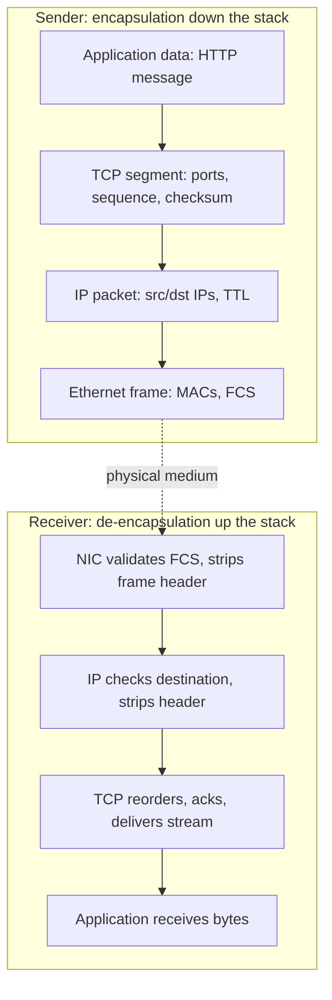

# Computer Networks

> *"The Internet is not just one thing; it's a collection of things — of numerous interconnected networks."* — Bob Kahn

## Overview

Computer Networks form the backbone of modern computing. Every web request, every email, every video stream relies on a layered stack of protocols working in concert. This section covers everything you need for placement interviews — from the OSI model to modern protocols like HTTP/3 and QUIC.

## Why Networks Matter for Placements

- **Every company** uses distributed systems; understanding networks is non-negotiable
- **FAANG interviews** frequently test TCP/IP, DNS, HTTP, and security concepts
- **System Design** interviews assume strong networking fundamentals
- **Real-world debugging** requires understanding packet flow, latency, and failures

## Section Map


```mermaid
graph TD
    A[Computer Networks] --> B[OSI Model]
    A --> C[TCP/IP Suite]
    A --> D[TCP Protocol]
    A --> E[UDP Protocol]
    A --> F[DNS]
    A --> G[HTTP & Web Protocols]

    B --> B1[Physical Layer]
    B --> B2[Data Link Layer]
    B --> B3[Network Layer]
    B --> B4[Transport Layer]
    B --> B5[Session Layer]
    B --> B6[Presentation Layer]
    B --> B7[Application Layer]

    C --> C1[IPv4 & IPv6]
    C --> C2[Subnetting & CIDR]
    C --> C3[NAT, ICMP, ARP]
    C --> C4[DHCP]

    D --> D1[Header & States]
    D --> D2[3-Way & 4-Way Handshake]
    D --> D3[Flow & Congestion Control]
    D --> D4[TCP Variants]

    E --> E1[UDP Header]
    E --> E2[TCP vs UDP]
    E --> E3[Applications]

    F --> F1[Resolution Process]
    F --> F2[Record Types]
    F --> F3[DNS Security]

    G --> G1[HTTP/1.1, HTTP/2, HTTP/3]
    G --> G2[HTTPS & TLS]
    G --> G3[WebSocket, REST, gRPC]

    style A fill:#e1f5fe
    style B fill:#fff3e0
    style C fill:#e8f5e9
    style D fill:#fce4ec
    style E fill:#f3e5f5
    style F fill:#fffde7
    style G fill:#e0f2f1
```

## How to Use This Section

1. **Start with OSI Model** — understand the layered architecture
2. **Move to TCP/IP** — the real-world implementation
3. **Deep dive into TCP** — the most interview-heavy protocol
4. **Compare with UDP** — understand trade-offs
5. **Study DNS** — critical for system design
6. **Master HTTP** — modern web protocols and APIs

## Key Concepts Checklist

| Concept | Importance | Interview Frequency |
|---------|-----------|-------------------|
| OSI Model | ⭐⭐⭐⭐⭐ | Very High |
| TCP 3-Way Handshake | ⭐⭐⭐⭐⭐ | Very High |
| TCP vs UDP | ⭐⭐⭐⭐⭐ | Very High |
| DNS Resolution | ⭐⭐⭐⭐⭐ | High |
| HTTP/2 vs HTTP/1.1 | ⭐⭐⭐⭐ | High |
| Congestion Control | ⭐⭐⭐⭐ | Medium-High |
| Subnetting/CIDR | ⭐⭐⭐⭐ | Medium-High |
| HTTPS/TLS | ⭐⭐⭐⭐ | High |
| NAT & DHCP | ⭐⭐⭐ | Medium |
| QUIC & HTTP/3 | ⭐⭐⭐ | Growing |

## Quick Reference: The Protocol Stack

```
Application Layer    → HTTP, FTP, SMTP, DNS, SSH, HTTPS
Transport Layer      → TCP, UDP, SCTP
Network Layer        → IP, ICMP, ARP, OSPF, BGP
Data Link Layer      → Ethernet, Wi-Fi (802.11), PPP
Physical Layer       → Cables, Radio, Fiber, Electrical Signals
```

## A Layered Mental Model: Encapsulation

Layering works because each layer treats the layer below as a black box. A sender moves data **down** the stack, prepending a header at each layer; the receiver moves it back **up**, stripping headers in reverse order. Two useful interview one-liners: (1) layer *N* on the sender logically talks to layer *N* on the receiver — the headers they exchange are their entire conversation; (2) IP is the "narrow waist" of the Internet — many transports run over it (TCP, UDP, QUIC, SCTP) and many link technologies carry it (Ethernet, Wi-Fi, cellular), which is exactly why IP won.

With an Ethernet MTU of 1500 bytes and 20-byte IP + 20-byte TCP headers, the typical TCP segment payload (MSS) is 1460 bytes — a number worth memorizing because Path MTU discovery and PMTUD blackholes all hang off it.


```mermaid
flowchart TD
    subgraph Sender["Sender: encapsulation down the stack"]
        A1["Application data: HTTP message"] --> A2["TCP segment: ports, sequence, checksum"]
        A2 --> A3["IP packet: src/dst IPs, TTL"]
        A3 --> A4["Ethernet frame: MACs, FCS"]
    end
    subgraph Receiver["Receiver: de-encapsulation up the stack"]
        B1["NIC validates FCS, strips frame header"] --> B2["IP checks destination, strips header"]
        B2 --> B3["TCP reorders, acks, delivers stream"]
        B3 --> B4["Application receives bytes"]
    end
    A4 -.->|physical medium| B1
```

## Networks in One Table

Use this table as a self-test: cover the last column and see whether you can produce (and then answer) the interview question for each layer.

| Layer | Problem it solves | Key protocols | Representative interview question |
|---|---|---|---|
| Physical | Move bits over a medium | 1000BASE-T, fiber optics, 802.11 radio | Why can't we just "send voltage" and call it done? (clocking, encoding, noise) |
| Data link | Node-to-node delivery on one segment, MAC addressing, framing | Ethernet, Wi-Fi, ARP, STP | What problem does ARP solve, and what does a poisoned ARP cache enable? (ARP spoofing) |
| Network | Host-to-host delivery across networks, best-effort, addressing | IPv4, IPv6, ICMP, OSPF, BGP | Walk me through what happens, hop by hop, when you `ping example.com`. |
| Transport | Process-to-process delivery, reliability, flow & congestion control | TCP, UDP, QUIC, SCTP | What exactly do the three TCP handshake packets agree on? (seq numbers, MSS, window scaling) |
| Application | Protocol semantics, data formats | HTTP/1.1–3, DNS, TLS, SMTP, SSH, gRPC | Why did HTTP/2 multiplexing not fix head-of-line blocking completely? (TCP-level HOL) |

## Where This Book Covers Networks

Every subsection below is a full chapter; use this hub to route yourself.

- Layered models and theory: [OSI Reference Model](./osi/README.md)
- Addressing and the IP layer: [IPv4, IPv6, ICMP, ARP, DHCP, NAT](./tcp-ip/README.md)
- The interview-heavy core: [TCP Deep Dive](./tcp/README.md) and [UDP](./udp/README.md)
- Name resolution: [DNS](./dns/README.md)
- Web protocols: [HTTP/1.1 → HTTP/3, REST, gRPC, WebSocket](./http/README.md)
- Path selection: [Routing](./routing/README.md)
- Encryption and trust: [Network Security](./security/README.md)
- QUIC, SCTP, BBR internals and more: [Protocol Studies](./protocols/README.md)
- Socket programming and I/O models: [Sockets](./sockets/README.md)
- Datacenter, SDN, eBPF, telemetry and beyond: [Advanced Networks](./advanced/README.md)
- Hands-on packet debugging: [Tools](./tools/README.md)

## Latency Numbers Every Engineer Should Know

Interviewers love candidates who reason with numbers. The figures below are order-of-magnitude values popularized by Jeff Dean's distributed-systems lectures; exact values vary by hardware generation, but the *ratios* are what matter. Note that each row differs from the next by 10–100×, which is why caching, batching, and connection reuse dominate system design.

| Event | Order of magnitude | Intuition |
|---|---|---|
| L1 cache reference | ~1 ns | CPU keeps hot data here |
| L2 cache reference | ~4 ns | One L1 miss ≈ 4 L1 hits |
| Main memory (DRAM) reference | ~100 ns | 100× an L1 hit |
| NVMe SSD random read | ~20–150 µs | ~1000× DRAM |
| HDD seek | ~10 ms | ~1000× NVMe |
| Same-datacenter round trip | ~0.5 ms | RPC territory |
| Cross-continent RTT (US East ↔ US West) | ~50–70 ms | Light in fiber is ~200,000 km/s (glass refractive index ≈ 1.5) |
| Intercontinental RTT (US ↔ Europe / Asia) | ~80–200 ms | Propagation floor, plus routing detours |

Worked example: a `curl` to a London API from New York (~80 ms RTT) costs at minimum 1 RTT for TCP, +1 RTT for a TLS 1.3 handshake (+2 RTT for TLS 1.2), +1 RTT for the HTTP request/response — roughly 320 ms before the first useful byte with TLS 1.2, half that with TLS 1.3 or QUIC 0-RTT. That arithmetic is why [QUIC](./protocols/quic-connection-migration.md), [connection reuse](./http/http1.md), and [CDNs](./cdn/README.md) exist.

## History Tidbits That Explain Modern Designs

- **Packet switching (1964–66)**: Paul Baran's RAND memos ("On Distributed Communications") and, independently, Donald Davies at NPL proposed chopping messages into fixed blocks routed independently. Redundancy and distributed routing were survivability features from day one.
- **The end-to-end argument (1984)**: Saltzer, Reed, and Clark argued that functions like reliability belong at the *endpoints* unless every intermediate system needs them. This is why TCP does retransmission in hosts rather than routers, why TLS terminates at clients and servers, and why "smart network" designs (ATM, QoS signaling) largely lost to "dumb network + smart endpoints." Full paper: [End-to-End Arguments in System Design, ACM TOCS 1984](https://web.mit.edu/Saltzer/www/publications/endtoend/endtoend.pdf).
- **Design goals of the Internet (1988)**: David Clark's SIGCOMM paper ranked the goals: survivability after partial failure first, then heterogeneous transport support, then performance. Reading the ranking explains otherwise odd choices (best-effort IP, fate-sharing of state with endpoints).
- **OSI lost the wire but won the vocabulary**: the full OSI stack was never deployed at scale, yet its 7-layer language is how we still teach and debug — when someone says "that's a Layer 2 problem," they are using OSI as a diagnostic taxonomy while running TCP/IP.
- **NAT was a temporary hack that stuck (1994)**: [RFC 1631](https://datatracker.ietf.org/doc/rfc1631/) was meant to buy time before IPv6. Its side effects — breaking inbound reachability and end-to-end transparency — are exactly why hole-punching protocols like STUN/TURN/ICE exist (see [STUN/TURN/ICE](./advanced/stun-turn.md)).

## Interview Questions

1. **Walk me through what happens at each layer when I visit a website.** Start with DNS (UDP, port 53, or DoH over TLS), then a TCP three-way handshake (SYN → SYN-ACK → ACK, 1 RTT), then TLS (1 RTT for TLS 1.3, 2 for 1.2), then the HTTP request (1 RTT). Each response travels back down: HTTP message → TCP segments with ports and sequence numbers → IP packets with source/destination addresses and TTL → Ethernet/Wi-Fi frames with MAC addresses. Routers rewrite only link-layer headers (MACs) per hop; the IP header survives end-to-end until NAT or the destination modifies it.
2. **Why is IP called "best-effort" and what does TCP add on top?** IP makes no promises: packets can be lost (buffer overflow), duplicated (retransmission ambiguity), reordered (ECMP path diversity), or corrupted (bit errors). TCP layers on sequence numbers + cumulative ACKs for loss detection, retransmission for recovery, per-connection flow control via the receive window so a slow receiver isn't overrun, and congestion control via the congestion window so a shared network isn't overrun. The checksum covers the header plus data (unlike IP's header-only checksum).
3. **Flow control vs congestion control — same thing?** No. Flow control is a *receiver* problem: the advertised window (rwnd) prevents the sender from exhausting the receiver's buffer. Congestion control is a *network* problem: the congestion window (cwnd) is inferred from losses or delays, not advertised by anyone. The sending limit is `min(rwnd, cwnd)`, and the two windows are adjusted by different parties on different timescales — a distinction many candidates blur.
4. **Why do we still teach the OSI model when the Internet runs TCP/IP?** Because it's a diagnostic vocabulary, not a deployment plan. TCP/IP collapses OSI layers 5–7 into applications, and TLS occupies that "session/presentation" gap (encryption, auth, compression were presentation-ish services). When an interviewer says "Layer 2 issue," OSI is the shared language for locating the fault, while the 4/5-layer TCP/IP model describes what actually runs.
5. **What latencies dominate a slow first page load?** DNS (~10–100 ms uncached), TCP handshake (1 RTT), TLS (1–2 RTT), and the HTTP exchange (1 RTT) — with intercontinental RTTs of 80–200 ms, that's easily 300–500 ms before first byte. The fixes map directly to features: DNS caching/TTLs, keep-alive connections, TLS 1.3/QUIC 0-RTT, CDNs that shorten the RTT, and prefetching. System design interviews expect you to budget latency with these numbers.
6. **Give one example of the end-to-end argument in a modern system and one counterexample.** Argument in action: TCP retransmits at the endpoints — routers just drop and move on, which keeps them cheap and stateless. Counterexamples exist where the network must intervene: NAT (it must rewrite addresses), firewalls, and fast failover (routers precompute backup paths that react in milliseconds, before any endpoint notices a loss — see [Fast Failover](./advanced/fast-failover.md)). Knowing both sides shows you understand the argument is a design heuristic, not a law.

## Key Takeaways

- Layering = encapsulation: each layer prepends a header, and peer layers converse only through those headers; IP is the narrow waist of the stack.
- Memorize the anchors: MTU 1500, MSS 1460, 20-byte IP and TCP headers, DRAM ~100 ns, same-DC RTT ~0.5 ms, intercontinental RTT ~80–200 ms.
- IP is best-effort; TCP adds sequence/ACK, retransmission, flow control (rwnd), and congestion control (cwnd); `min(rwnd, cwnd)` is the real sending limit.
- The end-to-end argument explains why reliability, encryption, and application semantics live at endpoints — and why "smart endpoints, dumb network" beat ATM-style smart networks.
- A first HTTPS connection costs ~4 RTTs (DNS + TCP + TLS + request); protocol evolution (keep-alive, TLS 1.3, HTTP/2 multiplexing, QUIC 0-RTT) is mostly a campaign to reclaim RTTs.
- Use this page as the hub: the section map above routes to every deep dive in the book.

## References

- TCP: [RFC 9293](https://datatracker.ietf.org/doc/rfc9293/) (obsoletes RFC 793)
- DNS: [RFC 1035](https://datatracker.ietf.org/doc/rfc1035/)
- HTTP semantics: [RFC 9110](https://datatracker.ietf.org/doc/rfc9110/)
- QUIC: [RFC 9000](https://datatracker.ietf.org/doc/rfc9000/)
- NAT: [RFC 1631](https://datatracker.ietf.org/doc/rfc1631/) (original, obsoleted by RFC 3022 mechanics)
- J. Saltzer, D. Reed, D. Clark, "End-to-End Arguments in System Design," ACM Transactions on Computer Systems, 1984 — [PDF (MIT)](https://web.mit.edu/Saltzer/www/publications/endtoend/endtoend.pdf)
- D. Clark, "The Design Philosophy of the DARPA Internet Protocols," ACM SIGCOMM CCR, 1988 (title + venue; no stable URL cited)
- Linux kernel networking documentation: <https://www.kernel.org/doc/html/latest/networking/>

## Cross-References

- For **Operating System** concepts related to networking (sockets, I/O), see [OS Section](../os/overview.md)
- For **System Design** applications, see [System Design Section](../interview/system-design/README.md)
- For **Database** networking (connections, replication), see [DBMS Section](../dbms/overview.md)
- [TCP Deep Dive](./tcp/README.md) — the most interview-tested protocol, handshake to congestion control
- [HTTP & Web Protocols](./http/README.md) — from HTTP/1.1 keep-alive to QUIC and HTTP/3
- [DNS](./dns/README.md) — resolution, caching, and DNSSEC
- [Routing](./routing/README.md) — control plane protocols: RIP, OSPF, IS-IS, BGP
- [Network Security](./security/README.md) — TLS, IPsec, VPNs, firewalls
- [Advanced Networks](./advanced/README.md) — datacenter fabrics, SDN, eBPF, telemetry
