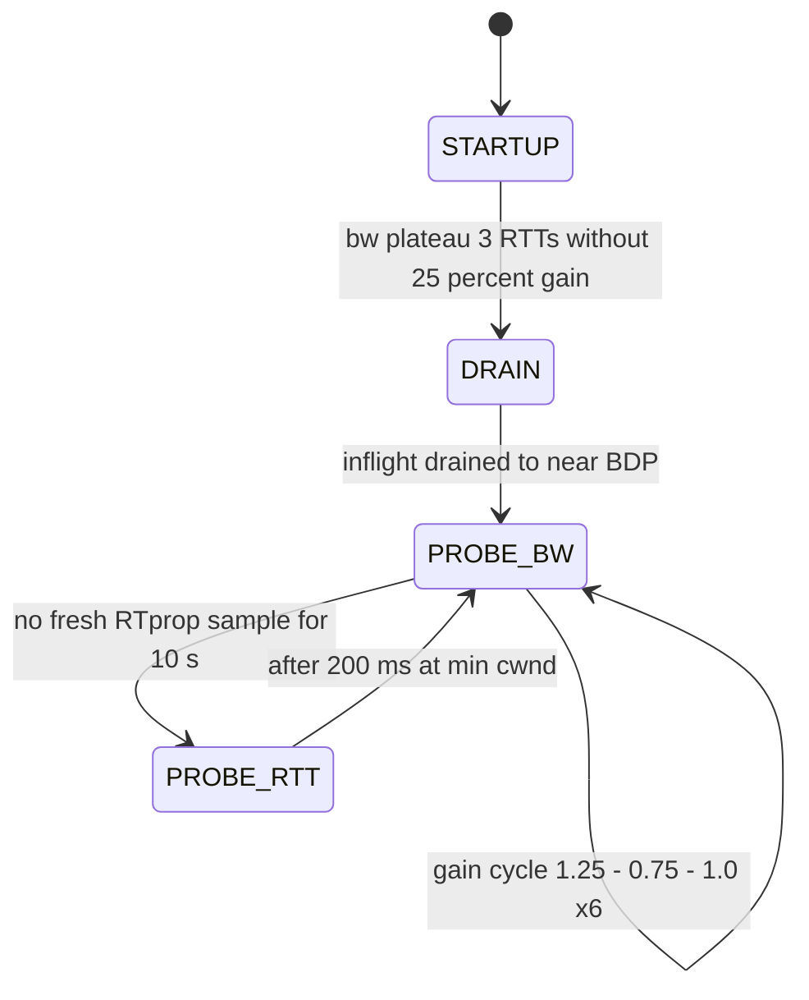

# BBR Deep Dive: Model-Based Congestion Control

## Overview

BBR (Bottleneck Bandwidth and RTT, Google 2016) replaces the loss-and-window folklore of
Reno/CUBIC with an explicit model of the path: measure the bottleneck bandwidth `BtlBw` and
the minimum round-trip time `RTprop`, then pace packets to keep exactly one BDP in flight.
This page is the internals deep dive for readers who already know the basics from
[TCP BBR](../tcp/bbr.md) — here we go into the windowed max/min estimators, the pacing-gain
arithmetic, why BBRv1 misbehaves against CUBIC and on lossy paths, and how BBRv2/v3 fix it
with inflight conservation, loss response, and ECN. It appears in interviews for
performance, CDN, and kernel-networking roles; the expected depth is "explain the gain
cycle and the 3 PTOs of path math", not "BBR is faster".

## Model-based vs loss-based: two different network models

Loss-based controllers (Reno, CUBIC — RFC 5681 family) treat packet loss as a congestion
signal and implicitly assume loss happens *only* when buffers overflow. AIMD then saws the
window: additively probe up, multiplicatively halve on loss. The equilibrium point of that
game is a **full buffer**: the flow fills the bottleneck queue, packets drop, the window
halves, the queue drains, refill. The standing queue is not a side effect — it is how the
controller knows where the cliff is.

BBR instead targets the Kleinrock optimum: the operating point that maximizes throughput
while minimizing delay, at exactly one BDP of data in flight:

\[
BDP = BtlBw \times RTprop
\]

At that point there is no standing queue, no self-induced loss, and the measured RTT equals
the propagation delay. The cost is that BBR needs *measurements* rather than a signal, and
measurements of a path you are deliberately not congesting are hard to get — which is where
the two filters and the probing state machine come in.

| Property             | Reno / CUBIC (loss-based)         | BBR (model-based)                       |
|----------------------|-----------------------------------|------------------------------------------|
| Congestion signal    | Packet loss (CUBIC also scales by RTT) | Estimated BtlBw and RTprop          |
| Operating point      | Buffer cliff (queue full)         | BDP knee (queue ~empty)                  |
| Queue it leaves behind | One buffer's worth (bufferbloat)| ~0 standing queue (minus probe overshoot)|
| Window dynamics      | AIMD sawtooth                     | Pacing rate + cwnd = gain × BDP          |
| Loss on shallow buffers | Starves itself (drops are the signal) | Thrives (ignores loss until v2)    |
| Response to random loss | Pointless halving              | None (v1) / bounded loss response (v2+)  |
| Where it wins        | Deep-buffer, low-BDP paths        | High-BDP WAN, shallow-buffer paths, long RTTs |

The trade both families pay for: loss-based flows converge to *fairness* through the shared
suffering of synchronized drops; BBR flows have no such coupling and must manufacture
fairness another way (the v1 attempt failed in places — see the pathologies section).

## The estimators: windowed max BtlBw, windowed min RTprop

BBR's entire model is two numbers, each maintained by a sliding-window filter over
per-ACK samples:

**Delivery rate → BtlBw.** Each ACK carries cumulative delivered bytes and an app-limited
timestamp. The delivery rate of an interval is
\\( deliveryRate = deliveredBytes / \Delta t \\) computed over the time window between the
transmission of the newest acknowledged packet and the acknowledgement of the oldest
unacknowledged one (the delivery-rate estimator, later formalized in an IETF ccwg draft).
BBR keeps the **maximum** delivery rate seen in the last **10 round trips** — a windowed
max filter implemented as a small ring buffer of per-RTT maxima. Probing beyond the real
bottleneck rate *cannot* raise the measured delivery rate, so a max filter is safe: excess
probing just queues, it never invents bandwidth.

**RTprop → min RTT.** Every ACK gives an RTT sample. BBR keeps the **minimum** over a
**10-second** window, because a standing queue can only add delay, never subtract it: the
smallest observed RTT is an upper bound on propagation delay no matter how congested the
path is. The 10 s window bounds how stale the estimate can be when the true path changes
(routing shift, different bottleneck).

The two windows are deliberately mismatched in scale (10 RTTs vs 10 s). A congested flow
cannot measure both quantities at once — pushing more data in raises BtlBw readings only
while the queue is building, and sees RTprop only when the queue is empty — so BBR alternates
between them in the state machine. Pairing a max filter of one quantity with a min filter of
the other is what makes the composition sound: each filter captures a hard bound the flow
can verify independently of congestion behavior.

One more consequence of model-based control: **pacing is mandatory**. Window-based
controllers transmit a cwnd-sized burst per ACK; BBR sends at a *rate*
\\( pacingRate = pacingGain \times BtlBw \\) with per-packet spacing
\\( packetSize / pacingRate \\). Linux implements pacing with a high-resolution timer in
the fq qdisc (`fq` + `sch_fq` is the recommended pairing for `tcp_bbr`) —
see [../advanced/fq-codel-pacing.md](../advanced/fq-codel-pacing.md).

## BBRv1 state machine



| State      | Pacing gain            | cwnd gain | Purpose and exit condition                            |
|------------|------------------------|-----------|--------------------------------------------------------|
| STARTUP    | 2 / ln 2 ≈ 2.885       | ≈ 2.885   | Double delivery rate each RTT (exponential); exit when 3 consecutive non-app-limited RTTs show < 25% bandwidth growth |
| DRAIN      | 1 / 2.885 ≈ 0.347      | ≈ 2.885   | Drain the STARTUP overshoot at the reciprocal rate; exit when inflight ≈ estimated BDP |
| PROBE_BW   | cycle [1.25, 1, 1, 1, 1, 1, 1, 0.75] | 2.0 | Steady state; random start phase per flow; exit only for RTprop refresh |
| PROBE_RTT  | 1.0 (cwnd pinned)      | 1.0       | Clamp inflight to 4 × MSS for ≥ 200 ms; refresh RTprop; runs at most once per 10 s |

Details that matter:

- **STARTUP gain is 2/ln 2**, not 2: doubling the rate *each RTT* with a paced sender
  requires the exponential factor `e^(ln 2 / 1 RTT)` arithmetic to clear the pipe within
  three probing round trips — the same trick that makes slow start exit in `log(BDP)` RTTs.
- **The PROBE_BW gain cycle is zero-sum by construction**: one RTT at 1.25× and one at 0.75×
  cancel, and six at 1.0× carry the flow, so a full 8-RTT cycle sends exactly
  `8 × BDP` at an average gain of 1.0. The 1.25 phase overdrives the bottleneck to discover
  new bandwidth (and to force delivery-rate samples above the old BtlBw when the path
  improves); the 0.75 phase drains the queue it created so the RTprop estimate is not
  polluted. Phase order is randomized per flow so coexisting flows desynchronize their
  probes instead of colliding in lockstep.
- **PROBE_RTT is the ugly one.** To re-measure propagation delay, the flow dumps its queue
  contribution and sits at 4 MSS for ≥ 200 ms — a throughput cliff every 10 seconds.
  Uncoordinated flows that share a bottleneck tend to *synchronize* their ProbeRTT episodes
  (all flows drain together, the link goes idle, everyone measures, everyone refills), which
  is measurable as periodic utilization dips on shared links. BBRv2 tightens the entry
  condition (only when actual inflight is near the BDP estimate) to shrink both the cost
  and the herding.

## Pacing-rate math, worked

A server in Frankfurt serves a client at 25 Mbps with an 80 ms path:

```text
BDP          = 25 Mbps x 80 ms  = 25e6/8 B/s x 0.08 s = 250,000 B  (~172 MSS-sized packets)
cwnd (PROBE_BW, gain 2.0)       = 2.0 x BDP          = 500,000 B
pacing rate (gain 1.0)          = 25 Mbps  -> spacing = 1448x8 / 25e6 = 463 us per packet
STARTUP rate (gain 2.885)       = 72 Mbps, exiting after the delivery-rate plateau
```

```python
# BBR pacing arithmetic: BDP, window bounds, and the zero-sum gain cycle
MSS = 1448

def bbr(bw_mbps, rtt_ms):
    bdp = bw_mbps * 1e6 / 8 * rtt_ms / 1e3
    return {
        "BDP_B":      bdp,
        "BDP_mss":    bdp / MSS,
        "cwnd_probe": 2.0 * bdp,          # PROBE_BW cwnd gain
        "startup_gbps": 2.885 * bw_mbps,  # STARTUP pacing gain
    }

for bw, rtt in [(25, 80), (100, 20), (10, 200)]:
    s = bbr(bw, rtt)
    print(f"{bw:>4} Mbps {rtt:>4} ms -> BDP {s['BDP_B']:>9.0f} B "
          f"({s['BDP_mss']:>5.1f} seg)  cwnd@2x {s['cwnd_probe']:>9.0f} B")

# PROBE_BW gain cycle: one 1.25 RTT and one 0.75 RTT cancel over 8 RTTs
cycle_gain = (1.25 + 0.75 + 6 * 1.0) / 8
print(f"average gain over the 8-RTT cycle: {cycle_gain:.3f}")
```

Output:

```text
  25 Mbps   80 ms -> BDP    250000 B (172.7 seg)  cwnd@2x    500000 B
 100 Mbps   20 ms -> BDP    250000 B (172.7 seg)  cwnd@2x    500000 B
  10 Mbps  200 ms -> BDP    250000 B (172.7 seg)  cwnd@2x    500000 B
average gain over the 8-RTT cycle: 1.000
```

The three paths above have identical BDP — a useful interview intuition: a 25 Mbps trans-
atlantic link and a 100 Mbps metro link behave identically to BBR. The gain-cycle line is
the design point most candidates miss: the probe is *paid for* within the cycle, which is
why BBR can probe aggressively without a standing queue — on average it never sends more
than the pipe drains.

## BBRv1 pathologies

BBRv1 shipped in Linux 4.9 and ran on google.com before its interactions were fully
understood. The known failure modes, all confirmed in Google's own follow-up work:

- **Unfairness against CUBIC on shallow-buffer bottlenecks.** A CUBIC flow signals
  congestion by filling the buffer and dropping; BBRv1 ignores those drops (loss is not in
  its model) and keeps pacing at `BtlBw`. On a shallow buffer the CUBIC flow's signal is
  suppressed — it cannot grow its queue — and BBRv1 captures most of the link. Measured
  results in Google's BBRv2 writeups show BBRv1 taking several times CUBIC's share on such
  paths.
- **Loss insensitivity on lossy paths.** On a link with 1-5% random loss (common on Wi-Fi
  and some satellite/access networks), CUBIC's AIMD collapse is self-limiting; BBRv1 in
  PROBE_BW shrugs loss off entirely and keeps a full BDP in flight — raising retransmit
  volume. Google reported BBRv1 retransmission rates as high as 10-15% on some lossy runs.
- **RTT unfairness and ProbeRTT herding.** The BtlBw max window is denominated in round
  trips, so flows with shorter RTT refresh their bandwidth estimates (and probe) more often
  in wall-clock time, skewing share toward low-RTT flows; meanwhile independently-timed
  ProbeRTT episodes on a shared bottleneck tend to coalesce, producing synchronized
  throughput dips.
- **Startup overshoot.** STARTUP doubles blind to loss; on a shallow buffer the exponential
  ramp overfills long before the plateau detector fires, dropping packets that CUBIC would
  have avoided with the same cwnd.

Each of these is the same root cause wearing different hats: **v1's model has no term for
other flows' signals**. BtlBw measured with a max filter is a *upper envelope of your own
throughput* — it says nothing about what the path would give you if you yielded.

## BBRv2 and v3: inflight conservation, loss response, ECN

BBRv2 (design docs and paper series in the `google/bbr` repository, refined through
BBRv3 in 2023) restructures the controller around two extra state variables and a real
loss/ECN response:

- **`inflight_hi` / `inflight_lo`.** The flow now tracks a *volume* envelope in bytes, not
  just a rate: `inflight_lo` is the largest inflight it has seen with no loss/ECN, and
  `inflight_hi` is a probe ceiling raised slowly during bandwidth probing. PROBE_UP can no
  longer run away — bandwidth growth is gated on inflight headroom, which is exactly the
  signal a CUBIC flow needs you to respect.
- **Loss response.** When the per-round loss rate crosses a small threshold (≈ 2% in the
  reference design) *and* inflight exceeds the estimated BDP, BBRv2 cuts inflight toward
  `inflight_lo`, mirroring AIMD's social contract: yield when others are signaling.
  Bandwidth probing then resumes from a lower ceiling. This bounds retransmit volume on
  lossy paths at a fraction of v1's.
- **ECN support.** BBRv2/v3 add a DCTCP-style ECN mode: ECN-marked bytes raise an EWMA of
  the marking fraction and the controller drains accordingly, keeping the queue near the
  marking threshold. This is *not* the L4S/Prague algorithm — Prague targets sub-RTT
  scalability against a different marking profile — but it makes BBR a cooperative citizen
  on ECN-marking datacenter fabrics. The interplay matters for datacenter TCP choices:
  DCTCP (RFC 8257) and BBR-ECN now answer the same question ("how do I keep shallow queues
  full of short flows?") from different assumptions — see
  [../advanced/datacenter-tcp.md](../advanced/datacenter-tcp.md).
- **Slower, loss-aware STARTUP.** v2 exits STARTUP on the bandwidth plateau *or* on excess
  loss, and the ProbeRTT entry condition is tightened (enter only when inflight is actually
  near the BDP estimate), cutting both overshoot and the herding artifact.

BBRv3 is the hardened release of that design — bug fixes to the v2 state machine (ECN,
ProbeRTT entry, app-limited handling) and Google's production default on its edge; it has
been posted to the Linux netdev list, while mainline kernels still carry the v1
`tcp_bbr` module. QUIC stacks took the middle path: Cloudflare's quiche and MsQuic ship
BBR-family controllers where the v2-style loss/ECN response is being exercised on
CDN-scale traffic — [../advanced/quic-congestion-control.md](../advanced/quic-congestion-control.md)
covers the QUIC-side mechanics.

## Deployment numbers and where BBR actually wins

The published results, worth quoting with their caveats:

- **Google B4 / internal WAN (2016 paper):** 2-25× throughput over CUBIC on paths with
  shallow buffers — the headline number, and the honest caveat is that B4 *is* BBR's home
  turf: controlled buffers, high BDP, loss engineered out.
- **google.com and YouTube (2016 rollout):** median throughput gains of ~4% globally
  (double digits in some regions) and median RTT reductions around 33% for YouTube flows —
  modest-sounding averages that hide the real effect: the *tail* (long transfers over
  congested access links) improves dramatically, which is what users feel.
- **Linux `tcp_bbr` since 4.9 (2016).** Available everywhere, still v1 semantics in
  mainline; requires the `fq` qdisc for pacing (or internal TCP pacing since 4.13).
- **QUIC/HTTP3 stacks** (quiche, MsQuic, quic-go) ship BBR variants as a first-class CC —
  pacing is native to QUIC, so BBR's main kernel-side integration cost disappears.

Where BBR is the wrong answer: deep-buffer datacenter paths at low BDP (CUBIC/DCTCP are
fine and better studied), links where fairness with unmanaged CUBIC traffic is a regulatory
requirement (use v2+ or don't), and anywhere a shallow buffer *must* be filled fast by
design (incast bursts — see [../advanced/congestion-control-advanced.md](../advanced/congestion-control-advanced.md)).

## Comparison: BBR vs CUBIC vs DCTCP

| Dimension            | CUBIC (RFC 8312-era default)     | DCTCP (RFC 8257)              | BBR v1 / v2+                                |
|----------------------|-----------------------------------|-------------------------------|----------------------------------------------|
| Signal               | Loss (RTT-scaled window growth)   | ECN marking fraction α        | BtlBw + RTprop (+ loss/ECN in v2+)          |
| Window dynamics      | Cubic scalene growth, halve on loss | Reduce cwnd by (1 − α/2), EWMA g = 1/16 | cwnd = cwnd_gain × BDP; pacing rate carries the load |
| Queue left behind    | Full buffer (AIMD equilibrium)    | ~1 marking threshold (shallow, K packets) | ~0 standing queue (probe overshoot only)  |
| Latency per flow     | High, buffer-sized                | Low and stable                | Low, with ProbeRTT dips (v1)                 |
| Fairness mechanism   | Synchronized loss                 | ECN marks couple flows        | None (v1) / loss+ECN yield, inflight bounds (v2+) |
| Random-loss tolerance| Poor (halves on every loss)       | n/a (no random marks in DC)   | Good (v1 ignores loss; v2 bounded response)  |
| Shallow-buffer host  | Starves (drops are its signal)    | Thrives (marks are cheap)     | v1 dominates; v2+ cooperates                 |
| Best habitat         | General internet, deep buffers    | Datacenter fabrics with ECN   | High-BDP WAN, CDN edge, QUIC                 |

## Interview Questions

1. **Why is BDP the right target, and how does BBR compute it?** The Kleinrock optimum —
   maximum throughput at minimum delay — sits at exactly one BDP in flight: more fills a
   queue (adding delay without adding throughput), less starves the pipe. BBR computes it
   as `BtlBw × RTprop`, the max delivery rate over the last 10 RTTs times the min RTT over
   the last 10 seconds. The max/min pairing works because congestion can only ever *raise*
   your RTT and *never* raise your real delivery rate — each filter converges on a hard
   bound of the path.
2. **Explain the PROBE_BW gain cycle and why it is zero-sum.** Eight one-RTT phases at
   pacing gains [1.25, 1×6, 0.75]: the 1.25 phase overdrives the bottleneck to discover
   bandwidth above the current estimate, the 0.75 phase drains the queue that created, and
   the six 1.0 phases carry the flow — `(1.25 + 0.75 + 6)/8 = 1.0`, so the cycle sends
   exactly 8 BDP in 8 RTTs. The start phase is randomized per flow so probes from
   coexisting BBR flows do not collide in lockstep.
3. **Why is BBRv1 unfair to CUBIC, and how does v2 fix it?** CUBIC's congestion signal is
   buffer-overflow loss; BBRv1's model contains no loss term, so it keeps pacing at the
   measured BtlBw while the CUBIC flow starves on a shallow buffer that can never produce
   enough signal. Google measured several-fold share imbalances and 10-15% retransmit
   rates on lossy runs. BBRv2 adds `inflight_hi/lo` volume bounds, yields when per-round
   loss exceeds ~2% while inflight exceeds BDP, adds DCTCP-style ECN response, and gates
   probing on inflight headroom — restoring the "yield when others signal" contract.
4. **What is PROBE_RTT and why is it controversial?** To re-measure RTprop the flow clamps
   inflight to 4×MSS for ≥200 ms, at most once per 10 s — a self-inflicted throughput
   cliff. Worse, uncoordinated flows sharing a bottleneck tend to synchronize their
   ProbeRTT episodes, so the link visibly idles every ~10 s. v2 tightens the entry
   condition (enter only when inflight is near the BDP estimate) to reduce both the cost
   and the herding.
5. **You run a CDN: where do you deploy BBR, and where do you not?** Deploy it on
   high-BDP, shallow-buffer paths — cross-continent origin pulls, mobile access, satellite,
   anything where CUBIC's buffer-filling equilibrium costs latency — and in QUIC stacks
   where pacing is native. Skip it on deep-buffer low-BDP datacenter paths (CUBIC/DCTCP are
   equivalent or better and better understood), and be careful mixed with unmanaged CUBIC
   traffic on shallow buffers — that is the known unfairness scenario; use v2/v3 semantics.
6. **Why does BBR need pacing when CUBIC does not?** A window controller sends bursts up to
   cwnd and relies on buffers to absorb them; BBR's whole value proposition is *not* using
   the buffer, so it must emit at a measured rate — `pacingGain × BtlBw` with per-packet
   spacing. Linux implements it via the fq qdisc (or internal pacing since 4.13); QUIC
   implementations own their send timers in userspace, which is why BBR integration there
   is cleaner.

## Key Takeaways

- BBR replaces the loss signal with a path model: `BtlBw` (windowed max delivery rate,
  10 RTTs) and `RTprop` (windowed min RTT, 10 s), targeting `cwnd ≈ gain × BDP`.
- Pacing is intrinsic: `pacingRate = pacingGain × BtlBw`; in Linux that means the `fq`
  qdisc, in QUIC it is native send-timer logic.
- STARTUP doubles per RTT with gain 2/ln 2 ≈ 2.89, DRAIN runs the reciprocal, PROBE_BW's
  8-phase gain cycle averages exactly 1.0, and PROBE_RTT clamps to 4 MSS every 10 s.
- The gain cycle is zero-sum by design: BBR probes bandwidth without leaving a standing
  queue, which is the entire latency argument.
- BBRv1's missing term is *other flows*: it dominates CUBIC on shallow buffers, shrugs off
  loss (10-15% retransmits reported), herds ProbeRTT, and skews share toward low-RTT flows.
- BBRv2/v3 add `inflight_hi/lo`, a ~2% loss-rate yield, DCTCP-style ECN (not L4S/Prague),
  and loss-aware STARTUP; v3 is Google's production default, mainline Linux still ships v1.
- Numbers worth quoting: 2-25× over CUBIC on Google's B4, ~4% median YouTube throughput
  gain with ~33% median RTT reduction — tail improvements, not averages.
- CUBIC on deep-buffer paths and DCTCP on ECN fabrics are still the right defaults in their
  habitats; BBR's home turf is high-BDP and shallow-buffer WANs plus QUIC.

## References

- [Google BBR repository](https://github.com/google/bbr) — source, the v2/v3 design docs
  (`bbr2.md`), measurement data, and the IETF ccwg draft pointers.
- Cardwell, Cheng, Gunn, Yeganeh, Jacobson — *BBR: Congestion-Based Congestion Control*,
  ACM Queue 14(5) / CACM 60(2), 2016-2017:
  [queue.acm.org/detail.cfm?id=3022184](https://queue.acm.org/detail.cfm?id=3022184)
- [draft-cardwell-ccwg-bbr — BBR Congestion Control (datatracker)](https://datatracker.ietf.org/doc/draft-cardwell-ccwg-bbr/) —
  the IETF-track protocol specification of the BBRv2/v3 algorithms.
- [RFC 8257 — Data-Center TCP (DCTCP)](https://www.rfc-editor.org/rfc/rfc8257.html) — the
  ECN-marking controller BBR's ECN mode mirrors.
- [RFC 3168 — Explicit Congestion Notification](https://www.rfc-editor.org/rfc/rfc3168.html)
- [RFC 8311 — Relaxing Restrictions on ECN Experimentation](https://www.rfc-editor.org/rfc/rfc8311.html)
- [RFC 5681 — TCP Congestion Control](https://www.rfc-editor.org/rfc/rfc5681.html) — the
  AIMD baseline BBR departs from.
- The delivery-rate estimator is specified in the IETF ccwg
  delivery-rate draft (`draft-cheng-iccwg-delivery-rate-estimator`) — cite by name; the
  canonical text lives under the google/bbr repository docs.

## Cross-References

- [TCP BBR](../tcp/bbr.md) — the overview page: state machine basics, Linux enablement,
  and the CUBIC operating-point comparison this page assumes.
- [TCP CUBIC](../tcp/cubic.md) — the loss-based incumbent, its scalene window function and
  where its equilibrium beats BBR.
- [Datacenter TCP (DCTCP)](../advanced/datacenter-tcp.md) — the ECN-marking alternative for
  fabrics, and the shallow-queue problem both solve differently.
- [Advanced Congestion Control](../advanced/congestion-control-advanced.md) — BBR internals
  summary, Copa/PCC alternatives, AQM, and the fairness context for v2's loss response.
- [fq/codel and pacing](../advanced/fq-codel-pacing.md) — the qdisc BBR pairs with in Linux
  for per-packet pacing.
- [QUIC Congestion Control](../advanced/quic-congestion-control.md) — pacing and CC
  mechanics inside QUIC, where BBR variants are the default choice on CDNs.
