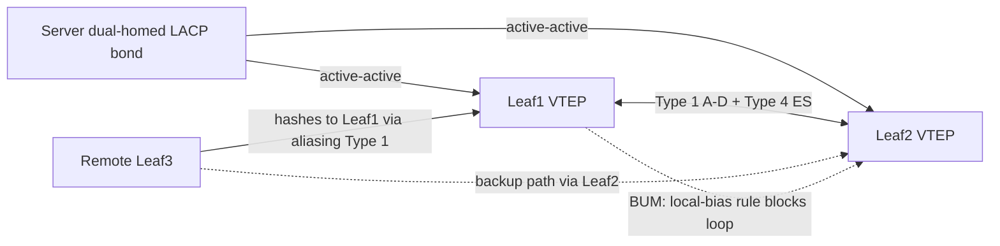
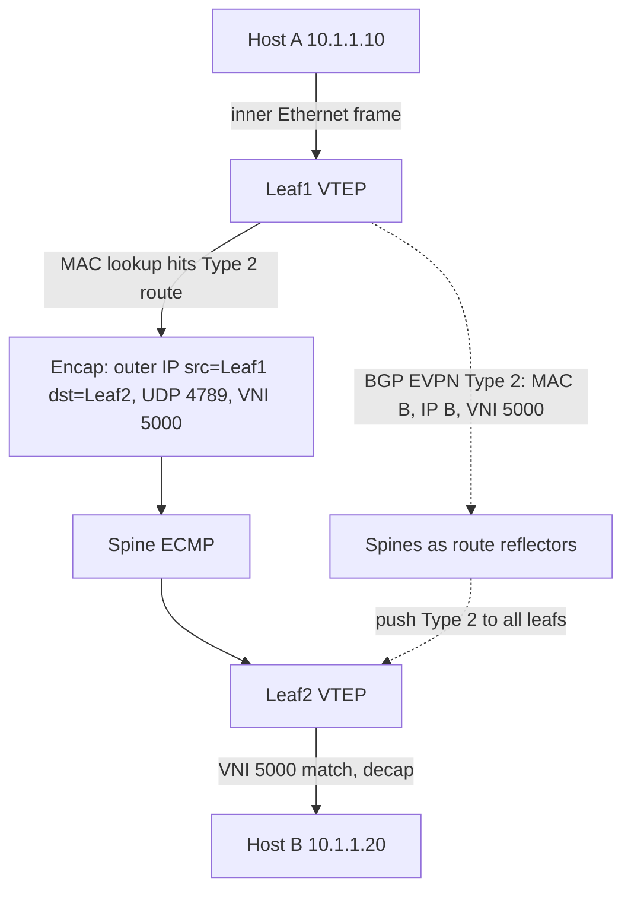

# EVPN-VXLAN: The Data Center Overlay Control Plane

## Overview

EVPN-VXLAN replaces the classic data center L2 recipe — VLANs, MAC flood-and-learn,
spanning tree — with two separable pieces: **VXLAN**, an encapsulation that stretches L2
segments across an IP fabric using a 24-bit VNI, and **BGP EVPN**, a control plane where
leaf switches advertise MAC/IP reachability instead of discovering it by flooding. It is
the default fabric design in modern clouds and campus networks, and a top-tier interview
topic for data center/infrastructure roles. This page covers the wire format, route types
1–5, all-active multihoming, ARP suppression, and L3 gateway models. For BGP mechanics
(eBGP, route targets, the decision process) read [BGP Deep Dive](../routing/bgp-deep.md)
first; this page assumes them.

## The problem: stretching L2 over a routed fabric

Virtualization and container orchestration need L2 adjacency semantics: live VM migration,
IPs that move without renumbering, broadcast domains that span racks. Classic VLANs deliver
this poorly at scale:

- **12-bit VLAN ID = 4094 usable segments** per switch ([VLAN & STP](../advanced/vlan-stp.md)),
  exhausted long before a cloud's tenant count.
- **Flood-and-learn** wastes bandwidth on unknown unicast and broadcast, and MAC tables at
  ToR scale into the hundreds of thousands.
- **Spanning tree blocks half the links** (or more) and reconverges slowly; see the STP
  mechanics in the VLAN page.
- **Traffic engineering is impossible** — a blocked link stays blocked.

The fix is a two-layer split: keep an IP routed fabric underneath (ECMP everywhere, no
blocked links — see [Data Center Fabrics](../advanced/datacenter-fabrics.md)) and *tunnel*
L2 over it. VXLAN provides the tunnel; EVPN provides the brains.

## VXLAN encapsulation on the wire

A VTEP (VXLAN Tunnel Endpoint — typically the ToR switch or host NIC) wraps the original
Ethernet frame in UDP. Packet layout outermost-first:

```text
Outer Eth | Outer IP | Outer UDP (dst 4789) | VXLAN hdr | Inner Eth frame
                                          | flags(8) VNI(24) R(24) |
```

- **VNI — 24 bits**: ~16.7M overlay segments, against 4094 VLANs. A VLAN maps 1:1 into a
  VNI (or one VNI bridges many VLANs, the "many-to-one" model of RFC 8365).
- **UDP destination port 4789** (IANA-assigned by RFC 7348; older implementations used
  8472 — a classic interop trap).
- **Outer UDP source port is a hash of the inner flow.** This is deliberate: the fabric's
  ECMP hashing (which load-balances on the 5-tuple) sees per-flow entropy even though the
  outer IPs/ports are just two VTEPs, so an elephant flow between the same pair of hosts
  does not pin a single spine link.
- **Overhead: 50 bytes** (14 outer Eth + 20 outer IP + 8 UDP + 8 VXLAN). A 1500-byte
  tenant frame needs 1550 end-to-end — hence the fabric-wide MTU increase to 9100+ or MSS
  clamping; the same MTU arithmetic as SRv6 overlays.

VXLAN is dumb by design: no control plane, no neighbor discovery — VTEPs either learn
remote VTEPs by flooding (data-plane learning) or are told. That "or is told" is EVPN.

## Flood-and-learn vs the BGP EVPN control plane

Without EVPN, a BUM frame (Broadcast, Unknown unicast, Multicast) is replicated to every
VTEP in the segment — via ingress replication (head-end replication, one copy per remote
VTEP) or multicast groups in the underlay — and receivers learn source MACs the way a
switch does: from traffic. Consequences: every ARP request hits every VTEP, unknown
unicast floods until learned, and MAC withdrawal/failover propagates only by aging timers.

BGP EVPN (RFC 7432, EVPN over NVO3 encapsulations in RFC 8365) inverts it: leafs are BGP
peers (typically eBGP to spines as route reflectors, or iBGP through a reflector), and
reachability is *advertised before traffic exists*. The address family is
`l2vpn-evpn` (AFI 25, SAFI 70); route targets constrain which VTEPs import which VNIs —
the same RT machinery as L3VPN (cross-link the pipeline discussion in
[BGP Deep Dive](../routing/bgp-deep.md)).

### Route types 1–5

| Type | Name | Carries | What it enables |
|---|---|---|---|
| 1 | Ethernet Auto-Discovery (per-ES / per-EVI) | ESI + ESI label | Aliasing, split-horizon, **mass withdraw** on failure |
| 2 | MAC/IP Advertisement | MAC, IP, VNI, ESI | Unicast reachability, **ARP suppression** entries, MAC mobility |
| 3 | Inclusive Multicast Ethernet Tag (IMET) | VTEP IP + VNI | Discovers remote VTEPs per segment → builds ingress-replication trees for BUM |
| 4 | Ethernet Segment Route | ESI + DF election algo | Elects Designated Forwarder per (ES, EVI); dedup BUM from multihomed ES |
| 5 | IP Prefix Route (RFC 9136) | Prefix, GW IP, VNI | L3 reachability (subnets/hosts) in the same AF — the routed overlay |

Reading table as an interview: Types 2 and 3 alone give you a working L2 overlay (unicast +
BUM); Type 1 and 4 are the multihoming machinery; Type 5 folds routed L3VPN-style
reachability into the same control plane so one BGP session runs the whole fabric.

## All-active multihoming: ESI, split-horizon, aliasing

A server dual-homes to two leafs with an LACP bond (MLAG's modern replacement — no
vendor-paired control plane, just standard BGP). The bundle's attachment circuit gets an
**ESI**: a 10-byte identifier, ESI=0 meaning single-homed. Three mechanisms make
all-active work:

1. **Split-horizon** — when leaf1 and leaf2 (both attached to ES-12) exchange a BUM frame,
   each must not re-send it to the other, or the frame loops back into the server. With
   VXLAN, RFC 8365 specifies the **local-bias rule**: a BUM frame received *from a local
   ES* is never forwarded out another local ES, only into the underlay. (MPLS EVPN instead
   uses the ESI label from Type-1 routes.)
2. **Aliasing** — Type-1 per-EVI routes tell remote leafs "MAC M lives on ES-12, reachable
   via leaf1 OR leaf2". Remote traffic to M load-balances across both leafs; with only
   Type-2 learning, the fabric would hash to one leaf and strand half the bond.
3. **DF election** — for BUM *toward* the server, Type-4 routes elect one Designated
   Forwarder per (ES, EVI) so the server does not receive duplicates; the non-DF leaf drops
   BUM copies it receives.

Failure handling is where EVPN earns its keep: when leaf1 dies, its peers withdraw the
Type-1 *per-ES* route — one route withdrawal, a **mass withdraw** — and every remote leaf
simultaneously stops using leaf1 for *all* MACs on that ES. Contrast MAC-table cleanup by
per-MAC withdrawal or aging. Convergence is sub-second and bounded by BGP, not by link
timers; pair it with the sub-50ms repair patterns in
[Fast Failover](../advanced/fast-failover.md).



## ARP suppression and MAC mobility

**ARP suppression** (integrated ARP flooding suppression, RFC 7432 §10 / RFC 8365):
every leaf gleans MAC↔IP bindings from Type-2 advertisements into a proxy-ARP/proxy-ND
table. When host A ARPs for 10.1.1.20, its local leaf answers *from the control plane*
without flooding the request into the fabric. With host counts in the tens of thousands,
this converts the single biggest BUM source — periodic ARP chatter — into unicast
lookups. The gleaning discipline (only from control plane, drop data-plane ARP learning)
is also a security win: ARP-spoofing inside the fabric no longer poisons leaf caches, the
attack class described in [ARP](../tcp-ip/arp.md).

**Mobility**: when a VM moves between leafs, both advertise the MAC in Type-2s. EVPN adds
a per-MAC sequence number (the MAC Mobility extended community); receivers keep the entry
from the higher sequence number, and the leaf detecting a *new* MAC on a port increments
its counter — deterministic, loop-free move handling.

## L3 gateway models: centralized vs distributed

A pure L2 overlay is not enough — tenants route, and subnets must talk. Two designs:

**Centralized gateway.** A dedicated (usually redundant) pair of leafs acts as the only
router: every inter-subnet packet hairpins from the source leaf to the gateway leaf and
back into the overlay. Simple (all leafs are bridges), scales poorly — the gateway pair is
both bandwidth bottleneck and failure blast radius, and suboptimal paths are structural.

**Distributed (anycast) gateway.** Every leaf runs the same *anycast* gateway: identical
virtual IP + virtual MAC for each tenant subnet, advertised to hosts. The host's default
gateway is *its own leaf*, so inter-subnet routing happens at first hop, optimally.
The routed overlay mechanics (RFC 9135, "Integrated Routing and Bridging") come in two
flavors:

- **Asymmetric IRB**: ingress leaf routes to the destination subnet and bridges in the
  destination VNI — it must hold all tenants' routes.
- **Symmetric IRB**: ingress leaf routes into a per-VRF **L3VNI** toward the remote leaf,
  which routes again into the destination subnet. Each leaf only needs routes for locally
  attached tenants — the scaling property large fabrics need. Type-5 routes carry the
  prefixes.

| Aspect | Centralized | Distributed (anycast IRB) |
|---|---|---|
| Inter-subnet path | Hairpin via GW leafs | Routed at first hop |
| Bandwidth | GW pair is a chokepoint | Fabric-wide ECMP |
| Leaf routing state | None | Per-VRF (symmetric: minimal) |
| Failure domain | GW pair | Distributed, none |
| Complexity | Low | Higher (L3VNI, Type-5, RT plumbing) |

Production rule of thumb: small fabrics start centralized; anything multi-rack ends up
distributed symmetric IRB, because the chokepoint is unacceptable and Type-5 collapses the
L2 and L3 control planes into one BGP AF.

## Packet walk: known unicast end to end

Host A (10.1.1.10, VNI 5000) behind Leaf1 sends to Host B (10.1.1.20) behind Leaf2:



Steps in order: Leaf1's bridge table for VNI 5000 already holds B's MAC via a Type-2 route
(remote leaf = Leaf2, learned through the spine reflectors) — no flooding happens. Leaf1
encapsulates, hashing the inner flow to pick the outer UDP source port for ECMP entropy.
Spines forward on outer IP only — they are unaware of VNIs. Leaf2 matches VNI 5000,
decapsulates, and delivers. Note what never occurred: unknown-unicast flood, ARP broadcast
(suppressed by proxy-ARP from Type 2), or MAC learning from data traffic.

## EVPN-VXLAN vs Geneve vs classic VLAN

| Dimension | Classic VLAN | EVPN-VXLAN | EVPN-Geneve |
|---|---|---|---|
| Segment ID width | 12-bit (4094) | 24-bit VNI | 24-bit VNI |
| Transport | Native Ethernet | UDP 4789 over IP fabric | UDP 6081 over IP fabric |
| Control plane | Flood-and-learn + STP | BGP EVPN types 1–5 | BGP EVPN or OVN logical flows |
| Header extensibility | None (fixed) | Fixed 8-byte header | **Variable TLV options** (flow-level metadata) |
| Where you meet it | Campus/legacy | DC fabrics (Cisco/Juniper/Arista, SONiC) | OVS/OVN, clouds (AWS uses its own NVMe-adjacent stack; OVN default is Geneve) |
| MTU overhead | 0 | 50 bytes | 50 + options bytes |

Geneve (RFC 8926) is VXLAN's generalization: variable-length TLVs let controllers attach
per-flow metadata (security groups, tenant policies) end-to-end — see
[Geneve](../advanced/geneve.md) for the TLV mechanics and the OVS lineage. The field split
is clear: hardware switch fabrics standardized on EVPN-VXLAN (ASIC support, mature vendor
interop), OVN/software overlays converged on Geneve. Interviews probe *why*: VXLAN's fixed
header fit existing ASIC pipelines; Geneve's extensibility costs parse complexity hardware
vendors didn't want in 2015 — a classic extensibility-vs-hardware lesson.

## Interview Questions

1. **Why does VXLAN hash the inner flow into the outer UDP source port?**
ECMP in the underlay hashes on the outer 5-tuple. Two VTEPs have exactly one address pair,
so without per-flow entropy every flow between a given host pair takes the same spine path,
deserializing links. Hashing the inner flow into the outer source port (16 usable bits)
gives the fabric per-flow spread while VTEPs stay the outer endpoints. Destination port is
fixed at 4789.
2. **What breaks if you run EVPN without Type-1 routes in an all-active multihoming setup?**
Aliasing disappears: remote leafs learn the multihomed server's MACs only from whichever
leaf's Type-2 wins, so all traffic to the bond lands on one leaf — half the server
uplink capacity is stranded and the surviving leaf must resync by new learning on failure.
Mass withdraw is also lost: a leaf failure degenerates to per-MAC withdrawal/aging, and
split-horizon on MPLS flavors loses its ESI label (VXLAN falls back to local-bias).
3. **Explain split-horizon for BUM traffic between two leafs attached to the same ESI.**
Leaf1 and Leaf2 both connect to server ES-12. If Leaf1 receives a BUM frame from ES-12 and
forwards it into the fabric, Leaf2 — also attached to ES-12 — must not deliver it back to
the server out its ES port, or the server sees duplicates and loops can form. VXLAN
implements this with the local-bias rule: frames arriving from a local ES are forwarded
only into the underlay, never to another local ES. MPLS EVPN uses the ESI label instead:
the receiving leaf checks the label and drops if it matches a locally attached ES.
4. **Centralized vs distributed L3 gateway — when does each make sense?**
Centralized: small fabrics, few inter-subnet flows, minimal leaf intelligence — one
redundant GW pair routes everything, and leafs stay pure bridges. Distributed: default
choice once multiple racks exist; anycast gateways on every leaf route at first hop, and
symmetric IRB (per-VRF L3VNI, Type-5 prefixes) means a leaf holds routes only for its
attached tenants. The switch-over reason is structural: the centralized pair is a
bandwidth and failure chokepoint that grows with the fabric.
5. **How does ARP suppression work, and why does it matter for scale?**
Type-2 MAC/IP advertisements populate a proxy-ARP table on every leaf. When a host ARPs
for an IP the leaf knows, the leaf answers directly — the request never enters the fabric.
At tens of thousands of hosts, ARP is the dominant BUM load (gratuitous bursts, periodic
re-ARP); suppression converts it to local lookups and doubles as an anti-spoofing control,
since leaf caches build only from the BGP control plane, not data-plane ARP.
6. **EVPN-VXLAN vs Geneve — who uses which and why?**
Both use a 24-bit VNI over UDP. EVPN-VXLAN dominates hardware switch fabrics: fixed 8-byte
VXLAN header maps cleanly onto ASIC pipelines, and BGP EVPN gives a standard multivendor
control plane. Geneve (RFC 8926) adds variable TLV options for controller-attached flow
metadata and is the default in OVN/OVS software overlays — extensibility over hardware
parsability. The interesting interview point is that neither "won": they dominate
different substrates (ASIC fabric vs host software dataplane).

## Key Takeaways

- VXLAN = L2 over UDP/IP: 24-bit VNI (~16.7M segments), UDP 4789, 50-byte overhead,
  outer-source-port entropy for ECMP. It is transport only — no discovery, no learning.
- BGP EVPN (RFC 7432) is the control plane: AF AFI 25/SAFI 70, RT-scoped import/export.
  Types 2+3 = basic L2 overlay; 1+4 = multihoming; 5 = routed overlay.
- Flood-and-learn dies at scale: BUM via ingress replication + EVPN. Unknown unicast,
  ARP chatter, and MAC aging are all replaced by Type-2/3 advertisements and proxy-ARP.
- All-active multihoming = ESI + split-horizon (local-bias on VXLAN) + aliasing (Type 1)
  + DF election (Type 4) + mass withdraw — sub-second, bounded by BGP withdrawal.
- Distributed anycast gateways with symmetric IRB (L3VNI per VRF, RFC 9135) are the
  production pattern for inter-subnet traffic; centralized gateways are a starting point,
  not an end state.
- Hardware fabrics run EVPN-VXLAN; OVN-style software overlays run Geneve — the split is
  ASIC parsability vs TLV extensibility, not protocol superiority.

## References

- [RFC 7348 — Virtual eXtensible Local Area Network (VXLAN)](https://www.rfc-editor.org/rfc/rfc7348.html)
- [RFC 7432 — BGP MPLS-Based Ethernet VPN (EVPN route types 1–4)](https://www.rfc-editor.org/rfc/rfc7432.html)
- [RFC 8365 — A Network Virtualization Overlay Solution Using Ethernet VPN (EVPN)](https://www.rfc-editor.org/rfc/rfc8365.html)
- [RFC 9136 — IP Prefix Advertisement in EVPN (Type 5 routes)](https://datatracker.ietf.org/doc/html/rfc9136)
- [RFC 9135 — Integrated Routing and Bridging in Data Center with EVPN (IRB models)](https://datatracker.ietf.org/doc/html/rfc9135)
- [RFC 8926 — Geneve: Generic Network Virtualization Encapsulation](https://www.rfc-editor.org/rfc/rfc8926.html)
- [FRRouting docs — BGP EVPN configuration and operations](https://docs.frrouting.org/)
- [Open vSwitch internals (dataplane implementation)](https://github.com/openvswitch/ovs/tree/master/lib)
- [OVN documentation — logical networks over Geneve](https://docs.ovn.org/)

## Cross-References

- [Geneve](../advanced/geneve.md) — the extensible sibling overlay; its page opens with
  exactly the VXLAN limitations this page solves with a control plane.
- [VLAN & Spanning Tree](../advanced/vlan-stp.md) — the classic L2 design EVPN-VXLAN
  replaces, including its comparison section to VXLAN.
- [BGP Deep Dive](../routing/bgp-deep.md) — route targets, RR design, and the decision
  process that EVPN rides on; read before this page.
- [Data Center Fabrics](../advanced/datacenter-fabrics.md) — the routed underlay (leaf-
  spine, ECMP) that VXLAN tunnels across.
- [ARP](../tcp-ip/arp.md) — the broadcast protocol ARP suppression eliminates from the
  fabric.
- [Fast Failover](../advanced/fast-failover.md) — complementary sub-second repair
  techniques in the underlay and control plane.
