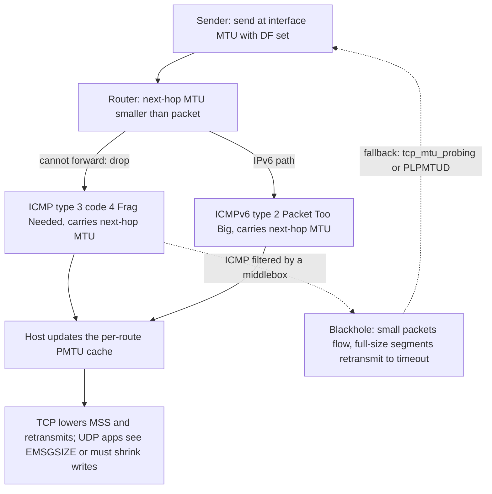
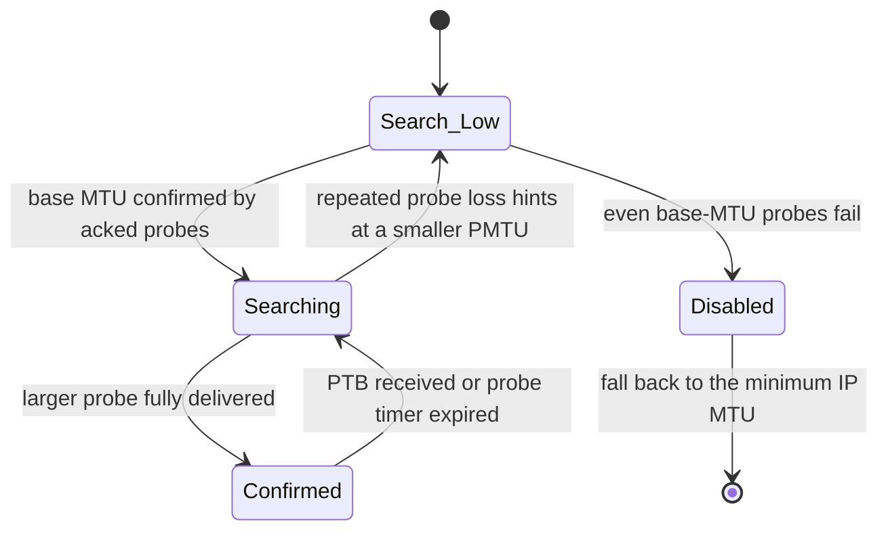

# Path MTU Discovery, MSS, and the Fragmentation Blackhole

## Overview

Every IP packet is sized against two limits: the local interface MTU, which
the sender knows, and the path MTU — the smallest link MTU anywhere between
the endpoints — which nobody knows up front. Path MTU Discovery (PMTUD,
RFC 1191 for IPv4 and RFC 8201 for IPv6) lets a host find that value without
routers fragmenting traffic, and TCP's Maximum Segment Size (MSS) is the knob
that turns the discovered value into segment sizes. The mechanism fails in a
characteristic way when firewalls filter ICMP — the "PMTUD blackhole" — so
this page covers the mechanics, the failure modes, the probe-based successor
(PLPMTUD, RFC 4821), the clamping workarounds used at PPPoE and tunnel edges,
and the Linux socket and sysctl surface interviews probe.

## MTU, MSS, and the Gap Between Them

### Two limits at two layers

The MTU is a property of a link or interface: 1500 bytes for classic Ethernet,
1492 for PPPoE, 1420 for a default WireGuard interface. The MSS is a property
of a TCP connection: the largest payload a TCP segment may carry, exchanged as
an option in the SYN and SYN-ACK and then honored for the life of the
connection. The two are related by the header sizes of everything between the
TCP payload and the wire:

\\[ \\text{MSS} = \\text{MTU} - \\text{IP header} - \\text{TCP header} \\]

which for IPv4 and TCP without options gives \\( 1500 - 20 - 20 = 1460 \\).
When TCP timestamps are negotiated (12 bytes of option space) the effective
segment payload drops to 1448, and the precise accounting of variable IP and
TCP options is specified in RFC 6691. The MSS option in the handshake is
described in [TCP options](../tcp/options.md) and in RFC 9293 section 3.7.1;
here we care about why it is not sufficient.

### Why MSS negotiation alone fails

MSS is exchanged only once, at connection setup, and each endpoint announces a
value derived from its *local* MTU. Three situations break that assumption.
First, the path can cross a tunnel or PPPoE link whose MTU is smaller than
either endpoint's interface MTU, and neither endpoint ever learns it. Second,
routing can change mid-connection onto a path with a different smallest link.
Third, UDP has no MSS concept at all: a DNS server or QUIC endpoint sizes
datagrams blind, and must discover the path MTU itself or rely on
fragmentation. PMTUD exists to close this gap dynamically: it turns "the path
cannot carry 1500-byte packets here" into per-route state that TCP converts
into a smaller MSS and that UDP applications observe as an `EMSGSIZE` error or
a delivered-datagram limit.

The discovered value is cached per route: `ip route get 10.0.0.5` will show a
`mtu` attribute (optionally *locked*) once discovery has run, and TCP
connections re-read it as segments are built. The cache is why one hung
application's fix often makes the "next" connection to the same host work.

## Classical PMTUD: RFC 1191 and RFC 8201

### The mechanics

The sender sets the DF (Don't Fragment) bit on every packet and transmits at
the interface MTU. A router whose *next-hop* MTU is smaller than the packet
cannot forward it and does not fragment it (DF set); instead it drops the
packet and returns an ICMP Destination Unreachable message with code 4,
"fragmentation needed and DF set" (RFC 792 type 3 code 4). RFC 1191's key
trick was to repurpose the low 16 bits of that message's unused field to carry
the next-hop MTU itself, so the sender does not have to guess from a plateau
table. IPv6 removed router fragmentation entirely: RFC 8201 uses the ICMPv6
Packet Too Big message (type 2), which always carries the MTU of the offending
next hop, and IPv6 hosts must treat any PMTU below 1280 bytes as 1280.

On receiving a valid message, the host lowers its per-route PMTU estimate,
TCP retransmits the dropped segment at the new (smaller) MSS, and UDP
applications either get the drop reflected as `EMSGSIZE` from `send()` or
keep sending blind. Where no MTU information is available (old ICMP
implementations that send code 4 with a zero MTU field), RFC 1191 falls back
to a plateau table of common MTU values — 1492 (PPPoE), 1476 (GRE), 1450
(VXLAN), 1420 (WireGuard) — the same numbers that reappear in the overhead
table below, because plateaus and tunnel overheads describe the same reality
from opposite directions. The flow, including the failure branch that makes
this topic interesting:



Where no MTU information is available, RFC 1191 falls back to a plateau
table of common MTU values that the sender steps down through. The important
entries for modern interviews are 1492 (PPPoE), 1480 (6in4), 1476 (GRE), 1450
(VXLAN), and 1420 (WireGuard default) — the same numbers that appear in the
overhead table below, because the plateaus and the tunnel overheads describe
the same reality from opposite directions.

### What the sender does with each protocol

| Protocol | On PMTU decrease | On PMTU unknown at first send |
|---|---|---|
| TCP | Shrinks `snd_mss`, retransmits lost segment, keeps connection alive | Announces local-MTU-derived MSS and trusts PMTUD to correct it |
| UDP (Linux, `IP_PMTUDISC_DO`) | Next `send()` larger than PMTU returns `EMSGSIZE` | Packet sent with DF; drop is silent unless the app listens for errors |
| UDP (`IP_PMTUDISC_WANT`) | Fragment locally only when no PMTU is known | Behaves like DF once the cache is populated |
| QUIC | Runs its own DPLPMTUD (RFC 8899) on top of UDP | Starts at 1200 bytes and probes upward |

## The PMTUD Blackhole

### Mechanism and symptoms

Classical PMTUD has a single point of failure: it depends on ICMP traveling
back from the point of congestion. Security administrators who filter "all
ICMP" (a 1990s hardening habit that survives in many enterprise and cloud
edge ACLs) silently break it. The result is the blackhole: the sender's
packets above the path MTU are dropped at the tunnel head, the Frag Needed
reply is dropped by the middlebox, and TCP retransmits the same oversize
segment until the connection times out. The signature is so characteristic
that it is worth memorizing: *small packets work, large transfers hang*.
A telnet or SSH session connects (SYN and small segments fit) but freezes the
moment a command produces a full screen of output; TLS handshakes stall after
the ServerHello; a web page's first kilobyte arrives and nothing follows.

### Linux defenses and sysctls

The kernel's knobs for this live in the ip-sysctl documentation and are
frequent interview material:
| Sysctl | Default | Effect |
|---|---|---|
| `net.ipv4.ip_no_pmtu_disc` | `0` | Globally disables PMTUD when set (rarely what you want) |
| `net.ipv4.route.min_pmtu` | `552` | Floor for PMTU guesses when nothing better is known |
| `net.ipv4.ip_forward_use_pmtu` | `0` | Let forwarding use PMTU information learned by the forwarding plane |
| `net.ipv4.tcp_mtu_probing` | `0` | `0` off, `1` probe after a suspected blackhole, `2` always probe |
| `net.ipv4.tcp_base_mss` | `1024` | Starting MSS when TCP MTU probing engages |
| `net.ipv4.tcp_probe_interval` | `600` | Seconds between re-probes for a larger PMTU |

Setting `tcp_mtu_probing=1` makes the kernel detect the blackhole signature
(heavy retransmission with no forward progress) and re-probe downward from
`tcp_base_mss`; `=2` does it proactively for every connection at the cost of
starting low and climbing. The clean fixes remain operational: let ICMP
types 3/4 and ICMPv6 Packet Too Big through (RFC 4890 gives the filtering
recommendations), clamp MSS at the tunnel edge (below), or use a transport
that probes without ICMP.

## PLPMTUD: RFC 4821 and DPLPMTUD (RFC 8899)

Packetization Layer PMTUD replaces the ICMP round trip with probes the
transport validates itself. The sender keeps a confirmed PMTU and periodically
sends probe packets one size larger; if the probe (or its acknowledgment)
arrives, the larger size is confirmed, and if probes are lost repeatedly, the
sender falls back — without ever consulting an ICMP message. Because loss
attribution is ambiguous (wireless loss vs. MTU loss), the state machine is
deliberately conservative:



RFC 4821 applies to any packetization layer; RFC 8899 specializes it for
datagram protocols as DPLPMTUD. QUIC is the flagship user: every QUIC packet
is sent with DF set, the initial size is 1200 bytes (the IPv6 minimum), and
the endpoint probes upward — commonly to 1452 or 1464 on well-behaved
Internet paths — using ack-eliciting PING frames as probes so the
acknowledgment confirms delivery. This is also why QUIC connections recover
from ICMP-filtered paths that break TCP: the [QUIC internals
page](../http/quic-internals.md) covers the integration points. The trade-off
against classical PMTUD is probe traffic and convergence time; the benefit is
that no middlebox can starve the mechanism, because probes are ordinary data.

## MSS Clamping in PPPoE and Tunnel Edges

### The arithmetic

PPPoE consumes 6 bytes of header plus 2 bytes of PPP protocol field, so a
1500-byte Ethernet underlay delivers a 1492-byte MTU to the PPP session, and
the correct TCP MSS is \\( 1492 - 40 = 1452 \\). Clients that announce
`mss 1460` inside a 1492 path will blackhole exactly as described above.
RFC 4638 documents how to restore a full 1500-byte MTU over PPPoE when PMTUD
works end to end, but the defensive default in consumer gateways is to rewrite
MSS at the edge. The same arithmetic applies to any encapsulation; the numbers
below are the ones the task of sizing a network keeps requiring:

| Encapsulation | Overhead added | Inner MTU on a 1500 underlay | MSS (IPv4+TCP, no options) |
|---|---|---|---|
| Bare Ethernet, IPv4 | 0 | 1500 | 1460 |
| 802.1Q VLAN tag | 4 | 1496 | 1456 |
| PPPoE + PPP | 8 | 1492 | 1452 |
| Q-in-Q (two VLAN tags) | 8 | 1492 | 1452 |
| GRE (outer IP + 4-byte GRE) | 24 | 1476 | 1436 |
| 6in4 / SIT tunnel | 20 | 1480 | 1440 |
| VXLAN (Eth + IP + UDP + 8-byte VXLAN) | 50 | 1450 | 1410 |
| Geneve (same stack, 8-byte base header) | 50 | 1450 | 1410 |
| WireGuard, IPv6 outer (40 + 8 + 32) | 80 | 1420 | 1380 |
| WireGuard, IPv4 outer (20 + 8 + 32) | 60 | 1440 | 1400 |
| IPsec ESP tunnel, AES-GCM | 60–73 (mode-dependent) | ~1430 | ~1390 |

Two rules follow. Overheads *compose*: a VXLAN frame inside WireGuard loses
both budgets, and the tunnel that terminates last wins the arithmetic.
And the table explains the tunnel-default MTUs you will recognize from real
systems: Linux WireGuard interfaces default to 1420 (the IPv6-outer figure),
and the [overlay VPN page](../advanced/overlay-mesh-vpns.md) shows the same
subtractive reasoning for userspace meshes.

### The clamping rules themselves

MSS clamping rewrites the MSS option in forwarded SYN packets (and the
corresponding value in RSTs, which can also carry option space) to a value the
tunnel can carry:

```bash
# Gateway with a PPPoE uplink (ppp0): let the kernel derive MSS from PMTU
iptables -t mangle -A FORWARD -p tcp --tcp-flags SYN,RST SYN \
  -o ppp0 -j TCPMSS --clamp-mss-to-pmtu

# Explicit arithmetic when the path is known: PPPoE 1492 -> MSS 1452
iptables -t mangle -A FORWARD -p tcp --tcp-flags SYN,RST SYN \
  -j TCPMSS --set-mss 1452
```

Clamping is TCP-only: UDP, QUIC, and ESP traffic through the same tunnel do
not carry an MSS option and still need working PMTUD, a lower interface MTU,
or an application that probes. Clamping also fixes only the *forward* direction
it matches; a gateway that rewrites egress SYNs but not ingress ones can leave
the asymmetric case broken. Treat it as a tactical fix for a known tunnel, not
a substitute for letting ICMP 3/4 through.

## Socket APIs: IP_MTU_DISCOVER and TCP_MAXSEG

Applications that care about datagram size talk to this machinery through two
socket options. `IP_MTU_DISCOVER` (IPv4; `IPV6_MTU_DISCOVER` for IPv6) selects
the fragmentation policy, and `TCP_MAXSEG` reads or clamps the segment size
for a TCP socket:

```c
int fd = socket(AF_INET, SOCK_DGRAM, 0);

/* Always send with DF; send() returns EMSGSIZE above the known PMTU.
   This is the mode QUIC-style transports want. */
int v = IP_PMTUDISC_DO;
setsockopt(fd, IPPROTO_IP, IP_MTU_DISCOVER, &v, sizeof v);

/* Learn what the kernel currently believes the path MTU is (connected socket). */
int pmtu = 0; socklen_t len = sizeof pmtu;
getsockopt(fd, IPPROTO_IP, IP_MTU, &pmtu, &len);

/* Clamp a TCP socket to a conservative segment size before connect(). */
int t = socket(AF_INET, SOCK_STREAM, 0);
int mss = 1360;                       /* fits 1420-byte WireGuard paths */
setsockopt(t, IPPROTO_TCP, TCP_MAXSEG, &mss, sizeof mss);
```

| Option / value | Effect | Typical user |
|---|---|---|
| `IP_PMTUDISC_DONT` | Never set DF; let the kernel fragment | Legacy datagram apps on trusted LANs |
| `IP_PMTUDISC_WANT` | DF once a PMTU is known; fragment otherwise | Default for connected UDP |
| `IP_PMTUDISC_DO` | Always DF; oversize sends fail with `EMSGSIZE` | QUIC, DNS-over-UDP with EDNS sizing |
| `IP_PMTUDISC_INTERFACE` | Treat the interface MTU as the PMTU floor | Virtualized / bridged datapaths |
| `TCP_MAXSEG` (set) | Ceiling on segment payload; influences the MSS advertised in SYN | Per-app clamping for tunneled hosts |
| `TCP_MAXSEG` (get) | Current effective MSS, after negotiation and PMTU events | Diagnostics |

The man pages for `ip(7)` and `tcp(7)` document the precise semantics per
kernel version; the behavioral detail interviewers probe is that `EMSGSIZE` is
a *local* signal — the kernel refuses to send a datagram it knows exceeds the
cached PMTU — while a PMTUD blackhole manifests as *remote* silence with no
error at all. Distinguishing the two from a bug report is half the diagnosis.

## Troubleshooting Toolbox

The Linux toolchain exposes path MTU directly, and a five-command sequence
resolves most incidents:

| Command | What it reveals |
|---|---|
| `tracepath 8.8.8.8` | Per-hop PMTU along the path (relies on ICMP, like PMTUD itself) |
| `ping -M do -s 1472 host` | Tests exactly a 1500-byte IPv4 path (adds 28 bytes of IP+ICMP); shrink `-s` until it answers to bisect the failing hop |
| `ping -6 -M do -s 1452 host` | IPv6 equivalent: adds 40 + 8 bytes, so 1452 tests a 1500 path |
| `ss -ti dst 10.0.0.5` | Live socket state: `pmtu`, `mss`, retransmit counters rising without progress |
| `ip route get 10.0.0.5` | Route-level PMTU cache, and whether it is *locked* by an admin |
| `tcpdump -ni eth0 'icmp[icmptype]=icmp-unreach'` | Whether Frag Needed replies are arriving at all (absence = suspect filtering) |

A worked diagnosis: `ping -M do -s 1472` to a remote office fails while
`-s 1400` succeeds and `tracepath` stops raising its `pmtu` line after hop 4
— a router there sits on a 1476 (GRE) or 1450 (VXLAN) link. If Frag Needed
packets appear in `tcpdump` but the remote stays unreachable, filtering is on
the reverse path; if they never appear, the tunnel head or an ACL is eating
them, and the mitigations are `tcp_mtu_probing=1` on affected hosts or a
clamping rule at the tunnel edge. The [ping and traceroute
toolbox](../tools/ping-traceroute.md) covers the general tool mechanics.

## Interview Questions

1. **Why is the MSS negotiated in the TCP handshake not enough to prevent fragmentation?**
   MSS is announced once, from each endpoint's *local* interface MTU, and
   says nothing about the path between them. A PPPoE hop (1492), a GRE
   tunnel (1476), or a VXLAN overlay (1450) can sit mid-path where neither
   endpoint ever sees it, and routing can move such a hop into the path
   mid-connection. PMTUD maintains a per-route estimate that TCP converts
   into a running MSS; UDP has no MSS at all and must discover the path MTU
   itself.

2. **A user reports "SSH connects fine but hangs when I run ls." Explain it and give three fixes.**
   The symptom is the PMTUD blackhole: SYN and small interactive segments fit
   the path, but full-size segments exceed it, the router drops them, and the
   Frag Needed ICMP reply is filtered, so TCP retransmits until timeout.
   Fixes: allow ICMP type 3 code 4 (and ICMPv6 type 2) through the edge
   filters; clamp MSS at the tunnel or PPPoE gateway with
   `TCPMSS --clamp-mss-to-pmtu`; or set `net.ipv4.tcp_mtu_probing=1` so the
   kernel detects the stall and re-probes from `tcp_base_mss`. PLPMTUD-based
   transports like QUIC are immune, which is part of why they "just work" on
   such networks.

3. **What changed between RFC 1191 and RFC 8201?**
   RFC 1191 (IPv4) builds PMTUD on the DF bit and ICMP type 3 code 4, with
   the next-hop MTU carried in the message since 1191 and a plateau table as
   the fallback. RFC 8201 (IPv6) removes router fragmentation entirely: the
   feedback message is ICMPv6 Packet Too Big (type 2), always carrying the
   MTU, and any advertised PMTU below 1280 is treated as 1280. IPv6 has no
   "let the router fragment it" escape hatch, so PMTUD is mandatory, not
   advisory.

4. **Why does QUIC run its own PMTUD instead of classical PMTUD?**
   Classical PMTUD's control channel is ICMP, which middleboxes filter
   unreliably and which QUIC's encryption makes harder to attribute anyway.
   DPLPMTUD (RFC 8899) probes with the transport's own packets: QUIC keeps DF
   set, starts at the 1200-byte IPv6 minimum, sends larger ack-eliciting
   probes, and only raises its maximum datagram size when a probe is
   acknowledged. The mechanism cannot be starved by a misconfigured firewall,
   and the QUIC spec mandates the integration so the connection converges on
   the real path MTU within a few round trips.

5. **Compute the right TCP MSS for a VXLAN overlay on a 1500 underlay, and say what breaks if it is wrong.**
   VXLAN adds outer Ethernet (14), outer IPv4 (20), UDP (8), and the VXLAN
   header (8): 50 bytes, so the inner MTU is 1450 and the MSS is
   \\( 1450 - 40 = 1410 \\). If a host announces 1460, every full-size segment
   is dropped at the VXLAN tunnel head and — with ICMP filtered, common in
   the same designs that deploy VXLAN — the flow blackholes with
   retransmissions and resets.

6. **What does `net.ipv4.tcp_mtu_probing=2` do, and what is its cost?**
   It makes every TCP connection start with MTU probing enabled: the initial
   effective MSS comes from `tcp_base_mss` (default 1024) and grows as probes
   succeed, rather than assuming the interface MTU and waiting for ICMP. The
   cost is suboptimal early throughput on healthy paths, which is why the
   default is `0` and `1` (probe only after a suspected blackhole) is the
   usual compromise behind aggressive filtering.

## Key Takeaways

- The interface MTU and the path MTU are different numbers; PMTUD is the
  protocol that discovers the second, and TCP MSS is how TCP consumes it.
- Classical PMTUD (RFC 1191/8201) rides on ICMP Frag Needed / Packet Too Big;
  any design that filters those ICMP types breaks TCP above the path MTU.
- The blackhole signature is diagnostic: small packets flow, full-size
  segments retransmit to timeout — SSH connects but `ls` hangs.
- PLPMTUD (RFC 4821) and DPLPMTUD (RFC 8899) replace the ICMP dependency with
  transport-validated probes; QUIC mandates this and is immune to ICMP
  filtering by construction.
- Tunnel overhead is subtractive and composable: PPPoE 8, GRE 24, VXLAN/Geneve
  50, WireGuard 80 (IPv6 outer) — giving the 1492/1476/1450/1420 inner MTUs
  and 1452/1436/1410/1380 MSS values.
- `IP_MTU_DISCOVER` and `TCP_MAXSEG` expose the machinery per socket;
  `EMSGSIZE` means the kernel refused to send, while blackhole silence means
  the network refused to deliver.
- `tracepath`, `ping -M do -s N`, and `ss -ti` localize the failing hop and
  the failing size in minutes; `tcp_mtu_probing` and MSS clamping are the
  mitigations while the ACL fix is pending.

## References

1. "Path MTU Discovery" (Mogul & Deering), RFC 1191 — <https://datatracker.ietf.org/doc/rfc1191/>
2. "Path MTU Discovery for IP version 6" (McCann, Deering, Mogul; Hinden, ed.), RFC 8201 — <https://datatracker.ietf.org/doc/rfc8201/>
3. "Packetization Layer Path MTU Discovery" (Mathis & Heffner), RFC 4821 — <https://datatracker.ietf.org/doc/rfc4821/>
4. "Datagram Packetization Layer Path MTU Discovery" (Fairhurst et al.), RFC 8899 — <https://datatracker.ietf.org/doc/rfc8899/>
5. "TCP Options and Maximum Segment Size", RFC 6691 — <https://datatracker.ietf.org/doc/rfc6691/>
6. "Accommodating MTU/PMTU Differences in PPP over Ethernet (PPPoE)", RFC 4638 — <https://datatracker.ietf.org/doc/rfc4638/>
7. "Transmission Control Protocol (TCP)" (Eddy, ed.), RFC 9293, section 3.7.1 — <https://datatracker.ietf.org/doc/rfc9293/>
8. Linux kernel documentation, "IP sysctls" (`tcp_mtu_probing`, `route.min_pmtu`) — <https://docs.kernel.org/networking/ip-sysctl.html>
9. Linux man-pages, `ip(7)` (`IP_MTU_DISCOVER`, `IP_MTU`) — <https://man7.org/linux/man-pages/man7/ip.7.html>; `tcp(7)` (`TCP_MAXSEG`) — <https://man7.org/linux/man-pages/man7/tcp.7.html>

## Cross-References

- [IP and Fragmentation](../tcp-ip/ip.md) — the DF bit, fragment fields, and why "sender only fragments" is IPv6's design posture.
- [TCP Options](../tcp/options.md) — the MSS option inside the handshake and the option-space arithmetic it competes in.
- [Overlay and Mesh VPNs](../advanced/overlay-mesh-vpns.md) — the same subtractive MTU reasoning applied to Tailscale/Nebula-style meshes.
- [WireGuard](../../linux/networking/wireguard.md) — why the default interface MTU is 1420 and how routing interacts with it.
- [QUIC Internals](../http/quic-internals.md) — DPLPMTUD integration and path migration re-measuring the PMTU.
- [TCP Sockets](../sockets/tcp.md) — the socket-option surface around `TCP_MAXSEG` and friends.
- [Ping and Traceroute](../tools/ping-traceroute.md) — the probing toolbox these diagnosis steps build on.
