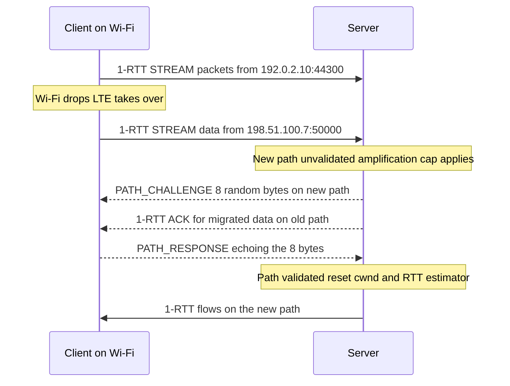

# QUIC Connection Migration

## Overview

Connection migration is QUIC's answer to a problem TCP never solved: a transport connection
that survives the client's IP address changing underneath it. Because QUIC identifies a
connection by an endpoint-chosen **connection ID** rather than the 4-tuple, a phone moving
from Wi-Fi to cellular can keep streaming without a handshake — the server notices packets
arriving from a new address, validates that path, and carries on. This page is the
mechanics deep dive: connection ID lifecycle and switching, path validation with
PATH_CHALLENGE/RESPONSE, the anti-amplification 3× rule, NAT rebinding, transport
parameters, and the honest comparison with TCP and MPTCP. The wire-format sibling is
[../http/quic-internals.md](../http/quic-internals.md) (frame types, header layout, packet
number decoding); congestion control after migration is covered by
[../advanced/quic-congestion-control.md](../advanced/quic-congestion-control.md).

## Connection IDs: separating identity from addressing

TCP welded connection identity to addressing: the connection *is* the 4-tuple
(src IP, src port, dst IP, dst port). Change any element and the kernel has a new socket.
QUIC decouples the two:

- Every packet carries a **Destination Connection ID (DCID)** and, in long headers, a
  **Source Connection ID (SCID)**.
- The **receiver** chooses the CID that the sender must use toward it. This is deliberate:
  the receiving endpoint picks an identifier that encodes whatever it needs — socket
  lookup, load-balancer routing state, an indirect token that hides the real internal
  identity.
- CIDs are issued with **NEW_CONNECTION_ID** frames (each carrying a 16-bit sequence
  number and a stateless reset token) and removed with **RETIRE_CONNECTION_ID**.

New CIDs are used for two distinct jobs that interviews often conflate:

1. **Privacy rotation without migration.** An endpoint may switch the DCID it sends on the
   *same* path (RFC 9000 §5.1.1) so a passive observer cannot link long-lived flows across
   a rotation. No address change, no path validation — just a new label.
2. **Migration support.** When a path change happens, fresh CIDs decouple the new path from
   any linkable identity observed on the old one, and let load balancers re-hash the flow
   onto a (possibly different) backend.

The number of CIDs an endpoint is willing to keep is bounded by the
**active_connection_id_limit** transport parameter — minimum 2, default 2, and endpoints
MUST NOT issue more than the peer's limit. Retire Prior To sequencing in NEW_CONNECTION_ID
coordinates retirement so both sides stop using retired CIDs at a consistent point;
packets on retired CIDs may trigger a stateless reset.

## Transport parameters that govern mobility

| Transport parameter       | Role in migration                                            |
|---------------------------|--------------------------------------------------------------|
| `active_connection_id_limit` | How many spare CIDs the peer must maintain (min 2)        |
| `initial_source_connection_id` | Pins the handshake CID; any later change signals CID rotation |
| `stateless_reset_token`   | Lets the peer distinguish a stateless reset from random data  |
| `preferred_address`       | Server's advertised IPv4/IPv6 address+port+CIDs to move to    |
| `disable_active_migration`| Tells the peer not to migrate to *other* addresses (advisory) |

These ride the TLS handshake's encrypted extension (QUIC transport parameters are carried
in the TLS ClientHello/EncryptedExtensions, RFC 9001), so a middlebox cannot tamper with
them — one of the quiet advantages of baking the transport handshake into TLS.

## What counts as migration

RFC 9000 §9.1 splits frames into **probing** and **non-probing**:

| Category      | Frames                             | What a new-address packet implies        |
|---------------|------------------------------------|------------------------------------------|
| Probing       | PATH_CHALLENGE, PATH_RESPONSE, PADDING | Path measurement only — NOT migration |
| Non-probing   | Everything else (STREAM, ACK, CRYPTO, ...) | Client intends to move to this path |

A client probing a new path (e.g., checking whether the cellular interface can reach the
server before switching) sends PATH_CHALLENGE and PADDING packets from the new address, and
the server keeps using the old path. The moment the server receives a packet containing a
non-probing frame from a new address, migration has begun. Two rules shape the rest:

- **Clients initiate migration.** Servers may migrate (§9.6) but rarely do — a server
  moving addresses invalidates everything the client believes about the path and is hard
  to distinguish from attack traffic.
- **NAT rebinding is migration the client never intended.** The NAT silently rewrites the
  external port (or address); the server sees packets from a "new" path even though the
  application never noticed. The same validation machinery covers both cases.

## Path validation: PATH_CHALLENGE/RESPONSE math

Before an endpoint treats a new path as usable, it must prove **reachability in both
directions** — that the peer can actually receive at the claimed address. The mechanism is
a challenge-response with unpredictable content:

- The validator sends a **PATH_CHALLENGE** carrying 8 unpredictable bytes.
- The peer must reply with a **PATH_RESPONSE** echoing those bytes *on the same path*.
- The challenge is retransmitted at PTO intervals (RFC 9002); a validation that sees no
  matching response after roughly 3 PTOs is abandoned and the path is discarded.
- Multiple outstanding challenges are allowed; the response must match byte-for-byte, so
  a spoofed early response must have guessed unpredictable content.

The unpredictability is the security argument. An off-path attacker that wants to hijack a
connection to a path it controls must guess the challenge to keep the connection alive;
an on-path attacker can already see everything QUIC exposes and is the threat model for the
handshake, not for path validation.



While validation is in flight, the endpoint may keep using the old path; an endpoint that
loses the old path entirely waits for validation before freeing the congestion window.

## The anti-amplification 3× rule

Path validation exists alongside the harshest numeric rule in QUIC: **until a path is
validated, an endpoint may send at most 3× the bytes it has received on that path**
(RFC 9000 §8.1). This is per *path*, not per connection, and it is what makes QUIC's UDP
flood story survivable — a spoofed-source attacker who sends 1,200 bytes of handshake to a
server cannot provoke more than ~3,600 bytes in return, so QUIC offers no reflection
amplification.

Worked example — client migrates to LTE and sends `STREAM` data:

```text
server receives on new path:      1,200 bytes of 1-RTT STREAM data
amplification budget:             3 x 1,200 = 3,600 bytes
server sends:                     ACK (~100 B) + PATH_CHALLENGE (~80 B)  -> budget left ~3,420 B
client echoes PATH_RESPONSE:      +1,200 B received -> budget ~4,620 B
server sends up to budget until:  PATH_RESPONSE received -> path VALIDATED, cap removed
```

The cap also shapes design decisions elsewhere in QUIC: Initial packets are padded to
1,200 bytes so the client's first flight already charges the budget fairly, and the
**address validation token** machinery exists to pre-pay validation:

- **Retry tokens**: issued during the handshake after the server proves the client's
  address (the classic TCP-like SYN-cookie role).
- **NEW_TOKEN tokens**: issued for *future* connections from the same address — this is
  how a reconnecting client (or a 0-RTT user) gets address validation without paying the
  probe round trip. A client sending 0-RTT from an address the server cannot validate
  should expect the server to discard it rather than open the amplification hole.

## NAT rebinding: migration you didn't order

The most common "migration" in production is silent. A home NAT with a short UDP mapping
timeout, a carrier-grade NAT rebalancing, or a mobile OS power event can rewrite the
external address:port without the endpoint emitting anything. The server then observes a
packet from a new 4-tuple containing non-probing frames — migration, by definition — even
though the client never switched interfaces.

The spec's treatment is pragmatic: the server migrates to the rebound path only after
validating it, and — the subtle bit — RFC 9000 §9.4 says the congestion controller and RTT
estimator **MUST be reset to initial values** on a validated path change, *except* that for
a **port-only** change (the classic NAT-rebinding signature) the endpoint MAY retain its
state. The reasoning: same IP, same network path characteristics, so throwing away a
learned cwnd punishes the flow for its NAT's housekeeping. A full address change means a
different path — Wi-Fi to LTE — where carrying the old cwnd would burst into an unknown
bottleneck.

Two more rebinding realities worth having ready in an interview:

- **PMTU changes.** The new path's MTU is unknown; QUIC re-runs DPLPMTUD (RFC 8899) rather
  than trusting the old path's probe results.
- **Loss detection continues.** Packet numbers are per-connection, so ACKs that arrive on
  the old path for packets sent on the new one are perfectly legal — no special case.
- **Off-path attacks get harder, not easier.** An off-path attacker who races a spoofed
  packet to move the connection to *its* address must still answer the PATH_CHALLENGE from
  that address — the NAT-rebinding equivalent of TCP's challenge-ACK defense.

## preferred_address: the server's relocation offer

The `preferred_address` transport parameter lets a server publish, during the handshake, an
alternative address pair — one IPv4 and one IPv6 address+port — plus a dedicated connection
ID and stateless reset token for each. After the handshake completes, the client **MAY**
migrate to the preferred address by sending non-probing packets from there; the server then
validates the client's new path in the usual way.

Why it exists:

- **Load-balancer handoff**: a virtual IP for initial connection setup that moves the flow
  to a stable service address afterwards.
- **Family preference**: a dual-stack server can advertise both families and let the
  client pick (or drop from IPv4 to IPv6 policy).
- **Migration plumbing in production**: it exercises the same validation path as any
  migration, so servers that support it get NAT-rebinding handling for free.

Clients that ignore the preferred address are fully compliant — it is an offer, not an
instruction.

## Migration vs TCP vs MPTCP

TCP has no migration: the 4-tuple is the identity, so an address change means a new
connection (new handshake, new congestion state, retransmit-ambiguity reset). The standard
workaround is **MPTCP** (RFC 8684), which multiplexes *multiple TCP subflows* under one
connection and can add a cellular subflow before the Wi-Fi subflow dies. The trade-off
table:

| Dimension             | QUIC migration                  | TCP (plain)             | MPTCP (RFC 8684)                    |
|-----------------------|---------------------------------|--------------------------|--------------------------------------|
| Identity              | Connection ID                   | 4-tuple                  | Connection-level key + per-subflow 4-tuples |
| Survives address change | Yes, single path at a time    | No                       | Yes, multiple simultaneous paths     |
| Endpoint support needed | No (it's QUIC-internal)       | —                        | Both hosts must speak MPTCP          |
| Middlebox exposure    | None (inside encrypted UDP)     | —                        | TCP options; MP_CAPABLE stripped by some NATs; needs checksum fallback |
| Path change cost      | PATH_CHALLENGE + cwnd reset     | Full reconnect           | Subflow handshake (MP_JOIN)          |
| Simultaneous multipath| No (drafts: MPQUIC)             | No                       | Yes, with packet scheduling          |
| NAT traversal         | Native (single UDP flow)        | Native                   | Often degraded; proxy deployments in practice |

The deep difference is architectural. MPTCP extends TCP *on the wire* with options, so
every middlebox on the path is invited to have an opinion — and enough of them do that
MPTCPv1 needed a checksum mode and still sees option stripping. QUIC keeps migration inside
an encrypted, UDP-encapsulated protocol that middleboxes cannot parse, at the cost of
living in userspace. MPTCP gives you *simultaneous* paths with scheduling (great for
bandwidth aggregation); QUIC gives you *mobility* (great for survival), with multipath QUIC
still working through standardization. Linux ships MPTCPv1 since kernel 5.6 — see
[../../linux/kernel/networking/mptcp.md](../../linux/kernel/networking/mptcp.md) for
the socket API and `ip mptcp` plumbing.

## The DoQ migration story

DNS over QUIC (RFC 9250) is a useful stress test for migration because its traffic shape is
the opposite of HTTP/3's: bursts of one- to two-packet exchanges on a long-lived
connection. The considerations pull in different directions:

- **Reuse is the point.** DoQ exists to amortize the handshake across queries, so a
  connection that dies on every NAT rebinding would erase its own advantage — connection
  migration is what makes DoQ's long-lived connections practical on mobile devices.
- **But migration costs exceed the payload.** A migrated path pays PATH_CHALLENGE/RESPONSE
  plus a congestion-controller reset (initial cwnd ~14 KB territory) before throughput
  recovers — while a typical DNS exchange is a few hundred bytes. On a clean network
  change, a fresh connection with 0-RTT resumption is frequently the cheaper recovery.
- **Anycast complicates it.** Many resolvers are anycast; a migrated path can land on a
  different PoP with different latency, and the connection's RTT estimate is reset anyway.
- **Server-side patience.** DoQ servers must tolerate idle periods and NAT rebindings on
  long-lived connections — aggressive idle timeouts defeat the design.

The deployment synthesis: keep the connection open across network changes when traffic is
dense (browsers, resolver libraries), and re-establish with 0-RTT when traffic is sparse.
Migration gives you the option; it does not mandate using it. Encrypted-DNS deployment
context: [../advanced/encrypted-dns.md](../advanced/encrypted-dns.md).

## Interview Questions

1. **Why can a QUIC connection survive an IP change when a TCP connection cannot?**
   TCP identifies a connection by the 4-tuple; the kernel demuxes packets by it, so an
   address change is by definition a different connection. QUIC demuxes on the Destination
   Connection ID, an endpoint-chosen identifier independent of addressing, and validates a
   changed path with PATH_CHALLENGE/RESPONSE before trusting it. The connection state
   (streams, crypto, flow control) never referenced the IP address in the first place.
2. **Walk through the anti-amplification rule and why it exists.** Until a path is
   validated, an endpoint may send at most 3× the bytes received on that path, enforced
   per path. It exists because QUIC runs over UDP: without the cap, a spoofed-source
   handshake to a server would be a reflection amplifier. The cap means 1,200 received
   bytes buy at most 3,600 response bytes, and full validation (PATH_RESPONSE echoed back)
   removes the cap. Initial packets pad to 1,200 bytes and NEW_TOKEN tokens pre-pay
   validation for later connections.
3. **What is the difference between CID switching and connection migration?** CID switching
   replaces the connection ID used on an unchanged path, purely for privacy rotation and
   load-balancer re-hashing — no address change, no validation, cwnd untouched. Migration
   changes the source address and requires path validation, a fresh amplification budget,
   and (per RFC 9000 §9.4) a congestion controller and RTT estimator reset unless the
   change is port-only. Conflating them breaks both the privacy story and the performance
   story.
4. **How does QUIC detect and handle NAT rebinding?** A NAT rewrite appears as non-probing
   frames from a new 4-tuple — formally a migration the client never announced. The server
   validates the new path with PATH_CHALLENGE/RESPONSE; because the change is port-only,
   it MAY retain congestion-control and RTT state instead of resetting. If validation
   fails, the server keeps the old path. Servers should treat rebindings as routine — a
   client-side OS power event is invisible to the application.
5. **Compare QUIC migration with MPTCP for a phone on Wi-Fi moving to LTE.** MPTCP
   establishes a second TCP subflow over LTE *before* Wi-Fi dies and schedules packets
   across both paths simultaneously — better for aggregation, but it needs both endpoints
   speaking MPTCP and surviving middleboxes that strip TCP options. QUIC migrates a single
   path after the fact: no endpoint cooperation beyond QUIC itself, no middlebox exposure
   (encrypted UDP), but no simultaneous multipath — you trade continuity windows and
   bandwidth for deployability. MPQUIC drafts aim to close that gap.
6. **Why might a DoQ client deliberately *not* migrate after a network change?** DNS
   exchanges are tiny; a migrated path pays challenge/response plus a cwnd reset (back to
   initial-window pacing) before reaching steady state, which can cost more than opening a
   fresh connection with 0-RTT resumption. Add anycast — the migrated path may land on a
   different resolver PoP — and re-establishment is often the rational default for sparse
   traffic, while dense-traffic clients (browsers) prefer migrating the warm connection.

## Key Takeaways

- QUIC connection identity is the connection ID, chosen by the receiver — addressing is
  metadata, not identity, which is the whole mobility story in one sentence.
- CIDs serve two jobs: privacy rotation on a stable path, and linkability-breaking during
  migration; `active_connection_id_limit` (min 2) bounds how many the peer keeps.
- Probing frames (PATH_CHALLENGE, PATH_RESPONSE, PADDING) measure a path without migrating;
  any non-probing frame from a new address *is* migration.
- Path validation: 8 unpredictable bytes out, exact echo back, retransmit on PTO, abandon
  after ~3 PTOs; the unpredictability defeats off-path hijack.
- The anti-amplification rule — send ≤ 3× bytes received per unvalidated path — is the
  security invariant that makes UDP-based QUIC flood-safe, with Retry and NEW_TOKEN tokens
  as the pre-payment mechanisms.
- Validated path change ⇒ congestion controller and RTT estimator reset, except port-only
  NAT rebindings MAY retain state; PMTU is re-measured via DPLPMTUD.
- `preferred_address` lets servers offer a post-handshake relocation with dedicated CIDs —
  an offer, not an instruction.
- Versus MPTCP: QUIC buys deployability (encrypted UDP, no middlebox opinions) at the cost
  of single-path operation; MPTCP buys simultaneous multipath at the cost of TCP-option
  fragility. Linux has shipped MPTCPv1 since 5.6.

## References

- [RFC 9000 — QUIC: A UDP-Based Multiplexed and Secure Transport](https://www.rfc-editor.org/rfc/rfc9000.html) —
  §5 (connection IDs), §8 (address validation, amplification limit), §9 (migration),
  §18.2 (transport parameters).
- [RFC 9002 — QUIC Loss Detection and Congestion Control](https://www.rfc-editor.org/rfc/rfc9002.html) —
  PTO, the timer that drives PATH_CHALLENGE retransmission.
- [RFC 9001 — Using TLS to Secure QUIC](https://www.rfc-editor.org/rfc/rfc9001.html) —
  transport parameters inside the TLS handshake.
- [RFC 9114 — HTTP/3](https://www.rfc-editor.org/rfc/rfc9114.html) — the application layer
  that mostly ignores migration (streams just continue).
- [RFC 9250 — DNS over QUIC (DoQ)](https://www.rfc-editor.org/rfc/rfc9250.html) — long-lived
  connection usage patterns that migration makes possible.
- [RFC 8899 — Packetization-Layer PMTU Discovery (DPLPMTUD)](https://www.rfc-editor.org/rfc/rfc8899.html) —
  PMTU re-measurement on a migrated path.
- [RFC 8684 — Multipath TCP v1](https://www.rfc-editor.org/rfc/rfc8684.html) — the
  subflow-based alternative this page compares against.

## Cross-References

- [QUIC Internals](../http/quic-internals.md) — packet/header formats, frame tables, and
  the §9 summary this page expands into mechanics.
- [HTTP/3](../http/http3.md) — what migration means at the application layer and the
  0-RTT/migration interplay.
- [QUIC Congestion Control](../advanced/quic-congestion-control.md) — what happens to the
  controller after a path change and why the reset matters.
- [Multipath TCP on Linux](../../linux/kernel/networking/mptcp.md) — the subflow model,
  MPTCP socket API, and `ip mptcp` configuration.
- [Encrypted DNS](../advanced/encrypted-dns.md) — DoH/DoT/DoQ deployment context for the
  resolver-migration discussion.
- [MASQUE](../security/masque.md) — proxying built on QUIC where migration and CONNECT-UDP
  interact.
