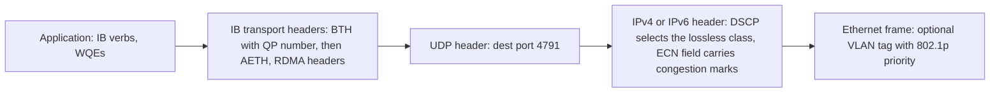
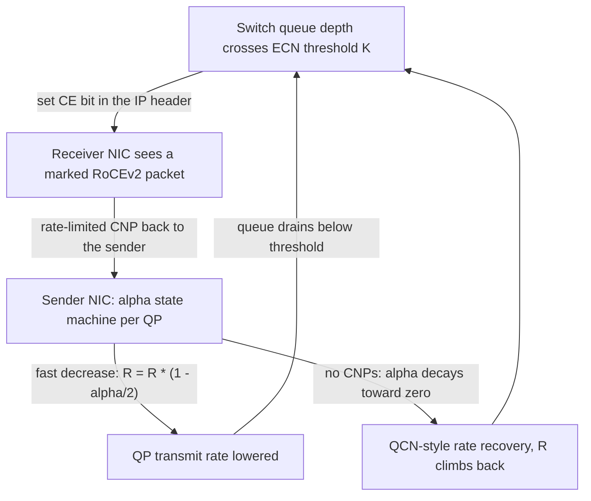

# RoCEv2 in the Datacenter: Lossless Ethernet for RDMA

## Overview

RDMA over Converged Ethernet version 2 (RoCEv2) carries InfiniBand's
kernel-bypass transport — queue pairs, zero-copy RDMA READ/WRITE, microseconds
of tail latency — across a standard, routable Ethernet/IP fabric by wrapping
the IB transport headers in a UDP datagram with destination port 4791. The
price of that portability is that Ethernet must be made *lossless enough* for
a transport with no TCP-style retransmit story: priority flow control (PFC)
pauses frames at the link level, Explicit Congestion Notification (ECN)
marking plus the DCQCN rate-control loop at the endpoints keeps queues out of
the pause regime, and a large tuning surface (DSCP-to-priority maps, buffer
thresholds, MTU consistency) decides whether the deployment is fast or a
pause-storm generator. This page covers the wire format, the lossless
machinery, the deployment failure modes, and the SmartNIC offload landscape —
complementing the deeper congestion-control mechanics in
[RDMA Congestion Control](../advanced/rdma-congestion-control.md) and the
verbs/QP substrate in [RDMA](../../linux/networking/rdma.md).

## What RDMA Needs From the Network

### The verbs contract, in three sentences

An RDMA application registers memory (MR), creates a Queue Pair (QP) whose
Work Queue Entries reference that memory directly, and posts operations that
the NIC performs without involving either kernel or remote CPU; completions
land in a Completion Queue (CQ) polled by the application. The transport
delivers operations in order and without duplication, and the two-sided verbs
(SEND/RECV) plus one-sided READ/WRITE semantics assume that a posted WQE
eventually succeeds or produces an explicit error — neither endpoint runs a
TCP-like loss-recovery loop over the application payload. The full mechanics
(QP state machines, memory keys, completion batching) are on the
[RDMA verbs page](../../linux/networking/rdma.md), and the InfiniBand link
layer they were originally designed against is on the
[InfiniBand page](../../linux/storage/infiniband.md).

Two properties follow for anyone deploying storage or AI fabrics. First,
drops are catastrophic at the application level: a lost RDMA packet stalls a
QP until the transport's selective-retransmission timer recovers it, which is
orders of magnitude slower than the µs tail latencies the fabric was bought
for — so fabrics are engineered for *zero drops on the RDMA class* rather
than "low loss". Second, congestion feedback cannot assume per-packet ACKs,
because the transport never had them; this is why congestion control for RDMA
is a separate design space (DCQCN, TIMELY, HPCC) rather than "just run
CUBIC".

## The RoCEv2 Wire Format

### From IB transport to routable Ethernet

RoCEv1 placed IB transport packets directly on Ethernet II frames, making the
fabric an L2 island: no IP headers, no routing, and class-of-service carried
only in an 802.1p VLAN priority. RoCEv2 inserts a UDP/IP stack between the IB
transport layer and Ethernet, so packets are ordinary routable IP datagrams
with destination port 4791 (the IANA-assigned RoCEv2 value), and the traffic
class rides in the DSCP field of the IP header instead of (or in addition to)
802.1p. The encapsulation stack:

The IB Base Transport Header (BTH) still names the destination QP and carries
the packet sequence number; the acknowledgment and RDMA operation headers
(AETH, RETH, IMDTH) still describe verbs-level semantics. What the UDP/IP
wrapper buys is L3: equal-cost multi-path, existing routers between racks,
and standard DSCP-based marking at every hop. What it costs is about 50 bytes
of overhead (14 outer Ethernet + 20 IPv4 + 8 UDP is the usual frame-level
accounting), which is why RoCE fabrics standardize on jumbo MTU — commonly
4096 on the lossless class end to end — and why an MTU mismatch between hops
is a top-three deployment failure (see pitfalls below). DSCP marking itself is
the DiffServ machinery covered in [DiffServ
QoS](../advanced/diffserv-qos.md); RoCE deployments just consume it with an
aggressive local policy (one DSCP value = the lossless traffic class,
consistent on every host and switch).

### Cumulative vs. per-hop: where each mechanism lives

The lossless stack has three control loops at three scopes, and interviewers
like the distinction:

| Loop | Scope | Signal | Acts on |
|---|---|---|---|
| PFC (802.1Qbb) | Per-hop, per-priority | Buffer threshold crossed on an ingress port | Pauses the *previous* hop's transmit for that class |
| QCN (802.1Qau) | Per-hop, per-switch | Local queue depth at each switch | Feedback CP frame to the *adjacent* sender NIC |
| DCQCN | End-to-end, sender-driven | ECN marks (CE) accumulated by receivers | Rate-limit CNPs to the source QP's NIC, which reduces transmit rate |

PFC protects buffers; it has no view beyond one link, which is why it
deadlocks (a cycle of full buffers waiting on each other) and why it must not
be the congestion-control *plan* — only the safety net. QCN never made it into
large RoCE deployments because per-hop feedback cannot see cross-fabric
interactions like incast fan-in. DCQCN aggregates the end-to-end signal
(receivers count CE marks per QP and generate Congestion Notification
Packets), making it the only loop in the trio that understands the full fabric
path; the mechanics of its alpha state machine are walked in
[RDMA Congestion Control](../advanced/rdma-congestion-control.md).

## PFC: the Lossless Contract and Its Sharp Edges

### How the pause actually works

For each priority configured lossless, a switch port monitors its ingress
buffer; crossing the *XOFF* threshold sends a PAUSE frame upstream naming that
priority, and the upstream port stops transmitting that class for the
specified duration (or until the buffer drains below the *XON* threshold).
Everything else on the link keeps moving, which is the whole point of doing
this per priority rather than with legacy 802.3x PAUSE. The sizing constraint
that rules deployments: the XOFF threshold must leave *headroom* of at least
link bandwidth times the pause round-trip — the frames already in flight while
the pause propagates plus the pause frame itself — or the buffer overruns
before the pause takes effect, which defeats the lossless premise.

### Deadlocks, watchdogs, and storms

Three failure shapes dominate production incidents. *Deadlock*: a cycle of
ports whose buffers are full on two crossing traffic classes pauses each
other forever — no packet is lost, no timer expires, and the fabric needs a
watchdog timer that kills the offending QPs to recover. The construction and
countermeasures are derived step by step in
[RDMA Congestion Control](../advanced/rdma-congestion-control.md). *PFC
storm*: a misconfigured sender (DSCP not mapped to the lossless class, or a
buggy driver) floods a priority with lossy-class traffic; switches pause it,
the pause propagates hop by hop toward the source, and pause-frame rates
across the fabric spike while ECN marks stay at zero — the signature that
pause, not rate control, is doing the congestion management. *Buffer
starvation*: oversized lossless buffers steal shared-buffer space from the
lossy classes, so "fixing" RoCE latency degrades everyone else's throughput.

## ECN and DCQCN: the Congestion Loop

DCQCN composes two standards into one loop: the switch marks packets with the
CE bit (as DCTCP expects) and the NIC reduces rate with a QCN-derived state
machine, since there are no per-packet ACKs to modulate. Per QP, the loop
runs:

The details that decide whether this works: the ECN marking threshold `K` must
trigger *before* the PFC XOFF threshold (pause should be the safety net, never
the control signal); CNPs must be rate-limited at the receiver (a CNP storm is
itself a congestion event); and the sender's alpha must decay fast enough for
recovery but slowly enough not to oscillate. Mis-tuned deployments show two
opposite signatures — pause frames rising *before* any ECN marks (thresholds
too high) or rate collapse with alpha pinned at 1 under bursty incast — and
the [RDMA Congestion Control page](../advanced/rdma-congestion-control.md)
demonstrates both with a runnable trace. The research frontier replaces CNP
feedback with in-network telemetry (HPCC) or RTT gradients (TIMELY); both are
covered in [Datacenter TCP](../advanced/datacenter-tcp.md).

### Goless operation

RoCEv2's retransmission story deserves its own paragraph because it shapes the
lossless requirement. A naive IB-style recovery is go-back-N: on detecting a
gap in packet sequence numbers, retransmit from the missing PSN onward — which
under congestion means dumping an entire window into an already-full fabric.
RoCEv2 is *goless*: the responder NAKs with the specific missing PSN and the
requester retransmits selectively, so a single lost packet costs one packet.
This is also why drops, though recovered, are so expensive in practice —
selective retransmit still stalls the QP for at least the retransmit timeout,
and storage workloads feel it as a latency outlier — so the fabric design
target remains "ECN and DCQCN keep queues shallow enough that PFC rarely
fires, and drops never happen at all".

## InfiniBand vs RoCEv2 vs iWARP

The three RDMA transports answer "what makes the network safe for RDMA" three
different ways, and the comparison table is the fastest way to hold them:

| Property | InfiniBand | RoCEv2 | iWARP |
|---|---|---|---|
| Underlying network | Native IB links, credit-based link-level flow control | Ethernet + IP, lossless via PFC on one class | Standard (lossy) Ethernet + IP |
| Congestion control | IB CC / hardware credit dynamics | DCQCN (ECN + CNP + alpha machine) | TCP's own congestion control |
| Loss/ordering | Lossless, in-order by fabric design | Lossless expected; selective retransmit ("goless") as backstop | TCP retransmission, in-order by construction |
| Routability | L2 subnets joined by IB routers (subnet manager) | Full L3 Ethernet routing (ECMP-friendly UDP flows) | Full Internet-routable |
| Header overhead | IB transport over IB link layer | ~50 bytes (IP/UDP) over Ethernet | TCP/IP itself, no extra wrapper |
| Ecosystem anchor | HPC clusters (TOP500 dominant), NVIDIA HCAs | AI/ML clusters, hyperconverged storage on Ethernet | Legacy IP storage, Intel/Marvell NICs |
| Fabric tuning burden | Subnet manager; link-level credits | PFC maps, ECN thresholds, buffers, DSCP policy | Essentially none beyond TCP tuning |
| Failure mode to study | Credit stalls, link errors | PFC storms, deadlocks, DCQCN mis-tuning | TCP dynamics under loss |

The operational summary: InfiniBand buys losslessness in the link layer at the
cost of a separate fabric; RoCEv2 buys it in the configuration layer at the
cost of a large, brittle tuning surface; iWARP buys safety by reusing TCP at
the cost of per-byte TCP processing and weaker offload economics. Most new
AI and disaggregated-storage deployments choose RoCEv2 on Ethernet fabrics for
the routing and operational consolidation, with InfiniBand retaining the
high-end HPC ground.

## Deployment Pitfalls

The counter triage every RoCE operator memorizes, with the first check for
each:

| Symptom | Root cause | First check |
|---|---|---|
| Pause-frame counters rising, ECN marks zero | PFC doing the congestion control (thresholds too high) or lossless class polluted by misclassified traffic | Compare `ethtool -S` per-priority `rx_pause` vs. ECN-marked counters; audit DSCP→priority maps on every switch and host |
| QPs in error/retry state, seconds-long latency outliers | A drop somewhere: MTU mismatch between hops, or buffer overrun | Verify MTU end to end (`tracepath`, switch configs); look for one port left at 1500 on a 4096 fabric |
| Throughput collapses under N-flow incast | Buffers too small for fan-in; DCQCN rate collapse with alpha pinned | Check shared-buffer allocation and XOFF/XON thresholds; capture the sender alpha/rate trace |
| CNP rate in the tens of thousands/sec | ECN marking threshold too low, or receiver CNP rate limiting disabled | Raise `K`, verify NIC CNP rate-limit config |
| Watchdog kills in logs after topology change | PFC deadlock from two classes crossing in a cycle | Identify the offending QP/priority in the log; separate lossless lanes or fix the class map |
| Fine at 25G, broken after 100G upgrade | Buffer sizing in *bytes* was tuned for the old bandwidth | Re-derive headroom = bandwidth x pause RTT; re-tune thresholds |

Three pitfalls deserve narrative emphasis. *PFC storms* are the canonical
"lossless class polluted" event: any traffic that lands on the lossless
priority without DCQCN speaking for it (a mis-tagged backup job is the
classic) generates pauses with no rate-control loop to calm them. *MTU
mismatch* is silent until it is loud: RoCEv2 does retransmit, but each drop
stalls a QP for a retransmit timeout, and storage paths (an NVMe-oF consumer
of all this — see [NVMe over Fabrics](../../linux/storage/nvme-of.md)) turn
those stalls into visible IO latency spikes. *Buffer tuning* is where the
physics lives: thresholds in bytes must be re-derived whenever link speed,
MTU, or topology changes, because headroom scales with bandwidth times
pause round-trip, and a config copied from a 25G design will overrun on 100G.

## SmartNIC Offloads

The NIC is where RoCEv2's performance is manufactured, and the offload stack
is deep: hardware queue pairs (tens of thousands per adapter), inline
checksum and segmentation handling for the UDP/IP wrapper, adaptive routing
participation where the switch supports it, on-demand paging (ODP) so memory
registration no longer pins whole host buffers, and transport offloads such
as Dynamically Connected Transport (DCT) that reduce QP-state memory at
scale. NVIDIA's ConnectX line is the reference implementation, and the DOCA
platform exposes the same dataplane for programmable flows:
[networking-docs.nvidia.com/doca](https://networking-docs.nvidia.com/doca/).
The [RDMA page](../../linux/networking/rdma.md) covers the Linux side
(rdma-core, `ibv_*` API, RoCE device configuration), and
[SR-IOV networking](../advanced/sr-iov-networking.md) explains how virtual
functions carve these offloads out to tenants — including why a VF inherits
the lossless-class configuration of the physical function and what that means
for multi-tenant fabrics.

## Interview Questions

1. **What does RoCEv2 add over RoCEv1, and why did it matter for adoption?**
   RoCEv1 put IB transport packets directly on Ethernet, which confined RDMA
   to a single L2 domain with 802.1p as the only class-of-service signal.
   RoCEv2 wraps the same IB transport in UDP (port 4791) and IP, making
   traffic routable across L3 boundaries, ECMP-friendly, and classifiable by
   DSCP — so a RoCEv2 cluster runs on ordinary routed Ethernet rather than an
   isolated L2 island. The cost is ~50 bytes of encapsulation overhead, hence
   the jumbo-MTU convention on lossless classes.

2. **Why does RDMA on Ethernet need PFC at all if RoCEv2 has selective retransmission?**
   Selective retransmit ("goless" operation) exists, but a drop still stalls
   the QP for at least a retransmit timeout — microseconds of budget spent on
   a milliseconds-long stall, which storage and AI collectives feel as tail
   latency outliers. The design target is therefore no drops on the RDMA
   class, and PFC is the mechanism that keeps switch ingress buffers from
   overflowing. Retransmission is the backstop for a fabric that failed its
   configuration, not the plan.

3. **Walk the DCQCN loop: who marks, who notifies, who throttles?**
   The switch marks CE in the IP header when its queue crosses threshold K;
   the receiver NIC, per QP, generates rate-limited CNPs back to the sender;
   the sender NIC's alpha state machine cuts rate by `R = R * (1 - alpha/2)`
   on each CNP and, in their absence, decays alpha and recovers rate
   QCN-style. The split exists because RDMA transports have no per-packet
   ACKs for an endhost to infer congestion from, so the switch observes the
   queue, the receiver relays, and the sender's hardware does the math.
   Mis-tuning shows up as PFC pauses firing before ECN marks (thresholds too
   high) or rate collapse under incast.

4. **Your fabric shows PFC pause rates spiking while ECN-marked packet counters stay flat. What is happening and what do you check?**
   Pause is doing the congestion control — either DCQCN marking thresholds
   sit above the PFC XOFF thresholds, or traffic is landing on the lossless
   priority with no DCQCN agent speaking for it (the classic mis-tagged
   lossy-flow-on-lossless-class event). Check per-priority pause counters
   with `ethtool -S`, the DSCP-to-priority maps on every host and switch for
   consistency, and the ECN thresholds on the lossless queues. Left alone it
   ends in either PFC storms or a deadlock the watchdog has to break.

5. **Compare how InfiniBand, RoCEv2, and iWARP each achieve a safe environment for RDMA.**
   InfiniBand builds losslessness into the link layer with per-link credits,
   so the transport simply never sees a drop — at the cost of a dedicated
   fabric with subnet managers. RoCEv2 assumes standard Ethernet and makes it
   lossless by configuration: one DSCP/priority class gets PFC, ECN, and
   DCQCN, which is powerful but leaves a large tuning surface where mistakes
   become pause storms and deadlocks. iWARP runs RDMA verbs over TCP, so
   retransmission, ordering, and congestion control are inherited from TCP —
   safe on any IP network, but paying per-byte TCP processing and generally
   weaker offload economics.

6. **Name three concrete deployment pitfalls and the counters that expose each.**
   PFC storms: rising per-priority `rx_pause`/`tx_pause` in `ethtool -S` with
   zero ECN marks, meaning pause is the control signal. MTU mismatch: QP
   retry/error counters and retransmission timeouts in the NIC stats after a
   partial jumbo rollout — verify with `tracepath` and per-hop switch MTU.
   Buffer starvation or overrun: throughput cliffs under incast, plus
   watchdog kills — check shared-buffer allocations and re-derive XOFF/XON
   headroom as bandwidth times pause round-trip for the *current* link speed.

## Key Takeaways

- RoCEv2 = IB transport headers inside UDP port 4791 inside IP inside
  Ethernet: routable, ECMP-friendly, DSCP-classified, at ~50 bytes of
  overhead that pushes fabrics to jumbo MTU.
- The verbs model (QP/MR/CQ, no retransmit-friendly ACK stream) is what
  forces the lossless design; drops stall QPs for retransmit timeouts.
- Three loops at three scopes: PFC per-hop pause (safety net), QCN per-hop
  rate feedback (deployed rarely), DCQCN end-to-end ECN/CNP/alpha (the
  actual control plane).
- PFC's failure modes are structural: deadlocks from crossing-class buffer
  cycles and storms from polluted lossless classes; watchdogs break
  deadlocks by killing QPs, sacrificing losslessness for the offender.
- DCQCN tuning is the health check: pause-before-ECN means thresholds are
  wrong; CNP storms mean marking is too eager; alpha pinned at 1 means
  incast collapse.
- Goless (selective) retransmission is RoCEv2's recovery path — cheaper than
  go-back-N, still catastrophic for tail latency, hence "no drops" as the
  target.
- InfiniBand buys losslessness in hardware, RoCEv2 in configuration, iWARP
  in TCP; the comparison table is the interview answer.
- The operational triad to monitor: per-priority pause counters, ECN-marked
  packet counters, and QP error/retry counters — the relative motion among
  the three names the failure.

## References

1. Zhu, Yibo, et al., "Congestion Control for Large-Scale RDMA Deployments" (DCQCN), SIGCOMM 2015 — [doi:10.1145/2829988.2787484](https://doi.org/10.1145/2829988.2787484)
2. Mittal, R. et al., "TIMELY: RTT-based Congestion Control for Datacenters", SIGCOMM 2015 — [doi:10.1145/2829988.2787510](https://doi.org/10.1145/2829988.2787510)
3. Li, Y. et al., "HPCC: High Precision Congestion Control", SIGCOMM 2019 (in-network-telemetry rate control; cited by title/venue)
4. InfiniBand Trade Association, "Supplement to InfiniBand Architecture Specification, Volume 1 (RoCEv2)", 2014 — specification portal: <https://www.infinibandta.org/>
5. IEEE 802.1Qbb Priority-based Flow Control project page — <https://www.ieee802.org/1/pages/802.1bb.html>
6. Blake, S. et al., "An Architecture for Differentiated Services" (DSCP), RFC 2474 — <https://datatracker.ietf.org/doc/rfc2474/>
7. Ramakrishnan, K. et al., "The Addition of Explicit Congestion Notification (ECN) to IP", RFC 3168 — <https://datatracker.ietf.org/doc/rfc3168/>
8. rdma-core (libibverbs/librdmacm userspace) — <https://github.com/linux-rdma/rdma-core>
9. NVIDIA Cumulus Linux documentation (PFC/ECN configuration on switches) — <https://docs.nvidia.com/networking-ethernet-software/>
10. NVIDIA DOCA platform documentation — <https://networking-docs.nvidia.com/doca/>

## Cross-References

- [RDMA](../../linux/networking/rdma.md) — verbs, queue pairs, memory registration, and Linux RoCE device configuration.
- [InfiniBand](../../linux/storage/infiniband.md) — the link layer and topology RoCEv2 is emulating on Ethernet.
- [RDMA Congestion Control](../advanced/rdma-congestion-control.md) — the PFC deadlock construction and DCQCN alpha-machine traces in depth.
- [DiffServ QoS](../advanced/diffserv-qos.md) — the DSCP marking machinery that selects the lossless traffic class.
- [Datacenter TCP](../advanced/datacenter-tcp.md) — DCTCP's ECN model (the marking half of DCQCN) and the TIMELY/HPCC alternatives.
- [NVMe over Fabrics](../../linux/storage/nvme-of.md) — the storage consumer whose IO tail latencies expose every fabric misconfiguration.
- [SR-IOV Networking](../advanced/sr-iov-networking.md) — how RDMA offloads are partitioned to tenants via VFs and what that inherits.
