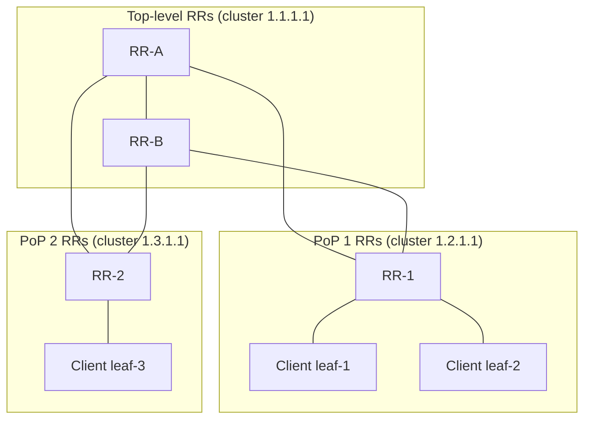

# BGP Route Reflector Design

## Overview

iBGP requires every speaker in an AS to learn every route, but its loop-prevention rule forbids re-advertising what you learned via iBGP — forcing an O(n²) full mesh. Route reflectors (RFC 4456) relax that rule safely: designated RRs reflect iBGP-learned routes to clients, collapsing the mesh into a hub-and-spoke control plane. This page goes past the [BGP Deep Dive](../routing/bgp-deep.md) summary into what RR design actually means at scale: reflection mechanics and the attributes that make it loop-free, cluster and hierarchy design, ORF and add-path, the next-hop semantics that eBGP and iBGP treat differently, and the mistakes that show up in production audits.

## The iBGP Full-Mesh Problem

### Why the rule exists

eBGP prevents loops by prepending the AS number to AS_PATH and rejecting routes containing one's own AS. Inside a single AS, AS_PATH is untouched — every iBGP speaker has the same AS — so that mechanism is useless. The designers of BGP-4 instead chose a strict rule: a route learned via iBGP is never advertised to another iBGP peer (it *is* advertised to eBGP peers, and eBGP-learned routes are advertised to iBGP peers). Loop-freedom is guaranteed, but the only way every speaker sees every route is a full mesh of iBGP sessions.

The cost is quadratic: an AS with n routers needs n(n−1)/2 sessions, and each router must hold a session with every other.

| Routers (n) | Full-mesh sessions n(n−1)/2 |
|---|---|
| 10 | 45 |
| 50 | 1,225 |
| 100 | 4,950 |
| 500 | 124,750 |
| 1,000 | 499,500 |

At 100 routers the mesh is merely painful; at 500 it is operationally impossible — every router add requires sessions to every existing router, and every session is a separate configuration, keepalive, and failure domain. The problem is control-plane only (iBGP sessions need not follow physical links), which is why the fix is also control-plane-only: change who advertises what, not the forwarding topology.

### The reflection idea

A route reflector (RR) is an iBGP speaker permitted to re-advertise iBGP-learned routes to selected iBGP peers. Peers of an RR split into **clients** (to which it reflects routes) and **non-clients** (which must still be fully meshed with the RR and with each other). Three sub-rules restore loop-freedom: routes from eBGP peers go to everyone; routes from clients are reflected to clients and non-clients; routes from non-clients are reflected to clients only. A client never needs a session to anything except RRs, so the mesh becomes a star per RR.

## Reflection Mechanics: What Is Added and What Is Preserved

An RR cannot just copy routes — it must tag them so loops through the reflection process are detectable. Two attributes do it, and they are the RR page's version of AS_PATH.

| Attribute | Set by | Meaning | Loop-prevention role |
|---|---|---|---|
| ORIGINATOR_ID | First RR to reflect | BGP router-ID of the route's original iBGP originator | Originator rejects its own reflected routes |
| CLUSTER_LIST | Every RR that reflects | Ordered list of cluster IDs traversed | RR rejects routes whose CLUSTER_LIST contains its cluster ID |

A **cluster** is an RR and its clients; the cluster ID (a 4-byte value, often the RR's router-ID) identifies it. When two RRs serve the same clients redundantly they normally share one cluster ID; when RRs peer hierarchically, each level has its own ID, so the CLUSTER_LIST records the reflection path exactly as AS_PATH records the AS path. Best-path selection also gains two tiebreakers for reflected routes: shorter CLUSTER_LIST wins, then lower ORIGINATOR_ID (steps 11–12 in the Cisco-ordered table in the [BGP Deep Dive](../routing/bgp-deep.md)).

Equally important for design interviews is what reflection does **not** change. An RR forwards the route with its NEXT_HOP, MED, LOCAL_PREF, and AS_PATH untouched — reflection is not a rewrite. That preservation is what lets clients compute correct best paths, but it also creates the next-hop reachability obligation described below, and it is why careless `next-hop-self` on RRs can silently distort route selection.



In this two-level hierarchy, RR-1 and RR-2 are simultaneously clients of the top-level cluster and reflectors for their own PoP clients; the top-level RRs see each other as non-clients and must stay meshed. A route from leaf-1 reaches leaf-3 with a CLUSTER_LIST of `1.2.1.1 1.1.1.1` — and any reflection attempt back through either cluster is rejected on sight.

### A reflection walkthrough, step by step

Tracing one route end-to-end makes the mechanics concrete. Suppose leaf-1 learns `203.0.113.0/24` from an eBGP peer and needs it to reach leaf-3 in another PoP.

1. Leaf-1 advertises the route to its only iBGP peers, RR-1 and RR-2 (its cluster's RRs).
2. RR-1 computes best path, sees the route came from a client, and reflects it: it appends its cluster ID `1.2.1.1` to CLUSTER_LIST, sets ORIGINATOR_ID to leaf-1's router-ID, and sends the route to its clients (leaf-2 — which rejects it, being the originator), to non-clients, and to its own RRs (the top-level pair).
3. RR-A (top level) receives it as a client-learned route, appends `1.1.1.1` to CLUSTER_LIST, and reflects it to the other top-level RR and to its non-client peers.
4. RR-2 receives the route, checks CLUSTER_LIST for its own ID `1.2.1.1` — not present, so it accepts — computes best path among its candidates, and reflects it to its clients.
5. Leaf-3 receives the route with NEXT_HOP still pointing at leaf-1's external next hop, verifies IGP reachability to it, and installs the path.

Every hop is loop-checked by exactly one of the two markers, and the route that leaf-3 finally installs is attribute-identical to what leaf-1 announced — that is the design invariant.

## eBGP vs iBGP Next-Hop Semantics

Next-hop handling is the sharpest eBGP/iBGP asymmetry and the root cause of a large fraction of broken RR deployments. The rules, per RFC 4271:

| Situation | NEXT_HOP behavior | Operational consequence |
|---|---|---|
| eBGP advertisement | Advertising router rewrites NEXT_HOP to its own peering address | The neighbor always has a directly connected next hop |
| iBGP advertisement (edge → interior) | NEXT_HOP is **preserved** — the external address travels unchanged | Interior routers must reach the external next hop via the IGP |
| RR reflection | NEXT_HOP is **preserved** across reflection | Clients must resolve the *original* next hop, not the RR's address |

The preserved next hop is deliberate: rewriting it would destroy information (which border router entered the AS) and break MED-aware best path. The obligation it creates is that the IGP must carry reachability to external next hops — the classic BGP/IGP "sink" pattern: BGP carries the Internet table, the IGP carries the next hops. Where operators do want next-hop rewriting, the standard pattern is `next-hop-self` on the *edge* routers for their iBGP peers, so interior speakers resolve to a nearby border instead of the far-end external address.

On route reflectors the temptation is to set `next-hop-self` toward clients, and the failure mode is subtle: changing the next hop at the RR can (a) break MED comparison groups, since MED is only comparable between routes learned from the same neighboring AS and the rewrite destroys that grouping, and (b) hide which border the route entered through, degrading the client's best-path decisions. Modern designs keep the RR control-plane-pure (preserve next hops, IGP carries them) or use implementations' *force* variants knowingly. If you cannot preserve IGP reachability to external next hops — for example in an SDN-fabric where clients run no IGP — that is precisely when RR-side `next-hop-self force` is the right tool, with the MED caveat documented.

## RR Placement Topologies

### Redundancy: two RRs per cluster

The baseline production design is two RRs per cluster serving the same clients. The subtle decision is the cluster ID: sharing one cluster ID between both RRs keeps CLUSTER_LIST short and prevents the two RRs from reflecting each other's copies into loops, while distinct IDs let each RR's reflections be distinguished (useful for debugging, but then each pair needs loop-safe policies). Most operator guidance is: same cluster ID per redundant pair, distinct IDs per hierarchy level.

### Inline vs control-plane-only

An **inline** RR runs on a forwarding device (a spine or core router) that also carries transit traffic; a **control-plane-only** RR is a dedicated route server — often GoBGP or FRR on a server — that holds no transit links at all. The trade is blast radius versus hardware: inline RRs ride hardware you already run but couple routing-protocol health to box health; dedicated route servers isolate the control plane, scale CPU/RAM freely, and fail independently of the forwarding fabric. Large ISPs increasingly run dedicated (often virtualized) route reflectors; EVPN fabrics commonly run RRs on spine switches for simplicity (see [EVPN-VXLAN](./evpn-vxlan.md)).

### Hierarchical RR vs confederations

Both structures kill the full mesh at AS scale, and comparing them is a classic interview question.

| Dimension | Route reflectors | Confederations (RFC 5065) |
|---|---|---|
| Model | Reflection inside one AS | AS split into sub-ASes with eBGP-like semantics between them |
| Loop prevention | ORIGINATOR_ID + CLUSTER_LIST | AS_PATH with sub-AS (AS_CONFED_SEQUENCE) |
| Config cost | Low — tag RR clients and peers | High — renumber, re-policy every sub-AS boundary |
| Next-hop between groups | Preserved (usually) | Rewritten at sub-AS boundary unless `next-hop-unchanged` |
| MED/LOCAL_PREF | End-to-end inside the AS | LOCAL_PREF retained; MED semantics shift at boundaries |
| Typical use | Default choice almost everywhere | Legacy ISPs, multi-vendor seams, merger integrations |

Hierarchical RR (RR of RRs) scales reflection to continental ASes: PoP-level RRs peer upward to top-level RRs, and each level's CLUSTER_LIST hop documents the path. The alternative nobody should choose first: neither mechanism is needed inside a single Clos fabric — EVPN fabrics and modern DC designs (RFC 7938's eBGP-per-plane) simply avoid iBGP scaling altogether, which is the strongest scaling decision of all (see [Data Center Fabrics](../advanced/datacenter-fabrics.md)).

## Scaling Features: ORF, Add-Path, and State Control

Three features turn a basic RR into a design that scales to a full Internet table.

### Outbound Route Filtering (ORF, RFC 5291)

Without ORF, an RR computes best paths and advertises them, and the client silently discards what it does not want — wasted CPU and bandwidth on both ends. ORF lets the client *push* its inbound prefix policy to the RR, which then filters at the source: a client that wants only a default (or only routes matching a community) stops receiving the rest entirely. The capability is negotiated per address family and composes with standard route-maps; the effect is that RR state shrinks from "full table per client" to "what each client actually asked for".

### Add-Path (RFC 7911)

BGP speakers advertise only their single best path per prefix, and an RR reflects only its best — which **hides diversity**: the RR's best path may be a poor second choice for the client, and there is no way to learn alternates. Add-path negotiates the advertisement of multiple paths per prefix, restoring the information the mesh used to carry implicitly. Three uses justify its near-universal adoption in large designs: client-side best-path computation with full information (the "primary" use), BGP PIC edge/pre-engineered backups, and ECMP across several next hops at the client.

Where is add-path least optional? In EVPN fabrics it is effectively mandatory for mobility and multihoming correctness — MAC/IP advertisement and fast convergence both assume the RR passes alternative paths rather than a single winner — and in designs where clients must see both of a PoP pair's exit choices. Run on the RR-to-RR sessions as well, or the top level collapses diversity just as the client level restores it. The capability is negotiated per address family, so it can be enabled exactly where the design needs it and left off where a single best path is genuinely sufficient.

A related control-plane saving for VPN/EVPN families is RT Constraint (RFC 4684): clients advertise the route targets they actually import, and RRs stop sending routes tagged with targets nobody wants. It is ORF's idea applied to L3VPN/EVPN route targets — the same "push your inbound policy upstream" pattern, and the same state reduction on the RR.

### State control and survivability

The RR holds the union of everything it reflects, so its RIB is the design's scaling ceiling — for the global IPv4 table at roughly 0.95–1.0M routes (2025, ~200k+ for IPv6), an RR serving hundreds of clients with soft reconfiguration must be sized accordingly (this is why dedicated route-server RRs with generous RAM exist). **Graceful Restart** (RFC 4724) lets a restarting RR or client keep forwarding with stale routes while the control plane rebuilds; **BGP Prefix Independent Convergence** designs pair add-path with pre-installed backups so a client failure converges without a full recalculation. Sub-second *forwarding* repair for link failures belongs to the IGP/LDP layer — LFA/RLFA (RFC 7490) — which composes with, but does not replace, these BGP mechanisms; see [Fast Failover](../advanced/fast-failover.md).

### What an RR deliberately does not do

Scoping the RR's job prevents a class of misdesigns. It does not participate in forwarding — reflected routes travel via the IGP/LDP data path, not through the RR. It does not modify route attributes (beyond its two loop markers), so it is not a policy point: traffic engineering belongs to export policies at edges and communities, not to reflection. And it does not guarantee every client learns every path — that is add-path's opt-in job — so designs that assume path diversity on plain RR sessions are broken by design, not by bug. Saying "the RR is a control-plane mirror, nothing more" is the level of precision these interviews reward.

## Scale Numbers and Sizing

| Number | Value | Design implication |
|---|---|---|
| Full-mesh sessions (100 routers) | 4,950 | Where RR design starts paying for itself |
| Global IPv4 table (2025) | ~0.95–1.0M routes | RR RIB sizing; max-prefix planning |
| Global IPv6 table (2025) | ~200k+ routes | Same, doubled session count if AF-separated |
| Clients per RR (practical) | Hundreds | Dedicated route-server RRs for bigger fan-out |
| Sessions eliminated (500 routers) | 124,750 → ~1,000 | The quadratic collapse RR design buys |
| max-prefix sizing rule | 1.5–2× expected, warn at 80–90% | On every RR-client and RR-RR session |

The last row is the operational guardrail: an RR restart that re-advertises 1M routes to a client with an undersized max-prefix limit is a self-inflicted outage, and the sizing rule is the same one used on external sessions ([BGP Security](../protocols/rpki-bgp-security.md) covers the interdomain side).

A FRR configuration sketch ties the knobs together — two RRs, cluster-shared, add-path and ORF negotiated:

```text
router bgp 64500
  bgp cluster-id 1.2.1.1
  neighbor CLIENTS peer-group
  neighbor CLIENTS remote-as 64500
  neighbor CLIENTS route-reflector-client
  neighbor CLIENTS maximum-prefix 1500000 warning-only
  address-family ipv4 unicast
    neighbor CLIENTS route-reflector-client
    neighbor CLIENTS capability add-path-rx add-path-tx-all-paths
  address-family l2vpn evpn
    neighbor CLIENTS route-reflector-client
```

The same shape in GoBGP or any vendor CLI reads identically concept-wise: designate clients, set the cluster ID, negotiate add-path per family, and bound state with maximum-prefix. The configuration is deliberately short — RR design is a *topology* discipline, and most of it lives in the placement decisions above, not in knob-turning.

### Verifying the design in a lab

RR behavior is unusually easy to lab before production, and a credible interview answer includes the lab. Four GoBGP (or FRR) containers — two RRs sharing a cluster ID, two clients — reproduce every mechanic on this page: client-route reflection, ORIGINATOR_ID/CLUSTER_LIST stamping, loop rejection of a client's own route, add-path negotiation, and ORF-style policy pushes. Inject a few test prefixes with GoBGP's CLI, withdraw one RR, and watch the second one carry the load — the failure modes that take months to hit in production take minutes to see in containers. The same lab extends to EVPN address families for the fabric-side variants (see [EVPN-VXLAN](./evpn-vxlan.md)).

## Common Design Mistakes

| Mistake | Symptom | Fix |
|---|---|---|
| Single RR per cluster | Whole control plane down on one box restart | Two RRs per cluster; shared cluster ID |
| `next-hop-self` on the RR by default | Broken MED comparisons; hidden border attribution | Preserve next hops; IGP carries external next hops; use `force` variants only deliberately |
| No add-path | Clients pick from a single reflected best path; no ECMP/PIC | Negotiate add-path (RFC 7911) on client and RR-RR sessions |
| No ORF | Full table pushed to clients that need a default | Push inbound policy to the RR (RFC 5291) |
| RR in the forwarding path *and* serving 1M routes | Box health couples control and data planes | Dedicated control-plane-only route servers at scale |
| MED comparisons across RR hierarchy oscillate | Routes flap as RRs compute best path in different orders | `deterministic-med`; consistent best-path algorithm versions |
| Undersized max-prefix on RR sessions | Route withdrawal storm on RR restart | 1.5–2× sizing, 80–90% warning threshold |
| Clients meshed "for safety" alongside RR | Residual mesh fragments; inconsistent policy | Pure client role — sessions only to RRs |
| Forgetting non-client meshing | Routes missing between non-client routers | RRs and non-clients fully meshed among themselves |
| Cluster IDs duplicated across levels | Reflection loops survive CLUSTER_LIST checks | Unique cluster ID per hierarchy level; shared only within a redundant pair |

## RR Deployment Checklist

| Question | Target answer |
|---|---|
| Are there two RRs per cluster? | Yes — single-RR clusters are outage insurance you skipped |
| Do redundant RRs share the cluster ID? | Yes within a pair; unique IDs across hierarchy levels |
| Do clients peer only with RRs? | Yes — no residual mesh fragments |
| Are non-clients fully meshed with RRs? | Yes — the mesh rule survives for non-clients |
| Is add-path negotiated where diversity matters? | Client sessions and RR-RR sessions |
| Is ORF or RT-constraint filtering in place? | Yes — no full-table pushes to default-only clients |
| Does the IGP reach every external next hop? | Verify with a next-hop reachability audit |
| Is max-prefix sized 1.5–2× with warnings? | On every session, both directions |
| Is the RR on the forwarding path on purpose? | If not, move it to a dedicated route server |
| Is graceful restart configured and tested? | RFC 4724 on RRs and clients, tested in maintenance |

## Interview Questions

1. **Why can't iBGP just re-advertise routes the way eBGP does?**
   Because the loop-prevention mechanism differs by construction: eBGP mutates AS_PATH and rejects routes containing the local AS, but within one AS every speaker shares that AS, so the check is vacuous. The protocol's answer was to forbid iBGP-to-iBGP re-advertisement, making a full mesh the only way everyone learns everything. Route reflectors re-open controlled re-advertisement by adding their own loop markers — ORIGINATOR_ID and CLUSTER_LIST — which play AS_PATH's role for the reflection process.

2. **Your AS grows from 30 to 300 routers. What happens to iBGP, and what do you deploy?**
   Sessions go from 435 to 44,850 — past the point where adds, changes, and blast radius are manageable. The standard answer is route reflectors: two per PoP cluster with a shared cluster ID, PeR-level clients peer only to their local pair, and a top-level RR cluster meshes the PoP RRs (hierarchical RR) if the AS spans regions. Alongside: ORF so clients pull only what they need, add-path so they see diversity, and max-prefix sized 1.5–2× the table. Confederations are the alternative if boundaries between regions carry policy meaning, at much higher configuration cost.

3. **What does an RR change on a reflected route, and what must it preserve?**
   It adds ORIGINATOR_ID (once, the original originator's router-ID) and appends its cluster ID to CLUSTER_LIST — nothing else. NEXT_HOP, MED, LOCAL_PREF, and AS_PATH are preserved, deliberately: clients need the true next hop to compute correct best paths, and rewriting it would break MED comparison groups (MED is only comparable within one neighboring AS). This preservation is why the IGP must carry reachability to external next hops, and why `next-hop-self` on RRs is a decision to make knowingly, not a default.

4. **What problem does add-path solve, and who needs it?**
   Add-path (RFC 7911) solves best-path hiding: BGP advertises one winner per prefix, so an RR's clients see only the RR's best — losing the diversity a full mesh carried implicitly. It restores client-side best-path computation with complete information, enables pre-installed backups for fast failover (BGP PIC), and allows ECMP across several next hops at the edge. It matters most in RR topologies precisely because reflection concentrates the information loss; a well-run mesh never noticed the problem.

5. **Where should route reflectors live in a modern data center fabric?**
   In EVPN-VXLAN fabrics, RRs commonly run on spine switches — spines are natural route servers, leaves peer only upward, and the fabric is small enough for inline placement. In large ISP cores the opposite trend dominates: dedicated, control-plane-only route servers (GoBGP/FRR on servers) that scale RAM/CPU independently and fail independently of the forwarding fabric. The RFC 7938-style alternative — eBGP per Clos plane — sidesteps iBGP scaling entirely, and recognizing that option is the senior-level answer.

6. **A route learned by a client comes back to the same client from its RR. Why does it not loop?**
   The first RR to reflect the route stamped ORIGINATOR_ID with the originating client's router-ID; when the reflected copy arrives back at that client, the client sees itself as originator and rejects it. If the copy instead travels through other RRs, each appends its cluster ID to CLUSTER_LIST, and any RR seeing its own cluster ID in the list rejects the route. Two loops, two markers — exactly analogous to AS_PATH's job between ASes, and the reason reflection is safe without any mesh underneath.

## Key Takeaways

- iBGP forbids re-advertisement because AS_PATH cannot loop-check inside one AS; the full mesh costs n(n−1)/2 sessions — 4,950 at 100 routers, 124,750 at 500.
- Route reflection (RFC 4456) replaces the mesh with stars: clients peer only to RRs; non-clients still mesh; ORIGINATOR_ID and CLUSTER_LIST provide loop safety the way AS_PATH does between ASes.
- Reflection preserves NEXT_HOP/MED/LOCAL_PREF and adds only the two loop markers — so the IGP must carry external next hops, and RR-side `next-hop-self` is a deliberate, MED-breaking decision, not a default.
- Two RRs per cluster (shared cluster ID), unique cluster IDs per hierarchy level, and hierarchical RR scale the design to continental ASes; confederations (RFC 5065) are the boundary-heavy alternative.
- ORF (RFC 5291) shrinks state to what each client asked for; add-path (RFC 7911) restores path diversity for correct client best-path, PIC backups, and ECMP — both are standard in large designs.
- Size for the table (~0.95–1.0M IPv4 routes, 2025) and for restarts: max-prefix 1.5–2×, graceful restart (RFC 4724), and BGP PIC; sub-second link repair is RLFA's job (RFC 7490), a different layer.
- Inside a single Clos fabric the strongest scaling choice may be avoiding iBGP altogether — EVPN RRs on spines or RFC 7938 eBGP-per-plane designs.
- Sizing facts to keep ready: 4,950 sessions at 100 routers, ~0.95–1.0M IPv4 routes in 2025, hundreds of clients per dedicated RR, max-prefix at 1.5–2× with warnings at 80–90%.
- The checklist mindset beats the knob mindset: cluster IDs, client/non-client roles, next-hop preservation, add-path/ORF negotiation, and restart testing cover most real RR audits.
- A four-container GoBGP/FRR lab exercises the entire design — reflection, loop rejection, add-path, and failover — before any of it touches production.

## References

- [RFC 4456: BGP Route Reflection — An Alternative to Full Mesh iBGP](https://datatracker.ietf.org/doc/html/rfc4456)
- [RFC 4271: BGP-4 (next-hop and best-path semantics)](https://datatracker.ietf.org/doc/html/rfc4271)
- [RFC 5065: Autonomous System Confederations for BGP](https://datatracker.ietf.org/doc/html/rfc5065)
- [RFC 7911: Advertisement of Multiple Paths in BGP (add-path)](https://datatracker.ietf.org/doc/html/rfc7911)
- [RFC 5291: Outbound Route Filtering Capability (ORF)](https://datatracker.ietf.org/doc/html/rfc5291)
- [RFC 4684: Constrained Route Distribution (RT Constraint)](https://datatracker.ietf.org/doc/html/rfc4684)
- [RFC 4724: Graceful Restart Mechanism for BGP](https://datatracker.ietf.org/doc/html/rfc4724)
- [RFC 7490: Remote-LFA Fast Reroute](https://datatracker.ietf.org/doc/html/rfc7490)
- [RFC 7938: Use of BGP for Routing in Large-Scale Data Centers](https://datatracker.ietf.org/doc/html/rfc7938)
- [GoBGP (open-source BGP implementation; common dedicated route-server RR)](https://github.com/osrg/gobgp)
- [FRRouting documentation (RR, add-path, ORF configuration)](https://docs.frrouting.org/)
- [APNIC Academy training (BGP scalability modules)](https://academy.apnic.net/)

## Cross-References

- [BGP Deep Dive](../routing/bgp-deep.md) — the base protocol, attributes, and best-path algorithm that reflection extends.
- [BGP](../routing/bgp.md) — introductory iBGP/eBGP concepts before this design page.
- [EVPN-VXLAN](./evpn-vxlan.md) — BGP EVPN fabrics where RRs on spines are the standard placement.
- [BGP Security (RPKI)](./rpki-bgp-security.md) — the filtering and max-prefix hygiene shared by RR and eBGP sessions.
- [Data Center Fabrics](../advanced/datacenter-fabrics.md) — Clos topologies that choose between iBGP-RR and eBGP-per-plane.
- [Fast Failover](../advanced/fast-failover.md) — LFA/RLFA sub-second repair below the BGP control plane.
- [OSPF Deep Dive](../routing/ospf-deep.md) — the IGP that must carry external next hops in RR designs.
- [Routing Protocols (Linux)](../../linux/networking/routing-protocols.md) — operator-level configuration of BGP roles on Linux.
