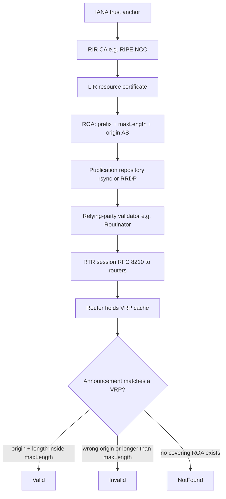

# BGP Security: RPKI, Hijacks, and Route Leaks

## Overview

BGP (RFC 4271) trusts every UPDATE: any AS can announce any prefix with any AS_PATH, and
the network believes it. Five decades of incidents — hijacks that blackholed YouTube, leaks
that dragged continents' traffic through the wrong hemisphere — forced a security stack:
**RPKI** for cryptographic origin authorization, **ROV** for enforcing it on routers,
**ASPA** for leak/path protection, plus decades-old operational hygiene (filtering,
max-prefix). This page is the deep version: incident anatomy, the full RPKI
signing-to-validation chain, ROV decision states, and why BGPsec died. BGP fundamentals
and the 13-step decision process are assumed — see
[BGP Deep Dive](../routing/bgp-deep.md), which carries a summary section this page expands.

## Hijack anatomy: the four primitive attacks

Every BGP incident is some combination of four primitives. Knowing them turns war stories
into analysis:

1. **Prefix hijack (origin forgery).** AS X originates a prefix it does not hold. If it
   announces a *more-specific* (e.g. /24 out of YouTube's /22), longest-prefix-match wins
   everywhere and traffic re-routes toward X — see the matching rules in
   [CIDR](../tcp-ip/cidr.md). An *exact-match* hijack is weaker: routers pick by
   policy/AS_PATH, so it re-routes only the part of the world that prefers X's path.
2. **Path poisoning / AS_PATH forgery.** X prepends ASNs it does not sit behind
   ("I heard this via AS 174, AS 3356") to fabricate a shorter or policy-preferred path.
   Remote ASes see an attractive route, funnel traffic to X, which then drops, inspects, or
   redirects it. The April 2020 Rostelecom incident used exactly this shape to pull CDN
   (Akamai, Amazon, Cloudflare) prefixes through Russia.
3. **Route leak.** Not forgery but broken policy: an AS exports routes it learned from one
   provider to another provider (becoming accidental transit). RFC 7908 classifies the
   patterns (multi-homed customer, transit provider, IX, CDN, default-peer). Leaks don't
   steal traffic — they *misplace* it, causing congestion and outage at scale.
4. **Reorigination of unallocated space / sub-prefix carve-outs.** Announcing prefixes the
   RIRs never assigned, or carving a /25 out of someone's /24 to steal only a host range —
   the surgical form used in targeted attacks (e.g. financial infrastructure incidents
   documented by MANRS and research groups).

The economic asymmetry explains persistence: an attacker needs one misconfigured or
malicious peer anywhere upstream; defenders need every path correct, always.

## Incidents worth memorizing

| Year | Incident | Class | What happened / why it worked |
|---|---|---|---|
| 2008 | **Pakistan Telecom → YouTube** | More-specific hijack | PT configured a blackhole of YouTube space, leaked `208.65.153.0/24` (inside YT's /22) via PCCW to the world; longest-match blackholed YouTube globally for ~2 hours. PCCW lacked prefix filtering. |
| 2010 | **China Telecom 18-minute leak** | Leak / hijack | ~50,000 prefixes transiently traversed Chinese networks (via IDC1 Telecom AS 23724); US commission report flagged interception potential. Duration was short; blast radius was global. |
| 2015 | **Telekom Malaysia leak** | Type-2 route leak | TM exported its full transit view to peers; Asia-Pacific traffic detoured through Malaysia, congesting links for hours. |
| 2017 | **Google/PEERING + SafeDNS** | Leak amplification | Google's research testbed prefixes leaked via SafeDNS (Nigeria) and transited TransTelekom (RU) and China Telecom; ~150k prefixes misrouted ~90 minutes. A research project's export filter gap became a global event. |
| 2020 | **Rostelecom CDN pulls** | AS_PATH forgery | 86 prefixes of Amazon, Akamai, Cloudflare, DigitalOcean momentarily re-routed via RU through forged paths — detected by AS-path anomaly monitoring. |

The 2008 YouTube case remains the canonical interview story because every defense discussed
below maps onto it: an RPKI ROA on YouTube's /22 (with maxLength 22) makes the /24 hijack
invalid-and-droppable; OTC would not have helped (the origin forged was real-looking);
outbound prefix-list filtering at PCCW — plain 1990s hygiene — would have stopped it.

## RPKI architecture: the signing chain

RPKI (Resource Public Key Infrastructure, RFC 6480) binds **IP prefixes and ASNs to their
legitimate holders** using X.509 certificates extended with INR (Internet Number Resource)
extensions. The hierarchy mirrors number allocation: IANA anchor → RIR CAs (ARIN, RIPE
NCC, APNIC, LACNIC, AFRINIC) → NIR/LIR certs → end-entity certs that sign objects. The
object that matters operationally is the **ROA** (Route Origin Authorization, RFC 6482):
a signed attestation `{prefix, maxLength, origin ASN, validity window}`.

Division of labor — a frequent interview probe:

- **Signers** (resource holders): create ROAs in their RIR portal; the RIR publishes them.
- **Publication** moved from rsync to **RRDP** (RFC 8182, HTTPS + snapshot/delta XML) for
  availability under attack; validators support both.
- **Relying-party software** (Routinator, OctoRPKI, Fort — see
  [Routinator docs](https://routinator.docs.nlnetlabs.nl/)) fetches, validates the whole
  certificate chain, and produces the **VRP set** (Validated ROA Payloads).
- **Routers** receive VRPs via **RTR** (RFC 8210; TCP port 323, serial/refresh state
  machine) and apply local ROV policy. The router does no cryptography — that's the
  architecture's scalability trick: heavy validation lives off-box.

## ROV: Route Origin Validation in the router

RFC 6811 defines the per-route decision. A route is checked against the VRP cache:

| Announcement | VRP situation | State | Typical policy |
|---|---|---|---|
| `198.51.100.0/24` AS64500 | ROA /24, origin 64500, maxLength 24 | **Valid** | Accept, prefer |
| `198.51.100.0/25` AS64500 | covering ROA but /25 > maxLength | **Invalid** | Reject |
| `198.51.100.0/24` AS64501 | ROA exists, different origin | **Invalid** | Reject |
| `203.0.113.0/24` AS64500 | no ROA anywhere in space | **NotFound** | Accept (per policy) |

Three nuances separate memorizers from practitioners. First, **maxLength is the knife**:
a ROA of `/22 maxLength /24` still *permits* the surgical /24 hijack; disciplined
operators set maxLength equal to the prefix length so only that exact block is valid.
Second, **NotFound is the deployment gap**: with roughly half of announced IPv4 prefixes
covered by ROAs as of 2024–2025 (up from ~10% in 2018; MANRS and NIST's RPKI monitor track
the curve), most of the table is unvalidated — a hijacked unregistered prefix shows
"NotFound" and sails through. Third, **Invalid ≠ automatically dropped**: ROV yields a
*state*, and rejection is a local policy knob (`bgp bestpath as-path multipath-relax`
-adjacent config family; in FRR `bgp reject-invalids`-style policy, in Cisco syntax
`bgp bestpath prefix-validate discard-invalid`) — the community norm since 2018 is to drop
Invalids from *providers and peers*, not from customers.

What ROV explicitly does **not** do: validate the path (any AS on the way can still leak or
poison), prevent re-origination by the holder's own downstream, or touch AS_PATH
semantics at all. That gap is why the next two mechanisms exist.

## ASPA: path protection without BGPsec's weight

ASPA (Autonomous System Provider Authorization, draft-ietf-sidrops-aspa-verification) is
the leak-defense layer being standardized as of 2025. The holder signs an object listing
the ASNs of its **authorized transit providers**. Validation is then distributed and cheap:
each AS on a received path checks that every customer→provider transition it can see is
consistent with the customer's ASPA. A leaked route — one that jumped from a provider back
out toward another provider through an AS that isn't authorized transit — fails the check
and is treated as a leak at the detection point.

Positioning against ROV: **ROV answers "is this origin legitimate?" (origin), ASPA answers
"does this path respect the customer-cone structure?" (path)**. They compose; neither
replaces the other. ROV is deployed (validators + routers shipped years ago); ASPA is in
the registration/pilot phase — RIRs added ASPA object support and large operators run
pilot validation. Interviews increasingly ask for exactly this origin-vs-path framing.

## BGPsec: history and why it failed

BGPsec (RFC 8205, 2018) was the full-cryptographic answer: every AS on the path signs
(neighbor AS, its own AS, next hop) into a `BGPsec_PATH` attribute, chained so any AS_PATH
edit invalidates the signature. It proves the *entire* path was actually traversed —
strictly more than ASPA. It failed commercially, not technically:

- **Per-UPDATE cost**: ~70-byte signatures per AS hop turn routing-table churn into a
  CPU/memory problem at millions of UPDATEs per day on RIB-limited hardware.
- **Cold-start economics**: an AS gains value only when *both* ends (and transit between)
  speak it; zero vendor default-on meant zero critical mass.
- **No partial benefit**: unlike ROV, where one ROA protects its prefix globally and one
  dropping router improves local safety, BGPsec's benefit required near-universal adoption
  to matter.

Operational result: protocol complete, implementations exist (e.g. in open stacks like
[GoBGP](https://github.com/osrg/gobgp) and FRR experimental), production deployment
effectively zero since 2018. The lesson interviewers want: **partial-deployment-friendly
design beats cryptographic completeness** — ROV/ASPA chose incrementally-usable.

## Operational hygiene: max-prefix, filtering, OTC, monitoring

RPKI is the newest layer; incidents still start with old-fashioned misconfiguration.
The hygiene stack, in deployment-priority order:

1. **Prefix-list filtering on every BGP session** — customers announce only their
   authorized prefixes (cross-checked against IRR/RPKI), peers/providers filter inbound to
   the customer cone. This alone stops the 2008 YouTube class of incident.
2. **max-prefix guardrails** — cap accepted prefixes per session at ~1.5–2× the expected
   count, warn at 80–90%, decide restart-vs-drop policy deliberately. Every mega-leak had
   a missing or absurdly high max-prefix.
3. **ROV enforcement** — drop Invalids from peers/providers; monitor (not necessarily
   drop) NotFound.
4. **OTC (RFC 9234, 2022)** — the standardized leak-stopper: sessions get a BGP **role**
  (provider/customer/peer), and routes learned from a customer carry the **Only-to-the-
  Customer** attribute, which downstream ASes may export only to *their* customers. The
  classic Type-2 leak (Telekom Malaysia 2015) becomes structurally impossible between OTC-
  speaking neighbors.
5. **Monitoring/detection** — global vantage (RouteViews and RIPE RIS collectors; MRT
   archives), BMP (RFC 7854) streams from own edge, anomaly alerts on origin changes and
   AS_PATH oddities; scripted injection/monitoring tooling like
   [ExaBGP](https://github.com/Exa-Networks/exabgp) for both defense testing and hijack
   detection. Incident response is a workflow: verify from independent vantage, withdraw
   your own announcements where possible, call upstreams (NOC contacts, now partly
   automated by MANRS channels).
6. **MANRS** — the Mutually Agreed Norms for Routing Security ([manrs.org](https://manrs.org/))
   packages the above into four auditable actions (filtering, anti-spoofing, coordination,
   global validation) with an observatory tracking member and non-member behavior;
   joining and being audited is now a procurement checkbox at large carriers.

| Layer | Protects | Status (2025) |
|---|---|---|
| Prefix filtering + max-prefix | Everything local | Universal best practice |
| RPKI ROV + drop-invalid | Origin (more-specific hijacks) | ~50% coverage; dropping normalized |
| OTC (RFC 9234) | Route leaks between roles | Standardized, deploying |
| ASPA | Leaks + some path forgeries | Draft/pilot |
| BGPsec (RFC 8205) | Entire path | Standard complete, deployment ≈ 0 |

## Interview Questions

1. **Walk through the 2008 YouTube hijack and name which modern defense would have stopped it.**
Pakistan Telecom configured a blackhole for YouTube's space and exported the more-specific
`208.65.153.0/24` from inside YouTube's `208.65.152.0/22`; PCCW propagated it unfiltered,
and longest-prefix-match pulled YouTube's traffic worldwide for ~2 hours. Stoppers, in
order of era: PCCW's outbound prefix-lists (1990s hygiene), an RPKI ROA on the /22 with
maxLength /22 making the /24 **Invalid** (droppable since ~2018), and max-prefix on
PCCW's side to flag the anomalous injection. OTC would not have fired — the route
traveled provider→customer→provider direction normally.
2. **Exactly what does a ROA's maxLength field control, and why do operators set it equal
to the prefix length?**
maxLength caps which more-specifics the origin AS may announce validly. A /22 with
maxLength /24 authorizes /22s, /23s, and /24s from that origin — meaning an attacker who
compromises or mimics the origin can surgically carve a /24 and keep **Valid** status.
Setting maxLength = prefix length restricts validity to the exact block, closing the
sub-prefix hijack window at the cost of flexibility for legitimate traffic engineering.
3. **A route is RPKI "Invalid" — what does that state mean, and what should a router do
with it?**
RFC 6811 Invalid means the announcement contradicts the VRP cache: either the origin ASN
matches no covering ROA, or the prefix is more-specific than the covering ROA's maxLength.
ROV produces a *state*, not an action; enforcement is local policy, and the normalized
practice is to reject Invalids received from providers and peers while treating customer
and internal sessions per policy. It is not a signature failure on the route — BGP carries
no signatures — it is an origin-vs-registry mismatch.
4. **ROV vs ASPA vs BGPsec — what does each verify, and why did BGPsec lose?**
ROV verifies origin against ROAs (registry-signed), deployable incrementally: one ROA
helps its prefix worldwide, one dropping router helps locally. ASPA verifies that path
transitions respect signed customer→provider relationships — leak detection, cheap to
check, in pilot. BGPsec cryptographically proves the entire AS_PATH was traversed via
chained per-hop signatures — the strongest guarantee, but its per-UPDATE signature cost
plus all-or-nothing adoption economics produced zero deployment. Lesson: designs that pay
off at partial deployment win; ROV/ASPA were chosen for exactly that.
5. **What is OTC and which leak does it make impossible?**
RFC 9234 pairs a configured BGP role on each session with the Only-to-the-Customer
attribute: routes received from a customer carry OTC, and an AS that received an OTC
route may re-advertise it only to its own customers — never to providers or peers. That
structurally prevents the classic Type-2 leak where a multi-homed customer passes routes
learned from provider A to provider B (Telekom Malaysia 2015), turning accidental transit
into a detectable protocol violation rather than a config error.
6. **Your AS gets hijacked right now — what is the response playbook?**
Confirm from independent vantage points (RouteViews/RIPE RIS MRT data, looking glasses)
which prefix, origin, and path are affected; determine class (more-specific vs
exact vs leak). If your ROA exists and the hijack is more-specific, push RPKI-invalid
dropping awareness to upstreams (many large ones already drop Invalids). Withdraw and
re-announce your exact prefixes with prepending where policy allows to re-win
longest-match/policy comparisons. Open tickets with the injecting AS's NOC and upstreams
(MANRS channels accelerate this), and record evidence in monitoring. Long-term fix:
review max-prefix and filtering on the sessions that let it through.

## Key Takeaways

- BGP's attack surface is four primitives — origin forgery, AS_PATH forgery, route leaks,
  and sub-prefix carving — and every famous incident decomposes into them.
- RPKI = number-resource PKI (IANA→RIR→LIR) whose ROAs bind `{prefix, maxLength, origin
  ASN}`; validators (Routinator et al.) produce VRP sets; routers receive them over RTR
  (RFC 8210) and do no crypto themselves.
- ROV states are Valid / Invalid / NotFound; Invalid contradicts a covering ROA (wrong
  origin or over-long); NotFound (unregistered space) is the deployment gap that keeps
  hijacks of unregistered prefixes viable.
- maxLength = prefix length closes the surgical sub-prefix hijack; loose maxLength
  quietly re-opens it.
- ROV protects origin only; ASPA (draft) adds customer-cone path checks for leaks; OTC
  (RFC 9234) is the standardized, deployable leak-stopper; BGPsec (RFC 8205) proves the
  full path but died on partial-deployment economics.
- Operational hygiene — prefix filtering, max-prefix guards, ROV enforcement, monitoring
  via RouteViews/RIPE RIS/BMP — stops more real incidents than any crypto layer; MANRS
  codifies and audits it.

## References

- [RFC 4271 — BGP-4](https://www.rfc-editor.org/rfc/rfc4271.html)
- [RFC 6480 — RPKI Architecture](https://datatracker.ietf.org/doc/html/rfc6480)
- [RFC 6482 — Route Origin Authorizations (ROA)](https://datatracker.ietf.org/doc/html/rfc6482)
- [RFC 6811 — BGP Prefix Origin Validation (ROV states)](https://datatracker.ietf.org/doc/html/rfc6811)
- [RFC 8210 — RPKI-Router Protocol v1](https://datatracker.ietf.org/doc/html/rfc8210)
- [RFC 8205 — BGPsec Protocol Specification](https://datatracker.ietf.org/doc/html/rfc8205)
- [RFC 7908 — Route Leak Problem Definition and Classification](https://datatracker.ietf.org/doc/html/rfc7908)
- [RFC 9234 — Route Leak Prevention Using Roles (OTC)](https://datatracker.ietf.org/doc/html/rfc9234)
- [RFC 7454 — BGP Operations and Security](https://datatracker.ietf.org/doc/html/rfc7454)
- [ASPA verification (I-D, draft-ietf-sidrops-aspa-verification)](https://datatracker.ietf.org/doc/draft-ietf-sidrops-aspa-verification/)
- [Routinator — NLnet Labs RPKI relying-party validator](https://routinator.docs.nlnetlabs.nl/)
- [MANRS — Mutually Agreed Norms for Routing Security](https://manrs.org/)
- [RIPE NCC — managing IPs and ASNs (RPKI resources)](https://www.ripe.net/manage-ips-and-asns/)
- [RouteViews — global BGP collector and MRT archives](https://www.routeviews.org/routeviews/)
- [FRRouting documentation](https://docs.frrouting.org/)

## Cross-References

- [BGP Deep Dive](../routing/bgp-deep.md) — path attributes, decision process, and the
  compact RPKI/BGPsec section this page expands into full depth.
- [BGP Fundamentals](../routing/bgp.md) — the eBGP/iBGP basics assumed here.
- [CIDR and Prefix Matching](../tcp-ip/cidr.md) — longest-prefix-match rules that decide
  whether a hijack wins or loses.
- [DNSSEC](../dns/dnssec.md) — the analogous sign-the-registry-hierarchy trust design in
  the DNS world; compare delegation chains to RPKI's CA chain.
- [Reference Library: Networking](../../references/networking.md) — verified primary
  sources: RIR portals, RouteViews, MANRS, routing stacks.
