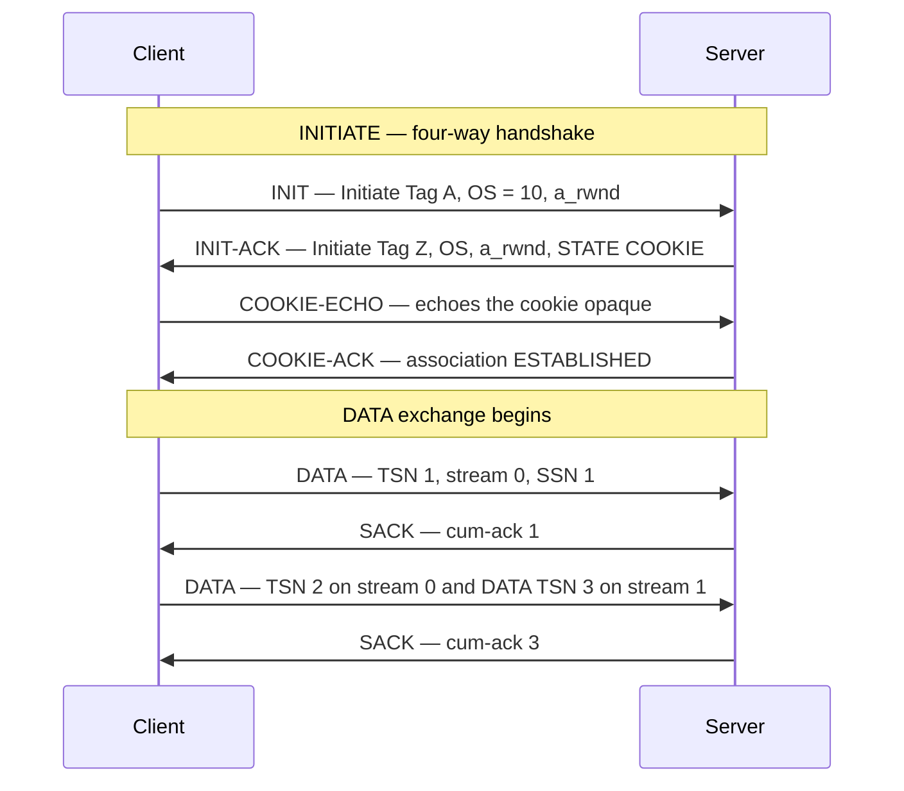
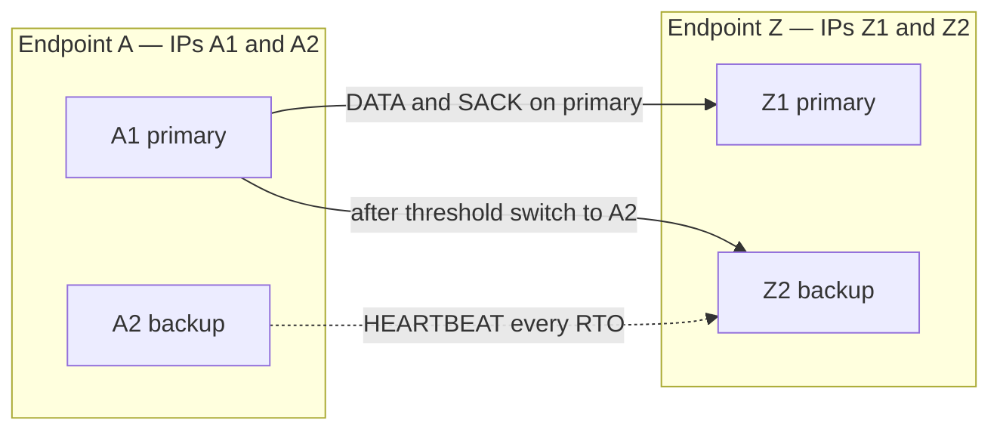

# SCTP: Stream Control Transmission Protocol

## Overview

SCTP (RFC 9260, formerly RFC 4960) is a message-oriented, reliability-capable transport that
sits beside TCP and UDP: it multiplexes independent ordered streams inside one association,
natively multihomes an endpoint across several IP addresses, and frames every unit of
application data with explicit boundaries. It was designed in 2000 to carry telephony
signaling (SS7 over IP), which is why it treats crashes as first-class events and why
WebRTC later picked it for data channels. This page covers the handshake with its cookie,
the multi-streaming/multi-homing machinery, chunk format, partial reliability, and the
WebRTC story. For the TCP handshake it departs from, see [TCP three-way handshake](../tcp/three-way.md).

## Why SCTP exists

TCP carries a byte stream: one ordering domain per connection, one IP address pair per
connection, and no message boundaries. All three design choices hurt the problems SCTP was
built for — carrier-grade signaling, where a single failed link must not stall unrelated
conversations, and where the endpoints (signaling gateways) have redundant interfaces that
should be usable transparently.

1. **Head-of-line blocking.** One lost TCP segment stalls the byte stream; a signaling
   message for call A waits behind a retransmission triggered by call B. SCTP's independent
   streams make loss on one stream invisible to the others.
2. **Message framing.** TCP applications invent length prefixes and delimiters; every
   "TCP is message-oriented too" bug report starts there. SCTP delivers records with
   boundaries preserved.
3. **Failover without socket surgery.** A TCP connection dies with either IP address.
   An SCTP endpoint registers several addresses during the handshake and the association
   survives the loss of one path — failover is protocol machinery, not application code.

SCTP runs over IP protocol number 132 and keeps TCP's proven mechanisms where they work:
slow start, congestion avoidance, fast retransmit, and SACK-style gap reporting — so its
throughput on a clean path is competitive with TCP. The differences are all structural.

## The association handshake: four-way with a cookie

An SCTP *association* (not "connection") establishes in four messages. The server never
commits state until the client proves it received the server's INIT-ACK — the same
defense-in-depth TCP re-invented later with SYN cookies ([SYN cookies](../tcp/syn-cookies.md)),
but built in from day one.

The cookie is a MAC-protected blob (timestamp, life span, the parameters needed to recreate
the TCB) produced by hashing with a server secret — RFC 9260 recommends SHA-1 or stronger.
Server-side processing of COOKIE-ECHO is verification plus TCB allocation, no shared state
to exhaust, so an attacker spoofing SYNs — the SCTP INIT flood — gains nothing: the
INIT-ACK is stateless and discarded by the server's TCB bookkeeping. Compare the TCP
sequence: SYN → SYN-ACK with state allocated *before* the peer proves existence, which is
the exact flaw SYN cookies patch after the fact.

| Aspect | SCTP 4-way | TCP 3-way |
|---|---|---|
| Server state before final ACK | None (stateless cookie) | TCB allocated at SYN |
| SYN-flood resistance | Inherent (cookie) | Needs SYN cookies/proxy |
| Negotiated in handshake | Streams, addresses, MTU hints | Window scale, MSS, SACK |
| Verification tag | Both directions (64-bit protection) | Sequence numbers only |

## Multi-streaming: no head-of-line blocking across streams

During the handshake each side announces how many *outbound* streams it will use
(`OS`; RFC 9260 raised the practical limit well past TCP's single stream — 65535 is the
field maximum). Every DATA chunk carries:

- **TSN** — Transmission Sequence Number, globally monotonic across the whole association,
  drives reliability and congestion control.
- **Stream Identifier + SSN** — Stream Sequence Number, per-stream ordering counter.
- **PPID** — Payload Protocol Identifier, an application hint (no wire-level framing cost).

Reliability is global (missing TSN → selective retransmission, exactly like TCP SACK gap
blocks), while *ordering* is per-stream. A loss on stream 0 holds back only stream 0's
delivery; stream 1's SSN sequence continues to hand data up. The U flag (unordered) can
switch off SSN sequencing per chunk for message flows that need neither — think
fire-and-forget event pushes inside a reliable association.

The performance caveat interviews probe: cross-stream independence helps only if the
receiver *consumes* streams independently. SCTP does not fix congestion-driven queueing in
the network — all streams share one path, one cwnd, one loss event — so a lost segment still
slows the whole association's sending rate. What it removes is the *delivery* stall at the
receiver, not bandwidth coupling.

## Multi-homing: heartbeats, primary path, failover

Each endpoint presents a list of IP addresses in INIT/INIT-ACK (or via dynamic
reconfiguration, RFC 5061). One address is the *primary*; data flows to it, and the sender
maintains per-destination-path state: separate RTO timers, cwnd, and partial error counts.

Failure detection is deliberate and slow by design: HEARTBEAT chunks probe idle paths each
RTO, and a path is declared failed after `Path.Max.Retrans` (default 5) consecutive probes
or retransmissions fail — with backoff that means tens of seconds, so SCTP failover is for
*association survival*, not sub-second convergence (BFD does the fast detection job; see
[Fast Failover](../advanced/fast-failover.md)). Once a path errors out, retransmissions
redirect to an alternate destination and subsequent sends can switch primaries.

Two operational realities temper this. Middleboxes are hostile: NATs and many firewalls
understand neither IP protocol 132 nor a flow whose addresses change, so multi-homing
works best inside carrier/provider domains, not across consumer NATs. And the checksum is
CRC32c (not the Adler-32 of early drafts, and not TCP's additive checksum), which inline
NICs and older appliances may not offload.

## Chunks: the packet format

Every SCTP packet = a 12-byte common header (ports, verification tags, CRC32c) plus a
bundle of variable-length *chunks*, each 4-byte aligned with type/flags/length. Bundling
means one datagram can carry a DATA chunk for stream 0, a HEARTBEAT, and a SACK — a cheap,
continuous control-plane piggyback that TCP achieves only with options.

| Chunk | Purpose | Key fields |
|---|---|---|
| INIT / INIT-ACK | Handshake | Initiate Tag, a_rwnd, OS/MIS, cookie |
| COOKIE-ECHO / COOKIE-ACK | Handshake completion | Cookie blob / empty |
| DATA | Payload | TSN, stream ID, SSN, PPID, U/B/E flags |
| SACK | Acknowledgment | Cumulative TSN, gap blocks, a_rwnd |
| HEARTBEAT / HEARTBEAT-ACK | Path liveness probe | Time info, opaque param |
| ABORT / SHUTDOWN* | Teardown (abrupt / graceful 3-step) | TSN bookkeeping |
| FORWARD-TSN | Advances cumulative ack past lost TSNs | New cumulative TSN |
| AUTH | Per-chunk authentication (RFC 4895) | Shared-key HMAC |

The DATA flags matter for framing: B (begin) and E (end) delimit a user message that may be
fragmented across chunks — messages larger than path MTU are fragmented and reassembled by
the *receiver's* association layer, unlike TCP where segmentation is sender-transparent.
FORWARD-TSN is the interesting one: it lets a sender officially abandon a lost TSN so the
receiver stops stalling on it — the escape hatch TCP lacks, and the basis of partial
reliability below.

## Partial reliability: PR-SCTP (RFC 3758)

Full reliability is wrong for some flows: a dropped video frame is worthless two seconds
later, and stale signaling updates should not queue behind retransmitted history. PR-SCTP
adds a single negotiated parameter (Supported Extensions in INIT) and one behavior: the
sender may replace retransmission with a FORWARD-TSN, permanently retiring a TSN so the
receiver skips it.

The sender chooses per-message, at send time:

| Policy | Semantics | Typical use |
|---|---|---|
| Timed reliability (lifetime) | Abandon after T seconds unsent/unacked | Signaling, telemetry |
| TTL / buffered retransmit | Send once, never retransmit | Best-effort events |
| PR policy on reliability level | Abandon after N retransmissions | Admission-critical data |

This gives applications a *reliability dial* on one association — from fully-ordered
reliable (TCP-like) to unordered unreliable (UDP-like) — without opening multiple sockets.
QUIC later brought stream-level control to the mainstream web (see
[QUIC](../http/quic.md)); SCTP had the knob two decades earlier, plus per-message rather
than per-stream granularity.

## SCTP in WebRTC data channels

WebRTC data channels (RFC 8831) are SCTP running over DTLS over UDP
(RFC 8261 — *DTLS Encapsulation of SCTP Packets*), tunneled through the ICE-selected
5-tuple the media already uses. The stack answers a precise question: why not TCP or UDP?

- **Why not UDP alone?** Channels want selectable reliability/ordering with congestion
  control — UDP leaves all of it to the application.
- **Why not TCP?** TCP's single ordered byte stream head-of-line blocks a dropped *chat*
  message behind a stalled *game-tick* message; one connection cannot mix reliable-ordered
  chat with unreliable-unordered game state; and TCP inside DTLS breaks TLS's
  record/segment coupling. Also, TCP retransmission cannot be told "give up".
- **Why SCTP?** Many streams in one encrypted transport, per-message reliability and
  ordering flags, message boundaries, congestion control for free, and partial reliability
  mapped directly onto the data-channel config `(ordered, maxRetransmits/maxPacketLifeTime)`
  that the WebRTC API exposes.

One SCTP association serves the whole peer connection; each data channel is a stream pair.
Browsers ship userspace implementations (usrsctp lineage) precisely because OS SCTP support
and middlebox friendliness were not dependable.

## SCTP vs TCP vs UDP

| Dimension | SCTP | TCP | UDP |
|---|---|---|---|
| Framing | Message (B/E-delimited) | Byte stream | Message (1 datagram) |
| Ordering | Per stream, optional per chunk | Global | None |
| Reliability | Global, per-message abandon (PR-SCTP) | Global, all-or-nothing | None |
| HOL blocking | Across streams only | Everywhere | None |
| Multi-homing | Native, protocol-level | None (MPTCP is separate RFC) | None |
| Handshake | 4-way, stateless server cookie | 3-way, stateful | None |
| Header | 12 B common + 4 B/chunk | 20–60 B | 8 B |
| Checksum | CRC32c | Internet checksum | Internet checksum |
| NAT traversal | Poor (proto 132, multi-IP) | Good | Good (with keepalives) |
| Flagship deployments | SS7/SIGTRAN, WebRTC data channels, 5G SBA (SBI over SCTP option), Diameter | Everything web | DNS, media, QUIC |

The 5G core note is worth storing: the Service-Based Interface was specified to allow SCTP
transport for HTTP/2 signaling between NFs, and Diameter — the LTE-era AAA protocol — runs
over SCTP in production networks. Telecom-adjacent interviews are where SCTP questions
actually appear; generic web interviews rarely touch it.

## Interview Questions

1. **Why does SCTP's handshake resist SYN floods without an afterthought mechanism?**
The server responds to INIT with a STATE COOKIE — a MAC-protected blob containing a
timestamp, lifetime, and everything needed to reconstruct the TCB — and allocates no state.
Only when the client returns COOKIE-ECHO does the server verify the MAC, check the lifetime
against replay, and allocate the TCB. A spoofed INIT flood buys the attacker stateless
INIT-ACKs. TCP allocates at SYN and needed SYN cookies retrofitted for the same guarantee.
2. **Explain exactly where head-of-line blocking remains and where it is removed in SCTP.**
Removed: *delivery* ordering. SSN is per-stream, so a lost TSN on stream 0 delays only
stream 0's in-order delivery; streams 1..n deliver onward. Remaining: bandwidth and loss
coupling — one cwnd, one RTT estimate, one retransmission pipeline per association, so
congestion on the path stalls the sending rate of all streams together. It is HOL removal
at the receiver, not per-stream congestion control.
3. **How does multi-homing failover work, and why is it not "carrier grade" fast?**
Endpoints exchange address lists at handshake; the sender probes alternate addresses with
HEARTBEAT every RTO and retransmits to alternates on loss. A path fails after
`Path.Max.Retrans` (default 5) failures with RTO backoff — tens of seconds. That protects
the association, not real-time traffic; sub-50ms switchover needs BFD/anycast designs
instead.
4. **What does PR-SCTP add over plain SCTP, and what does a WebRTC data channel map to?**
PR-SCTP (RFC 3758) lets the sender retire a TSN with FORWARD-TSN instead of retransmitting
it, chosen per message by policy: lifetime-expiry, max retransmissions, or send-once. A
WebRTC data channel is an SCTP stream with per-message flags: `ordered=true` uses SSN
ordering with full reliability; `maxRetransmits` or `maxPacketLifeTime` set maps to
PR-SCTP abandon policies; unordered+zero-retransmit is the UDP-like corner.
5. **A reviewer says "SCTP is just TCP with message boundaries." Give three counters.**
(1) Multi-streaming: independent per-stream SSN ordering, no cross-stream HOL — TCP has one
ordering domain. (2) Multi-homing: multiple addresses per endpoint with heartbeat-driven
path failover at the transport layer — TCP binds to one address pair. (3) The stateless
cookie handshake plus per-message partial reliability (FORWARD-TSN) — neither exists in TCP
at all.
6. **Why does SCTP rarely appear on the public internet despite these advantages?**
Middleboxes: NATs, stateful firewalls, and load balancers special-case TCP/UDP and often
drop IP protocol 132; SCTP's multi-address flows also break NAT state assumptions. Kernel
support is solid (Linux since 2.6, FreeBSD native) but application/framework support —
proxies, TLS stacks, CDNs — centered on TCP/QUIC, leaving SCTP confined to carrier
domains and the WebRTC tunnel where browsers embed userspace stacks.

## Key Takeaways

- SCTP = message-oriented, multi-stream, multi-homing transport over IP proto 132; TCP
  mechanisms (slow start, fast retransmit, SACK-style gaps) with structural fixes where
  TCP hurts: HOL across streams, message framing, single-address fragility.
- The 4-way handshake's STATE COOKIE makes the server stateless until COOKIE-ECHO —
  SYN-flood resistance by construction, not by retrofit.
- TSN is the global reliability sequence; SSN is the per-stream ordering sequence; PPID
  is an application hint. Reliability is association-wide, ordering is per-stream.
- Multi-homing: address lists in INIT, HEARTBEAT probes, per-path RTO/cwnd, failover after
  `Path.Max.Retrans` (5) — survival-grade, not convergence-grade, failover.
- PR-SCTP (RFC 3758) turns reliability into a per-message dial via FORWARD-TSN; this is
  exactly the mechanism WebRTC data channels expose as maxRetransmits/maxPacketLifeTime.
- WebRTC data channels = SCTP over DTLS over UDP (RFCs 8831, 8261): one association,
  many streams, per-message ordered/unordered reliable/unreliable.
- Deployment reality: dominant in telecom (SIGTRAN, Diameter, 5G signaling options),
  invisible on the open internet — middleboxes and stack economics, not protocol design.

## References

- [RFC 9260 — Stream Control Transmission Protocol](https://datatracker.ietf.org/doc/html/rfc9260) (obsoletes RFC 4960)
- [RFC 3758 — SCTP Partial Reliability Extension](https://datatracker.ietf.org/doc/html/rfc3758)
- [RFC 8831 — WebRTC Data Channels](https://datatracker.ietf.org/doc/html/rfc8831)
- [RFC 8261 — DTLS Encapsulation of SCTP Packets](https://datatracker.ietf.org/doc/html/rfc8261)
- [RFC 4895 — Authenticated Chunks for SCTP](https://datatracker.ietf.org/doc/html/rfc4895)
- [RFC 5061 — SCTP Dynamic Address Reconfiguration](https://datatracker.ietf.org/doc/html/rfc5061)
- [RFC 8899 — Packetization-Layer Path MTU Discovery](https://datatracker.ietf.org/doc/html/rfc8899)
- [RFC 6458 — Sockets API Extensions for SCTP](https://datatracker.ietf.org/doc/html/rfc6458)

## Cross-References

- [TCP Three-Way Handshake](../tcp/three-way.md) — the connection setup SCTP's 4-way
  handshake deliberately improves on.
- [SYN Cookies](../tcp/syn-cookies.md) — TCP's retrofit of the stateless-cookie idea SCTP
  built in.
- [TCP vs UDP](../udp/tcp-vs-udp.md) — the transport trade-off space SCTP enters between.
- [QUIC](../http/quic.md) — the modern mainstream transport carrying SCTP-style
  per-stream controls to the web.
- [TCP Socket Programming](../sockets/tcp.md) — how TCP's byte-stream API shapes
  application framing, which SCTP removes.
- [Transport Layer (OSI)](../osi/transport.md) — where transport protocols sit in the
  layered model.
